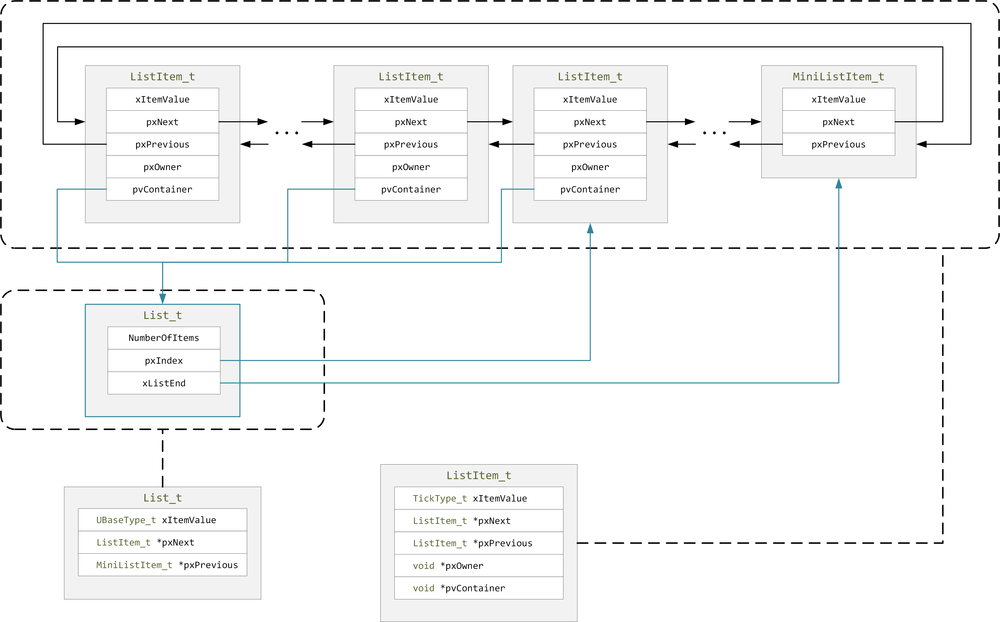

# 基础宏定义

## 接口

` portable.h`：

```c++

```

`portmacro.h`：

```c++
// [1] 基本数据类型
#define portCHAR		char
#define portFLOAT		float
#define portDOUBLE		double
#define portLONG		long
#define portSHORT		short
#define portSTACK_TYPE	uint32_t
#define portBASE_TYPE	long

// [2] 硬件相关类型
typedef portSTACK_TYPE StackType_t;
typedef long BaseType_t;
typedef unsigned long UBaseType_t;

// [3] 时钟计数类型
#if( configUSE_16_BIT_TICKS == 1 )
	typedef uint16_t TickType_t;
	#define portMAX_DELAY ( TickType_t ) 0xffff
#else
	typedef uint32_t TickType_t;
	#define portMAX_DELAY ( TickType_t ) 0xffffffffUL
	// 表示该计数类型是原子的
	#define portTICK_TYPE_IS_ATOMIC 1
#endif

```

## 通用值宏定义

`projdefs.h`：

```c++
#define pdFALSE			( ( BaseType_t ) 0 )
#define pdTRUE			( ( BaseType_t ) 1 )

#define pdPASS			( pdTRUE )
#define pdFAIL			( pdFALSE )
#define errQUEUE_EMPTY	( ( BaseType_t ) 0 )
#define errQUEUE_FULL	( ( BaseType_t ) 0 )
```

## 断言

`freeRTOSConfig.h`：

```c++
//断言
#define vAssertCalled(char,int) printf("Error:%s,%d\r\n",char,int)
#define configASSERT(x) if((x)==0) vAssertCalled(__FILE__,__LINE__)
```

`freeRTOS.h`：

```c++
#ifndef configASSERT
	#define configASSERT( x )
	#define configASSERT_DEFINED 0
#else
	#define configASSERT_DEFINED 1
#endif
```


# 列表

## 列表定义

**列表（双向循环链表）：**




```c
typedef struct xLIST
{
	listFIRST_LIST_INTEGRITY_CHECK_VALUE				// 列表完整性检查
	configLIST_VOLATILE UBaseType_t uxNumberOfItems;	// 1.列表包含的列表项数量
	ListItem_t * configLIST_VOLATILE pxIndex;			// 2.当前指向的列表项	
	MiniListItem_t xListEnd;							// 3.尾节点（由于为循环链表，因而需要尾节点来指明链尾）
	listSECOND_LIST_INTEGRITY_CHECK_VALUE				// 列表完整性检查
} List_t;
```

- 尾结点的类型为迷你列表项，该列表项只用来指针列表尾部，不保存数据。

**列表项**：

```c
// 普通列表项
struct xLIST_ITEM
{
	listFIRST_LIST_ITEM_INTEGRITY_CHECK_VALUE			
	configLIST_VOLATILE TickType_t xItemValue;			// 1.值
	struct xLIST_ITEM * configLIST_VOLATILE pxNext;		// 2.后继节点
	struct xLIST_ITEM * configLIST_VOLATILE pxPrevious;	// 3.前驱节点
	void * pvOwner;										// 4.绑定的任务控制块
	void * configLIST_VOLATILE pvContainer;				// 5.所属的列表
	listSECOND_LIST_ITEM_INTEGRITY_CHECK_VALUE			
};
typedef struct xLIST_ITEM ListItem_t;	

// 迷你列表项
struct xMINI_LIST_ITEM
{
	listFIRST_LIST_ITEM_INTEGRITY_CHECK_VALUE			
	configLIST_VOLATILE TickType_t xItemValue;			// 1.值
	struct xLIST_ITEM * configLIST_VOLATILE pxNext;		// 2.后继节点
	struct xLIST_ITEM * configLIST_VOLATILE pxPrevious; // 3.前驱节点
};
typedef struct xMINI_LIST_ITEM MiniListItem_t;
```

## 列表项初始化

```c
void vListInitialise( List_t * const pxList )
{
    // == 初始化列表 ==
    
	// [1] 当前节点<pxIndex> 指向 尾节点<pxList->xListEnd> 
	pxList->pxIndex = ( ListItem_t * ) &( pxList->xListEnd );			
	
    // [2] 初始化尾节点<xListEnd>：将尾节点的值置为设定值<portMAX_DELAY>
	pxList->xListEnd.xItemValue = portMAX_DELAY;

	// [3] `前驱节点<pxNext>` 与 `后继节点<pxPrevious>` 均为尾节点（因为此时列表中只有一个节点，即尾节点）
	pxList->xListEnd.pxNext = ( ListItem_t * ) &( pxList->xListEnd );
	pxList->xListEnd.pxPrevious = ( ListItem_t * ) &( pxList->xListEnd );
	
    // [4] 初始化列表项数量<uxNumberOfItems>（设为0）
	pxList->uxNumberOfItems = ( UBaseType_t ) 0U;

	// [5] 检测列表完整性
	listSET_LIST_INTEGRITY_CHECK_1_VALUE( pxList );
	listSET_LIST_INTEGRITY_CHECK_2_VALUE( pxList );
}

void vListInitialiseItem( ListItem_t * const pxItem )
{
    // == 初始化列表项 ==
	
    // [1] 脱离归属的列表<<pxItem->pvContainer = NULL;>>
	pxItem->pvContainer = NULL;

	// [2] 检查列表完整性
	listSET_FIRST_LIST_ITEM_INTEGRITY_CHECK_VALUE( pxItem );
	listSET_SECOND_LIST_ITEM_INTEGRITY_CHECK_VALUE( pxItem );
}
```

## 列表项插入

```c
void vListInsert( List_t * const pxList, ListItem_t * const pxNewListItem )
{
    // == 向列表<pxList>中 插入 列表项<pxNewListItem> ==
    ListItem_t *pxIterator;
    
    // [1] 获取新列表项的值<pxNewListItem->xItemValue>
    const TickType_t xValueOfInsertion = pxNewListItem->xItemValue;

	// [2] 检查列表与列表项完整性
	listTEST_LIST_INTEGRITY( pxList );
	listTEST_LIST_ITEM_INTEGRITY( pxNewListItem );

	// [3] 查找插入的位置<pxIterator>（列表项在列表中 `按照值` `升序排序`）
    // > [新列表项为尾节点]：插入到列表末尾
	if( xValueOfInsertion == portMAX_DELAY )
	{
		pxIterator = pxList->xListEnd.pxPrevious;
	}
    // > [新列表项不为尾节点]：遍历查找列表项中，直到有一个列表项的值 大于 新列表项的值
	else
	{
		for( pxIterator = ( ListItem_t * ) &( pxList->xListEnd ); 
            pxIterator->pxNext->xItemValue <= xValueOfInsertion; 
            pxIterator = pxIterator->pxNext ) 
		{}
	}
	
    // [4] 在插入的位置<pxIterator> 插入 新列表项<pxNewListItem>
    // > [4.1] 新列表项 链接后继节点
	pxNewListItem->pxNext = pxIterator->pxNext;
	pxNewListItem->pxNext->pxPrevious = pxNewListItem;
    // > [4.2] 新列表项 链接前驱节点
	pxNewListItem->pxPrevious = pxIterator;
	pxIterator->pxNext = pxNewListItem;

	// [5] 新列表项 绑定所属列表
	pxNewListItem->pvContainer = ( void * ) pxList;
	
    // [6] 所属列表的列表项数量+1
	( pxList->uxNumberOfItems )++;
}

void vListInsertEnd( List_t * const pxList, ListItem_t * const pxNewListItem )
{
    // == 在指定列表的遍历指针<pxList->pxIterator>前 插入 列表项<pxNewListItem> ==
    // ！注意：不是在尾节点前敀列表项
    
    // [1] 获取列表遍历指针<pxIndex>
	ListItem_t * const pxIndex = pxList->pxIndex;

	// [2] 检测列表完整性
	listTEST_LIST_INTEGRITY( pxList );
	listTEST_LIST_ITEM_INTEGRITY( pxNewListItem );

	// [3] 在遍历指针插入列表项<pxNewListItem>
    // > [3.1] 列表项链接前驱与后继节点
	pxNewListItem->pxNext = pxIndex;
	pxNewListItem->pxPrevious = pxIndex->pxPrevious;

	/* Only used during decision coverage testing. */
	mtCOVERAGE_TEST_DELAY();
	
    // > [3.2] 前戏与后继节点 链接 新列表项
	pxIndex->pxPrevious->pxNext = pxNewListItem;
	pxIndex->pxPrevious = pxNewListItem;

	// [4] 绑定所属列表
	pxNewListItem->pvContainer = ( void * ) pxList;

    // [5] 所在列表的列表项数量+1
	( pxList->uxNumberOfItems )++;
}
```

## 列表项删除

```c
UBaseType_t uxListRemove( ListItem_t * const pxItemToRemove )
{
	// == 将列表项从所属列表中去除（并不释放被删除列表项的内存占用） ==
    
    // [1] 获取 待删除列表项`所属的列表<pxList>`
	List_t * const pxList = ( List_t * ) pxItemToRemove->pvContainer;

    // [2] 从所属列表中去除列表项
	pxItemToRemove->pxNext->pxPrevious = pxItemToRemove->pxPrevious;
	pxItemToRemove->pxPrevious->pxNext = pxItemToRemove->pxNext;

	/* Only used during decision coverage testing. */
	mtCOVERAGE_TEST_DELAY();
	
	// [3][列表遍历指针正好指向被删除列表项] 将遍历指针往前移动一个节点
	if( pxList->pxIndex == pxItemToRemove )
		pxList->pxIndex = pxItemToRemove->pxPrevious;
	else
		mtCOVERAGE_TEST_MARKER();
	
    // [4] 被删除节点清除记录的所属列表，同时所属列表的列表项数量-1
	pxItemToRemove->pvContainer = NULL;
	( pxList->uxNumberOfItems )--;

	return pxList->uxNumberOfItems;
}
```

## 获取列表项

### 获取首项

```c++
#define listGET_OWNER_OF_HEAD_ENTRY( pxList )  \
	( (&( ( pxList )->xListEnd ))->pxNext->pvOwner )
```

### 获取下个列表项（可用于遍历）

```c++
#define listGET_OWNER_OF_NEXT_ENTRY( pxTCB, pxList )										\
{																							\
	// [1] 获取遍历列表																		\
	List_t * const pxConstList = ( pxList );												\
																							\
    // [2] 列表的遍历指针移动到下一个列表节点													 \
	( pxConstList )->pxIndex = ( pxConstList )->pxIndex->pxNext;							\
        																					\
    // [3][遍历指针指向了尾节点]：再指向下一个列表节											   \
	if( ( void * ) ( pxConstList )->pxIndex == ( void * ) &( ( pxConstList )->xListEnd ) )	\
	{																						\
		( pxConstList )->pxIndex = ( pxConstList )->pxIndex->pxNext;						\
	}																						\
        																					\
    // [4] 获取遍历指针指向的节点的任务控制块<pxTCB>												 \
	( pxTCB ) = ( pxConstList )->pxIndex->pvOwner;											\
}
```

## 列表是否为空

```c++
#define listLIST_IS_EMPTY( pxList )	\
	( ( BaseType_t ) ( ( pxList )->uxNumberOfItems == ( UBaseType_t ) 0 ) )
```


# 任务

## 任务控制块

```c++
typedef struct tskTaskControlBlock{
    char pcTaskName[ configMAX_TASK_NAME_LEN ]; // 1.任务名称
    volatile StackType_t *pxTopOfStack;			// 2.任务栈 栈顶指针
    StackType_t	*pxStack;						// 3.任务栈起始指针，即栈底指针
    ListItem_t xStateListItem;					// 4.任务状态列表项（该项所在的列表 表征了 该任务的运行状态）
    ListItem_t xEventListItem;		    		// 5.任务事件项 

}tskTCB;
typedef tskTCB TCB_t;  // 重命名为TCB_t
```

## 任务状态切换

### 全局变量

```c++
// [1] 当前任务
PRIVILEGED_DATA TCB_t * volatile pxCurrentTCB = NULL;

// [2] 任务列表
// > [2.1]就绪任务（数组，一个优先级对应一个队列）
PRIVILEGED_DATA static List_t pxReadyTasksLists[ configMAX_PRIORITIES ];

// > [2.2]延时任务
PRIVILEGED_DATA static List_t xDelayedTaskList1;						
PRIVILEGED_DATA static List_t xDelayedTaskList2;
PRIVILEGED_DATA static List_t * volatile pxDelayedTaskList;	
PRIVILEGED_DATA static List_t * volatile pxOverflowDelayedTaskList;

// > [2.3] 待绪任务（在调度器关闭时，就绪任务 切换为 待绪任务）
PRIVILEGED_DATA static List_t xPendingReadyList;

// [3] 其他私有变量
PRIVILEGED_DATA static volatile UBaseType_t uxCurrentNumberOfTasks 	= ( UBaseType_t ) 0U;
PRIVILEGED_DATA static volatile TickType_t xTickCount 				= ( TickType_t ) 0U;	// 时钟计数
PRIVILEGED_DATA static volatile UBaseType_t uxTopReadyPriority 		= tskIDLE_PRIORITY;
PRIVILEGED_DATA static volatile BaseType_t xSchedulerRunning 		= pdFALSE;
PRIVILEGED_DATA static volatile UBaseType_t uxPendedTicks 			= ( UBaseType_t ) 0U;
PRIVILEGED_DATA static volatile BaseType_t xYieldPending 			= pdFALSE;  			// 让出挂起
PRIVILEGED_DATA static volatile BaseType_t xNumOfOverflows 			= ( BaseType_t ) 0;		// 超时溢出计数
PRIVILEGED_DATA static UBaseType_t uxTaskNumber 					= ( UBaseType_t ) 0U;
PRIVILEGED_DATA static volatile TickType_t xNextTaskUnblockTime		= ( TickType_t ) 0U; /* Initialised to portMAX_DELAY before the scheduler starts. */
PRIVILEGED_DATA static TaskHandle_t xIdleTaskHandle					= NULL;			/*< Holds the handle of the idle task.  The idle task is created automatically when the scheduler is started. */


```


### 添加任务到就绪列表

```c++
#define prvAddTaskToReadyList( pxTCB )																\
	traceMOVED_TASK_TO_READY_STATE( pxTCB );														\
	taskRECORD_READY_PRIORITY( ( pxTCB )->uxPriority );												\
	vListInsertEnd( &( pxReadyTasksLists[ ( pxTCB )->uxPriority ] ), &( ( pxTCB )->xStateListItem ) ); \
	tracePOST_MOVED_TASK_TO_READY_STATE( pxTCB )
```


## 事件唤醒任务

```c++
BaseType_t xTaskRemoveFromEventList( const List_t * const pxEventList )
{
    // == 唤醒事件列表中的最高优先级任务 ==
    
    TCB_t *pxUnblockedTCB;
    BaseType_t xReturn;
    
    // [1] 从事件列表中取出最高优先级任务
	pxUnblockedTCB = ( TCB_t * ) listGET_OWNER_OF_HEAD_ENTRY( pxEventList );
	configASSERT( pxUnblockedTCB );
    
    // [2] 从事件列表中移除此项
	( void ) uxListRemove( &( pxUnblockedTCB->xEventListItem ) );

    // [3] 使任务就绪
	if( uxSchedulerSuspended == ( UBaseType_t ) pdFALSE )
	{
        // [3A.调度器运行中] 添加任务到就绪列表
		( void ) uxListRemove( &( pxUnblockedTCB->xStateListItem ) );
		prvAddTaskToReadyList( pxUnblockedTCB );
	}
	else
	{
        // [3B.调度器被关闭] 添加任务到等待就绪列表（等待调度器开启）
		vListInsertEnd( &( xPendingReadyList ), &( pxUnblockedTCB->xEventListItem ) );
	}

    // [4] 判断是否让出
	if( pxUnblockedTCB->uxPriority > pxCurrentTCB->uxPriority )
	{
        // [4A.唤醒的任务优先级更高（比当前任务）] 让出
		xReturn = pdTRUE;
		xYieldPending = pdTRUE;
	}
	else
	{
        // [4B.唤醒的任务级更低] 不让出
		xReturn = pdFALSE;
	}

	#if( configUSE_TICKLESS_IDLE != 0 )
	{
		/* If a task is blocked on a kernel object then xNextTaskUnblockTime
		might be set to the blocked task's time out time.  If the task is
		unblocked for a reason other than a timeout xNextTaskUnblockTime is
		normally left unchanged, because it is automatically reset to a new
		value when the tick count equals xNextTaskUnblockTime.  However if
		tickless idling is used it might be more important to enter sleep mode
		at the earliest possible time - so reset xNextTaskUnblockTime here to
		ensure it is updated at the earliest possible time. */
		prvResetNextTaskUnblockTime();
	}
	#endif

	return xReturn;
}
```


# 队列

## 定义

`queue.h`：

```c++
// [1] 队列控制块
typedef struct QueueDefinition
{
	int8_t *pcHead;					// 指向队列存储区头部
	int8_t *pcTail;					// 指向队列存储区尾部(尾部多一个空字节同，用于标记尾部)
	int8_t *pcWriteTo;				// 指向队尾

	union  {
		int8_t *pcReadFrom;			// 指向队首（下一个要出队的消息）
		UBaseType_t uxRecursiveCallCount;  // 记录递归锁`上锁次数`
	} u;

	List_t xTasksWaitingToSend;		// 等待发送消息的任务列表（按优先级排序）
	List_t xTasksWaitingToReceive;	// 等待接收消息的任务列表（按优先级排序）

	volatile UBaseType_t uxMessagesWaiting;  // 已有消息
	UBaseType_t uxLength;					 // 队列长度（消息个数，而不是字节大小）
	UBaseType_t uxItemSize;					 // 消息大小

	volatile int8_t cRxLock;		// 记录队列上锁期间要移除的消息数量（如果没有上锁，设置为 queueUNLOCKED）
	volatile int8_t cTxLock;		// 记录队列上锁期间要添加的消息数量（如果没有上锁，设置为 queueUNLOCKED）

    // 标记内存分配方式：当既可以动态创建队列，也可以静态创建队列时，需要标记创建方式，防止静态创建的队列内存被释放了
	#if( ( configSUPPORT_STATIC_ALLOCATION == 1 ) && ( configSUPPORT_DYNAMIC_ALLOCATION == 1 ) )
		uint8_t ucStaticallyAllocated;
	#endif

    // [ 启用队列集] 
	#if ( configUSE_QUEUE_SETS == 1 )
		struct QueueDefinition *pxQueueSetContainer;  // 记录所在队列集
	#endif

    // [监控使用情况] 
	#if ( configUSE_TRACE_FACILITY == 1 )
		UBaseType_t uxQueueNumber;	// (队列号)
		uint8_t ucQueueType;		// 队列类型
	#endif

} xQUEUE;

// 取个别名
// （xQUEUE是旧名称，Queue_t 是新名称）
// （为了保持兼容，因而保留旧名称）
typedef xQUEUE Queue_t;

// [2] 队列句柄
typedef void * QueueHandle_t;

// [3] 消息入队方式（仅内部使用）
#define	queueSEND_TO_BACK		( ( BaseType_t ) 0 )
#define	queueSEND_TO_FRONT		( ( BaseType_t ) 1 )
#define queueOVERWRITE			( ( BaseType_t ) 2 )

// [4] 队列类型（可用作互斥量）（仅内部使用）
#define queueQUEUE_TYPE_BASE				( ( uint8_t ) 0U )
#define queueQUEUE_TYPE_SET					( ( uint8_t ) 0U )  // 下面几种是队列用于兼容其他功能，如互斥锁等
#define queueQUEUE_TYPE_MUTEX 				( ( uint8_t ) 1U )
#define queueQUEUE_TYPE_COUNTING_SEMAPHORE	( ( uint8_t ) 2U )
#define queueQUEUE_TYPE_BINARY_SEMAPHORE	( ( uint8_t ) 3U )
#define queueQUEUE_TYPE_RECURSIVE_MUTEX		( ( uint8_t ) 4U )
```

## 创建队列

`queue.h`：

```c++
#if( configSUPPORT_DYNAMIC_ALLOCATION == 1 )
	#define xQueueCreate( uxQueueLength, uxItemSize ) \
		xQueueGenericCreate( ( uxQueueLength ), ( uxItemSize ), ( queueQUEUE_TYPE_BASE ) )
#endif
```

`queue.c`：

```c++
QueueHandle_t xQueueGenericCreate( const UBaseType_t uxQueueLength, const UBaseType_t uxItemSize, const uint8_t ucQueueType )
{
    Queue_t *pxNewQueue;       // 队列控制块
    size_t xQueueSizeInBytes;  // 队列大小
    uint8_t *pucQueueStorage;  // 队列

    configASSERT( uxQueueLength > ( UBaseType_t ) 0 );

    // [1] 计算队列大小：占用空间的大小（队列大小 = 长度 * 项大小）
    if( uxItemSize == ( UBaseType_t ) 0 ) {
        xQueueSizeInBytes = ( size_t ) 0;  // 这一行的作用应该是为了避免乘法计算，提高运行效率
    }
    else {
        xQueueSizeInBytes = ( size_t ) ( uxQueueLength * uxItemSize );
    }

    // [2] 分配队列空间：控制块 + 队列空间
    pxNewQueue = ( Queue_t * ) pvPortMalloc( sizeof( Queue_t ) + xQueueSizeInBytes );

    
    // [3]  初始化队列控制块
    if( pxNewQueue != NULL )
    {
        /* Jump past the queue structure to find the location of the queue
			storage area. */
        pucQueueStorage = ( ( uint8_t * ) pxNewQueue ) + sizeof( Queue_t );

        #if( configSUPPORT_STATIC_ALLOCATION == 1 )
        {
			// [] 当既可以动态创建队列，也可以静态创建队列时，标记他是动态创建的
            pxNewQueue->ucStaticallyAllocated = pdFALSE;
        }
        #endif /* configSUPPORT_STATIC_ALLOCATION */

        // [] 初始化
        prvInitialiseNewQueue( uxQueueLength, uxItemSize, pucQueueStorage, ucQueueType, pxNewQueue );
    }

    return pxNewQueue;
}
```

```c++
static void prvInitialiseNewQueue( const UBaseType_t uxQueueLength, 
                                  const UBaseType_t uxItemSize, 
                                  uint8_t *pucQueueStorage, 
                                  const uint8_t ucQueueType, Queue_t *pxNewQueue )
{
    // 进行一次类型转换，防止编译器说这个变量未使用（类型转换算一次变量使用）
    // （configUSE_TRACE_FACILITY 未开启时这个变量不使用）
	( void ) ucQueueType;

    // [1] 初始化队列空间头指针
	if( uxItemSize == ( UBaseType_t ) 0 ) {
        // 元素大小为零时，没有为队列分配空间，令队首指针指向控制块首地址
        // （不能让队首指针为NULL，因为NULL用于标识队列用于互斥锁）
		pxNewQueue->pcHead = ( int8_t * ) pxNewQueue;
	}
	else {
		pxNewQueue->pcHead = ( int8_t * ) pucQueueStorage;
	}

	// [2] 记录队列长度与消息大小
	pxNewQueue->uxLength = uxQueueLength;
	pxNewQueue->uxItemSize = uxItemSize;
    
	( void ) xQueueGenericReset( pxNewQueue, pdTRUE );

    // [4] 记录队列类型
	#if ( configUSE_TRACE_FACILITY == 1 ){
		pxNewQueue->ucQueueType = ucQueueType;
	}
	#endif
、
    // [5] 初始化队列集关系：不在队列集中
	#if( configUSE_QUEUE_SETS == 1 ) {
		pxNewQueue->pxQueueSetContainer = NULL;
	}
	#endif /* configUSE_QUEUE_SETS */

	traceQUEUE_CREATE( pxNewQueue );
}

BaseType_t xQueueGenericReset( QueueHandle_t xQueue, BaseType_t xNewQueue )
{
    Queue_t * const pxQueue = ( Queue_t * ) xQueue;

	configASSERT( pxQueue );

	taskENTER_CRITICAL();
	{
        // 存储区尾指针
		pxQueue->pcTail = pxQueue->pcHead + ( pxQueue->uxLength * pxQueue->uxItemSize );
		pxQueue->uxMessagesWaiting = ( UBaseType_t ) 0U;
		pxQueue->pcWriteTo = pxQueue->pcHead;
		pxQueue->u.pcReadFrom = pxQueue->pcHead + ( ( pxQueue->uxLength - ( UBaseType_t ) 1U ) * pxQueue->uxItemSize );
		pxQueue->cRxLock = queueUNLOCKED;
		pxQueue->cTxLock = queueUNLOCKED;

		if( xNewQueue == pdFALSE )
		{
			/* If there are tasks blocked waiting to read from the queue, then
			the tasks will remain blocked as after this function exits the queue
			will still be empty.  If there are tasks blocked waiting to write to
			the queue, then one should be unblocked as after this function exits
			it will be possible to write to it. */
			if( listLIST_IS_EMPTY( &( pxQueue->xTasksWaitingToSend ) ) == pdFALSE )
			{
				if( xTaskRemoveFromEventList( &( pxQueue->xTasksWaitingToSend ) ) != pdFALSE )
				{
					queueYIELD_IF_USING_PREEMPTION();
				}
				else
				{
					mtCOVERAGE_TEST_MARKER();
				}
			}
			else
			{
				mtCOVERAGE_TEST_MARKER();
			}
		}
		else
		{
			/* Ensure the event queues start in the correct state. */
			vListInitialise( &( pxQueue->xTasksWaitingToSend ) );
			vListInitialise( &( pxQueue->xTasksWaitingToReceive ) );
		}
	}
	taskEXIT_CRITICAL();

	/* A value is returned for calling semantic consistency with previous
	versions. */
	return pdPASS;
}
```


## 发送消息

`queue.h`：

```c++
#define xQueueSend( xQueue, pvItemToQueue, xTicksToWait )  \
	xQueueGenericSend( ( xQueue ), ( pvItemToQueue ), ( xTicksToWait ), queueSEND_TO_BACK )
```

`queue.c`：

```c++
BaseType_t xQueueGenericSend(QueueHandle_t xQueue, 
                             const void * const pvItemToQueue, 
                             TickType_t xTicksToWait, 
                             const BaseType_t xCopyPosition )
{
    BaseType_t xEntryTimeSet = pdFALSE, xYieldRequired;
    TimeOut_t xTimeOut;
    Queue_t * const pxQueue = ( Queue_t * ) xQueue;

    // [0] 输入参数检查
    // > [0.1] 检查队列地址是否有效
	configASSERT( pxQueue );
    // > [0.2] 检查消息是否有效
	configASSERT( !( ( pvItemToQueue == NULL ) && ( pxQueue->uxItemSize != ( UBaseType_t ) 0U ) ) );
    // >[0.3] 检查入队方式与队列长度是否合适
	configASSERT( !( ( xCopyPosition == queueOVERWRITE ) && ( pxQueue->uxLength != 1 ) ) );
	#if ( ( INCLUDE_xTaskGetSchedulerState == 1 ) || ( configUSE_TIMERS == 1 ) )
	{
		configASSERT( !( ( xTaskGetSchedulerState() == taskSCHEDULER_SUSPENDED ) && (xTicksToWait != 0) ));
	}
	#endif

    
	for( ;; )
	{
        // [1] 消息入队，若已满，则阻塞
		taskENTER_CRITICAL();
		{
			// [] 检查`队列是否已满`，或者为`覆盖发送方式`
			if( ( pxQueue->uxMessagesWaiting < pxQueue->uxLength ) || ( xCopyPosition == queueOVERWRITE ) )
			{
                // [1A.队列未满 或 覆盖入队] 
				traceQUEUE_SEND( pxQueue );
                
                // [1A.1] 消息入队
				xYieldRequired = prvCopyDataToQueue( pxQueue, pvItemToQueue, xCopyPosition );

                // [1A.2] 若有等待消息的阻塞任务，则让出(yield)
                if( listLIST_IS_EMPTY( &( pxQueue->xTasksWaitingToReceive ) ) == pdFALSE )
                {
                    if( xTaskRemoveFromEventList( &( pxQueue->xTasksWaitingToReceive ) ) != pdFALSE )
                        queueYIELD_IF_USING_PREEMPTION();
                    else
                        mtCOVERAGE_TEST_MARKER();
                }
                else if( xYieldRequired != pdFALSE )
                    queueYIELD_IF_USING_PREEMPTION();
                else
                    mtCOVERAGE_TEST_MARKER();

				taskEXIT_CRITICAL();
				return pdPASS;
			}
			else
			{
                // [1B.队列已满] 退出函数，返回错误
				if( xTicksToWait == ( TickType_t ) 0 )
				{
					taskEXIT_CRITICAL();
					traceQUEUE_SEND_FAILED( pxQueue );
					return errQUEUE_FULL;
				}
				else if( xEntryTimeSet == pdFALSE )
				{
					/* The queue was full and a block time was specified so
					configure the timeout structure. */
					vTaskSetTimeOutState( &xTimeOut );
					xEntryTimeSet = pdTRUE;
				}
				else
				{
					/* Entry time was already set. */
					mtCOVERAGE_TEST_MARKER();
				}
			}
		}
		taskEXIT_CRITICAL();

        // 此处已退出临界区，中断与其他任务可使用此队列

		vTaskSuspendAll();
		prvLockQueue( pxQueue );

		/* Update the timeout state to see if it has expired yet. */
		if( xTaskCheckForTimeOut( &xTimeOut, &xTicksToWait ) == pdFALSE )
		{
            // [未超时] 
			if( prvIsQueueFull( pxQueue ) != pdFALSE )
			{
				traceBLOCKING_ON_QUEUE_SEND( pxQueue );
				vTaskPlaceOnEventList( &( pxQueue->xTasksWaitingToSend ), xTicksToWait );

				/* Unlocking the queue means queue events can effect the
				event list.  It is possible	that interrupts occurring now
				remove this task from the event	list again - but as the
				scheduler is suspended the task will go onto the pending
				ready last instead of the actual ready list. */
				prvUnlockQueue( pxQueue );

				/* Resuming the scheduler will move tasks from the pending
				ready list into the ready list - so it is feasible that this
				task is already in a ready list before it yields - in which
				case the yield will not cause a context switch unless there
				is also a higher priority task in the pending ready list. */
				if( xTaskResumeAll() == pdFALSE )
				{
					portYIELD_WITHIN_API();
				}
			}
			else
			{
				/* Try again. */
				prvUnlockQueue( pxQueue );
				( void ) xTaskResumeAll();
			}
		}
		else
		{
			/* The timeout has expired. */
			prvUnlockQueue( pxQueue );
			( void ) xTaskResumeAll();

			traceQUEUE_SEND_FAILED( pxQueue );
			return errQUEUE_FULL;
		}
	}
}

static BaseType_t prvCopyDataToQueue( Queue_t * const pxQueue, 
                                     const void *pvItemToQueue, 
                                     const BaseType_t xPosition )
{
    BaseType_t xReturn = pdFALSE;
    UBaseType_t uxMessagesWaiting;

	/* This function is called from a critical section. */

	uxMessagesWaiting = pxQueue->uxMessagesWaiting;

    // [1] 消息入队：判断队列类型（使用类型）
	if( pxQueue->uxItemSize == ( UBaseType_t ) 0 )
	{
		#if ( configUSE_MUTEXES == 1 )
		{
            // [1A.队列用于互斥锁时][1]
			if( pxQueue->uxQueueType == queueQUEUE_IS_MUTEX )
			{
				/* The mutex is no longer being held. */
				xReturn = xTaskPriorityDisinherit( ( void * ) pxQueue->pxMutexHolder );
				pxQueue->pxMutexHolder = NULL;
			}
			else
			{
				mtCOVERAGE_TEST_MARKER();
			}
		}
		#endif /* configUSE_MUTEXES */
	}
	else if( xPosition == queueSEND_TO_BACK )
	{
        // [1B.正常入队（从队尾入队）] 
        // [1B.1] 拷贝消息到队尾
		( void ) memcpy( ( void * ) pxQueue->pcWriteTo, pvItemToQueue, ( size_t ) pxQueue->uxItemSize ); 
		
        // [1B.2] 队尾指针后移
        pxQueue->pcWriteTo += pxQueue->uxItemSize;
        
        // [1B.3] 处理队列循环
		if( pxQueue->pcWriteTo >= pxQueue->pcTail ) 
			pxQueue->pcWriteTo = pxQueue->pcHead;  // 处理循环逻辑
		else
			mtCOVERAGE_TEST_MARKER();
	}
	else
	{
        // [1C.从队首入队]
        // [1C.1] 拷贝消息到队首
		( void ) memcpy( ( void * ) pxQueue->u.pcReadFrom, pvItemToQueue, ( size_t ) pxQueue->uxItemSize );
        
        // [1C.2] 队首指针前移
		pxQueue->u.pcReadFrom -= pxQueue->uxItemSize;
        
        // [1C.3] 处理队列循环
		if( pxQueue->u.pcReadFrom < pxQueue->pcHead ) 
			pxQueue->u.pcReadFrom = ( pxQueue->pcTail - pxQueue->uxItemSize );
		else
			mtCOVERAGE_TEST_MARKER();

        // [1C.4] 若入队方式为覆盖，则保持消息计数不变（提前减1，抵消下面的计数+1）
		if( xPosition == queueOVERWRITE )
		{
			if( uxMessagesWaiting > ( UBaseType_t ) 0 )
			{
				/* An item is not being added but overwritten, so subtract
				one from the recorded number of items in the queue so when
				one is added again below the number of recorded items remains
				correct. */
				--uxMessagesWaiting;
			}
			else
			{
				mtCOVERAGE_TEST_MARKER();
			}
		}
		else
		{
			mtCOVERAGE_TEST_MARKER();
		}
	}
	
    // [2] 队列计数+1
	pxQueue->uxMessagesWaiting = uxMessagesWaiting + 1;

	return xReturn;
}


#if( configUSE_PREEMPTION == 0 )
	/* If the cooperative scheduler is being used then a yield should not be
	performed just because a higher priority task has been woken. */
	#define queueYIELD_IF_USING_PREEMPTION()
#else
	#define queueYIELD_IF_USING_PREEMPTION() portYIELD_WITHIN_API()
#endif

void vTaskSetTimeOutState( TimeOut_t * const pxTimeOut )
{
	configASSERT( pxTimeOut );
	pxTimeOut->xOverflowCount = xNumOfOverflows;
	pxTimeOut->xTimeOnEntering = xTickCount;
}

BaseType_t xTaskCheckForTimeOut( TimeOut_t * const pxTimeOut, 
                                TickType_t * const pxTicksToWait )
{
    // == 检查是否超时，并更新剩余等待时间 ==
    
    BaseType_t xReturn;
	
    // [0] 检查参数正确性
	configASSERT( pxTimeOut );
	configASSERT( pxTicksToWait );

	taskENTER_CRITICAL();
	{
        // [1] 检查是否超时
		const TickType_t xConstTickCount = xTickCount;

        // [1A.超时时间为portMAX_DELAY] 无限时长阻塞，返回pdFALSE
		#if ( INCLUDE_vTaskSuspend == 1 )
        if( *pxTicksToWait == portMAX_DELAY )
            xReturn = pdFALSE;
        else
		#endif

        // [1B.超过最大延时（走了一整圈）] 返回pdTRUE
        //	（时钟溢出计数变化，且当前计数大于阻塞计数，则表示已经计数完整地走了一圈，并且超过了起点）
		if( ( xNumOfOverflows != pxTimeOut->xOverflowCount ) &&  
            ( xConstTickCount >= pxTimeOut->xTimeOnEntering ) )
		{
			xReturn = pdTRUE;
		}
        // [1C.未超时] 更新超时参数（计算剩余等待时间pxTicksToWait，更新超时起点），返回pdFALSE
		else if( ( ( TickType_t ) ( xConstTickCount - pxTimeOut->xTimeOnEntering ) ) < *pxTicksToWait )
		{
			*pxTicksToWait -= ( xConstTickCount - pxTimeOut->xTimeOnEntering );
			vTaskSetTimeOutState( pxTimeOut );
			xReturn = pdFALSE;
		}
        // [1D.超时] 返回pdTRUE
		else
		{
			xReturn = pdTRUE;
		}
	}
	taskEXIT_CRITICAL();

	return xReturn;
}


```

`freertos.h`：

```c++
#ifndef portYIELD_WITHIN_API
	#define portYIELD_WITHIN_API portYIELD
#endif
```

`portmacro.h`：

```c++
#define portYIELD()																\
{																				\
	/* Set a PendSV to request a context switch. */								\
	portNVIC_INT_CTRL_REG = portNVIC_PENDSVSET_BIT;								\
																				\
	/* Barriers are normally not required but do ensure the code is completely	\
	within the specified behaviour for the architecture. */						\
	__dsb( portSY_FULL_READ_WRITE );											\
	__isb( portSY_FULL_READ_WRITE );											\
}
```

```c++
typedef struct xTIME_OUT
{
	BaseType_t xOverflowCount;
	TickType_t xTimeOnEntering;
} TimeOut_t;
```


## 接收消息

`queue.h`：

```c++
#define xQueueReceive( xQueue, pvBuffer, xTicksToWait )  \
	xQueueGenericReceive( ( xQueue ), ( pvBuffer ), ( xTicksToWait ), pdFALSE )
```

`queue.c`：

```c++
BaseType_t xQueueGenericReceive( QueueHandle_t xQueue, 
                                void * const pvBuffer, 
                                TickType_t xTicksToWait, 
                                const BaseType_t xJustPeeking )
{
    BaseType_t xEntryTimeSet = pdFALSE;
    TimeOut_t xTimeOut;
    int8_t *pcOriginalReadPosition;
    Queue_t * const pxQueue = ( Queue_t * ) xQueue;

	configASSERT( pxQueue );
	configASSERT( !( ( pvBuffer == NULL ) && ( pxQueue->uxItemSize != ( UBaseType_t ) 0U ) ) );
	#if ( ( INCLUDE_xTaskGetSchedulerState == 1 ) || ( configUSE_TIMERS == 1 ) )
	{
		configASSERT( !( ( xTaskGetSchedulerState() == taskSCHEDULER_SUSPENDED ) 
                        && ( xTicksToWait != 0 ) ) );
	}
	#endif

	/* This function relaxes the coding standard somewhat to allow return
	statements within the function itself.  This is done in the interest
	of execution time efficiency. */

	for( ;; )
	{
		taskENTER_CRITICAL();
		{
			const UBaseType_t uxMessagesWaiting = pxQueue->uxMessagesWaiting;

			/* Is there data in the queue now?  To be running the calling task
			must be the highest priority task wanting to access the queue. */
			if( uxMessagesWaiting > ( UBaseType_t ) 0 )
			{
				/* Remember the read position in case the queue is only being
				peeked. */
				pcOriginalReadPosition = pxQueue->u.pcReadFrom;

                // [] 队首消息出队（拷贝到pxBuffe中）
				prvCopyDataFromQueue( pxQueue, pvBuffer );

				if( xJustPeeking == pdFALSE )
				{
					traceQUEUE_RECEIVE( pxQueue );

					/* Actually removing data, not just peeking. */
					pxQueue->uxMessagesWaiting = uxMessagesWaiting - 1;

					#if ( configUSE_MUTEXES == 1 )
					{
						if( pxQueue->uxQueueType == queueQUEUE_IS_MUTEX )
						{
							/* Record the information required to implement
							priority inheritance should it become necessary. */
							pxQueue->pxMutexHolder = ( int8_t * ) pvTaskIncrementMutexHeldCount(); /*lint !e961 Cast is not redundant as TaskHandle_t is a typedef. */
						}
						else
						{
							mtCOVERAGE_TEST_MARKER();
						}
					}
					#endif /* configUSE_MUTEXES */

					if( listLIST_IS_EMPTY( &( pxQueue->xTasksWaitingToSend ) ) == pdFALSE )
					{
						if( xTaskRemoveFromEventList( &( pxQueue->xTasksWaitingToSend ) ) != pdFALSE )
						{
							queueYIELD_IF_USING_PREEMPTION();
						}
						else
						{
							mtCOVERAGE_TEST_MARKER();
						}
					}
					else
					{
						mtCOVERAGE_TEST_MARKER();
					}
				}
				else
				{
					traceQUEUE_PEEK( pxQueue );

					/* The data is not being removed, so reset the read
					pointer. */
					pxQueue->u.pcReadFrom = pcOriginalReadPosition;

					/* The data is being left in the queue, so see if there are
					any other tasks waiting for the data. */
					if( listLIST_IS_EMPTY( &( pxQueue->xTasksWaitingToReceive ) ) == pdFALSE )
					{
						if( xTaskRemoveFromEventList( &( pxQueue->xTasksWaitingToReceive ) ) != pdFALSE )
						{
							/* The task waiting has a higher priority than this task. */
							queueYIELD_IF_USING_PREEMPTION();
						}
						else
						{
							mtCOVERAGE_TEST_MARKER();
						}
					}
					else
					{
						mtCOVERAGE_TEST_MARKER();
					}
				}

				taskEXIT_CRITICAL();
				return pdPASS;
			}
			else
			{
				if( xTicksToWait == ( TickType_t ) 0 )
				{
					/* The queue was empty and no block time is specified (or
					the block time has expired) so leave now. */
					taskEXIT_CRITICAL();
					traceQUEUE_RECEIVE_FAILED( pxQueue );
					return errQUEUE_EMPTY;
				}
				else if( xEntryTimeSet == pdFALSE )
				{
					/* The queue was empty and a block time was specified so
					configure the timeout structure. */
					vTaskSetTimeOutState( &xTimeOut );
					xEntryTimeSet = pdTRUE;
				}
				else
				{
					/* Entry time was already set. */
					mtCOVERAGE_TEST_MARKER();
				}
			}
		}
		taskEXIT_CRITICAL();

		/* Interrupts and other tasks can send to and receive from the queue
		now the critical section has been exited. */

		vTaskSuspendAll();
		prvLockQueue( pxQueue );

		/* Update the timeout state to see if it has expired yet. */
		if( xTaskCheckForTimeOut( &xTimeOut, &xTicksToWait ) == pdFALSE )
		{
			if( prvIsQueueEmpty( pxQueue ) != pdFALSE )
			{
				traceBLOCKING_ON_QUEUE_RECEIVE( pxQueue );

				#if ( configUSE_MUTEXES == 1 )
				{
					if( pxQueue->uxQueueType == queueQUEUE_IS_MUTEX )
					{
						taskENTER_CRITICAL();
						{
							vTaskPriorityInherit( ( void * ) pxQueue->pxMutexHolder );
						}
						taskEXIT_CRITICAL();
					}
					else
					{
						mtCOVERAGE_TEST_MARKER();
					}
				}
				#endif

				vTaskPlaceOnEventList( &( pxQueue->xTasksWaitingToReceive ), xTicksToWait );
				prvUnlockQueue( pxQueue );
				if( xTaskResumeAll() == pdFALSE )
				{
					portYIELD_WITHIN_API();
				}
				else
				{
					mtCOVERAGE_TEST_MARKER();
				}
			}
			else
			{
				/* Try again. */
				prvUnlockQueue( pxQueue );
				( void ) xTaskResumeAll();
			}
		}
		else
		{
			prvUnlockQueue( pxQueue );
			( void ) xTaskResumeAll();

			if( prvIsQueueEmpty( pxQueue ) != pdFALSE )
			{
				traceQUEUE_RECEIVE_FAILED( pxQueue );
				return errQUEUE_EMPTY;
			}
			else
			{
				mtCOVERAGE_TEST_MARKER();
			}
		}
	}
}

static void prvCopyDataFromQueue( Queue_t * const pxQueue, void * const pvBuffer )=
{
    // === 队首消息出队 ===
	if( pxQueue->uxItemSize != ( UBaseType_t ) 0 )
	{
        // [1] 计算要出队的消息地址
		pxQueue->u.pcReadFrom += pxQueue->uxItemSize;
		if( pxQueue->u.pcReadFrom >= pxQueue->pcTail ) {
			pxQueue->u.pcReadFrom = pxQueue->pcHead; // 循环队列
		}
		else {
			mtCOVERAGE_TEST_MARKER();
		}
        
        // [2] 拷贝出队的消息
		( void ) memcpy( ( void * ) pvBuffer, ( void * ) pxQueue->u.pcReadFrom, 
                         ( size_t ) pxQueue->uxItemSize ); 
	}
}

```

