<style> .mermaid .classLabel text {     font-size: 16px !important; } .mermaid .classTitle {     font-size: 18px !important; } </style>

# 一、FreeRTOS移植

## 1.1 FreeRTOS源码目录结构

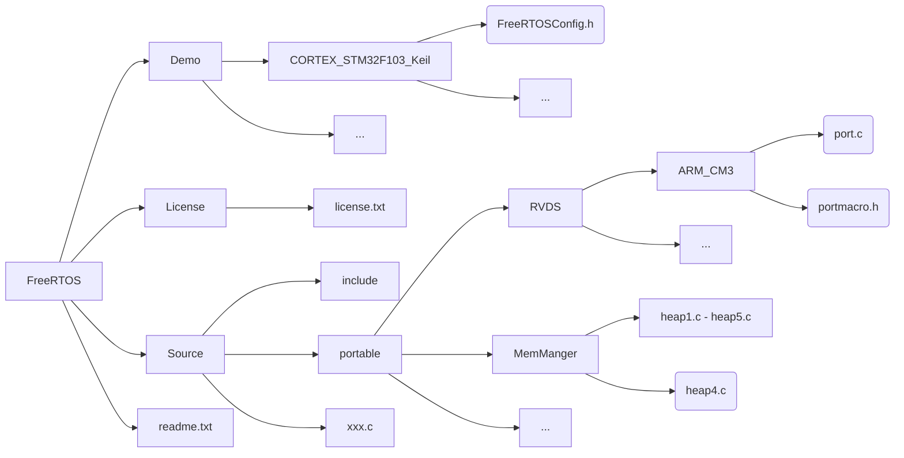

**文件结构**：

- **FreeRTOS**：

  - **Demo**：官方提供的 针对不对处理器架构、不同编译器的**例程**。
    - `FreeRTOSConfig.h`
  - **License**：证书。
  - **Source**：内核**源文件**。
    - **include**：**头文件**
    - **portable**：**专用源文件**（针对不对处理器架构或不同编译器的**源文件**）
      - **RVDS**：针对arm架构的源文件。
        - **ARM_CM3**:
          - `port.c`
          - `portmacro.h`
        - **其他**：其他arm架构的源文件
      - **MemManger**：
        - `head1.c` ~ `head45.c`：堆管理源文件。
      - **其他**：针对其他处理器架构或其他编译器的源文件。
    - `xxx.c`：**通用源文件**
  - `readme.txt`

- **FreeRTOS-Plus**：不重要

- `readme.txt`

  

> **移植**需要的文件：
>
> - FreeRTOS/Demo/CORTEX_STM32F103_Keil/FreeRTOSConfig.h；
> - Source/*.c：Source目录下的所有源文件（不递归包含）；
> - Source/include/*；
> - Source/portable/RVDS/ARM_CM3/port.c；
> - Source/portable/RVDS/ARM_CM3/portmacro.h；
> - Source/portable/MemManger/heap4.c；


## 1.2 FreeRTOS移植到STM32F103C8T6

0. **基础工程模板**：已有一个STM32F103C8T6的工程模板目录，命名为`FreeRTOS_template`

1. **创建FreeRTOS目录**：

   - **创建FreeRTOS目录**：`mkdir FreeRTOS_template/FreeRTOS`

   - **复制Source**：`cp -r FreeRTOS/Source/* FreeRTOS_template/FreeRTOS`

   - **删除无关文件**：删除 除`RVDS`、`MemManger`以外 的所有目录及文件（为了节省空间，因为这些用不到，虽然留着也不会报错）

   - **复制`FreeRTOSConfig.h`**：`cp FreeRTOS/Demo/CORTEX_STM32F103_Keil/FreeRTOSConfig.h FreeRTOS_template/FreeRTOS/incluce/FreeRTOSConfig.h ` 

     - 添加宏定义：

       ```c
       #define xPortPendSVHandler  PendSV_Handler
       #define vPortSVCHandler     SVC_Handler
       #define xPortSysTickHandler SysTick_Handler
       ```

     - 修改堆大小：stm32f103c8t6的可用ram为20KB，堆大小最多不超过20KB。

       ```c
       #define configTOTAL_HEAP_SIZE					((size_t)(10*1024)) 
       ```

     - 或者：直接复制附录中的`FreeRTOSConfig.h`

2. **注释中断函数**：在`stm32f10x_it.c`文件中，则将以下函数注释掉（否则会引起重复定义，因为FreeRTOS使用到了这些函数）

   - `void SVC_Handler(void)`

   - `void PendSV_Handler(void)`

3. **编写滴答定时器中断函数**：在`stm32f10x_it.c`文件中，编写滴答定时器中断函数

   ```c
   void SysTick_Handler(void)
   {
   	if(xTaskGetSchedulerState()!=taskSCHEDULER_NOT_STARTED)//如果开启了调度
   	{
   		xPortSysTickHandler();
   	}
   }
   ```

4. **主程序例程**

   ```c
   #include "stm32f10x.h"                  
   #include "FreeRTOS.h"
   #include "task.h"
    
   TaskHandle_t app_task1_handle = NULL;
   TaskHandle_t app_task2_handle = NULL;
    
   void App_Task1(void* pvParamenters);
   void App_Task2(void* pvParamenters);
    
   int main(void)
   {
   	//将全部优先级设为抢占优先级
   	NVIC_PriorityGroupConfig(NVIC_PriorityGroup_4);
   	
     //创建任务
   	xTaskCreate((TaskFunction_t)App_Task1,          //任务入口函数
   	            (const char *)"App_Task1",          //任务名字
   							(uint16_t)configMINIMAL_STACK_SIZE, //任务栈大小
   							(void*)NULL,                        //任务入口函数参数
   							(UBaseType_t)1,                     //任务优先级
   							(TaskHandle_t*)&app_task1_handle);  //任务句柄
   	//创建任务
   	xTaskCreate((TaskFunction_t)App_Task2,          //任务入口函数
   	            (const char *)"App_Task2",          //任务名字
   							(uint16_t)configMINIMAL_STACK_SIZE, //任务栈大小
   							(void*)NULL,                        //任务入口函数参数
   							(UBaseType_t)1,                     //任务优先级
   							(TaskHandle_t*)&app_task2_handle);  //任务句柄
   								
   	//开启任务调度器						
   	vTaskStartScheduler();
   }
    
   void LED_Init()
   {
   	RCC_APB2PeriphClockCmd(RCC_APB2Periph_GPIOC,ENABLE);//使能C端口时钟
   	
   	GPIO_InitTypeDef GPIO_InitStructure;
   	GPIO_InitStructure.GPIO_Mode = GPIO_Mode_Out_PP;  //推挽输出
   	GPIO_InitStructure.GPIO_Pin = GPIO_Pin_13;
   	GPIO_InitStructure.GPIO_Speed = GPIO_Speed_50MHz; //速度50Mhz
   	GPIO_Init(GPIOC,&GPIO_InitStructure);             //初始化GPIOC
   }
    
    
   void App_Task1(void *pvParameters)
   {
   	LED_Init();
     for(;;)
   	{
   		GPIO_WriteBit(GPIOC,GPIO_Pin_13,Bit_RESET);
   		vTaskDelay(500);
   		GPIO_WriteBit(GPIOC,GPIO_Pin_13,Bit_SET);
   		vTaskDelay(500);
   	}
   }
    
   void App_Task2(void *pvParameters)
   {
      for(;;)
   	{
   		
   	}
   }
   ```


# 二、任务

## 2.1 任务简介

## 2.2 任务实现（源码实现）

### 2.2.1 任务栈

**任务栈**：

- **概念**：每个任务需要拥有**独立的栈**，来支撑任务的运行。

- **实现方式**：任务栈可以由**全局数组**实现。

**创建任务栈**：

```c
#define Task2_STACK_SIZE 128  				// 定义任务1的栈大小（单位为节，而不是字节，1节=4字节
StackType_t task1_stack[task1_stack_size];  // 创建任务1任务栈

#define Task2_STACK_SIZE 128  				// 定义任务2的栈大小（单位为节，而不是字节，1节=4字节）
StackType_t task2_stack[task2_stack_size];	// 创建任务2任务栈
```


### 2.2.2 任务函数

```c
// 任务1函数
void task1(void* args){
    while(1){
        // ...
    }
}

// 任务2函数
void task2(void* args){
    while(1){
        // ...
    }
}
```

### 2.2.3 任务控制块

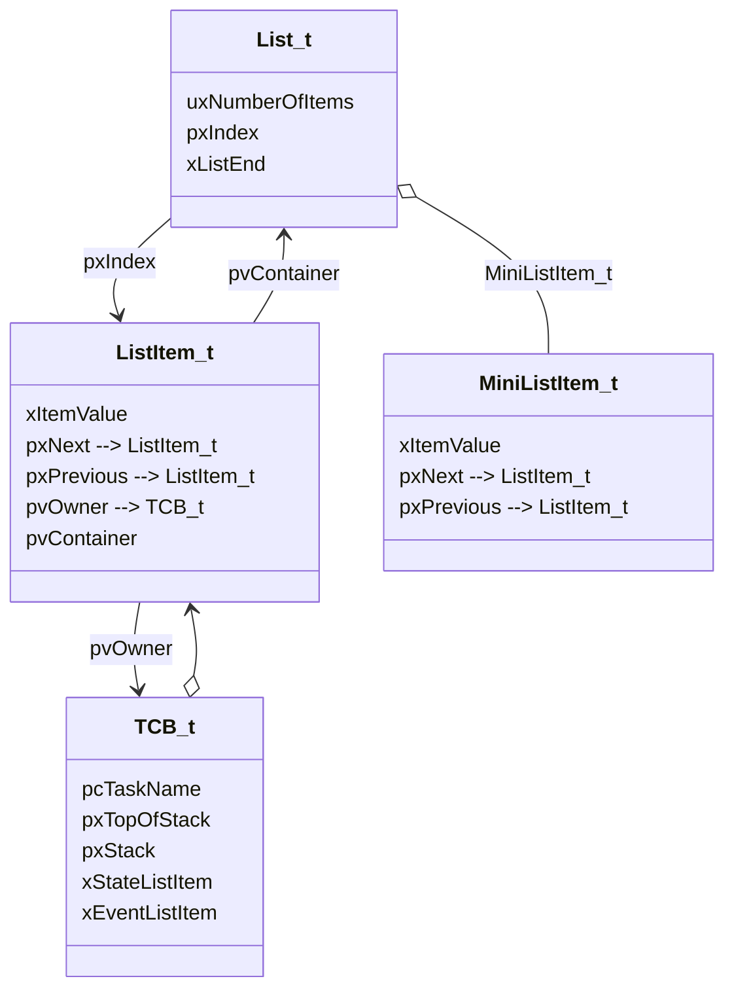

**具体定义**（简化版）：

```c
typedef struct tskTaskControlBlock{
    char pcTaskName[ configMAX_TASK_NAME_LEN ]; // 1.任务名称
    volatile StackType_t *pxTopOfStack;			// 2.任务栈 栈顶指针
    StackType_t	*pxStack;						// 3.任务栈起始指针，即栈底指针
    ListItem_t xStateListItem;					// 4.任务状态列表项（该项所在的列表 表征了 该任务的运行状态）
    ListItem_t xEventListItem;		    		// 5.任务事件项 

}tskTCB;
typedef tskTCB TCB_t;  // 重命名为TCB_t
```

### 2.2.4 列表和列表项

#### 2.2.4.1 列表

列表实际上为双向循环链表：

```c
typedef struct xLIST
{
	listFIRST_LIST_INTEGRITY_CHECK_VALUE				// 列表完整性检查
	configLIST_VOLATILE UBaseType_t uxNumberOfItems;	// 1.列表包含的列表项数量
	ListItem_t * configLIST_VOLATILE pxIndex;			// 2.当前指向的列表项	
	MiniListItem_t xListEnd;							// 3.尾节点（由于为循环链表，因而需要尾节点来指明链尾）
	listSECOND_LIST_INTEGRITY_CHECK_VALUE				// 列表完整性检查
} List_t;
```

- 尾结点的类型为迷你列表项，该列表项只用来指针列表尾部，不保存数据。

#### 2.2.4.2 列表项

```c
// 普通列表项
struct xLIST_ITEM
{
	listFIRST_LIST_ITEM_INTEGRITY_CHECK_VALUE			
	configLIST_VOLATILE TickType_t xItemValue;			// 1.值
	struct xLIST_ITEM * configLIST_VOLATILE pxNext;		// 2.后继节点
	struct xLIST_ITEM * configLIST_VOLATILE pxPrevious;	// 3.前驱节点
	void * pvOwner;										// 4.绑定的任务控制块
	void * configLIST_VOLATILE pvContainer;				// 5.所属的列表
	listSECOND_LIST_ITEM_INTEGRITY_CHECK_VALUE			
};
typedef struct xLIST_ITEM ListItem_t;	

// 迷你列表项
struct xMINI_LIST_ITEM
{
	listFIRST_LIST_ITEM_INTEGRITY_CHECK_VALUE			
	configLIST_VOLATILE TickType_t xItemValue;			// 1.值
	struct xLIST_ITEM * configLIST_VOLATILE pxNext;		// 2.后继节点
	struct xLIST_ITEM * configLIST_VOLATILE pxPrevious; // 3.前驱节点
};
typedef struct xMINI_LIST_ITEM MiniListItem_t;
```

#### 2.2.4.3 列表与列表项初始化

```c
void vListInitialise( List_t * const pxList )
{
    // == 初始化列表 ==
    
	// [1] 当前节点<pxIndex> 指向 尾节点<pxList->xListEnd> 
	pxList->pxIndex = ( ListItem_t * ) &( pxList->xListEnd );			
	
    // [2] 初始化尾节点<xListEnd>：将尾节点的值置为设定值<portMAX_DELAY>
	pxList->xListEnd.xItemValue = portMAX_DELAY;

	// [3] `前驱节点<pxNext>` 与 `后继节点<pxPrevious>` 均为尾节点（因为此时列表中只有一个节点，即尾节点）
	pxList->xListEnd.pxNext = ( ListItem_t * ) &( pxList->xListEnd );
	pxList->xListEnd.pxPrevious = ( ListItem_t * ) &( pxList->xListEnd );
	
    // [4] 初始化列表项数量<uxNumberOfItems>（设为0）
	pxList->uxNumberOfItems = ( UBaseType_t ) 0U;

	// [5] 检测列表完整性
	listSET_LIST_INTEGRITY_CHECK_1_VALUE( pxList );
	listSET_LIST_INTEGRITY_CHECK_2_VALUE( pxList );
}

void vListInitialiseItem( ListItem_t * const pxItem )
{
    // == 初始化列表项 ==
	
    // [1] 脱离归属的列表<<pxItem->pvContainer = NULL;>>
	pxItem->pvContainer = NULL;

	// [2] 检查列表完整性
	listSET_FIRST_LIST_ITEM_INTEGRITY_CHECK_VALUE( pxItem );
	listSET_SECOND_LIST_ITEM_INTEGRITY_CHECK_VALUE( pxItem );
}
```

#### 2.2.4.4 列表项插入

```c
void vListInsert( List_t * const pxList, ListItem_t * const pxNewListItem )
{
    // == 向列表<pxList>中 插入 列表项<pxNewListItem> ==
    ListItem_t *pxIterator;
    
    // [1] 获取新列表项的值<pxNewListItem->xItemValue>
    const TickType_t xValueOfInsertion = pxNewListItem->xItemValue;

	// [2] 检查列表与列表项完整性
	listTEST_LIST_INTEGRITY( pxList );
	listTEST_LIST_ITEM_INTEGRITY( pxNewListItem );

	// [3] 查找插入的位置<pxIterator>（列表项在列表中 `按照值` `升序排序`）
    // > [新列表项为尾节点]：插入到列表末尾
	if( xValueOfInsertion == portMAX_DELAY )
	{
		pxIterator = pxList->xListEnd.pxPrevious;
	}
    // > [新列表项不为尾节点]：遍历查找列表项中，直到有一个列表项的值 大于 新列表项的值
	else
	{
		for( pxIterator = ( ListItem_t * ) &( pxList->xListEnd ); 
            pxIterator->pxNext->xItemValue <= xValueOfInsertion; 
            pxIterator = pxIterator->pxNext ) 
		{}
	}
	
    // [4] 在插入的位置<pxIterator> 插入 新列表项<pxNewListItem>
    // > [4.1] 新列表项 链接后继节点
	pxNewListItem->pxNext = pxIterator->pxNext;
	pxNewListItem->pxNext->pxPrevious = pxNewListItem;
    // > [4.2] 新列表项 链接前驱节点
	pxNewListItem->pxPrevious = pxIterator;
	pxIterator->pxNext = pxNewListItem;

	// [5] 新列表项 绑定所属列表
	pxNewListItem->pvContainer = ( void * ) pxList;
	
    // [6] 所属列表的列表项数量+1
	( pxList->uxNumberOfItems )++;
}

void vListInsertEnd( List_t * const pxList, ListItem_t * const pxNewListItem )
{
    // == 在指定列表的遍历指针<pxList->pxIterator>前 插入 列表项<pxNewListItem> ==
    // ！注意：不是在尾节点前敀列表项
    
    // [1] 获取列表遍历指针<pxIndex>
	ListItem_t * const pxIndex = pxList->pxIndex;

	// [2] 检测列表完整性
	listTEST_LIST_INTEGRITY( pxList );
	listTEST_LIST_ITEM_INTEGRITY( pxNewListItem );

	// [3] 在遍历指针插入列表项<pxNewListItem>
    // > [3.1] 列表项链接前驱与后继节点
	pxNewListItem->pxNext = pxIndex;
	pxNewListItem->pxPrevious = pxIndex->pxPrevious;

	/* Only used during decision coverage testing. */
	mtCOVERAGE_TEST_DELAY();
	
    // > [3.2] 前戏与后继节点 链接 新列表项
	pxIndex->pxPrevious->pxNext = pxNewListItem;
	pxIndex->pxPrevious = pxNewListItem;

	// [4] 绑定所属列表
	pxNewListItem->pvContainer = ( void * ) pxList;

    // [5] 所在列表的列表项数量+1
	( pxList->uxNumberOfItems )++;
}
```

#### 2.2.4.5 列表项删除

```c
UBaseType_t uxListRemove( ListItem_t * const pxItemToRemove )
{
	// == 将列表项从所属列表中去除（并不释放被删除列表项的内存占用） ==
    
    // [1] 获取待删除列表项 所属的列表<pxList>
	List_t * const pxList = ( List_t * ) pxItemToRemove->pvContainer;

    // [2] 从所属列表中去除列表项
	pxItemToRemove->pxNext->pxPrevious = pxItemToRemove->pxPrevious;
	pxItemToRemove->pxPrevious->pxNext = pxItemToRemove->pxNext;

	/* Only used during decision coverage testing. */
	mtCOVERAGE_TEST_DELAY();
	
	// [3][列表遍历指针正好指向被删除列表项] 将遍历指针往前移动一个节点
	if( pxList->pxIndex == pxItemToRemove )
		pxList->pxIndex = pxItemToRemove->pxPrevious;
	else
		mtCOVERAGE_TEST_MARKER();
	
    // [4] 被删除节点清除记录的所属列表，同时所属列表的列表项数量-1
	pxItemToRemove->pvContainer = NULL;
	( pxList->uxNumberOfItems )--;

	return pxList->uxNumberOfItems;
}
```

#### 2.2.4.6 列表遍历

```c++
#define listGET_OWNER_OF_NEXT_ENTRY( pxTCB, pxList )										\
{																							\
	// [1] 获取遍历列表																		\
	List_t * const pxConstList = ( pxList );												\
																							\
    // [2] 列表的遍历指针移动到下一个列表节点													 \
	( pxConstList )->pxIndex = ( pxConstList )->pxIndex->pxNext;							\
        																					\
    // [3][遍历指针指向了尾节点]：再指向下一个列表节											   \
	if( ( void * ) ( pxConstList )->pxIndex == ( void * ) &( ( pxConstList )->xListEnd ) )	\
	{																						\
		( pxConstList )->pxIndex = ( pxConstList )->pxIndex->pxNext;						\
	}																						\
        																					\
    // [4] 获取遍历指针指向的节点的任务控制块<pxTCB>												 \
	( pxTCB ) = ( pxConstList )->pxIndex->pvOwner;											\
}
```

### 2.2.5 任务创建实现

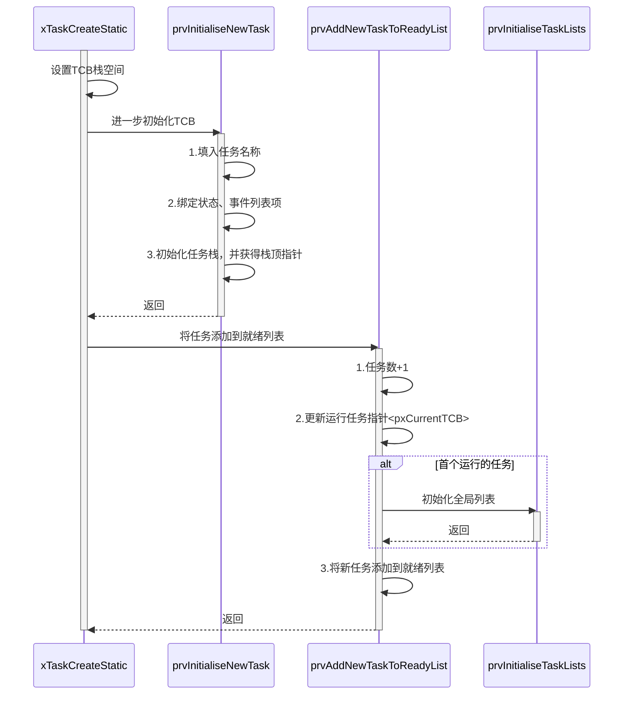

```c
TaskHandle_t xTaskCreateStatic(	TaskFunction_t pxTaskCode,				// 任务函数
									const char * const pcName,			// 任务名称
									const uint32_t ulStackDepth,		// 任务栈大小
									void * const pvParameters,			// 任务参数
									UBaseType_t uxPriority,				// 任务优先级
									StackType_t * const puxStackBuffer,	// 任务栈地址
									StaticTask_t * const pxTaskBuffer )	// 任务控制块
{
    // == 创建新任务（静态的）==
    // 1.初始化任务控制块<pxTaskBuffer>：将`传入参数`或`默认参数`填入`任务控制块`中
    // 2.初始化完成后，将任务添加到就绪列表中<<prvAddNewTaskToReadyList()>>
    
    TCB_t *pxNewTCB;
    TaskHandle_t xReturn;

    // [0] 参数检查
    configASSERT( puxStackBuffer != NULL );
    configASSERT( pxTaskBuffer != NULL );
	
    // [1]~[4]
    if( ( pxTaskBuffer != NULL ) && ( puxStackBuffer != NULL ) )
    {
        // [1] 获取任务控制块<pxNewTCB>
        pxNewTCB = ( TCB_t * ) pxTaskBuffer; 
        
        // [2] 设置栈空间<pxNewTCB->pxStack>
        pxNewTCB->pxStack = ( StackType_t * ) puxStackBuffer;
		
        // [3] 进一步初始化控制控制块
        prvInitialiseNewTask( pxTaskCode, pcName, ulStackDepth, pvParameters, 
                             uxPriority, &xReturn, pxNewTCB, NULL );
        
        // [4] 将任务添加到就绪列表
        prvAddNewTaskToReadyList( pxNewTCB );
    }
    else
        xReturn = NULL;

    return xReturn;
}
```

```c
static void prvInitialiseNewTask( 	TaskFunction_t pxTaskCode,  		// 任务函数（指针）
									const char * const pcName,			// 任务名称
									const uint32_t ulStackDepth,		// 任务栈大小（单位字）
									void * const pvParameters,			// 任务函数参数
									UBaseType_t uxPriority,				// 任务优先级
									TaskHandle_t * const pxCreatedTask,	// 任务句柄
									TCB_t *pxNewTCB,					// 任务控制块
									const MemoryRegion_t * const xRegions )// mpu相关参数
{
    // == 初始化任务：将传入参数或默认参数填入`任务控制块<pxNewTCB>`，并转为`任务句柄<pxCreatedTask>`传出 ==
    // 1.填入任务名称<.pcTaskName>
    // 2.绑定状态列表项与事件列表项：<.xStateListItem>和<.xEventListItem>
    // 3.初始化任务栈，并获得初始化后的栈顶指针<pxStack>
    
    StackType_t *pxTopOfStack;
    UBaseType_t x;
	
    // [1] 计算栈顶指针<pxTopPofStack>
	#if( portSTACK_GROWTH < 0 )
	{
        // > [1.1] 栈顶指针 = 栈底指针 + 栈大小 - 1
		pxTopOfStack = pxNewTCB->pxStack + ( ulStackDepth - ( uint32_t ) 1 );
        // > [1.2] 令栈顶指针8字节对齐：将栈顶指针的末3位置0
		pxTopOfStack = ( StackType_t * ) ( ( ( portPOINTER_SIZE_TYPE ) pxTopOfStack ) 
                                          & ( ~( ( 	portPOINTER_SIZE_TYPE ) portBYTE_ALIGNMENT_MASK ) ) ); 
		// > [1.3] 检查栈顶指针是否8字节对齐
		configASSERT( ( ( ( portPOINTER_SIZE_TYPE ) pxTopOfStack 
                         & ( portPOINTER_SIZE_TYPE ) portBYTE_ALIGNMENT_MASK ) == 0UL ) );
	}

	// [2] 保存任务名称 到任务控制块中<pxNewTCB>
    // > [2.1] 遍历字符串数组，依次复制任务名称<pcName>的每个字符到任务控制块中<pxNewTCB->pcTaskName>
	for( x = ( UBaseType_t ) 0; x < ( UBaseType_t ) configMAX_TASK_NAME_LEN; x++ )
	{
		pxNewTCB->pcTaskName[ x ] = pcName[ x ];

		if( pcName[ x ] == 0x00 ) break;
		else mtCOVERAGE_TEST_MARKER();
	}	
    // > [2.2] 确保任务名称不超过最大字数<configMAX_TASK_NAME_LEN>
	pxNewTCB->pcTaskName[ configMAX_TASK_NAME_LEN - 1 ] = '\0';
	
    // [3] 设置任务控制块优先级<pxNewTCB->uxPriority>
	// > [3.1] 确保任务优先级不超过最大值（因为任务优先级将会用作数组下标）
	if( uxPriority >= ( UBaseType_t ) configMAX_PRIORITIES )
		uxPriority = ( UBaseType_t ) configMAX_PRIORITIES - ( UBaseType_t ) 1U;
	else
		mtCOVERAGE_TEST_MARKER();
	// > [3.2] 设置任务控制块优先级
	pxNewTCB->uxPriority = uxPriority;

	// [4] 初始化任务控制块的 `状态列表项<pxNewTCB->xStateListItem>`、`<pxNewTCB->xEventListItem>`
    // > [4.1] 初始化任务控制块的列表项
	vListInitialiseItem( &( pxNewTCB->xStateListItem ) );
	vListInitialiseItem( &( pxNewTCB->xEventListItem ) );

	// > [4.2] 任务控制块的状态列表项绑定定本任务
	listSET_LIST_ITEM_OWNER( &( pxNewTCB->xStateListItem ), pxNewTCB );

	// > [4.3] 任务控制块的事件列表项绑定本任务
	listSET_LIST_ITEM_VALUE( &( pxNewTCB->xEventListItem ), ( TickType_t ) configMAX_PRIORITIES - ( TickType_t ) uxPriority );
	listSET_LIST_ITEM_OWNER( &( pxNewTCB->xEventListItem ), pxNewTCB );

	// [5] 初始化任务栈<<pxPortInitialiseStack()>>
	#if( portUSING_MPU_WRAPPERS == 1 ) {} // 省略
	#else{
		pxNewTCB->pxTopOfStack = pxPortInitialiseStack( pxTopOfStack, pxTaskCode, pvParameters );
	}
	#endif
	
    // [6] 将初始化完成的任务控制块<pxNewTCB>，转为任务句柄<pxCreatedTask>传出
	if( ( void * ) pxCreatedTask != NULL )
		*pxCreatedTask = ( TaskHandle_t ) pxNewTCB;
	else mtCOVERAGE_TEST_MARKER();
}
```

```c
static void prvAddNewTaskToReadyList( TCB_t *pxNewTCB )
{
	// 进入临界区
	taskENTER_CRITICAL();
	{
        // [1] 任务数<uxCurrentNumberOfTasks>+1
		uxCurrentNumberOfTasks++;
        
        // [2] 更新运行任务指针<pxCurrentTCB>
        // > [当前没有任务正在执行]：
        // > > [c.1]：新任务置为当前任务
        // > > [c.2][全局任务数量为1]：初始化所有全局列表
		if( pxCurrentTCB == NULL ){			
			pxCurrentTCB = pxNewTCB;	         
			if( uxCurrentNumberOfTasks == ( UBaseType_t ) 1 )
				prvInitialiseTaskLists();
			else
				mtCOVERAGE_TEST_MARKER();
		}
        // > [当前有任务正在执行][调度器没有运行][当前正在执行的任务小于优先新任务优先级]：新任务设为当前任务（取代原任务）
		else{
			if( xSchedulerRunning == pdFALSE )
			{
				if( pxCurrentTCB->uxPriority <= pxNewTCB->uxPriority )
					pxCurrentTCB = pxNewTCB;
				else
					mtCOVERAGE_TEST_MARKER();
			}
			else
				mtCOVERAGE_TEST_MARKER();
		}
		// [3] 将新任务添加到就绪列表
		prvAddTaskToReadyList( pxNewTCB );
	}
	taskEXIT_CRITICAL();
	
    // [4][调度器正在运行][新任务优先级 高于 当前任务优先级]：启动任务抢占
	if( xSchedulerRunning != pdFALSE )
	{
		if( pxCurrentTCB->uxPriority < pxNewTCB->uxPriority )
			taskYIELD_IF_USING_PREEMPTION();
		else
			mtCOVERAGE_TEST_MARKER();
	}
	else
		mtCOVERAGE_TEST_MARKER();
}
```

```c
static void prvInitialiseTaskLists( void )
{
    // == 初始化全局列表:就绪列表、延时列表、任务就绪扶起列表 ==
    UBaseType_t uxPriority;
	
    // [1] 初始化就绪列表数组：列表的列表项为0，pxIndex、pxNext、pxPrevious指向尾结点
	for( uxPriority = ( UBaseType_t ) 0U; uxPriority < ( UBaseType_t ) configMAX_PRIORITIES; uxPriority++ )
	{
		vListInitialise( &( pxReadyTasksLists[ uxPriority ] ) );
	}

    // [2] 初始化延时列表（两个）
	vListInitialise( &xDelayedTaskList1 );
	vListInitialise( &xDelayedTaskList2 );
    
    // [3] 初始化任务就绪挂起列表
	vListInitialise( &xPendingReadyList );

	// [4] 初始化延时列表指针（用于双延时列表机制）
	pxDelayedTaskList = &xDelayedTaskList1;
	pxOverflowDelayedTaskList = &xDelayedTaskList2;
}
```

### 2.2.6 调度器启动

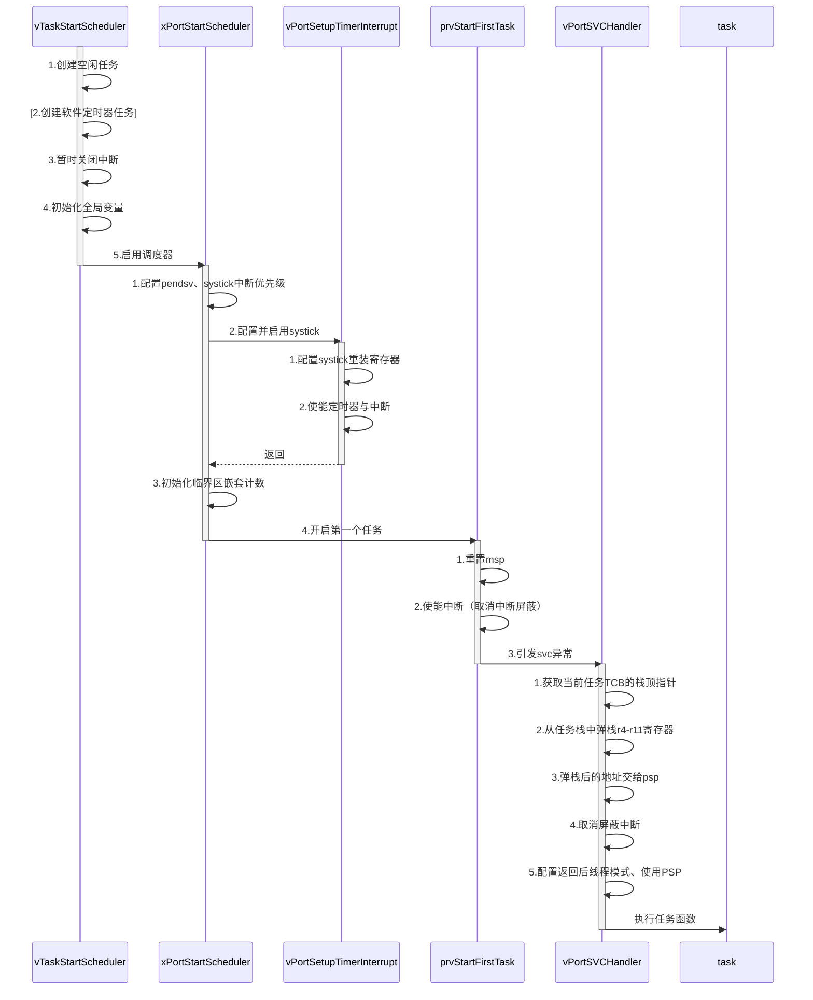


```c
void vTaskStartScheduler( void )
{
    // == 启动任务调度器 ==
	BaseType_t xReturn;

    // [1] 创建`空闲任务`，并获得创建结果<xReturn>
    // > [静态内存分配]：使用静态方法，创建空闲任务<<xTaskCreateStatic>>
	/* Add the idle task at the lowest priority. */
	#if( configSUPPORT_STATIC_ALLOCATION == 1 )
	{
        // > > [c.1] 获取空闲任务的TCB、栈空间 和 栈大小<<vApplicationGetIdleTaskMemory>>(该函数需自己实现)
		StaticTask_t *pxIdleTaskTCBBuffer = NULL;
		StackType_t *pxIdleTaskStackBuffer = NULL;
		uint32_t ulIdleTaskStackSize;
		vApplicationGetIdleTaskMemory( &pxIdleTaskTCBBuffer, &pxIdleTaskStackBuffer, &ulIdleTaskStackSize );
        
        // > > [c.2] 创建空闲任务
		xIdleTaskHandle = xTaskCreateStatic(prvIdleTask,
											"IDLE",
											ulIdleTaskStackSize,
											( void * ) NULL,
											( tskIDLE_PRIORITY | portPRIVILEGE_BIT ),
											pxIdleTaskStackBuffer,
											pxIdleTaskTCBBuffer ); 
		if( xIdleTaskHandle != NULL )
			xReturn = pdPASS;
		else
			xReturn = pdFAIL;
	}
    // > [动态内存分配]：使用动态方法，创建空闲任务<<xTaskCreate>>
	#else
	{
		xReturn = xTaskCreate(	prvIdleTask,
								"IDLE", configMINIMAL_STACK_SIZE,
								( void * ) NULL,
								( tskIDLE_PRIORITY | portPRIVILEGE_BIT ),
								&xIdleTaskHandle ); 
	}
	#endif /* configSUPPORT_STATIC_ALLOCATION */
	
    // [2][使用软件定时器][空闲任务创建成]：创建`定时器任务`<<xTimerCreateTimerTask()>>
	#if ( configUSE_TIMERS == 1 )
	{
		if( xReturn == pdPASS )
			xReturn = xTimerCreateTimerTask();
		else
			mtCOVERAGE_TEST_MARKER();
	}
	#endif /* configUSE_TIMERS */

    // [3]~[5]
	if( xReturn == pdPASS )
	{
		// [3] 暂时关闭中断（任务执行后会自动开启回来）
		portDISABLE_INTERRUPTS();
	
        // [4] 置全局变量
		xNextTaskUnblockTime = portMAX_DELAY;
		xSchedulerRunning = pdTRUE;
		xTickCount = ( TickType_t ) 0U;

		// [*5*] 启动调度器<<xPortStartScheduler()>>
		if( xPortStartScheduler() != pdFALSE )
		{
            // 如果调度器在运行，那xPortStartScheduler()不会返回，代码也就不会执行到这里
		}
		else
		{
            // 只有调用了<<xTaskEndScheduler()>>，才会执行到这里
		}
	}
	else
		configASSERT( xReturn != errCOULD_NOT_ALLOCATE_REQUIRED_MEMORY );
    
}
```

```c
BaseType_t xPortStartScheduler( void )
{
	// [1] 配置中断优先级（为最低抢占优先级）
    // > [1.1] 配置pendsv优先级
	portNVIC_SYSPRI2_REG |= portNVIC_PENDSV_PRI;
    // > [1.2] 配置systick优先级
	portNVIC_SYSPRI2_REG |= portNVIC_SYSTICK_PRI;

	// [2] 配置并启用系统滴答定时器
	vPortSetupTimerInterrupt();

	// [3] 初始化临界区嵌套计数
	uxCriticalNesting = 0;

	// [4] 开启第一个任务
	prvStartFirstTask();

	/* Should not get here! */
	return 0;
}
```

```c
void vPortSetupTimerInterrupt( void )
{
    // == 配置系统滴答定时器（systick） ==
    
    // [1] 配置systick重装寄存器：系统时钟/调度频率 - 1
    portNVIC_SYSTICK_LOAD_REG = ( configSYSTICK_CLOCK_HZ / configTICK_RATE_HZ ) - 1UL;
    
    // [2] 配置控制寄存器：使用内部时钟源、使能中断、使用定时器
    portNVIC_SYSTICK_CTRL_REG = ( portNVIC_SYSTICK_CLK_BIT | portNVIC_SYSTICK_INT_BIT | 
                                 portNVIC_SYSTICK_ENABLE_BIT );
}
```

```assembly
__asm void prvStartFirstTask( void )
{
	PRESERVE8

	// [1] 重置msp为初始值
	// > [1.1] 从中断向量表中读取msp的初始值
	ldr r0, =0xE000ED08
	ldr r0, [r0]
	ldr r0, [r0]
	// > [1.2] 将初始化值写入msp
	msr msp, r0
	
	// [2] 使能异常（取消异常屏蔽）
	cpsie i
	cpsie f
	dsb
	isb
	
	// [3] 引发svc异常（进入svc服务函数）
	svc 0
	nop
	nop
}
```

```assembly
__asm void vPortSVCHandler( void )
{
	PRESERVE8
	
	// [1] 获取当前TCB的栈顶指针
	// > [1.1] 获取pxCurrentTCB指针的地址（指针的地址）
	ldr	r3, =pxCurrentTCB	
	// > [1.2] 获取指针pxCurrentTCB指向的地址
	ldr r1, [r3]	
    // > [1.3] 获取TCB的值，即栈顶指针的值
    //         （TCB结构体的第一个成员为栈顶指针，因而TCB首地址的内容即为栈顶指针）
	ldr r0, [r1]			
	
	// [2] 从任务栈中弹栈r4-r11寄存器
	ldmia r0!, {r4-r11}
    
	// [3] 弹栈后的地址交给psp（用于本函数返回时的自动弹栈）
	msr psp, r0				
	isb
	
	// [4] 取消屏蔽中断
	mov r0, #0
	msr	basepri, r0
	
	// [5] 配置返回后为线程模式、使用PSP
	orr r14, #0xd
	
	bx r14
}
```

### 2.2.7 任务调度

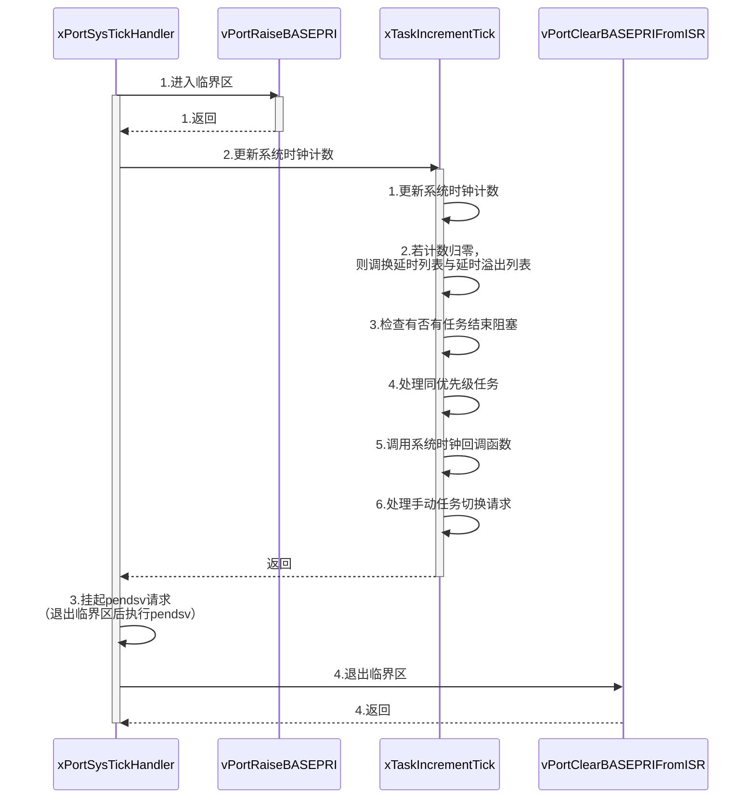


```c++
void xPortSysTickHandler( void )
{
	/* The SysTick runs at the lowest interrupt priority, so when this interrupt
	executes all interrupts must be unmasked.  There is therefore no need to
	save and then restore the interrupt mask value as its value is already
	known - therefore the slightly faster vPortRaiseBASEPRI() function is used
	in place of portSET_INTERRUPT_MASK_FROM_ISR(). */
    // [1] 进入临界区
	vPortRaiseBASEPRI();
	{
        // [2] 增加RTOS tick
		/* Increment the RTOS tick. */
		if( xTaskIncrementTick() != pdFALSE )
		{
			// [3] 悬起pendsv异常
			portNVIC_INT_CTRL_REG = portNVIC_PENDSVSET_BIT;
		}
	}
    // [4] 退出临界区
	vPortClearBASEPRIFromISR();
}
```

```assembly
static portFORCE_INLINE void vPortRaiseBASEPRI( void )
{
	// 创建临界区（即设置中断屏蔽阈值为系统调用最大允许优先级，即屏蔽中断）
	uint32_t ulNewBASEPRI = configMAX_SYSCALL_INTERRUPT_PRIORITY;

	__asm
	{
		/* Set BASEPRI to the max syscall priority to effect a critical
		section. */
		msr basepri, ulNewBASEPRI
		dsb
		isb
	}
}
```


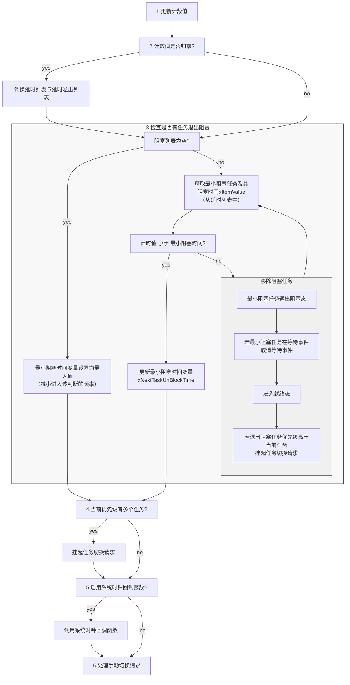
```c
BaseType_t xTaskIncrementTick( void )
{
    // == 增加RTOS tick ==
    // 1.增加RTOS tick
    // 2.察看阻塞任务
    // 3.处理手动任务切换请求
    TCB_t * pxTCB;
    TickType_t xItemValue;
    BaseType_t xSwitchRequired = pdFALSE;

	traceTASK_INCREMENT_TICK( xTickCount );
	if( uxSchedulerSuspended == ( UBaseType_t ) pdFALSE )
	{
        // [1] 更新计数值<xTickCount>
		const TickType_t xConstTickCount = xTickCount + 1;
		xTickCount = xConstTickCount;
		
        // [2][计数值回归零]：调换延时列表与延时溢出列表
		if( xConstTickCount == ( TickType_t ) 0U )
			taskSWITCH_DELAYED_LISTS();
		else
			mtCOVERAGE_TEST_MARKER();
		
        // [3] 检查是否有任务结束阻塞
		if( xConstTickCount >= xNextTaskUnblockTime ){
			for( ;; ){
                // > [没有阻塞任务（延时列表为空）]：最小阻塞时间变量设置为最大值（减小进入该判断的频率）
				if( listLIST_IS_EMPTY( pxDelayedTaskList ) != pdFALSE ){
					xNextTaskUnblockTime = portMAX_DELAY; 
					break;
				}
                // > [有阻塞任务（延时列表不为空）]：
				else{
                    // > > [c.1] 获取最小阻塞任务<pxTCB>及其阻塞时间<xItemValue>（从延时列表中）
					pxTCB = ( TCB_t * ) listGET_OWNER_OF_HEAD_ENTRY( pxDelayedTaskList );
					xItemValue = listGET_LIST_ITEM_VALUE( &( pxTCB->xStateListItem ) );
					
                    // > > [c.2]
                    // > > > [计时值 小于 最小阻塞时间]：更新最小阻塞时间变量<xNextTaskUnBlockTime> 为该时间
					if( xConstTickCount < xItemValue ){                  
						xNextTaskUnblockTime = xItemValue;
						break;
					}
					else
						mtCOVERAGE_TEST_MARKER();
					
                    // > > > [计时值 大于 最小阻塞时间]：
                    // > > > > [c.1] 最小阻塞任务退出阻塞态：将最小阻塞任务从延时列表中移除
					( void ) uxListRemove( &( pxTCB->xStateListItem ) );
					// > > > > [c.2][最小阻塞任务在等待事件]：取消等待事件
					if( listLIST_ITEM_CONTAINER( &( pxTCB->xEventListItem ) ) != NULL )
						( void ) uxListRemove( &( pxTCB->xEventListItem ) );
					else
						mtCOVERAGE_TEST_MARKER();
					// > > > > [c.3] 进入就绪态：插入就绪列表
					prvAddTaskToReadyList( pxTCB );
                    // > > > > [c.4][最小阻塞任务的优先级 高于 当前任务]: 挂起任务切换请求<xSwitchRequired>
					#if (  configUSE_PREEMPTION == 1 )
					{
						if( pxTCB->uxPriority >= pxCurrentTCB->uxPriority )
							xSwitchRequired = pdTRUE;
						else
							mtCOVERAGE_TEST_MARKER();
					}
					#endif /* configUSE_PREEMPTION */
				}
			}
		}
		// [4][启用抢占式调度 与 时间切片][当前优先级的任务还有一个]：切换任务
		#if ( ( configUSE_PREEMPTION == 1 ) && ( configUSE_TIME_SLICING == 1 ) )
		{
			if( listCURRENT_LIST_LENGTH( &( pxReadyTasksLists[ pxCurrentTCB->uxPriority ] ) ) 
               > ( UBaseType_t ) 1 )
				xSwitchRequired = pdTRUE;
			else
				mtCOVERAGE_TEST_MARKER();
		}
		#endif /* ( ( configUSE_PREEMPTION == 1 ) && ( configUSE_TIME_SLICING == 1 ) ) */
		
        // [5] 调用系统时钟回调函数
		#if ( configUSE_TICK_HOOK == 1 )
		{
			/* Guard against the tick hook being called when the pended tick
			count is being unwound (when the scheduler is being unlocked). */
			if( uxPendedTicks == ( UBaseType_t ) 0U )
				vApplicationTickHook();
			else
				mtCOVERAGE_TEST_MARKER();
		}
		#endif /* configUSE_TICK_HOOK */
	}    
	else{
		++uxPendedTicks;
		#if ( configUSE_TICK_HOOK == 1 )
		{
			vApplicationTickHook();
		}
		#endif
	}
	
    // [6] 处理手动任务切换请求
	#if ( configUSE_PREEMPTION == 1 )
	{
		if( xYieldPending != pdFALSE )
			xSwitchRequired = pdTRUE;
		else
			mtCOVERAGE_TEST_MARKER();
	}
	#endif /* configUSE_PREEMPTION */

	return xSwitchRequired;
}
```

```assembly
static portFORCE_INLINE void vPortClearBASEPRIFromISR( void )
{
	// == 取消中断屏蔽 ==
	__asm
	{
		/* Set BASEPRI to 0 so no interrupts are masked.  This function is only
		used to lower the mask in an interrupt, so memory barriers are not 
		used. */
		msr basepri, #0
	}
}
```

### 2.2.8 任务切换

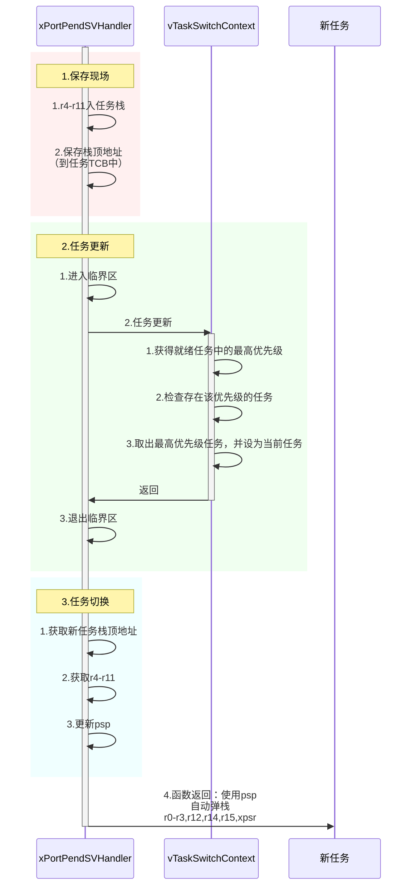

```assembly
__asm void xPortPendSVHandler( void )
{
	extern uxCriticalNesting;
	extern pxCurrentTCB;
	extern vTaskSwitchContext;

	PRESERVE8
	
	; [1] 保存现场
    ; > [1.1] 保存psp<r0>
	mrs r0, psp
	isb
	; > [1.2] 获取TCB地址，即栈顶指针地址<r2>
	ldr	r3, =pxCurrentTCB		
	ldr	r2, [r3]
	; > [1.3] r4-r11入栈
	stmdb r0!, {r4-r11}			
	; > [1.4] 保存栈顶地址（当前任务的PSP）
	str r0, [r2]				

	
	; [2] 更新要执行的任务<r3>
    ; > [2.1] pxCurrentPCB指针、r14入栈（因为下面要调用调用函数了）
	stmdb sp!, {r3, r14}  
	; > [2.2] 进入临界区
	mov r0, #configMAX_SYSCALL_INTERRUPT_PRIORITY
	msr basepri, r0    
	dsb
	isb	
	; > [2.3] 更新要执行的任务<pxCurrentTCB>
	bl vTaskSwitchContext
	; > [2.4] 退出临界区
	mov r0, #0
	msr basepri, r0
	; > [2.5] pxCurrentPCB指针、r14出栈
	ldmia sp!, {r3, r14}

	; [3] 任务切换
	; > [3.1] 获取新任务栈顶地址<r0> 
	ldr r1, [r3]
	ldr r0, [r1]				
	; > [3.2] 获得新任务r4-r11
	ldmia r0!, {r4-r11}		
    ; > [3.3] 弹栈后的地址为psp
	msr psp, r0
	isb
	; > [3.4] 函数返回：使用psp，自动弹栈r0-r3,r12,r14,r15,xpsr
	bx r14
	nop
}
```

```c
void vTaskSwitchContext( void )
{
	if( uxSchedulerSuspended != ( UBaseType_t ) pdFALSE )
		xYieldPending = pdTRUE;
	else
	{
		xYieldPending = pdFALSE;

		// 更新当前任务<pxCurrentTCB>为最高优先级任务，这是一个宏
		taskSELECT_HIGHEST_PRIORITY_TASK();
        {																								\
        	UBaseType_t uxTopPriority;																	\
                                                                                                        \
            // [1] 获得就绪列表中的最高优先级															   \
            portGET_HIGHEST_PRIORITY( uxTopPriority, uxTopReadyPriority );								\
            // [2] 断言存在该优先级的任务																	 \
            configASSERT( listCURRENT_LIST_LENGTH( &( pxReadyTasksLists[ uxTopPriority ] ) ) > 0 );		\
            // [3] 设置当前任务 为 最高优先级就绪列表中的任务
            listGET_OWNER_OF_NEXT_ENTRY( pxCurrentTCB, &( pxReadyTasksLists[ uxTopPriority ] ) );		\
        } /* taskSELECT_HIGHEST_PRIORITY_TASK() */

	}
}
```

## 2.3 创建任务（动态方法）


## 2.4 创建任务（静态方法）


# 三、任务管理

## 3.1 任务状态

## 3.2 常用任务API

xTaskResumeFromISR()与xTaskResume()

### 3.2.1 任务挂起

#### **vTaskSuspend()**

- **签名**：`void VTaskSuspend(TaskHandle_t xTaskToSuspend)`

- **功能**：挂起指定任务

- **参数**：
  - `xTaskToSuspend`：要挂起的任务的任务句柄。
    - 如果使用xTaskCreate()创建任务，那么该函数的传出参数pxCreatedTask为任务句柄。
    - 如果使用xTaSKCreateStatic()，那该函数返回值为任务句柄。
    - 或者使用xTaskGetHandle()来根据任务名称获取任务句柄。
    - 如果该参数为NULL，表示任务自己，任务可以挂起自己。

---

#### **vTaskSusPendAll()**

- **签名**：`void vTaskSusPendAll(void)`

- **功能**：挂起所有任务（即暂停调度）

- **原型**：

  ```c
  // 下面为函数原型，没有任务删改（除了删了一些注释）
  void vTaskSuspendAll(void){
  	++uxSchedulerSusPended;
  }
  ```

### 3.2.2 任务恢复

#### **vTaskResume()**

- **签名**：`void vTaskResume(TaskHandle_t xTaskToResume)`

- **功能**：恢复指定任务，即取消挂起。

- **参数**：
  - xTaskToresume：要恢复的任务的任务句柄。

---

#### **xTaskResumeFromISR()**

- **签名**：`BaseType_t xTaskResumeFromISR(TaskHandle_t xTaskToResume)`
- **功能**：恢复指定任务，需在中断函数中调用
  - 在中断函数中，**不允许**调用`xTaskResume()`。
- **参数**：
  - `xTaskToResume`：要恢复的任务的任务句柄
- **返回值**：
  - `pdTRUE`：
    - 表示要恢复运行的任务的任务优先级 等于或 高于 正在运行的任务（被中断打断的任务），
    - 这意味着在退出中断服务函数后，需要进行一次任务切换。
  - `pdFALSE`：
    - 表示要恢复运行的任务的任务优先级 低于 当前正在运行的任务，
    - 这意味着在退出中断服务函数后，不需要进行上下文切换

### 3.2.2 任务删除

#### **vTaskDelete()**

- **签名**：`void vTaskDelete(TaskHandle_t xTaskToDelete)`
- **功能**：删除指定任务
- **参数**：
  - `xTaskToDelete`：将删除的任务的任务句柄
- **注意**：
  - **使用前提**：使用这个函数需要添加宏定义`#define INCLUDE_vTaskDelete 1`
    - 默认可能已经在FreeRTOSConfig.h中定义了
  - **删除机制**：该函数只删除FreeRTOS管理的该任务的内存，如果任务中自己使用了堆内存，需要用户自己**手动清理**
    - 手动清理需要在删除任务之前，否则就难以定位开辟的内存，造成内存泄漏。

### 3.2.4 任务延时（任务阻塞）

#### **vTaskDelay()**

- **签名**：`void vTaskDelay( const TickType_t xTicksToDelay )`
- **功能**：当前任务（调用该延时函数的任务）延时指定时间
- **参数**：
  - `xTicksToDelay`：将要延时的时间。
    - 以FreeRTOS调度周期为单位，通常为1ms，即若xTicksToDelay为200，则表示延时200ms。
- **注意**：
  - 在使用FreeRTOS过程中，任务延时需要使用vTaskDelay，而不能使用Systick来阻塞式地延时，这会让FreeRTOS运行崩溃。

---

#### **vTaskDelayUntil()**

- **签名**：`void vTaskDelayUntil( TickType_t * const pxPreviousWakeTime, const TickType_t xTimeIncrement )`
- **功能**：
  - 当前任务延时一段时间；
  - 把理论上延时到的时间传出给pxPreviousWakeTime；
  - 用于循环延时的场合，该函数**没有累积误差**，而`vTaskDelay()`有。
- **参数**：
  - pxPreviousWakeTime：上次调用该延时函数后，计算出的本次唤醒的理论时间。
    - 在首次调用该函数时，需要获得当前时间，通过函数`xTaskGetTickCount()`
    - 在延时结束后，pxPreviousWakeTime的值会被函数设置为本次唤醒的理论时间，而不非本次唤醒的实际时间。
  - xTimeIncrement：延时时间。

# 四、消息队列

## 4.1 队列简介

特点：

- **FIFO**：先进先出；
  - LIFO：也支持后进先出
- **值拷贝**；
- 阻塞机制：
  - 入队阻塞
  - 出队阻塞

## 4.2 常用API

### 4.2.1  创建队列

#### **xQueueCreate()**

- **签名**：`QueueHandle_t xQueueCreate(UBaseType_t uxQueueLength, UBaseType_t uxItemSize)`
- **功能**：创建一个队列
- **参数**：
  - `uxQueueLength`：队列的长度
  - `uxItemSize`：队列中元素在大小，以字节为单位。
- **返回值**：
  - **创建成功**：返回队列句柄
  - **创建失败**：返回NULL。
    - **可能原因**：创建失败可能是因为空间不中，RAM分配失败。

---

#### **xQueueCreateStatic()**

- **签名**：

  ```c
  QueueHandle_t QueueCreateStatic( UBaseType_t uxQueueLength, UBaseType_t uxItemSize, 
                                  uint8_t*  pucQueueStorageBuffer, StaticQueue_t *pxQueueBuffer)
  ```

- **功能**：创建一个队列，使用静态内存分配方法。

- **参数**：

  - `uxQueueLength`：队列长度；
  - `uxItemSize`：队列中元素的大小，以字节为单位；
  - `pucQueueStorageBuffer`：缓存队列元素的数组。
    - 数组长度需要 大于或等于 uxQueueLength*uxItemSize；
    - 若`uxItemSzie`为0时，则可以为NULL。
  - `pxQueueBuffer`：用于存储队列的数据结构。

- **返回值**：

  - **创建成功**：返回队列句柄；
  - **创建失败**：返回NULL。
    - **可能原因**：创建失败可能是因为空间不中，RAM分配失败。

### 4.2.2 删除队列

#### **vQueueDelete()**

- **签名**：`void QueueDelete( QueueHandle_t xQueue)`
- **功能**：删除指定队列。
- **参数**：
  - xQueue：要删除的队列的句柄。

### 4.2.3 发送消息（消息入队）

#### **xQueueSend()** 

或 **xQueueSendToBack()**

- **签名**：`BaseType_t xQueueSend(QueueHandle_t xQueue, const void* pvItemToQueue, TickType_t xTicksToWait)`

  - `xQueueSendToBack`与`xQueueSend`是完全一样的，只是一个别名。

- **功能**：向队尾发送一个队列消息。

- **参数**：

  - `xQueue`：要发送的队列的句柄；
  - `pvItemToQueue`：指针，要发送的消息的指针。
  - `xTickToWait`：等待时间。
    - **详细解释**：若队列满了，`xTickToWait`为等待队列空闲的最大时间；
      - 若`xTickToWait`为0，则函数立刻返回
    - **特殊值**：当`xTickToWait`为`portMAX_DELAY`，
      - 若`INCLUDE_VTaskSuspend`设置为1，则任务将被挂起。
    - **单位**：等待时间的单位为系统节拍周期。
      - 常量`portTICK_PERIOD_MS`表示系统节拍周期，可以用于辅助计算真实等待时间。

- **返回值**：

  - **发送成功**：返回`pdTRUE`；
  - **发送失败**：返回`errQUEUE_FULL`。

- **注意**：

  - `xQueueSend`与`xQueueSendToBack`其实是**宏定义**，本质上是调用了`xQueueGenericSend()`，定义如下：

  - ```c
    #define xQueueSend(xQueue, pvItemToQueue, xTickToWait)\
    	xQueueGenericSend( (xQueue), (pvItemToQueue), (xTickToWait), queueSEND_TO_BACK)
    
    #define xQueueSendToBack(xQueue, pvItemToQueue, xTickToWait)\
    	xQueueGenericSend( (xQueue), (pvItemToQueue), (xTickToWait), queueSEND_TO_BACK)
    ```

---

#### **xQueueSendFromISR()** 

或 **xQueueSendToBackFromISR()**

- **签名** :

  ```c
  BaseType_t xQueueSendFromISR(QueueHandle_t xQueue, const void* pvItemToQueue
                               BaseType_t *pxHigherPriorityTaskWoken);
  ```
- **功能**：在中断服务程序中用队尾发送一个消息。
- **参数**:

  - `xQueue`：要发送 的队列的句柄；
  - `pvItemToQueue`：指针，要发送到队尾的消息的指针。
  - `pxHigherPriorityTaskWoken`：传出参数
    - 若消息发送导致一个任务解锁，并且解锁的任务优先级高于当前被中断的任务，
      - 则将`*pxHigherPriorityTaskWoken`设置为`pdTRUE`，
      - 指示在中断退出前，需要进行一次上下文切换，去执行被唤醒的更高优先级的任务。

    - 可以设置为`NULL`(自FreeRTOS v7.3.0起)。

- **返回值**：

  - **发送成功**：返回`pdTRUE`；
  - **发送失败**：返回`errQUEUE_FULL`。

- **注意**：

  - `xQueueSendFromISR()` 与 `xQueueSendToBackFromISR()` 本质是一个宏，实际是调用了`xQueueGenericSendFromISR()`函数，宏定义如下：

  - ```c
    #define xQueueSendFromISR( xQueue, pvItemToQueuem pxHigherPriorityTaskWoken)\
    	xQueueGenericSendFromISR((xQueue),(pvItemToQueue),(pxHigherPriorityTaskWoken),queueSEND_TO_BACK)
    
    #define xQueueSendToBackFromISR( xQueue, pvItemToQueuem pxHigherPriorityTaskWoken)\
    	xQueueGenericSendFromISR((xQueue),(pvItemToQueue),(pxHigherPriorityTaskWoken),queueSEND_TO_BACK)
    ```

---

#### **xQueueSendToFront()**

- **签名**：

  ```c
  BaseType_t xQueueSendToFront(QueueHandle_t xQueue, const void *pvItemValuem, TickType_t xTicksToWait);
  ```

- **功能**：向队首发送消息，用于紧急消息。

- **参数**：

  - `xQueue`：要发送的队列的句柄；
  - `pvItemToQueue`：指针，要发送的消息的指针；
  - `xTicksToWait`：等待时间。
    - **详细解释**：若队列满了，`xTickToWait`为等待队列空闲的最大时间；
      - 若`xTickToWait`为0，则函数立刻返回
    - **特殊值**：当`xTickToWait`为`portMAX_DELAY`，
      - 若`INCLUDE_VTaskSuspend`设置为1，则任务将被挂起。
    - **单位**：等待时间的单位为系统节拍周期。
      - 常量`portTICK_PERIOD_MS`表示系统节拍周期，可以用于辅助计算真实等待时间。

- **返回值**：

  - **发送成功**：返回`pdTRUE`；
  - **发送失败**：返回`errQUEUE_FULL`。

- **注意**：

  - `xQueueSendToFront()` 本质是一个宏，实际是调用了`xQueueGenericSend()`函数，宏定义如下：

  - ```c
    #define xQueueSendToFront( xQueue, pvItemToQueue, xTickToWait)\
    	xQueueGenericSend((xQueue), (vItemToQueue), (xTicksToWait), (queueSEND_TO_FRONT))
    ```

#### **xQueueSendToFrontFromISR()**

- **签名** :

  ```c
  BaseType_t xQueueSendToFrontFromISR(QueueHandle_t xQueue, const void* pvItemToQueue
                               BaseType_t *pxHigherPriorityTaskWoken);
  ```

- **功能**：在中断服务程序中用队首发送一个消息。

- **参数**:

  - `xQueue`：要发送 的队列的句柄；
  - `pvItemToQueue`：指针，要发送到队首的消息的指针。
  - `pxHigherPriorityTaskWoken`：传出参数
    - 若消息发送导致一个任务解锁，并且解锁的任务优先级高于当前被中断的任务，
      - 则将`*pxHigherPriorityTaskWoken`设置为`pdTRUE`，
      - 指示在中断退出前，需要进行一次上下文切换，去执行被唤醒的更高优先级的任务。
    - 可以设置为`NULL`(自FreeRTOS v7.3.0起)。

- **返回值**：

  - **发送成功**：返回`pdTRUE`；
  - **发送失败**：返回`errQUEUE_FULL`。

- **注意**：

  -  `xQueueSendToFrontFromISR()` 本质是一个宏，实际是调用了`xQueueGenericSendFromISR()`函数，宏定义如下：

  - ```c
    #define xQueueSendToFrontFromISR( xQueue, pvItemToQueuem pxHigherPriorityTaskWoken)\
    	xQueueGenericSendFromISR((xQueue),(pvItemToQueue),(pxHigherPriorityTaskWoken),queueSEND_TO_FRONT)
    ```

---

#### xQueueGenericSend()

- **签名**：

  ```c
  BaseType_t xQueueGenericSend( QueueHandle_t xQueue, const void* const pvItemToQueue, 
                                TickType_t xTicksToWait, const BaseType_t xCopyPostion)
  ```

- **功能**：

- **参数**：

### 4.2.4 接收消息

#### xQueueReceive()

- **签名**：`BaseType_t xQueueReceive( QueueHandle_t xQueue, void *pvBuffer, TickType_t xTicksToWait)`;

- **功能**：从指定队列中获取消息。

  - 在获取到消息后，该消息出队，FreeRTOS会从内存中，删除该消息。

- **参数**：

  - `xQueue`：要读取的消息队列的句柄；
  - `pvBuffer`：指针，传出参数，用于保存接收到的消息；
  - `xTicksToWait`：最大等待时间。

- **返回值**：

  - `pdTRUE`：接收成功；
  - `pdFALSE`：接收失败。

- **注意**：

  - `xQuueueReceive()`实际上是一个宏定义，如下：

    ```c
    #define xQueueReceive( xQueue, pvBuffer, xTicksToWait)\
    	xQueueGenericReceive( (xQueue), (pvBuffer), (xTicksToWait), pdFALSE)
    ```

---

#### xQueuePeek()

- **签名**：`BaseType_t xQueuePeek( QueueHandle_t xQueue, void *pvBuffer, TickType_t xTicksToWait)`;

- **功能**：从指定队列中获取消息。

  - `xQueuePeek`()只是查看队头消息，并不会删除队头消息（不同于`xQueueReceive()`）

- **参数**：

  - `xQueue`：要读取的消息队列的句柄；
  - `pvBuffer`：指针，传出参数，用于保存接收到的消息；
  - `xTicksToWait`：最大等待时间。

- **返回值**：

  - `pdTRUE`：接收成功；
  - `pdFALSE`：接收失败。

- **注意**：

  - `xQueuePeek()`实际上是一个宏定义，如下：

    ```c
    #define xQueuePeek( xQueue, pvBuffer, xTicksToWait)\
    	xQueueGenericReceive( (xQueue), (pvBuffer), (xTicksToWait), pdTRUE)
    ```

---

#### xQueueReceiveFromISR()

- **签名**：

  ```c
  BaseType_t xQueueReceiveFromISR( QueueHandle_t xQueue, void *pvBuffer, BaseType_t 
                                   *pxHigherPriorityTaskWoken)
  ```

  **功能**：在中断服务函数中，从指定队列中获取消息，获取后原消息删除。

- **参数**：

  - `xQueue`：要读取的消息队列的句柄；
  - `pvBuffer`：指针，传出参数，用于保存接收到的消息；
  - `pxHigherPriorityTaskWoken`：传出参数
    - `pdTrue`：表示由于此次消息读取，唤醒了正在等等发送的更高优先级的任务，需要任务切换。
    - `pdFALSE`：没有任务被唤醒，无需任务切换。

- **返回值**：

  - `pdTRUE`：接收成功；
  - `pdFALSE`：接收失败。

---

#### xQueuePeekFromISR()

- **签名**：

  ```c
  BaseType_t xQueuePeekFromISR( QueueHandle_t xQueue, void *pvBuffer, BaseType_t)
  ```

  **功能**：在中断服务函数中，从指定队列中获取消息，获取后原消息删除。

- **参数**：

  - `xQueue`：要读取的消息队列的句柄；
  - `pvBuffer`：指针，传出参数，用于保存接收到的消息；

- **返回值**：

  - `pdTRUE`：接收成功；
  - `pdFALSE`：接收失败。


# 五、信号量

## 5.1 信号量简介

## 5.2 常用API

### 5.2.1 创建信号量

#### xSemaphoreCreateBinary()

- **签名**：`SemaphoreHandle_t xSemaphoreCreateBinary()`

- **功能**：创建一个**二值信号量**（使用动态内存分配方法）

- **返回值**：返回信号量句柄

- **注意**：

  - `xSemaphoreCreateBinary()`其实为一宏定义，其原型如下：

  - ```c
    #if( configSUPPORT_DYNAMIC_ALLOCATION == 1)
    	#define xSemaphoreCreateBinary() \
    		xQueueGenericCreate( (UBaseType_t) 1, semSEMAPHORE_QUEUE_ITEM_LENGTH,\
    								queueQUEUE_TYPE_BINARY_SEMAPHORE)
    #endif
    ```

---

#### xSemaphoreCreateCounting()

- **签名**：`SemaphoreHandle_t xSemaphoreCreateCounting( UBaseType_t uxMaxCount, UBaseType_t uxInitialCount);`

- **功能**：创建一个**计数信号量**

- **参数**：

  - `uxMaxCount`：计数信号量的最大值。
    - 当达到这个值的时候，信号量不能再被释放（不会引起阻塞，会返回错误）。
  - `uxInitialCount`：创建计数信号量的初始值。

- **返回值**：

  - **创建成功**：返回计数信号量句柄；
  - **创建失败**：返回`NULL`。

- **注意**：

  - **前提**：创建计数信号量时需要**定义宏**：

    ```c
    #define configUSE_COUNTING_SEMAPHORES		1
    ```

  - **函数原型**：`xSemaphoreCreateCounting()`实际为一宏定义，如下：

    ```c
    #if( configSUPPORT_DYNAMIC_ALLOCATION == 1)
    	#define xSemaphoreCreateCounting( uxMaxCount, uxInitialCount ) \
    		xQueueCreateCountingSemaphore((uxMaxCount), (uxInitialCount))
    #endif
    ```

### 5.2.2 删除信号量

#### vSemaphoreDelete()

- **签名**：`void vSemaphoreDelete( SemaphoreHandle_t xSemaphore)`

- **功能**：删除一个信号量（无论什么类型的信号量）

- **参数**：

  - `xSemaphore`：要删除的信号量的句柄。

- **注意**：

  - 

  - ```c
    #define vSemaphoreDelete( xSemaphore ) vQueueDelete( ( QueueHandle_t ) ( xSemaphore ) )
    ```

### 5.2.3 释放信号量

#### xSemaphoreGive()

- **签名**：`BaseType_t xSemaphoreGive( SemaphoreHandle_t xSemaphore);`

- **功能**：释放一个指定的信号量（计数+1）

  - 这里说的“释放”是指信号量的计数+1，而不是指释放信号量的内存。

- **参数**：

  - `xSemaphore`：要释放的信号量的句柄。

- **返回值**：

  - **释放成功**：pdTRUE；
  - **释放失败**：pdFAIL。
    - **可能原因**：信号量已满。

- **注意**：

  - `vSemaphoreGive()`实际为一宏定义，如下：

  - ```c
    #define xSemaphoreGive( xSemaphore )	\
    	xQueueGenericSend( (QueueHandle_t)(xSemaphore), NULL, semGIVE_BLOCK_TIME, queueSEND_TO_BACK)
    ```

#### xSemaphoreGiveFromISR()

- **签名**：`BaseType_t xSemaphoreGiveFromISR( SemaphoreHandle_t xSemaphore, pxHigherPriorityTaskWoken);`

- **功能**：在中断服务函数中，释放一个指定的信号量（计数+1）

  - 无法在中断服务函数中释放一个**互斥量**，除了互斥量以外都可以。

- **参数**：

  - `xSemaphore`：要释放的信号量的句柄。
  - `pxHigherPriorityTaskWoken`：传出参数。
    - `pdTRUE`：表示此次信号量释放引起了更高优先级的任务被唤醒，需要任务切换。
    - `pdFALSE`：无需任务切换。

- **返回值**：

  - **释放成功**：`pdTRUE`；
  - **释放失败**：`pdFAIL`。
    - **可能原因**：信号量已满。

- **注意**：

  - `vSemaphoreGiveFromISR()`实际为一宏定义，如下：

  - ```c
    #define xSemaphoreGiveFromISR( xSemaphore, pxHigherPriorityTaskWoken)	\
    	xQueueGiveFromISR( (QueueHandle_t)(xSemaphore), (pxHigherPriorityTaskWoken))
    ```

### 5.2.4 获取信号量

#### xSemaphoreTake()

- **签名**：`BaseType_t xQueueGenericReceive(SemaphoreHandle_t xSemaphore, TickType_t xBlockTime);`

- **功能**：获取一个指定的信号量，可以是任何类型的信号量

- **参数**：

  - `xSemaphore`：要获取的信号量的句柄；
  - `xBlockTIme`：等待时间，单位为系统节拍周期。

- **返回值**：

  - `pdTRUE`：获取成功；
  - `errQUEUE_EMPTY`：获取失败。

- **注意**：

  - `xSemaphoreTake()`实际上为宏定义，如下：

    ```c
    #define xSemphoreTake( xSemaphore, xBlockTime) \
    	xQueueGenericReceive( (QueueHandle_t)(xSemaphore), NULL, (xBlockTime), pdFALSE)
    ```

---

#### xSemaphoreTakeFromISR()

- **签名**：

  ```c
  BaseType_t xSemaphoreTakeFromISR(SemaphoreHandle_t xSemaphore, 
                                   BaseType_t *const BaseType_t pxHigherPriorityTaskWoken);
  ```

  

- **功能**：在中断服务函数中，获取一个指定的信号量

  - 信号量类型不能是互斥量，其他都可以。

- **参数**：

  - `xSemaphore`：要获取的信号量的句柄；
  - `pxHigherPriorityTaskWoken`：传出参数。
    - `pdTRUE`：表示此次信号量释放引起了更高优先级的任务被唤醒，需要任务切换。
    - `pdFALSE`：无需任务切换。

- **返回值**：

  - `pdTRUE`：获取成功；
  - `errQUEUE_EMPTY`：获取失败。

- **注意**：

  - `xSemaphoreTakeFromISR()`实际上为宏定义，如下：

    ```c
    #define xSemaphoreTakeFromISR( xSemaphore, pxHigherPriorityTaskWoken )	\
    	xQueueReceiveFromISR( ( QueueHandle_t ) ( xSemaphore ), NULL, ( pxHigherPriorityTaskWoken ) )
    ```

    

# 六、事件

## 6.1 事件简介

## 6.2 常用API

### 6.2.1 创建事件

#### xEventGroupCreate()

- **签名**：`EventGroupHandle_t xEventGroupCreate(void)`
- **功能**：创建一个事件。
- **返回值**：返回事件句柄。

### 6.2.2 删除事件

#### xEventGroupDelete()

- **签名**：`void EventGroupDelete(EventGroupHandle_t xEventGroup)`
- **功能**：删除指定的事件。
- **参数**：
  - `xEventGroup`：要删除的事件的句柄。

### 6.2.3 发送事件

#### xEventGroupSetBits()

- **签名**：`EventBits_t EventGroupSetBits(EventGroupHandle_t xEventGroup, const EventBits_t uxBitsToSet)`
- **功能**：置位事件组中指定的位
- **参数**：
  - `xEventGroup`：要置位的事件的句柄；
  - `uxBitsToSet`：指定事件中的事件标志位。
    - 例如：若`uxBitsToSet`为`0x08`时，则置位位3
    - 若`uxBitsToSetg`为`0x09`时，则位3和位0都被置位。
- **返回值**：返回调用`xEventGroupSetBIts`()时，事件组中的值。

#### xEventGroupSetBitsFromISR()

- 签名：

  ```c
  BaseType_t xEventGroupSetBitsFromISR(EvnetGroupHandle_t xEventGroup, const EventBits_t uxBitsToSet,
                                       BaseType_t *pxHigherPriorityTaskWoken)
  ```

- **功能**：在中断服务函数中，置位事件中的标志位。

- **参数**：

  - `xEventGroup`：要置位的事件句柄；
  - `uxBitsToSet`：指定事件中要置位的事件标志位。
  - `pxHigherPriorityTaskWoken`：传出参数
    - `pdTrue`：表示由于事件被置位，唤醒了一个等待该事件的任务，
      - 且该任务的优先级高于当前任务（被中断打断的任务），pdTRUE表示需要进行一次**任务切换**。
      - 也可以不进行任务切换，这不是强制或者自动的。

- **返回值**：

  - `pdTRUE`：置位成功；
  - `pdFAIL`：置位失败。

### 6.2.4 等待事件

#### xEventGroupWaitBits()

- **签名**：

  ```c
  EventBits_t xEventGroupWaitBits(const EventGrtoupHandle_t EventGroup, const EventBits_t uxBitsToWaitFor,
                                  const BaseType_t xClearOnExit, const BaseType_t xWaitForAllBits,
                                  TickType_t xTicksToWait);
  ```

- **功能**：获取感兴趣的事件。

- **参数**：

  - `xEventGroup`：事件句柄；
  - `uxBitsToWaitFor`：要等待的事件组中的事件标志位，为位掩码。
  - `xClearOnExit`：
    - `pdTRUE`：等待的事件到来后，将等待的事件标志位清除。
    - `pdFALSE`：等待的事件到来后，不清除等待的事件标志位。
  - `xWaitForAllBits`：
    - `pdTRUE`：表示等待`uxBitsToWaitFor`标识的所有事件都满足，相当于**逻辑与**；
    - `pdFALSE`：表示等待`uxBitsToWaitFor`标识的所有事件的其中一个事件满足，相当于**逻辑或**。
  - `xTicksToWait`：最大等待时间，单位为系统节拍周期。

- **返回值**：返回事件中的哪些事件标志位被置位

  - **注意**：返回值很可能不与用户等待的标志位完全相同，需要再对返回值进行判断处理。

### 6.2.5 清除事件

#### xEventGroupClearBits()

- **签名**：`EventBits_t xEventGroupClearBits( EvnetHandle_t EventGroup, const EvnetBits_t uxBitsToClear);`
- **功能**：清除指定的事件标志位。
- **参数**：
  - `xEventGroup`：事件句柄；
  - `uxBitsToClear`：指定事件中的哪个需要清除。
- **返回值**：返回事件没清除指定位之前的值。

#### xEventGroupClearBitsFromISR()

- **签名**：`EventBits_t xEventGroupClearBitsFromISR( EvnetHandle_t EventGroup, const EvnetBits_t uxBitsToClear);`
- **功能**：在清除指定的事件标志位。
- **参数**：
  - `xEventGroup`：事件句柄；
  - `uxBitsToClear`：指定事件中的哪个需要清除。
- **返回值**：返回事件没清除指定位之前的值。


# 七、软件定时器

# 八、任务通知

## 8.2 常用API

### 8.2.1 发送通知

#### xTaskGenericNotify()

- **签名**：

  ```c
  BaseType_t xTaskGenericNotify( TaskHandle_t xTaskToNotify, uint32_t ulValue, 
                                 eNotifyActino eAction, uint32_t *pulPreviousNotificationValue)
  ```

- **功能**：向指定任务发送通知。

  - 这个函数是最通用的通知发送函数，其他通知发送函数都是调用此函数的宏定义。

- **参数**：

  - `xTaskToNotify`：要通知的任务的句柄；
  - `ulValue`：发送的通知值；
  - `eAction`：发送的通知类型；
    - `eNoAction`：对象任务接收任务通知，但是任务自身**不更新**任务通知值，即`ulValue`没有作用，被忽略。
    - `eSetBits`：对象任务接收任务通知，同时**置位**对象任务的通知值。
      - **具体置位方式**：`ulValue` 与 对象任务已有的通知值 按位或。
    - `eIncrement`：对象任务接收任务通知，任务自身的任务通道值+1（ulValue被忽略），相当于`xTaskNotifyGive()`。
      - **信号量释放**：此时相当于实现了轻量级地信号量释放。
    - `eSetValueWithOverwrite`：对象接收任务通知，且任务自身的任务通知值被设置为ulValue（无条件地覆盖已有通知值）
      - **通信**：此时相当于实现了轻量级的通信。
    - `eSetValueWithoutOverwrite`：对象任务接收通知，
      - 若对象任务没有通知值，则将其通知值设为ulValue；
      - 若对象任务已有通知值，则通知值更新，ulValue被忽略，同时函数返回pdFALSE。
      - **队列通信**：此时相当于实现了轻量级的队列通信（队列长度为1）。
  - `pulPreviousNotificationValue`：传出参数，保存通知前对应任务已有的通知值。

- **返回值**：

  - `pdFALSE`：只有`eAction`设置为`eSetValueWithoutOverwrite` 且 对象任务已经通知值（未被取走）时，才返回pdFALSE。
  - `pdPASS`：除了上述情况，其他时候都返回pdPASS。

---

#### xTaskGenericNotifyFromISR()

- **签名**：

  ```c
  BaseType_t xTaskGenericNotify( TaskHandle_t xTaskToNotify, uint32_t ulValue, 
                                 eNotifyActino eAction, uint32_t *pulPreviousNotificationValue,
                                 BaseType_t *pxHigherPriortyTaskWoken)
  ```

- **功能**：在中断服务函数中，向指定任务发送通知。

  - 这个函数是最通用的通知发送函数（在中断中），其他通知发送函数都是调用此函数的宏定义。

- **参数**：

  - `xTaskToNotify`：要通知的任务的句柄；
  - `ulValue`：发送的通知值；
  - `eAction`：枚举类型，确定通知的类型，决定了ulValue的效果，具体含义参考`xTaskGenericNotify()`。
  - `pulPreviousNotificationValue`：传出参数，保存通知前对应任务已有的通知值。
  - `pxHigherPriorityTaskWoken`：传出参数
    - `pdTRUE`：表示由于此次通知，有更高优先级的任务被唤醒，表明需要任务切换。
    - `pdFALSE`：表示无需要任务切换。

- **返回值**：

  - `pdFALSE`：只有`eAction`设置为`eSetValueWithoutOverwrite` 且 对象任务已经通知值（未被取走）时，才返回pdFALSE。
  - `pdPASS`：除了上述情况，其他时候都返回pdPASS。

---

#### xTaskNotifyGive()

- **签名**：`BaseType_t xTaskNotifyGive( xTaskHandle_t xTaskToNotify)`
- **功能**：让对方任务的任务通知值+1，相当于释放**信号量**。
- **参数**：
  - `xTaskToNotify`：接收通知的任务的句柄。
- **返回值**：总是返回`pdPASS`。

- **注意**：

  - `xTaskNotifyGive()`实际是一宏定义，如下：

    ```c
    #define xTaskNotifyGive( xTaskToNotify)\
    	xTaskGenericNotify( (xTaskToNotify), (0), eIncrement, NULL )
    ```

---

#### vTaskNotifyGiveFromISR()

- **签名**：`voidxTaskNotifyGiveFromISR( xTaskHandle_t xTaskToNotify, BaseType_t *pxHigherPriorityTaskWoken)`
- **功能**：在中断服务函数中，让对方任务的任务通知值+1，相当于释放**信号量**。
- **参数**：
  - `xTaskToNotify`：接收通知的任务的句柄。
  - `pxHigherPriorityTaskWoken`：传出参数
    - `pdTRUE`：表示由于此次通知，有更高优先级的任务被唤醒，表明需要任务切换。
    - `pdFALSE`：表示无需要任务切换。

---

#### xTaskNotify()

- **签名**：

  ```c
  BaseType_t xTaskNotify( TaskHandle_t xTaskToNotify, uint32_t ulValue, eNotifyAction eAction);
  ```

- **功能**：向指定任务发送一个通知，该通知有指定的通知值，并且可以设定通知类型。

- **参数**：

  - `xTaskToNotify`：接收通知的任务的句柄；
  - `ulValue`：发送的通知值，其效果由 参数eAction决定；
  - `eAction`：枚举类型，确定通知的类型，决定了ulValue的效果，具体含义参考`xTaskGenericNotify()`。

- **返回值**：

  - `pdFALSE`：只有`eAction`设置为`eSetValueWithoutOverwrite` 且 对象任务已经通知值（未被取走）时，才返回pdFALSE。
  - `pdPASS`：除了上述情况，其他时候都返回pdPASS。

- **注意**：

  - `xTaskNotify()`实际为宏定义，如下：

    ```c
    #define xTaskNotify( xTaskToNotify, ulValue, eAction ) \
    	xTaskGenericNotify( ( xTaskToNotify ), ( ulValue ), ( eAction ), NULL )
    ```

---

#### xTaskNotifyFromISR()

- **签名**：

  ```c
  BaseType_t xTaskNotifyFromISR( TaskHandle_t xTaskToNotify, uint32_t ulValue, 
                                 eNotifyAction eAction, BaseType_t *pxHigherPriorityTaskWoken);
  ```

- **功能**：向指定任务发送一个通知，该通知有指定的通知值，并且可以设定通知类型。

- **参数**：

  - `xTaskToNotify`：接收通知的任务的句柄；
  - `ulValue`：发送的通知值，其效果由 参数eAction决定；
  - `eAction`：枚举类型，确定通知的类型，决定了ulValue的效果，具体含义参考`xTaskGenericNotify()`。
  - `pxHigherPriorityTaskWoken`：传出参数
    - `pdTRUE`：表示由于此次通知，有更高优先级的任务被唤醒，表明需要任务切换。
    - `pdFALSE`：表示无需要任务切换。

- **返回值**：

  - `pdFALSE`：只有`eAction`设置为`eSetValueWithoutOverwrite` 且 对象任务已经通知值（未被取走）时，才返回pdFALSE。
  - `pdPASS`：除了上述情况，其他时候都返回pdPASS。

- **注意**：

  - `xTaskNotifyFromISR()`实际为宏定义，如下：

    ```c
    #define xTaskNotifyFromISR( xTaskToNotify, ulValue, eAction, pxHigherPriorityTaskWoken) \
    	xTaskGenericNotifyFromISR( ( xTaskToNotify ), ( ulValue ), 							\
    								( eAction ), NULL, (pxHigherPriortyTaskWoken))
    ```

---

#### xTaskNotifyAndQuery()

- **签名**：

  ```c
  BaseType_t xTaskNotifyAndQuery( TaskHandle_t xTaskToNotify, uint32_t ulValue, 
                                	eNotifyAction eAction, uint32_t* pulPreviousNotifyValue)
  ```

- **功能**：向指定任务发送一个通知，并返回对象任务的上一个通知值。

- **参数**：

  - `xTaskToNotify`：接收通知的任务的句柄；
  - `ulValue`：发送的通知值，其效果由 参数eAction决定；
  - `eAction`：枚举类型，确定通知的类型，决定了ulValue的效果，具体含义参考`xTaskGenericNotify()`。
  - `pulPreviousNotificationValue`：传出参数，保存通知前对应任务已有的通知值。

- **返回值**：

  - `pdFALSE`：只有`eAction`设置为`eSetValueWithoutOverwrite` 且 对象任务已经通知值（未被取走）时，才返回pdFALSE。
  - `pdPASS`：除了上述情况，其他时候都返回pdPASS。

- **注意**：

  - `xTaskNotifyAndQuery()`实际为宏定义，如下：

    ```c
    #define xTaskNotifyAndQuery( xTaskToNotify, ulValue, eAction, pulPreviousNotifyValue ) \
    	xTaskGenericNotify( ( xTaskToNotify ), ( ulValue ), ( eAction ), (pulPreviousNotifyValue) )
    ```

---

#### xTaskNotifyAndQueryFromISR()

- **签名**：

  ```c
  BaseType_t xTaskNotifyAndQueryFromISR( TaskHandle_t xTaskToNotify, uint32_t ulValue, 
                                		   eNotifyAction eAction, uint32_t* pulPreviousNotifyValue,
                                         BaseType_t *pxHigherPriortyTaskWoken)
  ```

- **功能**：在中断服务函数中，并返回对象任务的上一个通知值。

- **参数**：

  - `xTaskToNotify`：要通知的任务的句柄；
  - `ulValue`：发送的通知值；
  - `eAction`：枚举类型，确定通知的类型，决定了ulValue的效果，具体含义参考`xTaskGenericNotify()`。
  - `pulPreviousNotificationValue`：传出参数，保存通知前对应任务已有的通知值。
  - `pxHigherPriorityTaskWoken`：传出参数
    - `pdTRUE`：表示由于此次通知，有更高优先级的任务被唤醒，表明需要任务切换。
    - `pdFALSE`：表示无需要任务切换。

- **返回值**：

  - `pdFALSE`：只有`eAction`设置为`eSetValueWithoutOverwrite` 且 对象任务已经通知值（未被取走）时，才返回pdFALSE。
  - `pdPASS`：除了上述情况，其他时候都返回pdPASS。

- **注意**：

  - `xTaskNotifyAndQueryFromISR()`实际为宏定义，如下：

    ```c
    #define xTaskNotifyAndQueryFromISR( xTaskToNotify, ulValue, eAction, 					\
    									pulPreviousNotifyValue, pxHigherPriortyTaskWoken)  	\
    	xTaskGenericNotifyFromISR( ( xTaskToNotify ), ( ulValue ), (eAction), 				\
    							   ( pulPreviousNotifyValue ), ( pxHigherPriortyTaskWoken)
    ```

### 8.2.2 接收通知

#### ulTaskNotifyTake()

- **签名**：`uint32_t ulTaskNotifyTake( BaseType_t xClearCountOnExit, TickType_t xTicksToWait)` 
- **功能**：获取任务通知，获取二值信号量、计数信号量类型的任务通知。
- **参数**：
  - `xClearCountOnExit`：
    - `pdFLASE`：在函数执行完成前，将任务的通知值-1，相当于获取计数信号量；
    - `pdTRUE`：在函数执行完成前，将任务通知值清零，相当于获取二值信号量。
  - `xTicksToWait`：阻塞等待的时间。
- **返回值**：返回任务的当前通知值，在其减1或清零之前。

---

#### xTaskNotifyWait()

- **签名**：

  ```c
  BaseType_t xTaskNotifyWait( uint32_t ulBitsToClearOnEntry, uint32_t ulBitsToClearOnExit,
                            	uint32_t *pulNotificationValue, TickType_t xTicsToWait);
  ```

- **功能**：等待一个任务通知 ，获取通知值，并执行相应操作。

- **参数**：

  - `ulBitsToClearOnEntry`：在使用通知值之前，清零通知的指定位。
    - 具体清零方法：ulBitsClearOnEntry按位取反后 与上 通知值。
  - `ulBitsToClearOnExit`：在获取通知值之后，清零通知的指定位。
  - `pulNotificationValue`：传出参数，保存接收到的通知值。
    - 或不需要获取通知值，可将该参数设置为NULL。
  - `xTickToWait`：阻塞等待的时间。

- **返回值**：

  - `pdTRUE`：获取通知成功；
  - `pdFALSE`：获取通知失败。

# 九、内存管理

# 十、临界区

## 10.1 普通任务

### 10.1.1 进入临界区

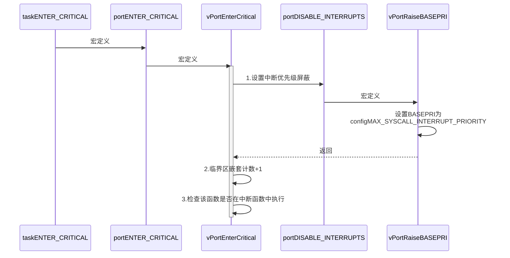

```c
#define taskENTER_CRITICAL() portENTER_CRITICAL()
#define portENTER_CRITICAL() vPortEnterCritical()
```

```c
void vPortEnterCritical( void )
{
    // [1] 屏蔽优先级低于configMAX_SYSCALL_INTERRUPT_PRIORITY的中断
	portDISABLE_INTERRUPTS();
    
    // [2] 临界区嵌套计数+1
	uxCriticalNesting++;

	// [3] 检查该函数不在中断中执行（因为不允许在中断中调用此函数）
    //     只在嵌套计数为1时检查，为了避免configASSERT中也调用了该函数
	if( uxCriticalNesting == 1 )
		configASSERT( ( portNVIC_INT_CTRL_REG & portVECTACTIVE_MASK ) == 0 );
}
```

```c
#define portDISABLE_INTERRUPTS() vPortRaiseBASEPRI()

static portFORCE_INLINE void vPortRaiseBASEPRI( void )
{
uint32_t ulNewBASEPRI = configMAX_SYSCALL_INTERRUPT_PRIORITY;

	__asm
	{
		// 设置basepri为configMAX_SYSCALL_INTERRUPT_PRIORITY
		msr basepri, ulNewBASEPRI
		dsb
		isb
	}
}

```

### 10.1.2 退出临界区

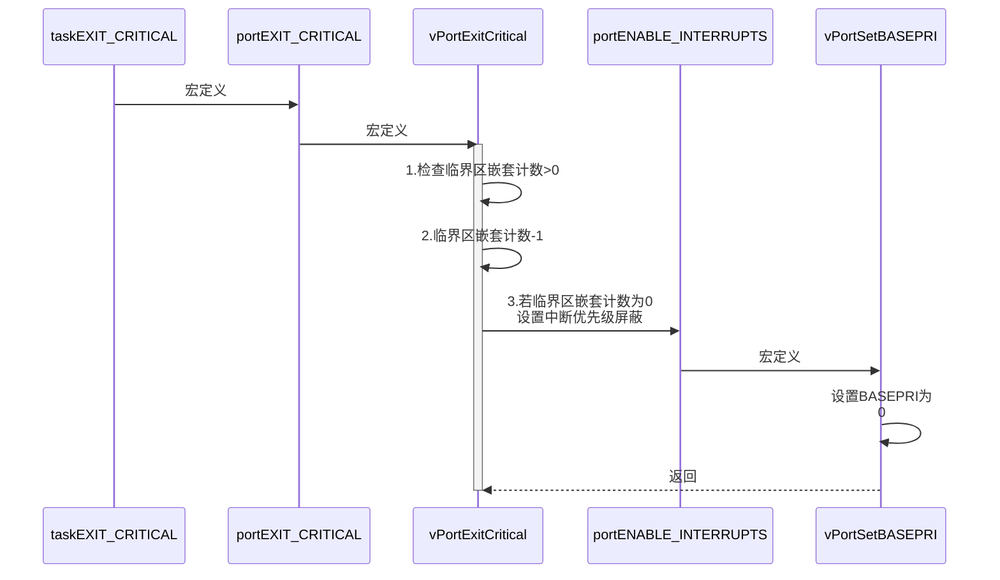

```c
#define taskEXIT_CRITICAL() portEXIT_CRITICAL()
#define portEXIT_CRITICAL()	vPortExitCritical()
```

```c
void vPortExitCritical( void )
{
    // [1] 检查临界区嵌套计数>0
	configASSERT( uxCriticalNesting );
    
    // [2] 临界区嵌套计数-1
	uxCriticalNesting--;
    
    // [3][临界区嵌套计数为0] 设置
	if( uxCriticalNesting == 0 )
	{
		portENABLE_INTERRUPTS();
	}
}
```

```c
#define portENABLE_INTERRUPTS() vPortSetBASEPRI( 0 )

static portFORCE_INLINE void vPortSetBASEPRI( uint32_t ulBASEPRI )
{
	__asm
	{
		/* Barrier instructions are not used as this function is only used to
		lower the BASEPRI value. */
		msr basepri, ulBASEPRI
	}
}

```

## 10.2 中断

### 10.2.1 进入临界区

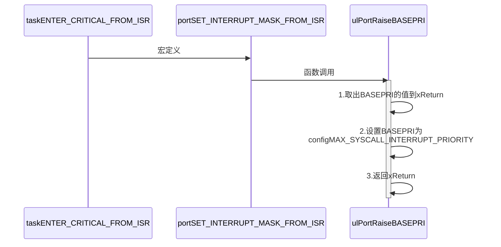

```c
#define taskENTER_CRITICAL_FROM_ISR() portSET_INTERRUPT_MASK_FROM_ISR()
#define portSET_INTERRUPT_MASK_FROM_ISR()		ulPortRaiseBASEPRI()

static portFORCE_INLINE uint32_t ulPortRaiseBASEPRI( void )
{
uint32_t ulReturn, ulNewBASEPRI = configMAX_SYSCALL_INTERRUPT_PRIORITY;

	__asm
	{
		/* Set BASEPRI to the max syscall priority to effect a critical
		section. */
		mrs ulReturn, basepri
		msr basepri, ulNewBASEPRI
		dsb
		isb
	}

	return ulReturn;
}
```

### 10.2.2 退出临界区

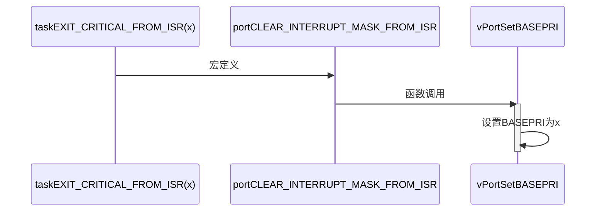

```c
#define taskEXIT_CRITICAL_FROM_ISR( x ) portCLEAR_INTERRUPT_MASK_FROM_ISR( x )
#define portCLEAR_INTERRUPT_MASK_FROM_ISR(x)	vPortSetBASEPRI(x)

static portFORCE_INLINE void vPortSetBASEPRI( uint32_t ulBASEPRI )
{
	__asm
	{
		/* Barrier instructions are not used as this function is only used to
		lower the BASEPRI value. */
		msr basepri, ulBASEPRI
	}
}
```


# 附录

## FreeRTOSConfig.h

```c++
/*
    FreeRTOS V9.0.0 - Copyright (C) 2016 Real Time Engineers Ltd.
    All rights reserved

    VISIT http://www.FreeRTOS.org TO ENSURE YOU ARE USING THE LATEST VERSION.

    This file is part of the FreeRTOS distribution.

    FreeRTOS is free software; you can redistribute it and/or modify it under
    the terms of the GNU General Public License (version 2) as published by the
    Free Software Foundation >>>> AND MODIFIED BY <<<< the FreeRTOS exception.

    ***************************************************************************
    >>!   NOTE: The modification to the GPL is included to allow you to     !<<
    >>!   distribute a combined work that includes FreeRTOS without being   !<<
    >>!   obliged to provide the source code for proprietary components     !<<
    >>!   outside of the FreeRTOS kernel.                                   !<<
    ***************************************************************************

    FreeRTOS is distributed in the hope that it will be useful, but WITHOUT ANY
    WARRANTY; without even the implied warranty of MERCHANTABILITY or FITNESS
    FOR A PARTICULAR PURPOSE.  Full license text is available on the following
    link: http://www.freertos.org/a00114.html

    ***************************************************************************
     *                                                                       *
     *    FreeRTOS provides completely free yet professionally developed,    *
     *    robust, strictly quality controlled, supported, and cross          *
     *    platform software that is more than just the market leader, it     *
     *    is the industry's de facto standard.                               *
     *                                                                       *
     *    Help yourself get started quickly while simultaneously helping     *
     *    to support the FreeRTOS project by purchasing a FreeRTOS           *
     *    tutorial book, reference manual, or both:                          *
     *    http://www.FreeRTOS.org/Documentation                              *
     *                                                                       *
    ***************************************************************************

    http://www.FreeRTOS.org/FAQHelp.html - Having a problem?  Start by reading
    the FAQ page "My application does not run, what could be wrong?".  Have you
    defined configASSERT()?

    http://www.FreeRTOS.org/support - In return for receiving this top quality
    embedded software for free we request you assist our global community by
    participating in the support forum.

    http://www.FreeRTOS.org/training - Investing in training allows your team to
    be as productive as possible as early as possible.  Now you can receive
    FreeRTOS training directly from Richard Barry, CEO of Real Time Engineers
    Ltd, and the world's leading authority on the world's leading RTOS.

    http://www.FreeRTOS.org/plus - A selection of FreeRTOS ecosystem products,
    including FreeRTOS+Trace - an indispensable productivity tool, a DOS
    compatible FAT file system, and our tiny thread aware UDP/IP stack.

    http://www.FreeRTOS.org/labs - Where new FreeRTOS products go to incubate.
    Come and try FreeRTOS+TCP, our new open source TCP/IP stack for FreeRTOS.

    http://www.OpenRTOS.com - Real Time Engineers ltd. license FreeRTOS to High
    Integrity Systems ltd. to sell under the OpenRTOS brand.  Low cost OpenRTOS
    licenses offer ticketed support, indemnification and commercial middleware.

    http://www.SafeRTOS.com - High Integrity Systems also provide a safety
    engineered and independently SIL3 certified version for use in safety and
    mission critical applications that require provable dependability.

*/


#ifndef FREERTOS_CONFIG_H
#define FREERTOS_CONFIG_H

#include "system.h"
#include "usart.h"


//针对不同的编译器调用不同的stdint.h文件
#if defined(__ICCARM__) || defined(__CC_ARM) || defined(__GNUC__)
    #include <stdint.h>
    extern uint32_t SystemCoreClock;
#endif

//断言
#define vAssertCalled(char,int) printf("Error:%s,%d\r\n",char,int)
#define configASSERT(x) if((x)==0) vAssertCalled(__FILE__,__LINE__)

/************************************************************************
 *               FreeRTOS基础配置配置选项 
 *********************************************************************/
/* 置1：RTOS使用抢占式调度器；置0：RTOS使用协作式调度器（时间片）
 * 
 * 注：在多任务管理机制上，操作系统可以分为抢占式和协作式两种。
 * 协作式操作系统是任务主动释放CPU后，切换到下一个任务。
 * 任务切换的时机完全取决于正在运行的任务。
 */
#define configUSE_PREEMPTION					  1

//1使能时间片调度(默认式使能的)
#define configUSE_TIME_SLICING					1		

/* 某些运行FreeRTOS的硬件有两种方法选择下一个要执行的任务：
 * 通用方法和特定于硬件的方法（以下简称“特殊方法”）。
 * 
 * 通用方法：
 *      1.configUSE_PORT_OPTIMISED_TASK_SELECTION 为 0 或者硬件不支持这种特殊方法。
 *      2.可以用于所有FreeRTOS支持的硬件
 *      3.完全用C实现，效率略低于特殊方法。
 *      4.不强制要求限制最大可用优先级数目
 * 特殊方法：
 *      1.必须将configUSE_PORT_OPTIMISED_TASK_SELECTION设置为1。
 *      2.依赖一个或多个特定架构的汇编指令（一般是类似计算前导零[CLZ]指令）。
 *      3.比通用方法更高效
 *      4.一般强制限定最大可用优先级数目为32
 * 一般是硬件计算前导零指令，如果所使用的，MCU没有这些硬件指令的话此宏应该设置为0！
 */
#define configUSE_PORT_OPTIMISED_TASK_SELECTION	        1                       
                                                                        
/* 置1：使能低功耗tickless模式；置0：保持系统节拍（tick）中断一直运行
 * 假设开启低功耗的话可能会导致下载出现问题，因为程序在睡眠中,可用以下办法解决
 * 
 * 下载方法：
 *      1.将开发版正常连接好
 *      2.按住复位按键，点击下载瞬间松开复位按键
 *     
 *      1.通过跳线帽将 BOOT 0 接高电平(3.3V)
 *      2.重新上电，下载
 *    
 * 			1.使用FlyMcu擦除一下芯片，然后进行下载
 *			STMISP -> 清除芯片(z)
 */
#define configUSE_TICKLESS_IDLE		0   

/*
 * 写入实际的CPU内核时钟频率，也就是CPU指令执行频率，通常称为Fclk
 * Fclk为供给CPU内核的时钟信号，我们所说的cpu主频为 XX MHz，
 * 就是指的这个时钟信号，相应的，1/Fclk即为cpu时钟周期；
 */
#define configCPU_CLOCK_HZ						  (SystemCoreClock)

//RTOS系统节拍中断的频率。即一秒中断的次数，每次中断RTOS都会进行任务调度
#define configTICK_RATE_HZ						  (( TickType_t )1000)

//可使用的最大优先级
#define configMAX_PRIORITIES					  (32)

//空闲任务使用的堆栈大小
#define configMINIMAL_STACK_SIZE				((unsigned short)128)
  
//任务名字字符串长度
#define configMAX_TASK_NAME_LEN					(16)

 //系统节拍计数器变量数据类型，1表示为16位无符号整形，0表示为32位无符号整形
#define configUSE_16_BIT_TICKS					0                      

//空闲任务放弃CPU使用权给其他同优先级的用户任务
#define configIDLE_SHOULD_YIELD					1           

//启用队列
#define configUSE_QUEUE_SETS					  0    

//开启任务通知功能，默认开启
#define configUSE_TASK_NOTIFICATIONS    1   

//使用互斥信号量
#define configUSE_MUTEXES						    0    

//使用递归互斥信号量                                            
#define configUSE_RECURSIVE_MUTEXES			0   

//为1时使用计数信号量
#define configUSE_COUNTING_SEMAPHORES		0

/* 设置可以注册的信号量和消息队列个数 */
#define configQUEUE_REGISTRY_SIZE				10                                 
                                                                       
#define configUSE_APPLICATION_TASK_TAG		  0                       
                      

/*****************************************************************
              FreeRTOS与内存申请有关配置选项                                               
*****************************************************************/
//支持动态内存申请
#define configSUPPORT_DYNAMIC_ALLOCATION        1    
//支持静态内存
#define configSUPPORT_STATIC_ALLOCATION					0					
//系统所有总的堆大小
#define configTOTAL_HEAP_SIZE					((size_t)(10*1024))    


/***************************************************************
             FreeRTOS与钩子函数有关的配置选项                                            
**************************************************************/
/* 置1：使用空闲钩子（Idle Hook类似于回调函数）；置0：忽略空闲钩子
 * 
 * 空闲任务钩子是一个函数，这个函数由用户来实现，
 * FreeRTOS规定了函数的名字和参数：void vApplicationIdleHook(void )，
 * 这个函数在每个空闲任务周期都会被调用
 * 对于已经删除的RTOS任务，空闲任务可以释放分配给它们的堆栈内存。
 * 因此必须保证空闲任务可以被CPU执行
 * 使用空闲钩子函数设置CPU进入省电模式是很常见的
 * 不可以调用会引起空闲任务阻塞的API函数
 */
#define configUSE_IDLE_HOOK						0      

/* 置1：使用时间片钩子（Tick Hook）；置0：忽略时间片钩子
 * 
 * 
 * 时间片钩子是一个函数，这个函数由用户来实现，
 * FreeRTOS规定了函数的名字和参数：void vApplicationTickHook(void )
 * 时间片中断可以周期性的调用
 * 函数必须非常短小，不能大量使用堆栈，
 * 不能调用以”FromISR" 或 "FROM_ISR”结尾的API函数
 */
 /*xTaskIncrementTick函数是在xPortSysTickHandler中断函数中被调用的。因此，vApplicationTickHook()函数执行的时间必须很短才行*/
#define configUSE_TICK_HOOK						0           

//使用内存申请失败钩子函数
#define configUSE_MALLOC_FAILED_HOOK			0 

/*
 * 大于0时启用堆栈溢出检测功能，如果使用此功能 
 * 用户必须提供一个栈溢出钩子函数，如果使用的话
 * 此值可以为1或者2，因为有两种栈溢出检测方法 */
#define configCHECK_FOR_STACK_OVERFLOW			0   


/********************************************************************
          FreeRTOS与运行时间和任务状态收集有关的配置选项   
**********************************************************************/
//启用运行时间统计功能
#define configGENERATE_RUN_TIME_STATS	        0             
 //启用可视化跟踪调试
#define configUSE_TRACE_FACILITY				      0    
/* 与宏configUSE_TRACE_FACILITY同时为1时会编译下面3个函数
 * prvWriteNameToBuffer()
 * vTaskList(),
 * vTaskGetRunTimeStats()
*/
#define configUSE_STATS_FORMATTING_FUNCTIONS	1                       
                                                                        
                                                                        
/********************************************************************
                FreeRTOS与协程有关的配置选项                                                
*********************************************************************/
//启用协程，启用协程以后必须添加文件croutine.c
#define configUSE_CO_ROUTINES 			          0                 
//协程的有效优先级数目
#define configMAX_CO_ROUTINE_PRIORITIES       ( 2 )                   


/***********************************************************************
                FreeRTOS与软件定时器有关的配置选项      
**********************************************************************/
 //启用软件定时器
#define configUSE_TIMERS				            0                              
//软件定时器优先级
#define configTIMER_TASK_PRIORITY		        (configMAX_PRIORITIES-1)        
//软件定时器队列长度
#define configTIMER_QUEUE_LENGTH		        10                               
//软件定时器任务堆栈大小
#define configTIMER_TASK_STACK_DEPTH	      (configMINIMAL_STACK_SIZE*2)    

/************************************************************
            FreeRTOS可选函数配置选项                                                     
************************************************************/
#define INCLUDE_xTaskGetSchedulerState       1                       
#define INCLUDE_vTaskPrioritySet		         1
#define INCLUDE_uxTaskPriorityGet		         1
#define INCLUDE_vTaskDelete				           1
#define INCLUDE_vTaskCleanUpResources	       1
#define INCLUDE_vTaskSuspend			           1
#define INCLUDE_vTaskDelayUntil			         1
#define INCLUDE_vTaskDelay				           1
#define INCLUDE_eTaskGetState			           1
#define INCLUDE_xTimerPendFunctionCall	     0
//#define INCLUDE_xTaskGetCurrentTaskHandle       1
//#define INCLUDE_uxTaskGetStackHighWaterMark     0
//#define INCLUDE_xTaskGetIdleTaskHandle          0


/******************************************************************
            FreeRTOS与中断有关的配置选项                                                 
******************************************************************/
#ifdef __NVIC_PRIO_BITS
	#define configPRIO_BITS       		__NVIC_PRIO_BITS
#else
	#define configPRIO_BITS       		4                  
#endif
//中断最低优先级
#define configLIBRARY_LOWEST_INTERRUPT_PRIORITY			15     

//系统可管理的最高中断优先级
#define configLIBRARY_MAX_SYSCALL_INTERRUPT_PRIORITY	5 

#define configKERNEL_INTERRUPT_PRIORITY 		( configLIBRARY_LOWEST_INTERRUPT_PRIORITY << (8 - configPRIO_BITS) )	/* 240 */

#define configMAX_SYSCALL_INTERRUPT_PRIORITY 	( configLIBRARY_MAX_SYSCALL_INTERRUPT_PRIORITY << (8 - configPRIO_BITS) )


/****************************************************************
            FreeRTOS与中断服务函数有关的配置选项                         
****************************************************************/
#define xPortPendSVHandler 	PendSV_Handler
#define vPortSVCHandler 	SVC_Handler


/* 以下为使用Percepio Tracealyzer需要的东西，不需要时将 configUSE_TRACE_FACILITY 定义为 0 */
#if ( configUSE_TRACE_FACILITY == 1 )
#include "trcRecorder.h"
#define INCLUDE_xTaskGetCurrentTaskHandle               1   // 启用一个可选函数（该函数被 Trace源码使用，默认该值为0 表示不用）
#endif


#endif /* FREERTOS_CONFIG_H */
```

