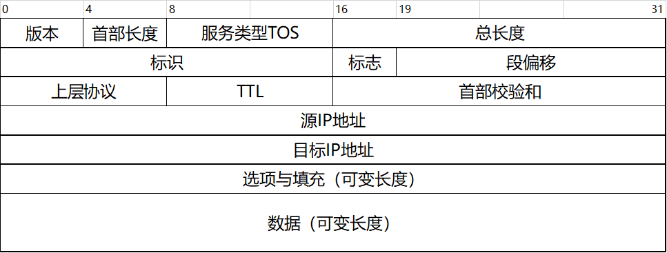
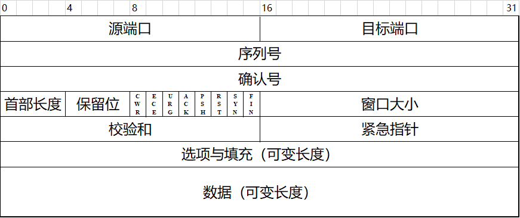

# 网络模型

## TCP/IP协议栈

## OSI模型

# 数据链路层数据格式

## 以太网帧格式

## WiFi帧格式

## ARP数据格式

# 网络层数据格式

## IP数据包格式

## ICMP数据格式

# 传输层数据格式

## TCP段格式

## UDP报文格式

# 应用层数据格式

## Http报文格式

## Https报文格式

## Ftp报文格式

