# 一、工程模板

## 1.1 建立工程目录

工程目录结构：

- **`start`**：
  - stm32的**启动文件**（启动函数）：
    - `startup_xx.s`：
    - `system_xxx.c/.h`：
  - stm32的**寄存器定义**文件（就是一堆的宏定义）：
    - 内核寄存器定义：`core_cm3.c/.h`
    - 外设寄存器定义：`stm32f10x.h`
- **`lib`**：存储stm32的**库文件**
  - 内核库函数：`misc.h/.c`
  - 外设库函数：`stm32f10x_adc.c/.h`、`stm32f10x_can.c/.h`等。
- **`src`**：
  - 配置文件：`stm32f10x_conf.h`
  - 中断函数：`stm32f10x_it.c\.h`
  - 自定义函数：`main.c`等


## 1.2 keil中管理工程

### 1.2.1 在keil工程管理面板中复制目录层级

​		在文件夹中创建的各目录和文件与keil中工程管理面板并不是互通的，而是独立的。因此刚刚在文件夹中作了那么多修改，并不影响keil的工程管理面板（仍然是空的），为了方便管理，需要把工程目录中的文件都添加到工程管理面板中：

- 创建组：
  - 在Target1下右击：选择add group（新建组）并重命名，共添加三个组，对应工程目录下的三个文件夹；
    - `start`、`lib`、`src`
- 添加文件到组：
  - 在刚创建的组上右击（例如在src上右击）：选择`Add Existing Files to Group "src"`
  - 然后在跳出的文件选择窗口中选择组名对应的工程目录下的所有文件（按住Ctrl多选），然后点击`Add`。

### 1.2.2 配置工程选项

- 添加头文件目录：
  - 点击魔术棒按钮（Options for Target），
  - 选择c/c++选项卡，
  - 找到include Paths项：
    - 点击include Paths项中最右侧的省略号按钮，
    - 在新跳出的窗口中点击New(Insert) 按钮，
    - 再点击新建项的省略号按钮，
    - 在跳出的文件选择窗口中选择工程目录中包含头文件的目录，
    - 然后点击选择文件夹。


- 解释：
  - 虽然我们已经把各种头文件都放入了工程目录下，而且也把这些头文件都加入到了keil的工程管理面板中，
  - 但是keil内置的编译器还是不知道哪些目录包含了头文件
    - keil只是知道了你用到了哪些头文件，
    - 但是keil并没有告诉编译器这些头文件在哪个目录下
  - 而编译器运行时（即我们执行编译时）需要知道头文件都在哪些目录，
    - 因此我们还要手动把包含头文件件的目录通过keil的选项卡告诉编译器。
  - 这确实很麻烦，但之所以这么做的理由涉及到编译器（c/c++编译器）的工作方式，所以先这么干吧。

### 1.2.3 添加宏定义

- 同样点击魔术棒按钮，再点击c/c++选项卡，
- 在Define项中输入：`USE_STDPERIPH_DRIVER`。


- 解释：

  - 这么做的效果其实跟在我们的main.c文件中的第一行添加`#define USE_STDPERIPH_DRIVER`，效果一样。

    - 只是把这个宏定义在这里而不是定义在main.c文件里是为了好看。

  - 定义这个宏的作用是启用标准外设库：

    - 我们的main.c文件中一般都会`#include"stm32f10x.h"`，

    - 在stm32f10x.h中，有一段语句：

      ```c++
      #ifdef USE_STDPERIPH_DRIVER
      	#include "stm32f10x_conf.h"
      #endif
      ```

    - 而在stm32f10x_conf.h中，包含了所有标准外设库的头文件。

  - 即：

    - 如果我定义了`USE_STDPERIPH_DRIVER`，
    - 那在`stm32f10x.h`中就会包含`stm32f10x_conf.h`
    - 而`stm32f10x_conf.h`就又包含了所有外设头文件：`stm32f10x_adc.h`、`stm32f10x_can.h`等，
    - 所以这个宏的作用就是包含了所有的外设头文件。


# 二、GPIO

## 2.1 GPIO简介

​		GPIO是General Purpose Input/Output的缩写，意思为通用（目的）输入/输出（端口）。规定高电平为3.3v，低电平为0v，部分引脚可容忍5V。

根据需要，GPIO可以配置为输入或者输出模式：

- **输出模式**：可以控制端口输出高/低电平。
  - 应用：驱动LED、控制蜂鸣器、模拟通信协议时序等。
- **输入模式**：可读取端口的高低电平或电压。
  - 应用：读取按键输入、外接模块电平信号输入、ADC电压采集、模拟通信协议接收数据等。

## 2.2 GPIO结构


GPIO的其中一位的结构如上图所示，**主要组成**有：

- **IO端口**：
  - **保护二极管**：当IO引脚电压大于额定电压时，用于保护单片机不受损坏。
    - 当IO引脚上的电压大于3.3v时，电流会通过（上面的）保护二级管流入VDD，而不会流入单片机内部。
    - 当IO引脚上的电压小于0V时，电流会通过（下面的）保护二级管注入VSS，而不会注入单片机内部。
  - **IO引脚**：对应单板机上具体的一个引脚。
- **输入部分**：从左至右依次介绍
  - 驱动器部分：
    - **VDD开关与VSS开关**：
      - 当VDD闭合、VSS断开时，输入为**上拉输入**，即引脚默认值为1；
      - 当VDD断开、VSS闭合时，输入为**下拉输入**，即引脚默认值为0；
      - 当VDD断开、VSS也断开时，输入为**浮空输入**，即引脚默认值是不确定的；
      - 当VDD闭合，VSS也闭合时，会导致短路（VDD直通VSS），不存在这个功能。
    - **施密特触发器**（为图上的肖特基触发器，图上标注错误）：用于滤波
      - 施密特触发器规定上下限（假设下限为0.7v，上限为2.6v），
      - 当输入电压从小变大，且大于上限时，输出为高电平，
      - 当输入电压由大变小，且小于下限时，输出为低电平。
      - 这样避免了当高电压不稳定时（例如在2.6v上下波动），施密特触发器会输出稳定的高电平3.3v。
      - 低电平不稳定时也是同样的道理。
  - 寄存器部分：
    - **输入数据寄存器**：用于保存IO口的数据（电平）。
      - IO口的数据（电平）经过施密特触发器整形后传递到输入数据寄存器的输入端，
      - 然后经过一个时钟脉冲后，IO口的电平被锁存在了输入数据寄存器中，这样IO口的电平就被保存了下来，
      - 之后内核CPU可以读取输入数据寄存器的电平来获得该IO口的电平。
- **输出部分**：
  - 驱动器部分：
    - **P-MOS与N-MOS**：用于配置输出是高电平还是低电平。
      - 当P-MOS导通，N-MOS断开，VDD与IO口连接，输出高电平；
      - 当P-MOS断开，N-MOS导通，VSS与IO口连接，输出低电平；
      - 当P-MOS断开，N-MOS也断开，IO口关闭（悬空），不输出任何电平；
      - 当P-MOS导通，N-MOS导通，VDD与VSS短接，不存在这个功能。
    - **输出控制**：用于配置IO口的输出模式（通过控制两个MOS管的通断）
      - **推挽输出**：
        - 输出高电平：P-MOS导通，N-MOS断开；
        - 输出低电平：P-MOS断开，N-MOS导通。

      - **开漏输出**：
        - 输出高阻态：P-MOS断开，N-MOS断开；
        - 输出低电平：P-MOS断开，N-MOS导通。

      - 说明：
        - 推挽输出时VDD和VSS分别与IO口直连，因此有较强的驱动能力；
        - 开漏输出无法输出高电平，因此这个模式下的输出为这两种：输出低电平与不输出低电平，一般用于IIc等通信协议中。

  - 寄存器部分：
    - **输出数据寄存器**：与输入数据寄存器类似，用于输出数据（电平）给IO口。
      - 输出数据寄存器上低16位的值就对应了GPIO端口上的16个引脚的电平（高16位保留，为空）。
      - CPU将要输出给IO的电平先锁存在输出数据寄存器中，
      - 然后输出数据寄存器将保存的数据传递到输出控制上来实现IO口输出高低电平。

    - **位设置/清除寄存器**：
      - 由于输出数据寄存器是32位的，每次只能读写32位的数据，如果我只想GPIO操作某一个引脚，每次都要写32位的数据太过麻烦，因此用位设置/清除寄存器来简化操作。
      - 位设置寄存器：可以只将输出数据寄存器上某一位的值置为1；
      - 位清除寄存器：可以只将输出数据顺丰器上某一个的值置为0。

- **IO功能复用**：
  - **模拟输入**：片上外设直接读取IO输入进来的数据（不读取经过施密特触发器整形后的数据），就可以获得IO输入进来的模拟依赖。
  - **复用功能**：片上外设可以通过读取施密特触发器整形后的数据与写入输出控制器来实现对IO的控制（与CPU控制IO方式相同），从而实现片上外设与CPU共同使用这个IO口，所以也叫做IO口复用（共同使用）。


## 2.3 GPIO模式

根据IO上VDD开关与VSS开关的通断，及P-MOS管和N-MOS管的导通情况等，GPIO共有8种工作模式：

- 输入：
  - **上拉输入**：IO口无外接线路时，电平为高电平；
  - **下拉输入**：IO口无外接线路时，电平为低电平；
  - **浮空输入**：IO口无外接线路时，电平未知；
  - **模拟输入**：读取IO口的模拟输入；
- 输出：
  - **推挽输出**：高电平时接VDD，低电平时接VSS；
  - **开漏输出**：”高电平“时为高阻态，低电平时接VSS；
  - **复用推挽输出**：IO口为推挽输出模式，由片上外设控制IO口；
  - **复用开漏输出**：IO口为开漏输出模式，由片上外设控制IO口。


## 2.4 GPIO控制

控制GPIO一般要经过下面几个步骤：

- 启用GPIO

- 配置GPIO

- 使用GPIO

### 2.4.1 启用GPIO

​		GPIO是转载到APB2总线上的（也就是一组引脚默认是接到APB2总线上的），而APB2总线时钟默认是全部关闭的，如果没有时钟，GPIO就无法工作，因此如果要使用GPIO，用要先启动APB2上的GPIO时钟（也就是把系统的时钟线连接到GPIO的时钟线上）。

启动GPIO的需要使用`RCC_APB1PeriphClockCmd`函数：

- 定义：`void RCC_APB1PeriphClockCmd(uint32_t RCC_APB1Periph, FunctionalState NewState);`

- 作用：控制APB2上外设时钟的状态。

- 参数：

  - `RCC_APB1Periph`：外设名称，可以为
    - RCC_APB2Periph_GPIOA；
    - RCC_APB2Periph_GPIOB；
    - RCC_APB2Periph_GPIOC；
    - 还有很多，见附录。
  - `NewState`：启用状态
    - `DISABLE`：禁用；
    - `ENABLE`：启用。

- 示例：

  ```c
  // 启用GPIOA的时钟
  RCC_APB1PeriphClockCmd(RCC_APB2Periph_GPIOA, ENABLE);
  ```

> **RCC**：Reset and Colck Contrl，复位与时钟控制模块
>
> - stm32上基本上所有的时钟都由这个模块管理，
> - 因此要启用GPIO的时钟，也要通过RCC来启动。


### 2.4.2 配置GPIO

在启用了GPIO的时钟后，还需要使用`GPIO_Init`配置GPIO的工作模式：

- 定义：`void GPIO_Init(GPIO_TypeDef* GPIOx, GPIO_InitTypeDef* GPIO_InitStruct);`

- 作用：使用GPIO_InitStruct结构体的成员来初始化GPIO的工作模式。

- 参数：

  - `GPIOx`：GPIO端口名称

    - 可以为`GPIOA` - `GPIOG`。

  - `GPIO_InitStruct`：初始化结构体，其中包含了各种初始化参数，其中的成员有

    - `GPIO_Pin`：IO引脚名称
      - 可以为`GPIO_Pin_0` - `GPIO_Pin_15`，或者`GPIO_Pin_All`
      - 也可以同时指定多个引脚，用`|`来连接，例如：`GPIO_Pin_0 | GPIO_Pin_15 | GPIO_Pin_14`
      
    - `GPIO_Speed`：输出速度，可以为
      - `GPIO_Speed_10MHz`；
      
      -  `GPIO_Speed_2MHz`；
      
      - `GPIO_Speed_50MHz`。
      
    - `GPIO_Mode`：GPIO的工作模式，8种工作模式
      - `GPIO_Mode_AIN`：模拟输入；
      - `GPIO_Mode_IN_FLOATING`：浮空输入；
      - `GPIO_Mode_IPD`：下拉输入；
      - `GPIO_Mode_IPU`：上拉输入；
      - `GPIO_Mode_Out_OD`：开漏输出，”Open Drain“；
      - `GPIO_Mode_Out_PP`：推挽输出：“push pull”；
      - `GPIO_Mode_AF_OD`：复用开漏输出；
      - `GPIO_Mode_AF_PP`：复用推挽输出。
  
- 示例：

  ```c++
  GPIO_InitTypeDef GPIO_InitStruct;  // 申明一个GPIO初始化结构体
  GPIO_InitStruct.GPIO_Pin = GPIO_Pin_13;  // 指定初始化的引用为13脚
  GPIO_InitStruct.GPIO_Speed = GPIO_Speed_50MHz;  // 指定13脚的速度为50Mz
  GPIO_InitStruct.GPIO_Mode = GPIO_Mode_Out_PP;  // 指定13脚的工作模式为推挽输出
  GPIO_Init(GPIOC, &GPIO_InitStruct);  // 将初始化结构体传递给GPIO_Init函数
  ```
  
  - 注意：GPIO_Init函数传入的是GPIO_InitStruct的地址，而不是变量。

> GPIO_InitStructp定义：
>
> ```c
> typedef struct
> {
>   uint16_t GPIO_Pin;             /*!< Specifies the GPIO pins to be configured.
>                                       This parameter can be any value of @ref GPIO_pins_define */
> 
>   GPIOSpeed_TypeDef GPIO_Speed;  /*!< Specifies the speed for the selected pins.
>                                       This parameter can be a value of @ref GPIOSpeed_TypeDef */
> 
>   GPIOMode_TypeDef GPIO_Mode;    /*!< Specifies the operating mode for the selected pins.
>                                       This parameter can be a value of @ref GPIOMode_TypeDef */
> }GPIO_InitTypeDef;
> ```
>

### 2.4.3 使用GPIO

常用的GPIO操作函数有：

```c++
// GPIO输出：
void GPIO_SetBits(GPIO_TypeDef* GPIOx, uint16_t GPIO_Pin);
void GPIO_ResetBits(GPIO_TypeDef* GPIOx, uint16_t GPIO_Pin);
void GPIO_WriteBit(GPIO_TypeDef* GPIOx, uint16_t GPIO_Pin, BitAction BitVal);
void GPIO_Write(GPIO_TypeDef* GPIOx, uint16_t PortVal);

// GPIO输入：
uint8_t GPIO_ReadInputDataBit(GPIO_TypeDef* GPIOx, uint16_t GPIO_Pin);
uint16_t GPIO_ReadInputData(GPIO_TypeDef* GPIOx);
uint8_t GPIO_ReadOutputDataBit(GPIO_TypeDef* GPIOx, uint16_t GPIO_Pin);
uint16_t GPIO_ReadOutputData(GPIO_TypeDef* GPIOx);
```


## 2.5 常用输出输入设备

常用的**GPIO设备**有：

- 输出：

  - LED；

  - 蜂鸣器。

- 输入：

  - 按键；
  - 传感器。

### 2.5.1 LED

LED是light-emitting diode的缩写，意思为发光二极管。发光二极管有各种颜色，一般长脚为正极，短脚为负极（长正短负）。


驱动电路：

- 高电平驱动：将LED的**正极**经过限流电阻接GPIO，负极接地，当GPIO输出高电平时灯亮，低电平时灯灭。
- 低电平驱动：将LED的**负极**经过限流电阻接GPIO，正极接VCC，当GPIO输出高电平时灯亮，高电平时灯灭。
  - 一种采用这种驱动方式，因为这种方式只需要输出低电平，对stm32的负载小。


### 2.5.2 蜂鸣器

蜂鸣器是可以发声的元件，分为：

- 有源蜂鸣器：
  - 使用简单；
  - 只要接通触发电平（高电平或低电平），就会发声。
- 无源蜂鸣器：
  - 相对麻烦；
  - 需要手动给震荡信号，可以通过调节震荡信号的频率来调节蜂鸣器的音调。


### 2.5.3 按键

按键是常用的**输入设备**：

- 按下时导通；
- 松手时断开。

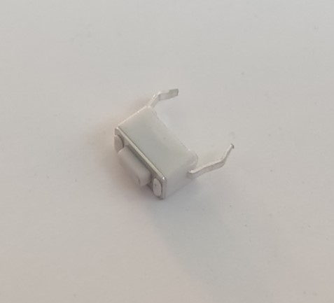

**按键抖动**：

- 按键内部使用**机械式弹簧片**来实现通断的，
- 所以在按下和松手的瞬间会伴随有一连串的抖动（电平拉动）。

因此在使用按键时，往往需要有**消抖**的步骤：

- 电路消抖：使用电容元件消除电平的抖动。
- 软件消抖：在软件中检测到电平变化后，延时一段时间（一般为20ms）再检测是否真的电平变化了，避免因为电平抖动而误判。

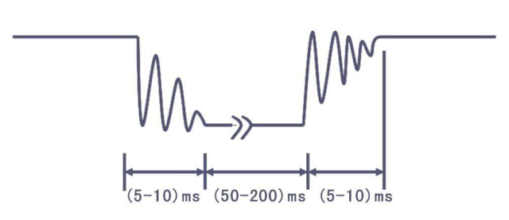

**驱动电路**：

- 低电平触发：
  - GPIO为上拉输入：
    - 松开按键时，GPIO在上拉作用下为高电平；
    - 按下按键时，GPIO接通GND，为低电平。
  - 外置上拉电阻：
    - 工作原理与上述类似。
    - 只是此时使用的是外置的上拉电阻，而不是GPIO内置的上拉电阻，
    - 因此GPIO可以配置为上拉输入或者浮空输入（虽说是浮空模式，但是由于外置上拉电阻的作用，引脚的默认电平是确定的）
- 高电平触发：
  - GPIO为下拉输入：
    - 松开按键时，GPIO在下拉作用下为低电平；
    - 按下按键时，GPIO接通VCC，为高电平。
  - 外置下拉电阻：
    - 工作原理与上述类似。

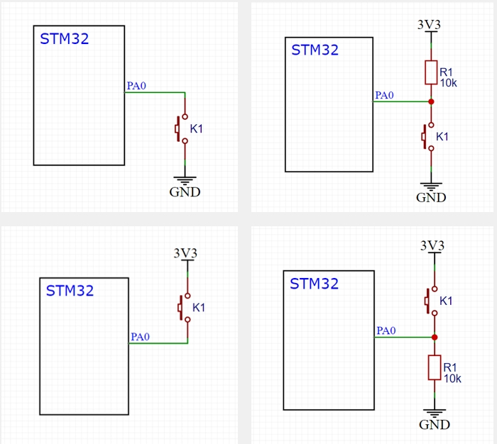


### 2.5.4 传感器模块

**传感器模块**：

- 传感器元件（核心元件）：
  - 光敏电阻；
  - 热敏电阻；
  - 红外接收管等。
- 工作原理：
  - 传感器元件的电阻值随外界物理量的变化而变化，
  - 通过**与定值电阻分压**，即可得到**模拟电压输出**，
  - 再**通过电压比较器进行二值化**，即可得到**数字电压输出**。

**内部电路**（设下图中，从左到右共四幅子图）：

- 图4：
  - **电源**`VCC`与`GND`从P1口的1脚和2脚引入；
  - P3脚用于输出数字量（高电平或低电平）；
  - P3脚用于输出模拟量（连接变化的电压值）。
  - LED显示灯：
    - LED2用于显示`DO`输出为高电平或者低电平，用于观察DO输出的实际电平。
    - LED1为电源指示灯，显示电源是否接通。
- 图3：
  - N1为传感器元件（可以是光敏电阻或热敏电阻等）；
  - R1与N1串联，分压出的**模拟电压**从`AO`输出；
    - 分压也从IN+口输出，用于产生后续的数字量；
  - C2为滤波电容，过滤模拟量中的高频噪声。
- 图2：
  - R2为可调电阻（手动调整阻值），产生的分压输出到`IN-`。
    - `IN-`将在图1与`IN+`比较。
- 图1：
  - LM393为电压比较器，
  - 当`IN-`**小于**`IN+`时，其7脚（连接着`DO`）输出**高电平**，
  - 当`IN-`**大于**I`N+`时，DO输出**低电平**。
  - 因此**调节R2（图2中）可以调节DO高低电平的域值**。

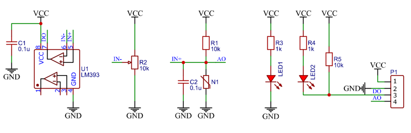

**驱动电路**：

- VCC与GND：负责给传感器模块供电，可以使用stm32提供的电源；
- AO：Analog Output，模拟量输出；
- DO：Digital Output，数字量输出。

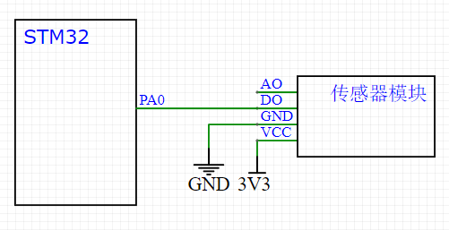


## 2.6 GPIO示例

​		这次笔记中的程序都使用c++编程，面对思想的编程方式更容易理解与维护，可以提高代码的复用率，提升开发效率。

### 2.6.1 继承关系图

```bash
GPIODevice ──┬── GPIOOut ──┬── LED ───── LEDGroup ────  # └├┬
			 |			   |
			 |		       └── Buzzer
			 |
			 └── GPIOIn ──┬─── Button
			 			  |
			 			  └─── Sensor
			 
```


### 2.6.1 GPIO基类

**基类的申明**：

```c++
// GPIO设备的基类
class GPIODevice{
public:
        GPIODevice(GPIO_TypeDef* IO_port=GPIOA, uint16_t pin=GPIO_Pin_0);
        void enable_clock();  // 启用GPIO时钟
protected:
        GPIO_TypeDef* _IO_port;
        uint16_t _IO_pin;
};

// GPIO输出设备（推挽输出）
class GPIOOut: public GPIODevice{
public:
    GPIOOut(GPIO_TypeDef* IO_port=GPIOA, uint16_t pin=GPIO_Pin_0);
    void set();     // 置GPIO口为1
    void reset();   // 置GPIO口为0
	uint8_t get();  // 读取输出口的电平
};

// GPIO输入设备（上拉输入）
class GPIOIn: public GPIODevice{
public:
    GPIOIn();
    GPIOIn(GPIO_TypeDef* IO_port=GPIOA, uint16_t pin=GPIO_Pin_0);
    uint8_t get();
};
```

---

**具体实现**：

```c++
// ------------------- GPIODevice ------------------
// 构造函数
GPIODevice::GPIODevice(GPIO_TypeDef* IO_port, uint16_t pin):_IO_port(IO_port), _IO_pin(pin){   
    // 启用GPIO时钟
    this->enable_clock();
}

// 启用时钟
void GPIODevice::enable_clock(){
    if(_IO_port == GPIOA){
        RCC_APB2PeriphClockCmd(RCC_APB2Periph_GPIOA, ENABLE);
    }
    else if(_IO_port == GPIOB){
        RCC_APB2PeriphClockCmd(RCC_APB2Periph_GPIOB, ENABLE);
    }
    else if(_IO_port == GPIOC){
        RCC_APB2PeriphClockCmd(RCC_APB2Periph_GPIOC, ENABLE);
    }
	else if(_IO_port == GPIOD){
        RCC_APB2PeriphClockCmd(RCC_APB2Periph_GPIOD, ENABLE);
    }
    else if(_IO_port == GPIOE){
        RCC_APB2PeriphClockCmd(RCC_APB2Periph_GPIOE, ENABLE);
    }
    else if(_IO_port == GPIOF){
        RCC_APB2PeriphClockCmd(RCC_APB2Periph_GPIOF, ENABLE);
    }
    else if(_IO_port == GPIOG){
        RCC_APB2PeriphClockCmd(RCC_APB2Periph_GPIOG, ENABLE);
    }
}

// ------------------- GPIOOut ------------------
// 构造函数
GPIOOut::GPIOOut(GPIO_TypeDef* IO_port, uint16_t pin):GPIODevice(IO_port, pin){
    // 配置GPIO为输出模式
    GPIO_InitTypeDef GPIO_InitStruct;
    GPIO_InitStruct.GPIO_Pin = _IO_pin;
    GPIO_InitStruct.GPIO_Speed = GPIO_Speed_50MHz;
    GPIO_InitStruct.GPIO_Mode = GPIO_Mode_Out_PP;
    GPIO_Init(_IO_port, &GPIO_InitStruct);
}

// GPIO口置为1
void GPIOOut::set(){
    GPIO_SetBits(this->_IO_port, this->_IO_pin);
}

// GPIO口置为0
void GPIOOut::reset(){
    GPIO_ResetBits(this->_IO_port, this->_IO_pin);
}

// 读取输出口的电平
uint8_t GPIOOut::get(){
    return GPIO_ReadInputDataBit(_IO_port, _IO_pin);
}

// -------------------- GPIOIn -------------------
// 构造函数
GPIOIn::GPIOIn(GPIO_TypeDef* IO_port, uint16_t pin):GPIODevice(IO_port, pin){
    // 配置GPIO为输入模式
    GPIO_InitTypeDef GPIO_InitStruct;
    GPIO_InitStruct.GPIO_Pin = _IO_pin;
    GPIO_InitStruct.GPIO_Speed = GPIO_Speed_50MHz;
    GPIO_InitStruct.GPIO_Mode = GPIO_Mode_IPU;
    GPIO_Init(_IO_port, &GPIO_InitStruct);
}

// 读取IO口数据
uint8_t GPIOIn::get(){
    return GPIO_ReadInputDataBit(_IO_port, _IO_pin);
}
```


### 2.6.1 灯闪烁

**定义一个LED类**：

```c++
// LED设备
class LED: public GPIOOut{
public:
	static const uint8_t LEDON = 0;
	static const uint8_t LEDOFF = 1;
    // 构造函数
    LED(GPIO_TypeDef* IO_port=GPIOC, uint16_t pin=GPIO_Pin_13);	
    void on();  // 灯亮
    void off();	// 灯灭
    void twinkle(int times=1, int interval_ms=500);  // LED闪烁（阻塞式地）
    void flip();  // 翻转亮灭状态
};
```

---

在构造函数中实现**启用与配置LED需要的GPIO**：

```c++
// 构造函数：指定led的端口和引脚
LED::LED(GPIO_TypeDef* IO_port, uint16_t pin):GPIOOut(IO_port, pin){  
	// 关闭灯
	this->off();
}

// 灯亮
void LED::on(){
    this->reset();
}

// 灯灭
void LED::off(){
    this->set();
}

// LED闪烁一次
void LED::twinkle(int times, int interval_ms){ 
/*
    times: 闪烁次数，如果闪烁次数为负数，表示无限次数
    interval_ms：闪烁间隔时间
*/
    int i=times;
    while(1){
        this->on();
        Delay_ms(interval_ms);
        this->off();
        Delay_ms(interval_ms);
        if(times < 0)
            continue;
        else{
            i--;
            if(i<=0) break;
        }
    }
}

// 翻转亮灭状态
void LED::flip(){
    uint8_t status = get();
    if(status == LEDON) off();
    else if(status == LEDOFF) on();
}
```

---

**主函数**：

```
LED light(GPIOA, GPIO_Pin_3);
light.twinkle();
```


### 2.6.2 流水灯

流水灯需要多个led轮流闪烁，即多个GPIO配合，因此**定义一个LEDGroup类**，进行统一管理：

```c++
class LEDGroup: public LED{
	public:
		using LED::_IO_port;
        LEDGroup(GPIO_TypeDef* IO_port, uint16_t *pins, uint8_t num_light);
        void on();  // 灯亮
        void off();	// 灯灭
        void waterfall(int interval_ms);  // 流水灯
    
    protected:
        uint16_t *_IO_pins;
        uint8_t _num_light;
};
```

---

完成**多个GPIO的统一启用与配置**：

```c++
// 构造函数
LEDGroup::LEDGroup(GPIO_TypeDef* IO_port, uint16_t *pins, uint8_t num_light){
	// 读取参数
    this->_IO_port = IO_port;
    this->_IO_pins = pins; 
    this->_num_light = num_light;
    this->_IO_pin = 0;
    for(int i=0; i<this->_num_light; i++) _IO_pin |= this->_IO_pins[i];

    // 启用GPIO时钟
    this->enable_clock();
    
    // 配置GPIO           
    GPIO_InitTypeDef GPIO_InitStruct;
    GPIO_InitStruct.GPIO_Pin = _IO_pin;
    GPIO_InitStruct.GPIO_Speed = GPIO_Speed_50MHz;
    GPIO_InitStruct.GPIO_Mode = GPIO_Mode_Out_PP;
    GPIO_Init(_IO_port, &GPIO_InitStruct);
	
	// 关闭灯
	this->off();
}
```

- 通过pins数组传递多个IO口；
- 但是当前函数只实现了同一组端口下的流水灯，多个端口的流水灯比较麻烦。

---

**流水灯实现**：

```c++
// 流水灯
void LEDGroup::waterfall(int interval_ms){
    uint8_t index = 0;
    int8_t dir = 1;
    while(1){
        GPIO_ResetBits(this->_IO_port, this->_IO_pins[index]);
        Delay_ms(interval_ms);
        GPIO_SetBits(this->_IO_port, this->_IO_pins[index]);
        Delay_ms(interval_ms);

        if(index == this->_num_light-1)
            dir = -1;
        else if(index==0)
            dir = 1;
        index += dir;
    }
}
```

思路：

- 轮流对各GPIO输出低电平和高电平，即每个LED轮流闪烁一次。

---

**主函数**：

```c++
uint16_t pins[6] = {GPIO_Pin_0, GPIO_Pin_1, GPIO_Pin_2, GPIO_Pin_3, GPIO_Pin_4, GPIO_Pin_5};
LEDGroup leds(GPIOA, pins, 6);
leds.twinkle(500);
```

### 2.6.3 按键控制蜂鸣器

### 2.6.4 小夜灯


# 三、外部中断

## 3.1 中断与stm32

### 3.1.1 中断介绍

**中断**：

- 在**主程序运行过程中**，
- 出现了特定的**中断触发条件**（中断源）：
  - CPU将暂停当前正在远行的程序，
  - 转而去处理中断程序。
- 中断程序结束后，**主程序指针回到被暂停的位置**继续运行。

**中断优先级**：

- 当有**多个中断源**同时申请中断时，
- CPU会根据中断源的轻重缓急（**优先级**）进行裁决，
- 优先响应更加紧急（优先等级更高）的中断源。

> 在stm32中，中断的优先级由数字表示，优先级越高，对应的数字越小（系统级中断的优先级甚至为负数）。

**中断嵌套**：

- 当一个**中断程序正在运行**时，
- 又有新的**更高优先级的中断源**申请中断，
  - CPU**再次暂停当前中断程序，转而去处理新的中断程序**，
- 处理完成后依次进行返回。

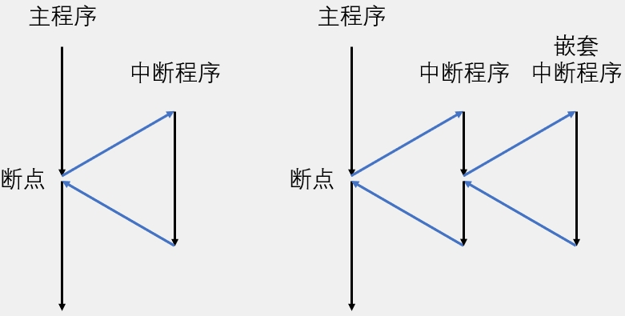

### 3.1.2 stm32中断

stm32共有**68个可屏蔽中断通道**：

- `EXTI`：外部中断；
- `TIM`：定时器中断；
- `ADC`：模数转换中断；
- `USART`：串口中断；
- `SPI`；
- `IIC`；
- `RTC`；
- ……

**NVIC**：Nested Vectored Interupt Controller，嵌套向量中断控制器。

- 负责管理stm32中的所有中断：

  - **中断优先级分组**：由NVIC中的优先级寄存器的4位决定

    - 抢占优先级：抢占优先级高的中断可以嵌套中断。
    - 响应优先级：响应优先级高的中断可以优先排除。

  - 优先级寄存器的4位可以进行任意切分为两组，因此就有5种**分组方式**：

    - | 分组方式 | 抢占优先级      | 响应优先级      |
      | -------- | --------------- | --------------- |
      | 分组0    | 0位，取值为0    | 4位，取值为0-15 |
      | 分组1    | 1位，取值为0-1  | 3位，取值为0-7  |
      | 分组2    | 2位，取值为0-3  | 2位，取值为0-3  |
      | 分组3    | 3位，取值为0-7  | 1位，取值为0-1  |
      | 分组4    | 4位，取值为0-15 | 0位，取值为0    |

  - 如果抢占优先和响应优先级都一样，则按照中断号排队。

- 在中断信号到达CPU之前，会先经过NVIC电路，由NVIC根据中断源的优先级进行放行。

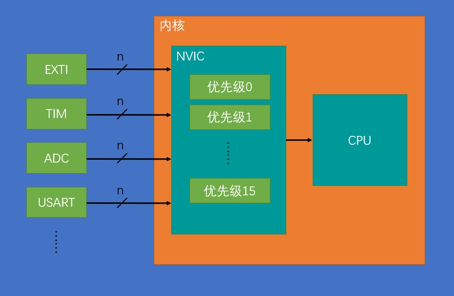

## 3.2 外部中断

### 3.2.1 简介

**外部中断**一般用英文缩写**EXTI**表示，意思为External Interupt。

- **工作原理**：监测指定GPIO的电平信号是否变化
  - 当其指定的GPIO口产生电平变化时，EXTI立即向NVIC发出中断申请，
  - 经过NVIC裁决后即可中断CPU主程序，使CPU执行EXTI对应的中断程序。
- **触发方式**：
  - 上升沿；
  - 下降沿；
  - 双边沿；
  - 软件触发。

- **通道数**：20个
  - 16个GPIO_Pin；
    - EXTI支持所有GPIO口作为中断源，
    - 但是相同的Pin不能同时触发中断。
      - 例如：GPIOA_Pin1和GPIOB_Pin1不能共存。
  - PVD输出、RTC闹钟、USB唤醒、以太网唤醒；
- **响应方式**：
  - 中断响应；
  - 事件响应。

### 3.2.2 EXTI结构

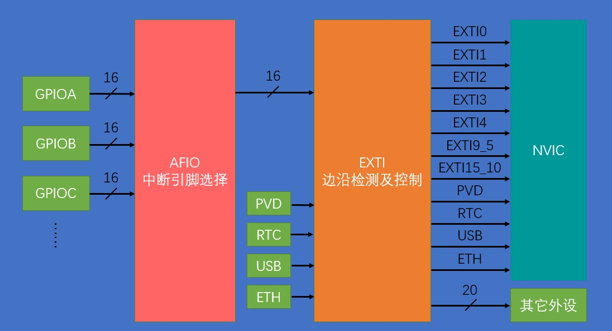

使用EXTI主要由下面几个环节参与：

- **GPIO**：连接中断源
  - 当`GPIO`口产生电平变化时，首先将电平信号发往`AFIO`。
- **AFIO**：选择中断源
  - `AFIO`从 `GPIOA` - `GPIOG` 的112 (16*7) 个引脚中**选择16个引脚作为EXTI的触发通道**。
    - 这16个引脚需要是不同的pin编号，例如：`GPIOA_pin_10`和`GPIOB_pin_10`不能同时启用。
  - 从`AFIO`出来的16个通道与`PVD`、`RTC`、`USB`、`ETH`组成完整的**20个`EXTI`中断通道**。
- **EXTI**：检测中断触发
  - `EXTI`**检测20个通道的电平信号**，一旦电平信号满足条件：
    - 就发起对应通道的中断请求（”请求“本质上也是一个电平信号）；
    - 同时向其他外设发送中断信号（允许外设处理中断而不是CPU处理中断，缓解CPU负担）。
- **NVIC**：按优先级裁决
  - 根据事先配置的中断优先级决定是否放行EXTI的中断请求。
  - 如果同时存在的其他中断优先级低于EXTI中断，则中断请求发送给CPU，CPU执行EXTI的中断程序。
    - 否则，中断请求将被缓存在队列中，等待高优先级的中断程序执行完成。

### 3.2.3 AFIO

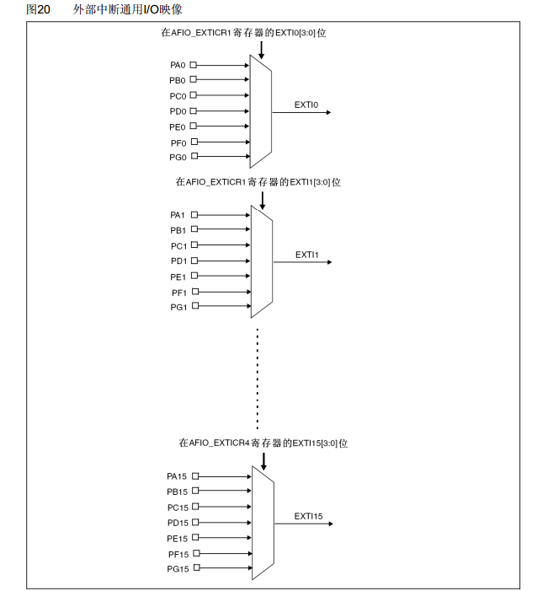

- AFIO包含了16个多路开关，
  - 每个多路开关都决定中断通道指向哪个GPIO端口。

- 例如：
  - EXTI0指向PA0，EXTI1指向PC1，
    - 即EXTI0分配给了PA0，EXTI1分配给了PC1。
  - 但是不存在EXT0指向PA0，EXTI1指向PB0，
    - 所以相同的Pin不能同时作为中断源。

### 3.2.4 EXTI

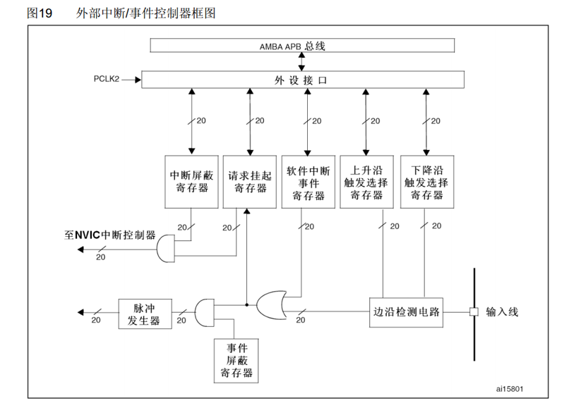

- **输入**：
  - 由AFIO出来的16个通道与其他四个通道将被送往EXTI进行触发检测。
- **中断检测**：
  - **上升沿触发选择寄存器**：配置中断为上升沿触发。
  - **下降沿触发选择寄存器**：配置中断为下降沿触发。
  - **边沿检测电路**：根据上面两个寄存器来检测电平边沿。
  - **软件中断事件寄存器**：主动发送中断信号。
  - **或门**：只要边沿检测电路和软件中断事件寄存器有一个发送中断，就认为中断触发。
- **发起中断**：
  - **请求挂起寄存器**：中断信号首先将请求挂起寄存器置为1
    - 可用于用户判断中断是否已经触发，
    - 但是需要用户手动清零（在中断程序中），否则会被视为中断一直被触发。
  - **中断屏蔽器**：发送中断屏蔽信号。
  - **与门**：只要中断屏蔽信号为0，与门就没有输出，中断信号就被屏蔽了。
- **发起事件**：
  - **事件屏蔽寄存器**：发送事件屏蔽信号。
  - **与门**：只要事件屏蔽信号为0，与门就没有输出，事件信号就批号从屏蔽了。
- **外设接口**：
  - 外设接口可以访问上述寄存器，具有了与CPU一样的权利。
  - 可以使外设独立使用中断（即事件），降低CPU负担。

### 3.2.5 配置与使用EXTI

根据3.2.2中EXTI的结构图，若需使用EXTI，应先配置GPIO、AIFO、NVIC。

---

**配置GPIO**

- **启用GPIO时钟**：`RCC_APB2PeriphClockCmd(RCC_APB2Periph_GPIOB, ENABLE);`

- **GPIO初始化**：

  - 定义GPIO初始化结构体：

    ```c++
    GPIO_InitTypeDef GPIO_InitStructure;
    GPIO_InitStructure.GPIO_Mode = GPIO_Mode_IPU;
    GPIO_InitStructure.GPIO_Pin = GPIO_Pin_2;
    GPIO_InitStructure.GPIO_Speed = GPIO_Speed_50Mhz;
    ```

  - 进行GPIO初始化：`GPIO_Init(GPIOB, &GPIO_InitStructure);`

---

**配置AFIO**：

- **启用AFIO时钟**：`RCC_PeriphClockCmd(RCC_APB2Periph_AFIO, ENABLE);`
- **选择中断引脚**：`GPIO_EXTILineConfig(uint8_t GPIO_PortSource, uint8_t GPIO_PinSource);`
  - `GPIO_PortSource`：中断端口，可以是`GPIO_PortSourceA` -- `GPIO_PortSourceG`；
  - `GPIO_PinSource`：中断引脚，可以是`GPIO_Pinsource0` -- `GPIO_PinSource15`
    - 中断的GPIO引脚号也就对应了外部中断的通道号，如PA1也就对应了EXTI1。

---

**配置EXTI**：

- **定义EXITI初始化结构体**：`EXTI_InitTypeDef EXTI_InitStructure;`

- **设置初始化结构体参数**：

  - **中断通道**：`EXTI_Line`
    - `EXTI_Line0` -- `EXTI_Line19`。
  - **通道命令**：`EXTI_LineCmd`
    - `ENABLE`：开启通道；
    - `DISABLE`：关闭通道。
  - **中断模式**：`EXTI_Mode`
    - `EXTI_Mode_Interrupt`：中断模式；
    - `EXTI_Mode_Event`：事件模式。
  - **触发模式**：`EXTI_Trriger`
    - `EXTI_Trigger_Rising`：上升沿触发；
    - `EXTI_Trigger_Falling`：下降沿触发；
    - `EXTI_Trigger_Rising_Falling`：上升下降沿都触发。

- **进行初始化**：`EXTI_Init(&EXTI_InitStructure);`	

- **例如**：

  ```c++
  EXTI_InitTypeDef EXTI_InitStructure;						//定义结构体变量
  EXTI_InitStructure.EXTI_Line = EXTI_Line2;					//选择配置外部中断的2号线
  EXTI_InitStructure.EXTI_LineCmd = ENABLE;					//指定外部中断线使能
  EXTI_InitStructure.EXTI_Mode = EXTI_Mode_Interrupt;			//指定外部中断线为中断模式
  EXTI_InitStructure.EXTI_Trigger = EXTI_Trigger_Falling;		//指定外部中断线为下降沿触发
  EXTI_Init(&EXTI_InitStructure);								//将结构体变量交给EXTI_Init，配置EXTI外设
  ```

---

**配置NVIC**：

- **设置优先级分组**：`NVIC_PriorityGroupConfig(uint32_t NVIC_PriorityGroup);`

  - `NVIC_PriorityGroup`：分组模式，可以是`NVIC_PriorityGroup_0` -- `NVIC_PriorityGroup_4`

- **初始化NVIC**：

  - **定义初始化结构体**：`NVIC_InitTypeDef NVIC_InitStructure;`
  - **填入参数**：
    - 中断请求通道：`NVIC_IRQChannel`（IRQ是Interrupt ReQuest）
      - 具体可以数值定义在`stm3210x.h`中。
    - 通道命令：`NVIC_IRQChannelCmd`
      - `ENABLE`：启用该中断通道的请求。
      - `DISABLE`：禁用该中断通道的请求。
    - 抢占优先级：`NVIC_IRQChannelPreemptionPriority`
      - 具体的数值，参考3.1.2NVIC优先级分组，如：1表示抢占优先级为1。
    - 响应优先级：`NVIC_IRQChannelSubPriority`
      - 具体的数值，如：2表示响应优先级为2。
  - **初始化**：`NVIC_Init(NVIC_InitTypeDef* NVIC_InitStruct);`

- **例如**：

  ```c++
  // 设置中断优先级分组
  NVIC_PriorityGroupConfig(uint32_t NVIC_PriorityGroup2);
  
  // 定义NVIC初始化结构体并填入参数
  NVIC_InitTypeDef NVIC_InitStructure;
  NVIC_InitStructure.NVIC_IRQChannel = EXTI15_10_IRQn;
  NVIC_InitStructure.NVIC_IRQCmd = ENABLE;
  NVIC_InitSturcture.NVIC_IRQChannelPreemptionPriority = 1;
  NVIC_InitSturcture.NVIC_IRQChannelSubpriority = 1;
  
  // 初始化NVIC
  NVIC_Init(&NVIC_InitStructure);
  ```

> stm32把EXTI5-EXTI9合并为一个中断请求了，EXTI15-EXTI10也是，所以在NVIC初始化结体中指定NVIC通道时，填写EXTI15_10_IRQn，如果是EXTI4的中断请求，那就填EXTI4_IRQn。

---

**实现中断服务函数(ISR，Interupt Service Routine)**

- **函数名称**：

  - 中断服务函数的名称都是stm32预先定义好的（在`startup_stm32f10x_md.s`中申明了），
  - 一般命名规则是`中断名+IRQHandler`，
  - 中断服务函数没有接收值也没有返回值，
  - 例如：`void EXTI15_10_IRQHandler(void)`

- **检查与清零中断标志**：

  - **检测中断标志**：`ITStatus EXTI_GetITStatus(uint32_t EXTI_Line);`
    - `EXTI_Line`：EXTI通道，可以是`EXTI_Line0` -- `EXTI_Line19`
    - `ITStatus`：中断标志，`SET` 或者 `RESET`
  - **清零中断标志**：`void EXTI_ClearITPendingBit(uint32_t EXTI_Line);`

- **例如**：

  ```c++
  void EXTI15_10_IRQHandler(void){
      // 判断是否是期望通道触发的中断
      if(EXTI_GetITStatus(EXTI_Line14) == SET){
          // 主函数体
          
          EXTI_ClearPendingBit(EXTI_Line14);
      }
  }
  ```

  

> 为什么要检测中断标志：
>
> - 因为EXTI15和EXTI10被合并为一个中断请求了，
> - EXTI15 - EXTI10都被触发这个中断服务函数，
> - 所以进入中断服务函数后要先检查是不是期望有中断通道被触发了。
>
> 为什么清零中断标志：
>
> - 中断标志需要手动清除，否则中断服务程序执行完后，
> - 系统检测到中断标志位被设置，
> - 会认为中断又被触发，将一直执行中断服务程序。


# 四、定时器

## 4.1 简介

- **英文缩写**：定时器的缩写为 `TIM`（timer）。
- **工作原理**：定时器可以对输入的时钟进行计数，并在计数值达到设定值时触发中断。
- **时基单元**：预分频器、16位计数器、自动重装寄存器。
  - 在72MHz计数时钟下可以实现最大59.65s的定时；
  - 如果嫌定时时间不够，可以多个定时器级联，可实现几十万亿年的定时。
- **分类**：根据定时器的复杂度和使用场景，定时器分为
  - **基本定时器**：
    - 编号：`TIM6`、`TIM7`；
    - 总线：APB1总线；
    - 功能：
      - 定时中断；
      - 主从触发模式DAC。
  - **通用定时器**：
    - 编号：`TIM2`、`TIM3`、`TIM4`、`TIM5`；
    - 总线：APB1总线；
    - 功能：
      - 拥有基本定时器的全部功能；
      - 内外时钟源选择；
      - 输入捕获；
      - 输出比较；
      - 编码器接口；
      - 主从模式触发等。
  - **高级定时器**：
    - 编号：`TIM1`、`TIM8`；
    - 总线：APB2总线；
    - 功能：
      - 拥有基本定时器的全部功能；
      - 重复计数器；
      - 死区生成；
      - 互补输出；
      - 刹车输入等。

> STM32F103C8T6具有的定时器仅有`TIM1`、`TIM2`、`TIM3`、`TIM4`


## 4.2 基本定时器

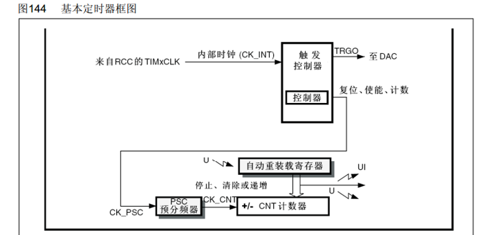

- **时钟源**：基本定时器的时钟源只能是内部时钟。

  - 内部时钟是72MHz。

- **触发控制器**：

  - **TRGO**：输出一个外设事件。
  - **控制器**：输出复位信号、计数器使能信号与计数信号 到时基单元。
    - 复位信号：用于将计数器清零；
    - 计数器使能信号：用于使能计数器，否则计数器不计数；
    - 计数信号：脉冲信号，一个脉冲计数器计数一次，
      - 控制器发送脉冲信号就是时钟源发送的信号。

- **时基单元**：

  - **预分频器**：简称PSC，"PreSCaler"的缩写，

    - **作用**：用于将降低计数信号（脉冲信号，或者说时钟信号）的频率，简称分频；

      - 其实预分频器也是一个计数器，当他计数到指定数时再输出一个脉冲，然后自身清零，
      - 因而多个计数信号对应一个预分步器输出，就相当于对计数信号作为分频。

    - **分频倍率**可以用这个公式计算：
      $$
      CK\_CNT = CK\_PSC/(PSC+1)
      $$

      - $CK\_CNT$：分频器输出频率，也为计数器输入频率；
      - $CK\_PSC$：分频器输入频率；
      - $PSC$：分频器设定值。

    - **例如**：PSC的值为1，表示2分频。

  - **计数器**：简称CNT，"CouNTer"的缩写，每有一个脉冲输入就自加1或自减1（取决于模式）

    - 递增模式：输入一个脉冲，计数器自加1；
    - 递减模式：输入一个脉冲，计数器自减1；
    - 中央对齐模式：
      - 输入一个脉冲，计数器先自加1，到达指定数值后（ARR寄存器的值）自减1，
      - 自减到零后，再自加1。

  - **自动重装寄存器**：简称ARR，"Auto Reload Register"

    - **重装载**：当计数器的数值大于自动重载计数器的数值时，将计数器清零。
      - 例如：假如当前时刻CNT数值为99，ARR设定为100，
      - 一个脉冲后，CNT变为100，与ARR相等，但此时不清零；
      - 再来一个脉冲后，CNT变为101，大于ARR，此时清零，则CNT变为0
      - 因此相当于一个脉冲使得CNT直接从100变成为0，而不是从100变成了101，
    - **溢出**：当发生清零时，称为计数器溢出
      - 计数器溢出时会输出一个脉冲，
      - 该脉冲根据需要，会通往NVIC，从而触发定时器中断；
      - 或能被重映射别的功能上。

- **溢出频率**：计数器的溢出频率是定时器的输出频率，决定了定时器中断的触发频率，可以用下面的公式计算：
  $$
  \begin{align}
  CK\_CNK\_OV 
  &= \frac{CK\_CNT}{ARR+1}  \\[2ex]
  &= \frac{CK\_PSC / (PSC+1)}{ARR+1} \\[2ex]
  &= \frac{CK\_PSC}{(ARR+1)(PSC+1)} \\[2ex]
  \end{align}
  $$

  - $CK\_CNK\_OV$：计数器溢出频率；
  - $CK\_CNT$：计数器输入频率；
  - $ARR$：自动重装寄存器设定值。

- **计数溢出周期**，即定时周期可以按下式计算：
  $$
  \begin{align}
  T\_CNK\_OV 
  &= \frac{ARR + 1}{CK\_CNT}  \\[2ex]
  &= \frac{ARR + 1}{CK\_PSC / (PSC+1)} \\[2ex]
  &= \frac{(ARR + 1)(PSC + 1)}{CK\_PSC} \\[2ex]
  
  \end{align}
  $$

- **使用方法**：

  - 通过设置预分频器和自动重装寄存器的数值，可以灵活地设置定时时间。
  - 例如：
    - 当PSC设为9，ARR为71999时，则一次计数周期为 $\cfrac{(71999+1)(9+1)}{72 \times10 ^6}=0.01\; \text{s}$ ；
    - 当PSC设为99，ARR为7199时，则一次计数周期也为 $\cfrac{(7199+1)(99+1)}{72 \times10 ^6}=0.01\; \text{s}$ 。

## 4.3 通用定时器

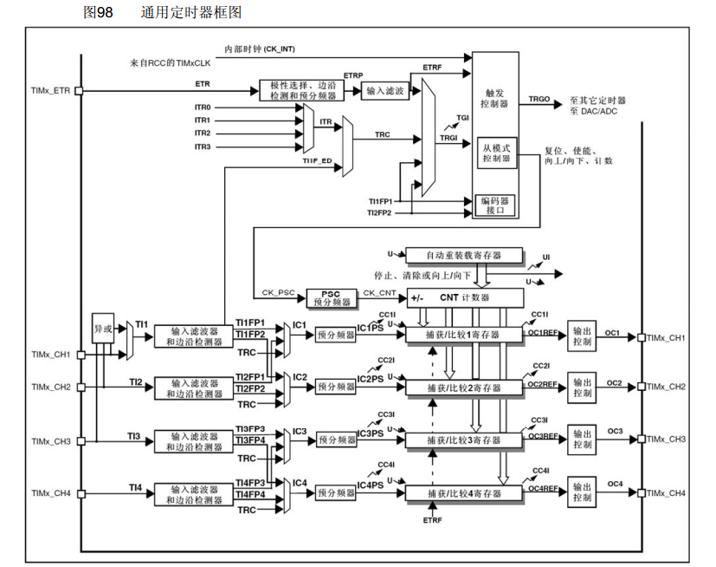

- **组成**：
  - **时钟源选择**：
    - **内部时钟模式**：可选择为内部时钟源，此时定时器为内部时钟模式；
    - **外部时钟模式2**：将GPIO的输入信号作为时钟源
      - 外部时钟源GPIO的引脚号是规定好的，即固定的GPIO口可以复用为外部时钟源；
      - 从GPIO接入的外部时钟源ETR会经过极性选择、边沿检测和预分频器后，得到比较规整的脉冲信号ETRP；
      - ETRP再经过滤波，得到ETRF。
    - **外部时钟模式1**：
      - 将GPIO输入的时钟源经过规定后的脉冲信号作为外部时钟，此时跟外部时钟模式2没有区别；
      - 将系统内其他定时器的输出作为该定时器的时钟源；
      - 将输入捕获的信号作为时钟源。
    - **编码器模式**：
  - **原基本定时器的架构**：
    - 时基单元，在基本定时器中已经介绍过。
  - **输出比较**：这里简单介绍下，后面还会仔细讲解。
    - **比较寄存器**：
      - 将自身的数值与时基单元中计数器的数值进行比较，
      - 若计数器数值大于比较寄存器数值，则输出高电平
        - 这只是其中一种情况，后面还会仔细讲解。
      - 比较寄存器与捕获寄存器为同一寄存器（也就是一个寄存器两个作用，取决于定时器的工作模式）。
    - **输出控制**：控制比较寄存器的输出的能断、极性或是触发中断等。
  - **输入捕获**：

## 4.4 高级定时器

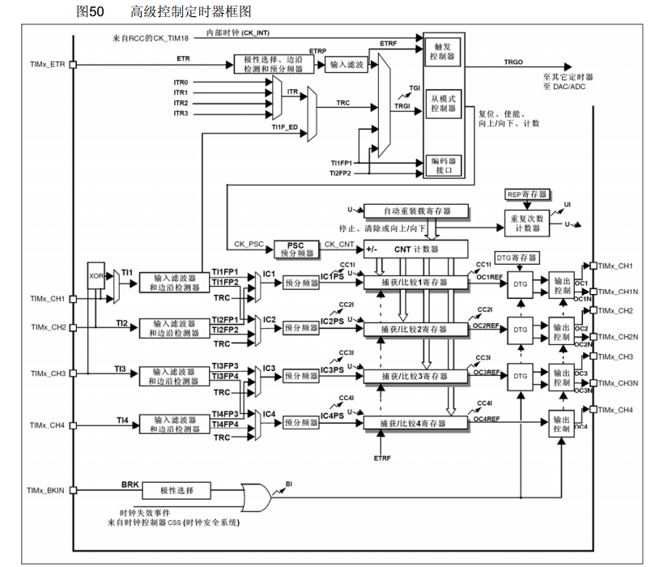


## 4.5 主从触发模式

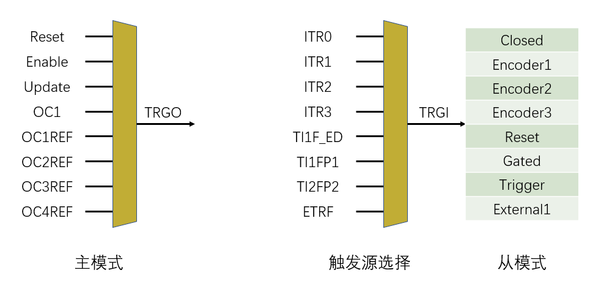

- 主模式：由定时器内部信号触发，输出脉冲信号TRGO给外部。
  - 此时相当于定时器输出控制信号TRGO给外部，自己为主动方，因而称为主模式。
- 从模式：由定时器内部或外部信号触发，定时器自身自动执行一系列动作（由硬件自动完成）。
  - 此时相当于定时器受一个信号触发，被动地去完成一件事，为被动方，因而称为从模式。
- 触发源：主模式或从模式的触发信号源。

## 4.6 定时中断基本

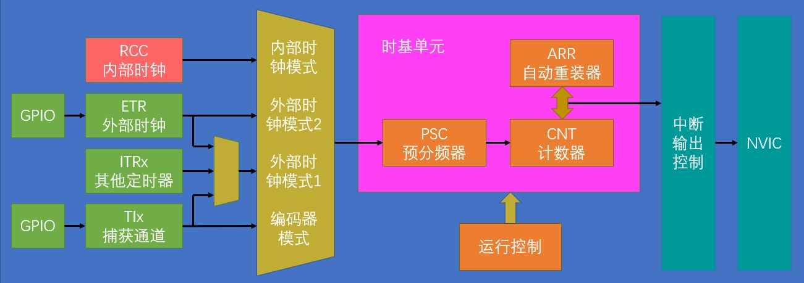

上图为定时器中断的结构简图，从左至右的结构为：

- **时钟源**：

  - **内部时钟模式**：
    - 由系统内部的**RCC作为时基单元的时钟源**，为72MHz
  - **外部时钟模式2**：
    - **从GPIO接入的外部时钟源**；
    - 外部时钟用ETR表示。
  - **外部时钟模式1**：
    - 可以配置为从GPIO接入的外部时钟源；
    - 也可以是系统内的**其他定时器的输出**；
    - 也可以是连接GPIO的捕获通道。
  - **编码器模式**：
    - 将连接GPIO的**捕获通道作为时基单元的时钟源**。

- **时基单元**：

  - **预分频器**：PSC，prescaler

    - 将时钟源进行分频，

    - 预分频器的设置值+1就是分频倍率，用公式可以描述为：
      $$
      CK\_CNT = CK\_PSC/(PSC+1)
      $$

      - $CK\_CNT$：分频器输出频率，也为计数器输入频率；
      - $CK\_PSC$：分频器输入频率；
      - $PSC$：分频器设定值。

    - 例如PSC的值为1，表示2分频。

  - **计数器**（16位）：CNT，counter

    - 预分频器出来的时钟信号每到高电平时（上升沿），自增1，用于计数。

  - **自动重装寄存器**：ARR，auto reload register

    - 当计数器的计数值超过ARR的设定值时，即**计数溢出**时，

      - 自动重装寄存器将计数器的数值清零。

        - 例如：ARR设定为1，而当前计数器计数值为1，
        - 当计数时钟来临时，计数器本会自增为2，
        - 但是ARR检测到计数器计数值为2，超过了1，就将计数器清零，
        - 因为最结果上看，计数器从1变成了0，而不是2。

      - 计数溢出时，计数器将输出一个脉冲，这个脉冲就是定时器的输出脉冲。

        - 因此，**计数器的溢出频率就是定时器的输出频率**。
        - 而设定ARR的值，就是间接设定了定时器的输出频率。

      - 溢出频率可以由下式计算：
        $$
        \begin{align}
        CK\_CNK\_OV 
        &= \frac{CK\_CNT}{ARR+1}  \\[2ex]
        &= \frac{CK\_PSC / (PSC+1)}{ARR+1} \\[2ex]
        &= \frac{CK\_PSC}{(ARR+1)(PSC+1)} \\[2ex]
        \end{align}
        $$

        - $CK\_CNK\_OV$：计数器溢出频率；
        - $CK\_CNT$：计数器输入频率；
        - $ARR$：自动重装寄存器设定值。

      - 则计数溢出周期，即定时周期可以按下式计算：
        $$
        \begin{align}
        T\_CNK\_OV 
        &= \frac{ARR + 1}{CK\_CNT}  \\[2ex]
        &= \frac{ARR + 1}{CK\_PSC / (PSC+1)} \\[2ex]
        &= \frac{(ARR + 1)(PSC + 1)}{CK\_PSC} \\[2ex]
        
        \end{align}
        $$

  - **使用方法**：

    - 通过设置预分频器和自动重装寄存器的数值，可以灵活地设置定时时间。
    - 例如：
      - 当PSC设为9，ARR为71999时，则一次计数周期为 $\cfrac{(71999+1)(9+1)}{72 \times10 ^6}=0.01\; \text{s}$ ；
      - 当PSC设为99，ARR为7199时，则一次计数周期也为 $\cfrac{(7199+1)(99+1)}{72 \times10 ^6}=0.01\; \text{s}$ 。

- **运行控制**：

  - 开启或关闭时钟计数。

- **中断输出**：

  - 配置是否需要中断输出。
    - 当定时器工作在输出比较或者输入捕获时，一般不需要中断输出

  - 配置NVIC的通道。

## 4.7 输出比较

### 4.7.1 简介

- **名称**：输出比较，简称OC，是"Output Compare"的缩写。
- **功能**：将输出比较寄存器CCR与计数器CNT的数值作对比，对比的结果按照相应的规则输出0或1。
  - **输出PWM**：输出比较常用来输出PWM波。
  - **死区生成**：高级定时器的输出比较才有的功能，主要用于PWM波控制无刷直流电机的情况。
  - **互补输出**：同样也是高级定时器的输出比较才有的功能，主要用于PWM波控制无刷直流电机的情况。
- **数量**：
  - 每个**通用定时器**与**高级定时器**都具有**4个输出比较电路**；
  - **基本定时器没有输出比较**电路。

### 4.7.2 硬件电路


- **输出模式控制器**：
  - **输入端**：来自输出比较寄存器CCR的输出
    - CNT>CCR1：当CNT>CCR1时，该输入为1；
    - CNT=CCR1：当CNT=CCR1时，该输入为1；
  - **输出端**：根据输入端与输出比较模式输出，输出信号命名为**REF**，为"reference"的缩写
  - **控制端**：OC1M[2:0]，用于控制输出比较的模式，3位共**8种模式**
    - **冻结**：CNT=CCR时，REF保持不变（其实也就是比较失效，输出不论什么情况都保持不变）；
    - **匹配时置高电平**：当CNT=CCR时，REF置高电平；
    - **匹配时置低电平**：当CNT=CCR时，REF置低电平；
    - **匹配时电平翻转**：当CNT=CCR时，REF电平翻转；
      - 可以用于生成占空比50%的PWM波，但是这个PWM的周期是定时周期的两倍。
    - **强制为低电平**：不论什么情况强制输出低电平；
    - **强制为高电平**：不论什么情况强制输出高电平；
    - **PWM模式1**：
      - 计数器向下计数时：当CNT < CCR时，REF置高电平，CNT $\ge$ CCR时，REF置低电平；
      - 计数器向上计数时：当CNT $\le$ CCR时，REF置高电平，CNT > CCR时，REF置低电平。
    - **PWM模式2**：
      - 计数器向下计数时：当CNT < CCR时，REF置低电平，CNT $\ge$ CCR时，REF置高电平；
      - 计数器向上计数时：当CNT $\le$ CCR时，REF置低电平，CNT > CCR时，REF置高电平。
      - 其实PWM模式2的输出 就是 PWM模式1的输出**取反**。
- **极性控制器**：由TIMx_CCER寄存器控制
  - 用于控制REF是否**取反**，即控制REF的**极性**。
  - 如果配置输出模式控制器为PWM模式2，然后再将极性控制器设置为取反，则输出相当于PWM模式1的输出；
  - 多一个极性控制器的作用是增加输出比较的选择性和灵活性。
- **输出使能电路**：控制REF是否输出；
- **CC1E**：控制输出使能电路是否使能，由TIMx_CCER寄存器控制。

### 4.7.3 简化结构

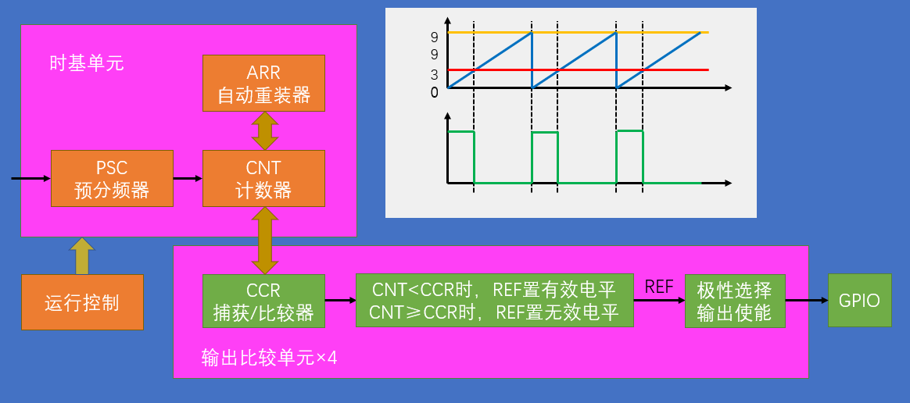

- 

## 4.8 输入捕获

### 4.8.1 简介

- **名称**：输入捕获，Input Capture，简称IC。
- **功能**：
  - **主功能**：当通道输入引脚出现指定电平跳变时，当前CNT（计数器）的值将被锁存到CCR中。
    - 自动锁存的计数器的值**可以用于测量PWM频率、占空比，脉冲间隔、电平持续时间**等参数。
  - **PWMI模式**：同时测量PWM信号的频率和占空比。
  - **主从触发模式**：实现硬件全自动测量。
- **数量**：
  - 每个高级定时器和通用定时器拥有**4个输入捕获通道**；
  - 基本定时器没有输入捕获功能。
  - 输入捕获和输出比较共享同一个IO，
    - 因此如果当前IO被用作输出比较时，就无法使用输入捕获。

### 4.8.2 频率测量原理

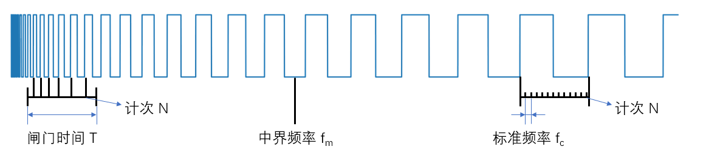

- 测频法：在闸门时间 $T$ 内，对待测信号的上升沿进行计次，得到$N$，则频率 $f_x$ 为$N/T$；

- 测周法：在待测信号相邻两个上升沿之间，以标准频率 $f_c$ 进行计次，得到 $N$，则频率 $f_x$ 为 $f_c/N$；

- 中界频率：测频法与测周法各有误差，误差的大小取决于待测信号的频率。

  - 当待测信号高于中界频率时：适合用测频法测量，精度更高；
  - 当待测信号低于中界频率时：适合用测周法测量，精度更高。
  - 当待测信号为中界频率时：测周法和测频法的精度相当。

- 中界频率计算方式：

  - 测频法与测周法的精度与计数值的大小呈正相关，
    - 由于存在正负一误差（即多计数一次或漏计数一次），
    - 因而计数越多，计数值越大，正负一误差在计数中占比就越小，精度越高。
  - 频率越高，测频法精度越高：固定闸门时间内，频率越高，计数越多，精度越高。
  - 越率越低，测周法精度越高：固定标准频率下，频率越低（周期越长），计数越多，精度越高。
  - 令两个方法的计数值相等，

  $$
  \begin{align}
  N
  &= f_x \cdot T = \frac{f_c}{f_x}  \quad \Longrightarrow \quad f_x = f_m = \sqrt{\frac{f_c}{T}} 
  \end{align}
  $$

  - 因而中界频率 $f_m = \sqrt{\dfrac{f_c}{T}}$

> 简单来说：
>
> - 测频法适合测量高频信号；
> - 测周法适合测量低频信号。

### 4.8.3 硬件电路


- **TI1**：定时器的输入捕获通道的输入信号，也就是CH1引脚的输入信号；
- **f_DTS**：滤波器的采样频率；
- **滤波器**（向下计数器）：对TI1进行滤波，防止拉动干扰。滤波机制如下。
  - 以采样频率 $f_{DTS}$ 对 TI1进行采样，
  - 当相同电平的采样数超过 N 时，认为该电平有效。
    - N：滤波器的参数，可以由ICF设置。
  - 例如：
    - 设N为4，当连续采样到5个高电平时，则输出高电平；
    - 如果连续采样到3个高电平后又采样到一个低电平，则认为是信号拉动，输出电平不改变。
- **ICF**：位于TIMx_CCMR1寄存器中，由三位组成用于控制滤器参数，包括采样频率与N
- **TI1F**：经过滤波后的输入捕获信号，F表示"Filtered"
- **边沿检测器**：对信号（滤波后的）进行边沿检测。
- **TI1F_Rising**：上升沿脉冲。
- **TI1F_Falling**：下降沿脉冲。
- **TI1F_ED**：边沿脉冲，为 TI1F_Rising 或上 TI1F_Falling。
- **TI2F_rising**：输入捕获通道2的上升沿脉冲。
- **TI2F_falling**：输入捕获通道2的下降沿脉冲。
- **CC1P**：位于TIMx_CCER寄存器，用于边沿的极性选择。
  - 本质上就是一个二路选择器，选择放行TI1F_Rising还是TI1F_Falling。
  - 如果CC1P置为0，则放行TI1F_Rising，最终效果为输出上升沿脉冲；
  - 如果CC1P置为1，则放行TI1F_Falling，最终效果为输出下降沿脉冲。
- **TI1FP1**：经过极性选择后的边沿脉冲，P表示"Polarity"。
- **TI2FP1**：输入捕获通道2，经过极性选择后的边沿脉冲。
- **TI1FP2**：图中没有画出，实际上输入捕获通道1中，还有一套极性选择电路，该极性选择后的信号输入到通道2中。
  - 该信号输入到通道2中，就像通道2中的 TI2FP1 输入到通道1中一样，两个通道互有交叉。
  - 这种通道的交叉是为了方便后的PWMI模式。
- **TRC**：来自从模式的输出， 即其他定时器的输出，配置从模式的触发源可以配置TRC。
- **CC1S**：位于TIMx_CCMR1寄存器，用于选择放行哪一路的信号，可以为：TI1FP1、TI2FP2与TRC。
- **IC1**：经过选择后输入捕获信号。
- **分频器**：对选择后的输入捕获信号进行分频。
- **ICPS**：位于TIMx_CCMR1寄存器，用于控制分频器的分频系数。
- **CC1E**：位于TIMx_CCMER寄存器，用于使用输入捕获的输出。
- **IC1FPS**：输入捕获的通道的输出，该输出用于触发计数器的值写入到 捕获/比较寄存器 中。

### 4.8.4 简化结构

**输入捕获简化结构**：

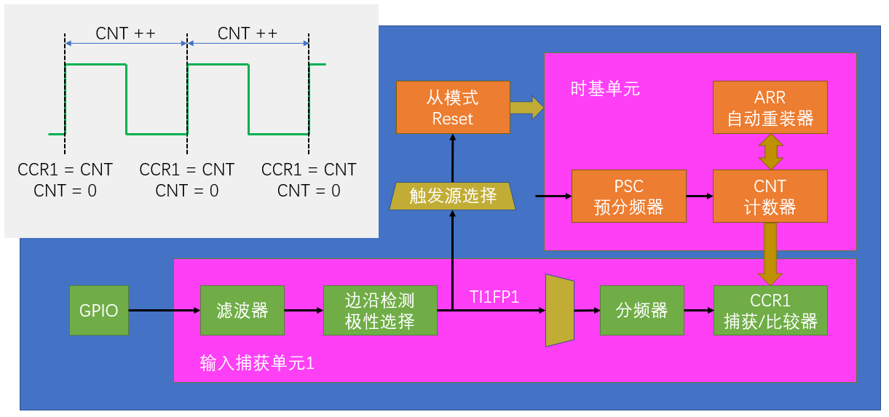

- **时基单元**：提供基本的定时计数功能，计数频率为测周法的标准频率。
- **GPIO**：输入捕获通道的输入来自GPIO外设。
- **输入捕获**：
  - **滤波器**：对输入信号进行滤波，排除噪声（抖动）的干扰。
  - **边沿检测、极性选择**：对滤波后的信号进行边沿检测。
  - **分频器**：对边沿信号进行分频。
  - **捕获/比较寄存器**：分频后的信号用于触发计数器的数值写入到捕获/比较寄存器中。
- **从模式**：
  - **触发源选择**：将边沿信号TI1FP1配置为从模式触发源。
  - **从模式选择**：从模式设置为自动清零计数器。
- **输入捕获实现测频法**：
  - 计数器以标准频率不断计时，
  - 被测信号的上升沿到来时，计数器的数值被写入捕获寄存器中，
  - 被测信号的上升沿到来时，触发从模式，计数器被清零（计数器清零发生计数器数值写入捕获寄存器之后）。
  - 最终效果为：
    - 被测信号的上升沿到时来时，捕获寄存器中的数值即为被测信号一个周期内的计数值，
    - 并且计数器清零，为下个周期计数作准备。
    - 读取捕获寄存器的数值 N，并且公式计数被测信号的频率  $f_x = f_c / N$

**PWMI简化结构**：

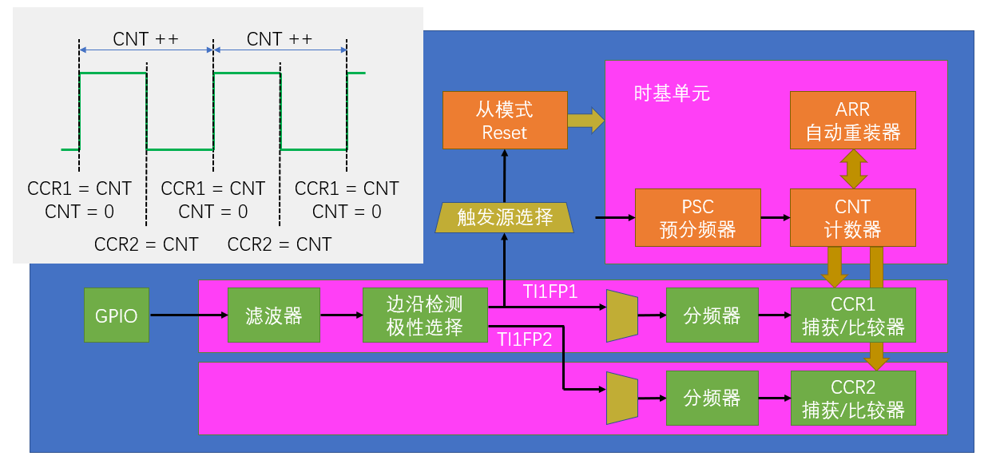

- **其他结构同上**：用于测量PWM频率；
- **TI1FP2**：为输入捕获通道1的下降沿，用于触发通道2的输入捕获。
  - 被测信号下降沿来临时，计数器的数值被写入CCR2，
    - 但是此时计数器并不清零（TI1FP2没有配置为从模式触发源），
    - 此时计数器继续计数。
- **CCR2**：
  - 由于计数器清零的时刻发生的被测信号的上升沿，
  - 因而CCR2的数值是被测信号的上升沿到下降沿这段时间内的计数值，
  - 该计数值代表了高电平的时间，
  - CCR2/ CCR1也就是高电平在被测信号一个周期内所占用的时间比例，**即PWM信号的占空比**。

## 4.9 编码器接口

### 4.9.1 简介

- **名称**：编码器接口，Encoder Interface。
- **功能**：
  - 接收增量（正交编码器）的信号，根据编码器旋转产生的正交信号脉冲，自动控制CNT自增或自减
  - 从而指示编码器的旋转速度、旋转方向与位置。
  - 编码器接口的两个输入通道借用了输入捕获的通道1和通道2。
- **数量**：每个高级定时器和通用定时器都拥有**1个编码器接口**。

### 4.9.2 编码原理

**硬件规定**：

- **两个信号**：编码器接口有两个输入口，即两个信号源；
- **正交信号**：两个信号源为**正交信号**，即
  - **频率相同**；
  - **相位差90度**：相位相差90度（$\pi/2$），可以是A相超前90度，也可以是B相超前90度；
    - 即相位差的绝对值为90度。
- 实现方式：
  - 可以将两个传感器元件（如霍尔传感器）旋转在旋转周长的不同位置，
  - 计算好位置就能保证相位差90度。


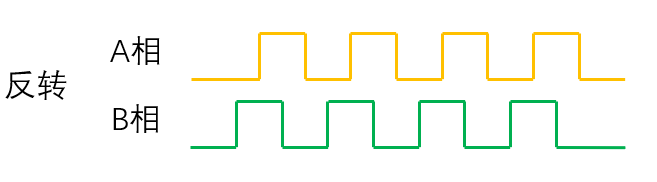

**正交信号特点**：

- 正转时：A相超前B相90度（假如说，也可以是B相超前）

  - A相上升沿时：B相低电平：
  - A相下降沿时：B相高电平；
  - B相上升沿时：A相高电平；
  - B相下降沿时：A相低电平。

- 反转时：B相超前A相90度

  - A相上升沿时：B相高电平；
  - A相下降沿时：B相低电平；
  - B相上升沿时：A相低电平；
  - B相下降沿时：A相高电平。

- 总结为表格：

  |                        | 正转         | 反转         |
  | ---------------------- | ------------ | ------------ |
  | A相上升沿 $\uparrow$   | 0，B相低电平 | 1，B相高电平 |
  | A相下降沿 $\downarrow$ | 1，B相高电平 | 0，B相低电平 |
  | B相上升沿 $\uparrow$   | 1，A相高电平 | 0，A相低电平 |
  | B相下降沿 $\downarrow$ | 0，A相低电平 | 1，A相高电平 |

**编码原理**：

- 方向：在A相与B相的边沿时刻，检测对应相的电平高低，就可以得知旋转方向。

- 位移：设置计数器，在每次信号的边沿时刻，根据方向递增或递减，则计数值就代表当前位置（与角位移呈正相关）。

- 即：

  |                        | A相高电平 | A相低电平 | B相高电平 | B相低电平 |
  | ---------------------- | --------- | --------- | --------- | --------- |
  | A相上升沿 $\uparrow$   | -         | -         | 向下计数  | 向上计数  |
  | A相下降沿 $\downarrow$ | -         | -         | 向上计数  | 向下计数  |
  | B相上升沿 $\uparrow$   | 向上计数  | 向下计数  | -         | -         |
  | B相下降沿 $\downarrow$ | 向下计数  | 向上计数  | -         | -         |

- 例如：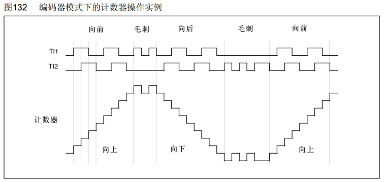

### 4.9.3 简化结构

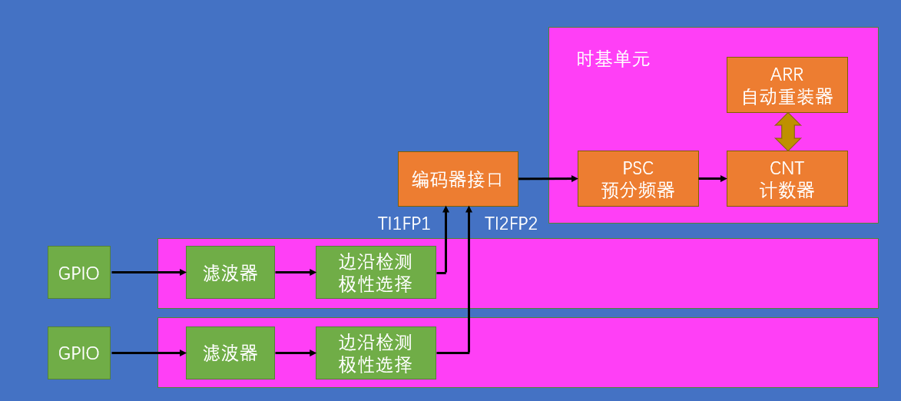

- **GPIO**：正交信号A相与B相的输入口。
- **滤波器、边沿检测、极性选择**：正交信号进而整形。
  - 这里借用了输入捕获的通道1和通道2的部分电路。
- **编码器接口**：根据上述规则，输出计数脉冲给时基单元
  - 此时时基单元由编码器接口接管，并不随系统时钟计数。
- **时基单元**：接收编码器控制，进而计数。

## 4.10 常用中断触发设备

### 4.10.1 旋转编码器

​		旋转编码器是用于测量位置、速度、旋转方向的装置，当其旋转轴旋转时，其输出端可以输出与旋转速度和方向相对应的**方波信号**，读取该信号的频率与相位信息即可得知旋转轴的转速与方向。

根据**工作原理**，旋转编码器可以分为：

- 光栅式：
  - 比较传统的旋转编码器，
  - 通过一对光栅编码盘遮挡红外发射器发送给接收器的信号来对转速进行测量，
    - 由于只有一对红外发射与接收器，所以只能得到转速信息，而无法获得相位信息。
  - 成本低，用于精度要求不高的场合。
- 霍尔传感器式：
  - 利用霍尔传感器来测量转速与相位，
  - 常用于与电机连接，可靠性强。
- 机械触点式：
  - 由内部的机械触点盘的通断来输出方波信号。

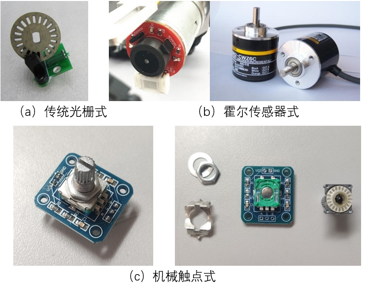

**驱动电路**：

- 引脚定义：
  - 由VCC和GND供电。
  - A脚输出一路方波信号，B脚输出另一路方波信号。
  - C脚为输出参考GND。
- 工作原理（如图b所示）：
  - 机械触点的导通与断开对应着图上的开关
    - 图上的两个开关对应着机械触点盘上两个不同的机械触点。
  - 当旋转轴旋转时，使得机械触点经历导通与断开的循环过程，
    - 当开关导通时，A口电位被GND拉低为低电平；
    - 当开关断开时，A口电位被VCC拉高到高电平；
    - 开关的通断使得A口的电位一会一会低，输出方波信号，
    - 方波信号的频率就对应了机械触点通断的频率，也就是旋转轴的转速。
    - B口的工作方式同理。
  - 旋转方向不同，A口与B口的相位差不同，例如：
    - 旋转轴顺时针旋转时，B口方波提前A口90度；
    - 旋转轴逆时针旋转时，B口方波滞后A口90度。
    - 比较A口与B口的相位（看谁提前90度），就能判断旋转轴的旋转方向。


# 五、ADC

## 5.1 简介

- **名称**：ADC是"Analog-Digital Converter"的简称，意思为模拟-数字转换器。
- **功能**：将引脚上连续变化的**模拟电压转换**为内存中存储的**数字变量**。
  - 将连续的模拟信号转换为离散的数字信号。
  - ADC建立了模拟电路到数字电路的桥梁。
- **类型**：12位逐次逼近型ADC；
  - **转换范围**：0 - 4095，12位意味着转换结果的范围为 $0 \sim 2^{12}-1$
- **通道数**：18个输入通道；
  - 16个外部信号源；
  - 2个内部信号源。
- **特点**：
  - **速度**：转换时间最快1us；
  - **输入电压**：0 - 3.3V；
  - **通道分组**：
    - **规则组**：常用的通道；
    - **注入组**：专用通道；
    - 通道分组可通过编程自主划分。
  - **看门狗**：模拟看门狗自动监测输入电压范围。


## 5.2 ADC工作原理

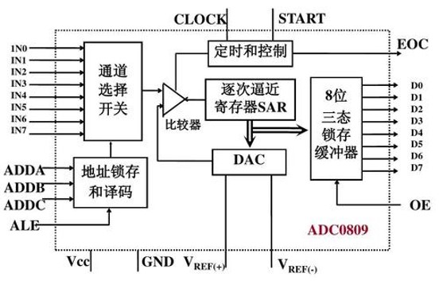

- **通道选择开关**：一个八路通道选择器
  - 同一时间只能选择`IN0` - `IN7`中的其中一路作为输出。
- **地址锁存和译码**：
  - `ADDA`、`ADDB`和`ADDC`：三者的高低电平组成3位二进制数，控制通道选择开关选择其中的一路。
  - `ALE`：使能开关。
- **比较器**：
  - 当输入A大于输入B时，输出1；
  - 用于比较通道选择开关的输出与DAC的输出，
    - 即比较输入通道的电压与DAC输出的电压，
    - 当输入通道电压 大于 DAC的输出电压时，比较器输出1；
    - 当输入通道电压 小于 DAC的输出电压时，比较器输出0。
- DAC：将逐次逼近寄存器的12位数值转换为相应的模拟电压量。
- 逐次逼近寄存器：简称SAR，12位寄存器。
  - 控制DAC的输出：DAC将SAR的数值转换为对应的模拟电压。
  - 

## 5.3 硬件结构

## 5.4 简化结构

> STM32F103C8T6的ADC资源有：
>
> - ADC1：10个通道，对应10个IO；
> - ADC2：10个通道，对应10个IO；
> - ADC1与ADC2的10个通道共用相同的IO口：`PA0` - `PA7`、`PB0`与`PB1`。

# 六、DMA


# 七、USART

## 7.1 USART简介

**简介**：

- **名称**：USART是“Universal Synchornous/Asynchornous Reciver and Transmitter”的缩写，即通用同步/异步收发器
  - **USART与UART**之间少了一个S，即UART缺少同步功能，物理上表现为通信时少一根时间线CLK，
  - 但是一般情况下时间线都可以省去，因而实际使用中UART使用更多。
- **类型**：是一种串行通信协议，由于这是最常用的串行通信协议，因此**俗称串口**。
- **功能**：
  - **通信功能**：实现两个设备的**互相通信**，
    - 单片机与单片机之间；
    - 单片机与电脑之间；
    - 单片机和各式各校的模块之间；
  - **扩展功能**：极大地扩展了单片机的应用满园，增加了单片机系统的硬件实力。

- **特点**：
  - 成本低；
  - 容易使用；
  - 通信线路简单。

## 7.2 物理层

### 7.2.1 硬件接口

USART的硬件接口规定如下，通常需要3根或4根线：

- VCC：用于其中一个设备向另一个设备供电
  - VCC并不是必须的，如果两个设备都有各自的电源，就不需要一方向另一方供电，
  - 但是单片机，通信的对方往往是一个模块，需要单片机供电。
- TX：数据发送脚；
- RX：数据接收脚。
  - 一方的TX接到另一方的RX上；
  - 一方的RX接到另一方的TX上。
  - 即通信双方的TX和RX需要交叉连接。
- GND：基准电平，两个设备的GND必须连接，不像VCC那样可以没有。

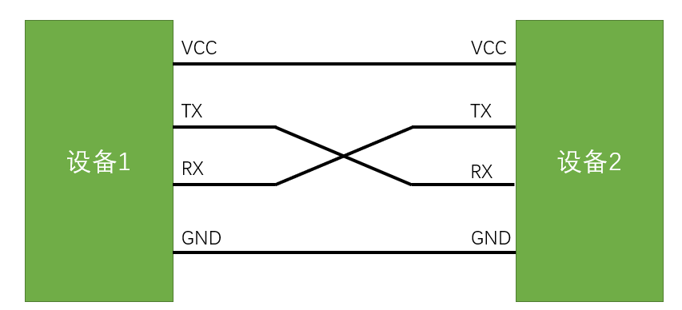

### 7.2.2 电平标准

### 7.2.3 数据位

**通信规则**：

- **发送方**：以固定的频率发送连续的数据位，
- **接收方**：以相同的频率接收连续的数据位，
- **波特率**：这个收发的频率称作波特率
- **注意**：通信双方的**波特率必须相等**，否则无法通信。

**数据位类型**：

- **起始位**：固定为低电平；
- **停止位**：固定为高电平；
- **数据位**：1为高电平，0为低电平；
- **校验位**：根据数据内容计算与校验类型计算高低电平。

## 7.3 数据链路层

### 7.3.1 帧格式

**数据帧基本格式**：

- **起始位**：标志一个数据帧的开始。
- **有效载荷**：
  - **8位数据位**：一字节数据，**低位先行**。
  - **1位校验位**：用于数据验证，通常为奇偶校验位。
    - **可选**：校验位也可以没有，此时有效载荷为8位而非9位。
- **停止位**：标志一个数据帧的结束。
  - **实际作用**：在连续传输时，与起始位的低电平组合，构成明显的高低电平时序，方便数据帧之间的分隔。
  - **长度**：更好地区分数据帧，通信停止位的长度可以设置成0.5位、1位、1.5位和2位。

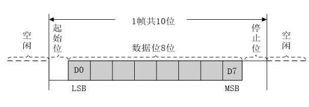

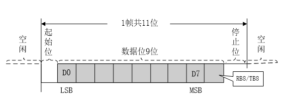

### 7.3.2 实际波形

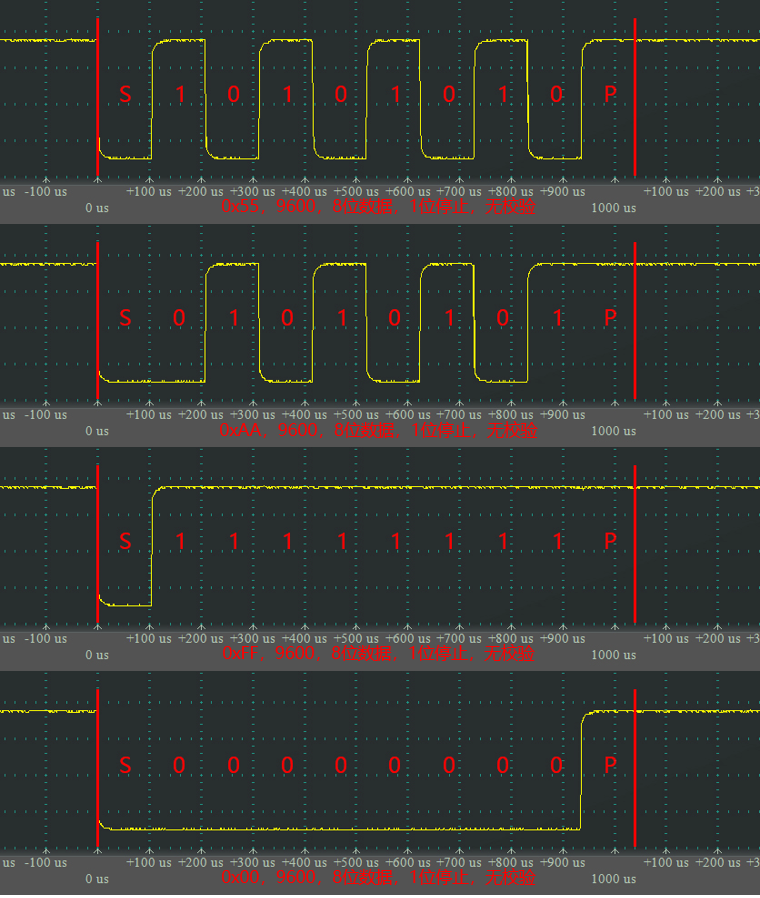

- 上图为波特率9600，无校验位、一位停止位时的串品输出波形，分别输出了数据0x55、0xAA、0xFF和0x00

  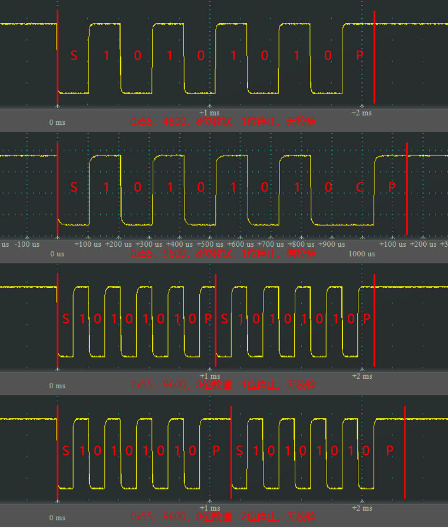

- **波形1**：
  - **配置**：波特率4800，1位停止位，无校验位；
  - **现象**：波形周期更长。
- **波形2**：
  - **配置**：波特率9600，1位停止位，1位偶校验位；
  - **现象**：有效载荷为9位。
- **波形3**：
  - **配置**：波特率9600，1位停止位，无校验位；
  - **现象**：两个数据帧之间由起始位与停止位隔开。
- **波形4**：
  - **配置**：波特率9600，2位停止位，无校验位，由于停止位长度增加；
  - **现象**：两个数据帧之间的界限更加清晰。

## 7.4 USARTR外设

### 7.4.1 简介

STM32内部集成一块硬件电路，专用用于实现USART的时序。

- **功能**：
  - **生成USART的时序**：
    - 发送数据：根据数据寄存器一个字节数据自动生成数据帧时序，从TX引脚发送出去；
    - 接收数据：自动接收RX引脚的数据帧时序，拼接为一个字节数据，存放在数据寄存器里。
  - **同步模式**：发送数据时发生同步时钟信号
    - 但是USART只能发送同步时钟信号，不能接收同步时钟信号，
    - 因此同步模式不能用于两个stm32之间的通信，
    - 一般用来给支持同步的其他外部模块使用的，一般使用也不多。
  - **硬件流控**：当发送方发送过快，接收方接收过慢时，硬件流控可以减慢发送方速度，确保接收方不漏接数据；
  - **DMA**：数据转运；
  - 兼容协议：USART还可以用于下列协议的通信，但是用的不多。
    - 智能卡；
    - IrDA；
    - LIN。
- **特点**：
  - 自带波特率发生器，最高达4.5Mbits/s。
- **可配置**：
  - **数据位长度**：8位或9位；
  - **停止位长度**：0.5位、1位、1.5位、2位；
  - **校验位**：奇校验、偶校验 或 无校验。
  - **一般来说**：
    - 配置为8位数据位后，设置无校验位，
    - 配置为9位数据位后，设置为有校验位，
    - 这样一个数据帧就是发送一个字节数据，否则要么7位数据要么9位数据，不是完整的一字节，不方便。
- **数量**：
  - stm32F103C8T6：USART1、USART2、USART3（）

### 7.4.2 硬件电路

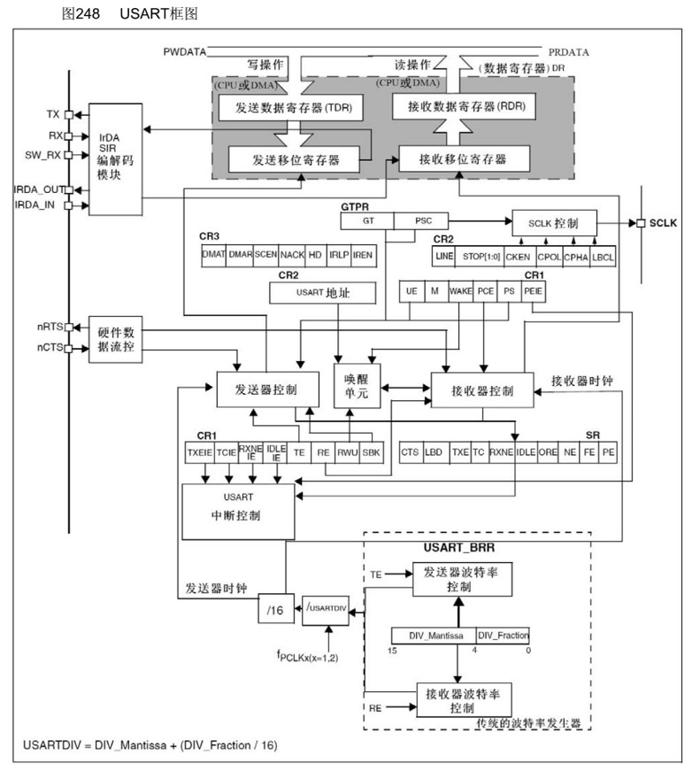

- TX、RX：串口的通信引脚；
- 发送移位寄存器：
  - 将其中的数据一位一位的发送出去；
  - 由于串口通信低位先行，因此移位方向是向左，即左移。
- 发送数据寄存器：
  - 将要发送的数据保存在这个寄存器中，
  - 一旦检测到移位寄存器没有移位：
    - 说明上个字节的数据已经发送完成，
    - 此时立刻将数据写入到移位数据寄存器中，
    - 同时置标志TXE，表示数据寄存器为空，可以准备发送下一个字节的数据了。
- 接收数据寄存器：
- 接收移位寄存器：
- nRTS：
- nCTS：
- 硬件数据流控：

### 7.4.3 简化结构


# 八、IIC

## 8.1 IIC简介

**IIC**是“Inter Integrated Circuit“的缩写，是Philips公司开发的一种**通用数据总线协议**：

- **名称含义**：
  - `Inter`：表示“在……之间”；
  - `Intergrated Circuit`：表示集成电路；
  - `Inter` + `Intergrated Circuit`：表示**集成电路之间**的一种通信协议。
- **信号线数量**：
  - SCL：时钟线；
  - SDA：数据线；
- **通信特点**：
  - **同步通信**：
    - 由SCL保持通信同步；
    - 有应答机制。：
  - **半双工**。
  - **高位先行**。
  - **一主多从**：
    - 或者，多主多从，但是一主多人最常见。

## 8.2 物理层

### 8.2.1 硬件接口

IIC硬件接口与附属电路的基本形式如下两图所示：

- **两根总线**（如左图所示）：
  - 通信协议总共需要两根总线完成，分别为SDA和SCL。
  - SCL负责传输时钟信号，SDA负责传输数据信号。
  - 所有设备（包括主机与从机）均有两根线分别连接到SDA和SCL总线上。
    - 即：所有的设备都有一根线连接到SCL上，所有的设备都有一根线连接到SDA上。
- IO为**开漏输出**模式（如右图所示上半部分）：
  - 每个设备都将连接在总线上的两个IO口（SDA口与SCL口）配置为开漏输出模式；
  - 因此总线上的设备要么**输出“0”**，将总线拉至低电平；
  - 要么**输出“1”**，处于**高阻态**，与总线”断开连接“，
    - 处于总线上的设备处于高阻态时，只是输出不影响总线电平，
    - 但是仍然可以“接收”（读取）总线电平。
    - 即：**只能被动**接收，**不能主动**发出。
- 总线连接**上拉电阻**（如左图所示）：
  - 当所有设备**均处于高阻态**时，总线为**高电平**（因为没有人输出“0”将总线拉底）。
  - 一旦**有一个设备输出“0”**，总线被拉低为**低电平**，哪怕别的设备都输出高阻态（输出“1”）。
  - 这种特性被称为“**线与**”，即：
    - 有一个设备输出0，则总线为0（低电平）；
    - 只有全输出1，则总线为1（高电平）。
  - 上拉电阻一般为 $4.7K\ohm$。

> 开漏输出的好处：
>
> - 避免短路：
>
>   - 如果总线上的设备IO口都配置为推挽输出，
>
>   - 则可能会出现一个设备输出1，另一个设备输出0，
>   - 则此时VCC与GND直连，发生短路。
>   - 但是开漏输出就不会发生短路：
>     - 一个输出1，一个输出0，只会把总线电平拉低，
>     - 因为输出1的设备只是处于高阻态，并不是输出VCC。
>
> 注意：
>
> - 开漏模式是输出模式，此时设备仍可以正常读取，无论输出什么；
> - 也就是说，设备在任何时候都可以读取总线上的数据，与输出情况无关。

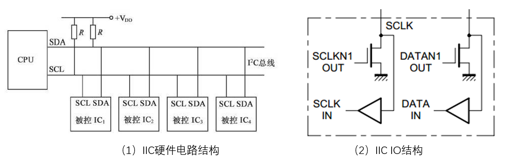

### 8.2.2 数据位的产生方式

- **常规状态**：
  - **通信期间**：SCL默认为低电平，SDA电平状态未知。
  - **非通信期间**：SCL、SDA均为高电平。

- **起始位**（S）：
  - 当SCL为高电平时，SDA产生下降沿（即由高电平跳变为低电平）。
- **停止位**（P）：
  - 当SCL为高电平时，SDA产生上升沿（即由低电平跳变到高电平）。
- **常规数据位**（1 或 0）：
  - 当SCL为高电平时：
    - 若SDA为高电平，则表示数据1；
    - 若SDA为低电平，则表示数据0。
- **应答位**（ACK 或 NACK）：
  - 当SCL为高电平时：
    - 若SDA为高电平，则表示非应答；
    - 若SDA为低电平，则表示应答。
  - 应答位其实跟常规数据位的产生方式一样，
    - 但是由于他在数据帖中的位置（下面马上讲到），因此具有特殊的含义。

> 总结一下：
>
> - SCL为高电平时，SDA为有效状态：
>   - SDA为高电平：表示数据1；
>   - SDA为低电平，表示数据0；
>   - SDA产生上升沿，表示通信开始；
>   - SDA产生下降沿，表示通信结束。
> - SCL为低电平时，SDA为无效状态：
>   - 此时SDA怎么变化都不影响通信（理论上）；
>   - 主机或从机可以趁此时改变SDA的电平状态，设置好SDA，等待下次SCL高电平的到来。

## 8.3 数据链路层

### 8.3.1 数据帖基本格式

数据帧**组成**：

- **起始位**：通信起始于起始位。
- **内容**：
  - **数据字节**：8位数据位。
  - **应答位**：每发送一个数据字节，收到方需要有应答位，若有应答表示接收成功，无应答表示接收失败。
  - 数据字节 与 应答位 按照发送数据的字节数交替出现n次

- **停止位**：通信由结束位终止。


### 8.3.2 一主多从

**主机**：

- **主导时钟**：
  - 具有对SCL总线的绝对控制权；
  - 从机无权控制SCL，只能被动读取。
- **主导通信**：
  - 所有通信均由主机发起，即起始位由主机发出；
  - 所有通信均由IIC结束，即结束位由主机发出。
  - 大部分时候主机控制SDA，从机只能被动读取，
    - 当主机需要从机发送数据时，主机才暂时转交SDA控制权，
    - 此时从机可以暂时控制SDA总线（输出0或1）。

**从机**：

- **接收指挥**：
  - 读取SCL时钟信号，并在时钟高电平时从SDA总线上读取数据。
  - 只有主机需要从机发送数据时，主机暂时转交SDA控制权，此时从机可以控制SDA。
    - 但SCL仍由主机控制。

### 8.3.3 数据字节类别

根据用途，数据字节分为以下几类：

- **从机地址字节**：
  - 开始通信后，主机向总线发送的**第一个数据字节**，用于寻找从机；
  - 包括：从机ID + 读写标志位。
  - 从机ID：
    - 每个从机的内置的ID号，设备出厂时就已确定，通常是7位；
    - 最后一位通常可变：
      - 因为同个厂家生产的设备一般ID号都相同，
      - 为了避免一条IIC总线上同时ID相同的设备（同个厂家生产的），
      - 设备的ID最后一位可以更改为0或1（由设备AD口决定）。
  - 读写标志位：
    - 1：表示读操作（要读从机）；
    - 0：表示写操作（要写从机）。
  - 每个从机随时都在读取数据：
    - 当检测到该数据字节前7位刚好是自己的ID时，就主机在“叫”自己了，
    - 加上从机地址字节的最后一位读写标志位，从机就知道主机要对自己干什么了。
- **寄存器地址字节**：
  - **紧跟在从机地址帧后的数据字节**，同样一定由主机发出，表示主机要操作的从机的寄存器的地址。
  - 具体数值由从机提供的寄存器地址决定。
- **普通数据字节**：
  - 为寄存器地址字节后的数据，表示一个字节的数据；
  - 多个普通数据字节（或一个普通数据字节）拼接成一个完整的数据内容。    


### 8.3.4 具体操作

 **指定地址写**：

- **组成**：

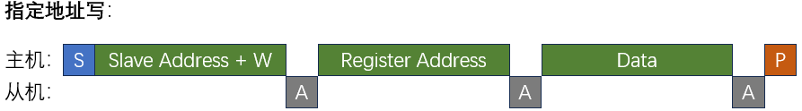

- **时序图**：

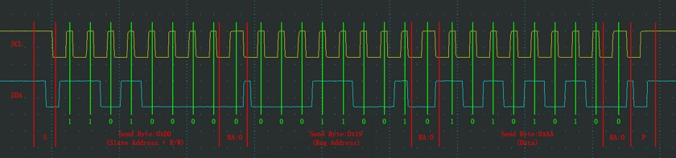

- **作用**：向**指定从机**下的**指定地址 ** **写入数据**。

---

**当前地址读**：

- **组成**：

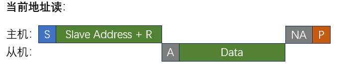

- **时序图**：

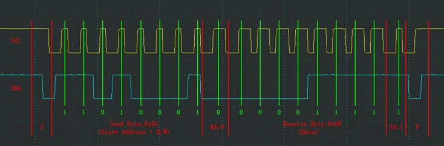

- **作用**：主机**读取** **指定从机** **当前地址指针**指向的数据（一个字节）。

---

**指定地址读**：

- **组成**：

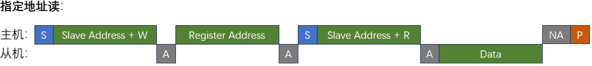

- **时序图**：


- **作用**：主机**读取** **指定从机**的**指定地址** 的数据。

## 8.4 GPIO软件实现IIC

### 8.4.1 初始化与准备

**初始化**：用两个GPIO分别模拟SDA线与SCL线。

```c++
# define SCL_Pin GPIO_Pin_10
# define SDA_Pin GPIO_Pin_11
# define IIC_Port RCC_APB2Periph_GPIOB

void iic_init(void)
{
	/* 开启时钟 */
	RCC_APB2PeriphClockCmd(IIC_Port, ENABLE);	// 开启GPIOB的时钟
	
	/* GPIO初始化 */
	GPIO_InitTypeDef GPIO_InitStructure;
	GPIO_InitStructure.GPIO_Mode = GPIO_Mode_Out_OD;
	GPIO_InitStructure.GPIO_Pin = SCL_Pin | SDA_Pin;
	GPIO_InitStructure.GPIO_Speed = GPIO_Speed_50MHz;
	GPIO_Init(GPIOB, &GPIO_InitStructure);  // 将PB10和PB11引脚初始化为开漏输出
	
	/* 设置默认电平 */
    GPIO_SetBits(GPIOB, SCL_Pin | SDA_Pin);  // 非通信期间SCL与SDA均为高电平（释放总线状态）
}
```

**总线基本操作**：

```c++
// I2C写SCL引脚电平
void set_scl(uint8_t BitValue)
{
	GPIO_WriteBit(GPIOB, GPIO_Pin_10, (BitAction)BitValue);  // 根据BitValue，设置SCL引脚的电平
	Delay_us(10);										     // 延时10us，防止时序频率超过要求
}

// I2C写SDA引脚电平
void set_sda(uint8_t BitValue)
{
	GPIO_WriteBit(GPIOB, GPIO_Pin_11, (BitAction)BitValue);	 // 根据BitValue，设置SDA引脚的电平
	Delay_us(10);											 // 延时10us，防止时序频率超过要求
}

// I2C读SDA引脚电平
uint8_t read_sda(void)
{
	uint8_t BitValue;
	BitValue = GPIO_ReadInputDataBit(GPIOB, GPIO_Pin_11);  // 读取SDA电平
	Delay_us(10);										   // 延时10us，防止时序频率超过要求
	return BitValue;									   // 返回SDA电平
}

```

### 8.4.2 数据位实现

**起始位**：

```c++
// 起始位
void iic_start(void){	
	set_sda(0);	 // 在SCL高电平期间，拉低SDA，产生起始信号
	set_scl(0);	 // 起始后把SCL也拉低，因为通信状态下SCL默认为低电平
}


// 重新起始位
void iic_restart(void){
    set_sda(1);  // 释放SDA，确保SDA为高电平
	set_scl(1);	 // 释放SCL，确保SCL为高电平
	set_sda(0);	 // 在SCL高电平期间，拉低SDA，产生起始信号
	set_scl(0);	 // 起始后把SCL也拉低，因为通信状态下SCL默认为低电平
}
```

- 若起始位发生在**开始通信**时，

  - 即之前是非通信状态，则非通信状态下默认`SCL`、`SDA`均为高电平，
  - 可直接将`SDA`置`0`，这样在SCL高电平期间就发生了一个下降沿，
  -  起始位之后，处于通信状态，通信状态下SCL默认为低电平，因此最后将`SCL`置`0`。

- 但如果起始位发生在**通信期间**（指定地址读时），

  - 则通信状态下`SCL`默认为低电平，而SDA状态未知，
  - 因此首先趁`SCL`为低电平，先将`SDA`置`1`，`SDA`在`SCL`高电平来临时一定是高电平，
  - 然后再将`SCL`置`1`，将使`SDA`信号有效化。
  - 然后 将`SDA`置`0`，令`SDA`在`SCL`高电平期间产生一个下降沿。
  - 最后 将`SCL`置`0`，确保通信期间`SCL`为默认的低电平。

- 可以将上述两种情况下的起始位整合一下，可以得到统一的四行代码：

  ```c++
  // 产生一个起始位
  void iic_start(void){
      set_sda(1);  // 释放SDA，确保SDA为高电平
  	set_scl(1);	 // 释放SCL，确保SCL为高电平
  	set_sda(0);	 // 在SCL高电平期间，拉低SDA，产生起始信号
  	set_scl(0);	 // 起始后把SCL也拉低，即为了占用总线，也为了方便总线时序的拼接
  }
  ```

  - 如果起始位发生在开始通信时，则前两行代码有些冗余，
  - 但是兼容了通信期间产生起始化的方法。

**停止位**：

```c++
// 停止位
void iic_stop(void){
	set_sda(0);  // 释放SDA，确保SDA为高电平
	set_scl(1);	 // 释放SCL，确保SCL为高电平
	set_sda(1);	 // 在SCL高电平期间，拉低SDA，产生起始信号
}
```

- 不同于起始化，停止位不用考虑发生的时机，发生时一定处于通信状态，

- 因此首先趁`SCL`为低电平时，将`SDA`置为`0`，为后续的上升沿作准备，
- 然后将`SCL`置1，使`SDA`信号有效化，
- 最后将`SDA`置`1`，产生一个有效的上升沿
- 之后通信结束，`SCL`和`SDA`都为高电平，为非通信状态的默认状态，所以不用再作调整。

**数据位**：

```c++
// 数据位
void iic_send_bit(bool data_bit){
	set_sda(data_bit);  // 准备好数据位
    set_scl(1);			// SCL置1
    set_scl(0);			// SCL置0
}

// 发送一个数据字节字节
void iic_send_byte(uint8_t data){
    // 发送8个数据位
    for(uint8 i=0;i<8;i++){
        iic_send_bit(data & (0x80 >> i));  
}
    
// 读取一个数据字节
uint8_t iic_read_byte(){
    // 转交sda总线控制权
    set_sda(1);  
    
    // 接收数据
    uint8_t data = 0;
    for(uint8 i=0;i<8;i++){
        // SCL高电平
        set_scl(1);
        // 左移一位 并 读取数据 
        data <<= 1;
        data |= read_sda());  

        // SCL低电平
        set_scl(0);
    }
    return data;
}
```

**应答位**：

```c++
// 发送应答位
void iic_ack(){
    iic_send_bit(0);
}

// 不应答
void iic_unack(){
    iic_send_bit(1);
}

// 接收应答位
bool iic_get_ack(){
    // 转交sda总线控制权
    set_sda(1);  
    
    set_scl(1);
    bool ack = read_sda();
    set_scl(0);
    return ack;
}
```


### 8.4.3 读写操作

**指定地址写**：

```c++
// 指定地址写
void iic_send(uint8_t id, uint8_addr, uint8_t data){ 
    iic_start();  // 起始位
    iic_send_byte(id)    // 发送从机地址字节
	iic_get_ack();
    iic_send_byte(addr)  // 发送寄存器地址字节
    iic_get_ack();
    iic_send_byte(data)  // 发送普通数据字节
    iic_get_ack();
    iic_stop();  // 停止位
}
```

**当前地址读**：

```c++
uint8_t iic_read(uint8_t id){
    iic_start();
    iic_send_byte(id);
    iic_get_ack();
    uint8_t data = iic_read_byte();
    iic_unack();
    iic_stop();
    return data
}
```

**指定地址读**：

```c++
uint8_t iic_read(uint8_t id, uint8_t addr){
    iic_start();  		  // 起始位
    iic_send_byte(id);    // 发送从机地址字节
    iic_get_ack();
    iic_send_byte(addr);  // 发送寄存器地址字节
    iic_get_ack();
    iic_start();          // 重新起始位
    iic_send_byte(id & 0x01);    // 发送从机地址字节
    iic_get_ack();
    uint8_t data = iic_read_byte();  // 接收数据
    iic_unack();
    iic_stop();  		  // 结束位
    return data
}
```

## 8.5 IIC外设

### 8.5.1 简介

- **简介**：
  - STM32内部集成了一块硬件电路，该块硬件电路被称为“IIC外设”，可以自动生成IIC时序以发送数据：

- **功能**：

  - 自动生成**起始位**与**停止位**；

  - 自动生成**应答位**；

  - 生成稳定**时钟**；
  - 辅助**数据收发**；

- **扩展功能**：

  - 支持**多主机模型**；
  - 支持7位与10位**地址模型**，默认采用7位地址；
  - 支持不同的**通讯速度**：
    - 标准速度：100KHz；
    - 高速：400KHz；
  - 支持DMA；
  - 兼容SMBus协议。

> STM32F103C8T6具有的IIC资源：IIC1，IIC2

### 8.5.2 硬件电路

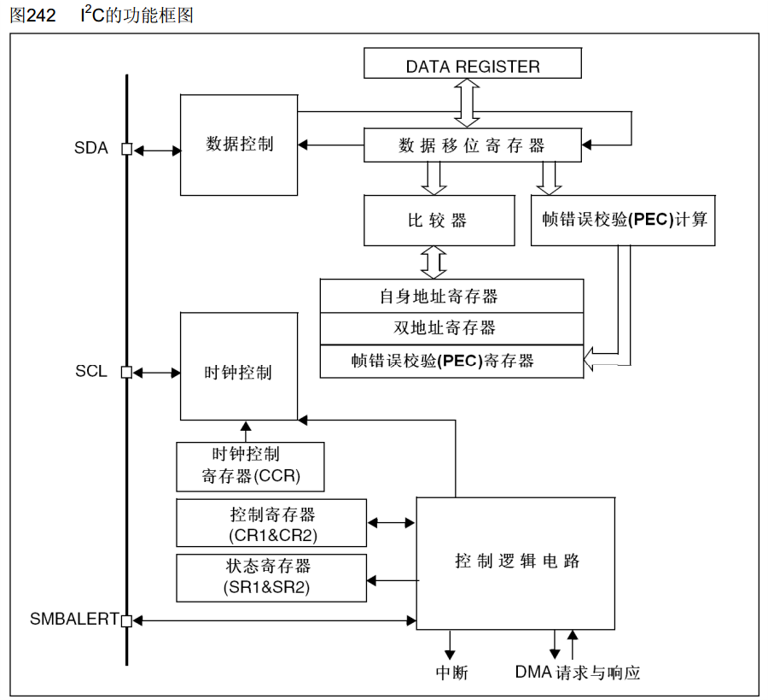

STM32中IIC的硬件电路如上图所示：

- **数据发送部分**：
  - 数据控制：不清楚什么作用，猜测主要是生成起始位、终止位、应答位、数据位等IIC基础的时基单元。
  - **数据寄存器** 与 **数据移位寄存器**
    - **数据寄存器**（DATA REGISTER， 简称DR）用于**缓存**：
      - 将要发送的数据；
      - 或接收到的数据；
    - **数据移位寄存器**用于**按位发送或接收**数据：
      - 发送数据时：将寄存器最高位数据发送到 数据控制电路，然后自身数据左移一位；
      - 接收数据时：读入 数据控制电路的数据到 自身最低位，然后自身数据左移一位。
      - IIC高位先行：因为IIC通信高位先行，因此发送时先发送最高位，读取时先存入最低位（逐步左移到最高位）。
    - **发送数据**：
      - 数据移位寄存器 将 数据寄存器 中的数据全部读入到自身的内存中，
      - 数据移位寄存器按位逐步发送数据；
      - 当数据移位寄存器中的全部分数发送完毕后，自动读取数据寄存器，准备发送下个字节；
    - **接收数据**：
      - 数据控制电路 将数据存在入 数据移位寄存器 的最低位；
      - 然后自身数据左移，准备读入下一位数据。
      - 当数据移位寄存器读完一字节数据后，自动将数据全部存入数据寄存器中，然后准备读取下个字节。   
  - 自身地址寄存器 与 双地址寄存器：
    - 由于STM32的IIC支持多主机通信，因此STM32自身也有一个从机地址。
      - 或者说在STM32IIC在设计时就是按照多主机通信模型设计的，一主多从只是多主机通信一个特殊情况。
    - 自身地址寄存器：保存自身的IIC地址，用于多主机通信情况；
    - 双地址寄存器：自身可以拥有第二个IIC地址，同样也用于多主机通信情况。
  - 比较器：
    - 身份认证：
      - 在多主机通信情况下，
      - 将 数据移位寄存器中 读取到的数据与 自身地址寄存器 或 双地址寄存器中 的数据比较，
      - 如果相同，则表示有主机“呼叫”自身，此时自身为从机。
  - 帧错误校验计算 与 帧错误校验寄存器：
    - 用于自动校验数据的，好像是CRC校验，一般不用。
- **时钟生成部分**：
  - 时钟控制：不清楚什么作用，但是基本上是用来生成稳定的时钟信号的（根据控制寄存器的标志位）。
- **控制部分**：
  - 控制逻辑电路：不清楚什么作用，一个黑盒子，主要用于实现控制寄存器各标志位指定的功能。
  - **控制寄存器**：
    - 用来控制IIC电路的工作行为的，包含控制标志位。
    - PE：IIC使能；
    - START：自动产生起始位使能；
    - STOP：自动产生停止位使能；
    - ACK：应答使能；
  - **状态寄存器**：
    - 通过标志位反映IIC工作状态。
    - SB：起始位已发送；
    - ADDR：地址数据帧已发送；
    - BTF：字节数据发送完成；
    - RxNE：数据寄存器非空，
      - 在接收时，表示已经接收到数据，可以从数据寄存器中取走数据以免新数据覆盖该数据。
    - TxE：数据寄存器为空，
      - 在发送数据时，表示数据寄存器中的数据已经被数据移位寄存器取走，
      - 即数据寄存器中的数据正在发送中，可以向数据寄存器写入下一个要发送的字节数据，
      - 否则当数据移位寄存器发送完数据后，检测到数据寄存器为空，会以为没有数据要发送了，
      - 就会自动产生一个停止位，结束通信

> 如果把操作STM32比作开汽车：
>
> - 汽车的组成：
>
>   - 那控制寄存器就像是汽车的方向盘，
>
>   - 状态寄存器就像是汽车的仪表盘，
>
>   - 数据移位寄存器和数据寄存器就像是汽车的马达，
>
>   - 而其他部分都各司其职，用于保证汽车动作。
>
> - 对于使用者为说：
>   - 只要观察仪表盘上的指示，控制好方向盘就可以驾驶汽车。
>   - 了解汽车的马达和其他辅助设备可以加深对汽车的理解。

### 8.5.3 简化结构

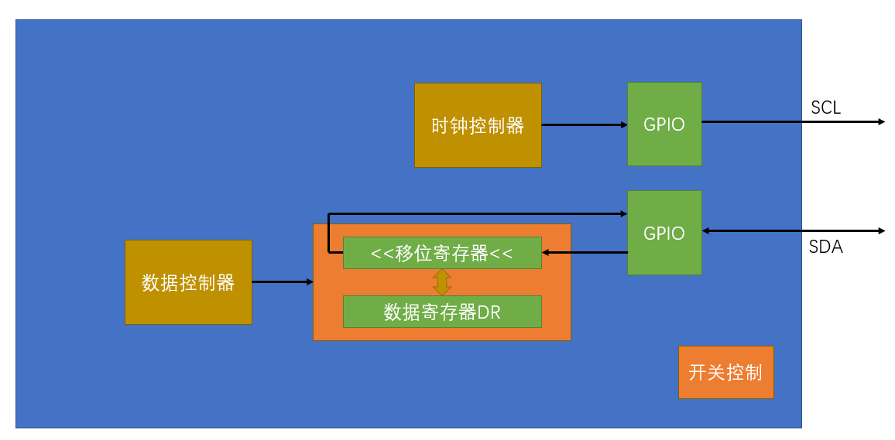

上图为STM32中IIC电路的简化表达，只保留了主要的内容：

- **SCL线**：
  - 时钟控制器根据需要的频率产生时钟信号，
  - 该时钟信号注入的GPIO（开漏输出模式）的复用输入口，
  - 最终从GPIO中输出符合IIC规范的时钟信号到SCL线上。
- **SDA线**：
  - 发送数据时：
    - 移位寄存器从数据寄存器中装载数据，
    - 然后最高位发送到GPIO（开漏输出模式）的复用输入口，然后左移一位
    - GPIO输出符合IIC规范的数据信号到SDA上。
  - 接收数据时：
    - GPIO从SDA总线上读取数据，
    - 移位寄存器读取GPIO的数据到最低位，然后左移一位，
    - 当移位寄存器读取到一字节后，将其存入数据寄存器中。

### 8.5.4 使用硬件IIC

---

#### 硬件时序

**指定地址写**：

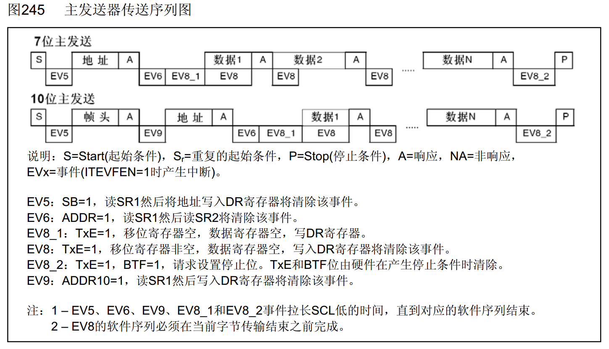

> 这里的“事件”实际上标志位的意思，为多个标志位组成的一个大标志

下面按序列顺序依次讲解：

- S：起始位，首先通信从发送一个起始位开始；
- EV5：起始位发送成功后，EV5事件（标志）将被触发。
  - 当检测到EV5时，说明起始位成功发送，此时可以发送字节数据了。
- 地址 + A：发送从机地址数据字节，并接收应答
  - 此时EV5事件自动被清除。
- EV6：从机地址数据字节成功发送后，EV6事件将被触发。
  - 当检测到EV6时，说明从机地址数据字节已经成功发送完毕，可以继续发送下个字节。
- EV8_1：移位寄存器空，数据寄存器空，说明目前没有数据正在发送也没有数据准备发送，表示可以发送数据了。
  - EV8_1的出现也表示从机地址数据字节已经从移位寄存器全部发送出去了，
  - 而接下来准备要发送的数据需要尽快交付给数据寄存器。
- EV8：移位寄存器非空，数据寄存器。
  - 当我把要发送的数据交付给数据寄存器后，为空的移位数据寄存器立马把数据寄存器的数据取走，
  - 因此移位寄存器非空，表示交付给硬件IIC的数据正在发送了，
  - 而数据寄存器为空，表示还需要继续把要发送的数据交付给数据寄存器。
- EV8_1到EV8的转变，正好在发生在数据1方块出现时，
  - 因为EV8_1到EV8的区别就是移位寄存器非空，
  - 移位寄存器非空也就表示了数据1正在发送中。
  - 而数据寄存器为空则表示当前的字节正在发送了，还需要尽快把下个要发送的数据字节给硬件IIC。
- EV8的清除：说明移位寄存器和数据寄存器都非空。
  - EV8在数据发送过程中被清除，说明移位寄存器还在发送着数据，接着数据寄存器也被输入了新的数据，
  - 说明此时正在发送当前的数据，而下个要发送的数据也已经准备好了，那就等着当前数据发送完吧。

- 每当数据 + A结束时，EV8重新出现：
  - 每当数据+A方块结束时，说明数据已经发送完成，移位寄存器完成了数据字节的发送，
  - 移位寄存器发送完数据后立马把数据寄存器中的数据取走，然后发送，
  - 因此数据寄存器又空了，因而EV8事件重新触发，
  - 提醒刚才交付给IIC的数据已经正在发送了，我们要准备好下个要发送的数据。
- EV8_2：移位寄存器为空，数据寄存器也为空，说明全部数据发送完成。
  - 当移位寄存器和数据寄存器都为空时，说明没有新的数据需要发送了，
  - 表示数据已经全部发送完毕，可以发送停止位了。
  - 这里EV8_2跟EV8_1好像没什么区别：
    - 实际上EV8_1是不存在的，只是逻辑上存在，
    - 或者说EV8_1和EV8_2在状态上是相同的，只是语义不同。
    - 在实际编程操作硬件时，只有EV8_2而没有EV8_1。
- P：在检测到EV8_2后，说明数据已经发送完毕，这时发送停止位结束通信。

**指定地址读：**

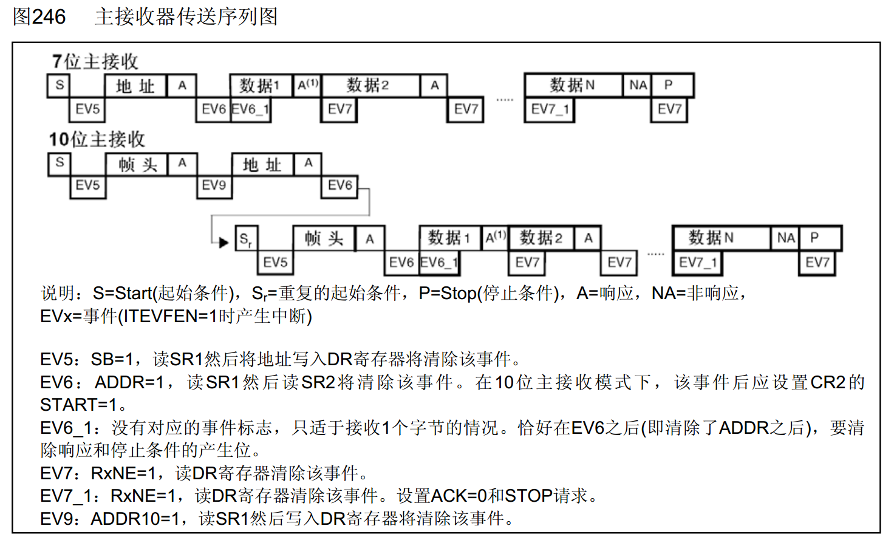

下面按序列顺序依次讲解：

- S：起始位，通信首先从一个起始位开始；
- EV5：起始位发送成功，表示可以开始通信了；
- 地址 + A：发送从机地址数据字节，并接收响应；
- EV6：表示从机地址字节发送成功，并收到响应，可以开始与从机通信；

- EV6_1：没有啥用，不知道画在这干啥；
- 数据1：接收数据1；
- EV7：数据寄存器非空，表示接收到一个完整的数据字节，提示我们可以把接收到的数据取走了；
  - 在数据取走之后，EV7事件被清除；
- 接收数据时 EV7 被清除：
  - 接收数据由移位寄存器负责，上一个已经被完整接收的数据字节被保存在数据寄存器中，
  - 取走数据寄存器中的数据与移位寄存器无关，
  - 因此在移位寄存器接收新数据字节时，完全可以取走数据寄存器的数据，
  - 取走数据寄存器的数据后，腾出了空间给移位寄存器接收到完整的数据后存放。
- EV7_1：与EV7类似，表示数据接收完成，可以取走了，同时需要准备发送停止位了。
  - EV7_1实际上是触发条件与EV7_1相同，
  - 只是语义上的不同，
  - 因此编程时没有EV7_1，只有EV7。
- EV7_1后的EV7：
  - 在EV7_1之后，读取到的数据被取走，同时准备发送停止位，
    - EV7_1事件被清除被不是由于停止位被发送，而是停止条件被设置，
    - 停止条件被设置后不会立刻发送停止位，而是当前数据字节读取完成后再发送停止位。
  - EV7_1标志的是倒数第二个数据字节接收完成，
  - 最后一个字节仍然在接收中，
  - 因此在停止位发送后，EV7事件触发，表示可以最后一个数据字节接收完成，
  - 可以从断气寄存器中取走。

**主要的事件**：

- **EV5**：起始位发送成功；
- **EV6**：从机地址发送成功并收到应答；
- **EV7**：读取到一数据字节；
- **EV8**：成功发送一数据字节，并请准备好新的数据字节（到数据寄存器中）；
- **EV8_1**：发送完毕，没有新的数据字节需要发送。

**整体的流程**：

- **指定地址写**：

  - 发送起始位；

  - 检测EV5；

  - 发送从机地址数据字节；

  - 检测EV6；
  - 发送数据；
  - 检测EV8；

  - 继续发送数据；
  - 检测EV8_2；
  - 发送停止位；

- **指定地址读**：
  - 发送起始位；
  - 检测EV5；
  - 发送从机地址数据字节；
  - 检测EV6；
  - 接收数据；
  - 检测EV7；
  - 发送停止位；
  - 接收数据

---

#### 库函数

| 功能         | 函数                                                         |
| ------------ | ------------------------------------------------------------ |
| 初始化IIC    | void I2C_Init(I2C_TypeDef* I2Cx, I2C_InitTypeDef* I2C_InitStruct); |
| 使能IIC      | void I2C_Cmd(I2C_TypeDef* I2Cx, FunctionalState NewState);   |
| 发送起始位   | void I2C_GenerateSTART(I2C_TypeDef* I2Cx, FunctionalState NewState); |
| 发送停止位   | void I2C_GenerateSTOP(I2C_TypeDef* I2Cx, FunctionalState NewState); |
| 是否自动应答 | void I2C_AcknowledgeConfig(I2C_TypeDef* I2Cx, FunctionalState NewState); |
| 发送从机地址 | void I2C_Send7bitAddress(I2C_TypeDef* I2Cx, uint8_t Address, uint8_t I2C_Direction); |
| 发送数据     | void I2C_SendData(I2C_TypeDef* I2Cx, uint8_t Data);          |
| 接收数据     | uint8_t I2C_ReceiveData(I2C_TypeDef* I2Cx);                  |
| 检测事件     | ErrorStatus I2C_CheckEvent(I2C_TypeDef* I2Cx, uint32_t I2C_EVENT); |

---

#### 变量与宏定义

- `I2C_TypeDef* I2Cx`：为I2Cx实例，可以为

  - `I2C1`；
  - `I2C2`；
  - 等等；

  - 实际上是I2C外设的地址值，具体可看附录。

- `I2C_InitTypeDef* I2C_InitStruct`：为一结构体，其成员为

  - `I2C_ClockSpeed`：SCL时钟线频率，可以为小于400k的任意值；
  - `I2C_Mode`：IIC外设模式，可以配置为除IIC协议以外的其类似协议。
    - `I2C_Mode_I2C`：IIC协议；
    - `I2C_Mode_SMBusDevice`：SMBus协议从机；
    - `I2C_Mode_SMBusHost`：SMBus协议主机。
  - `I2C_DutyCycle`：SCL时钟信号的占空比。
    - `I2C_DutyCycle_16_9`：低电平时间：高电平时间= $16 \colon 9$；
    - `I2C_DutyCycle_2`：低电平时间：高电平时间= $2 \colon 1$；
  - `I2C_OwnAddress1`：指定从机模式下的地址（7位或者10位）。
  - `I2C_Ack`：
    - `I2C_Ack_Enable`：自动应答；
    - `I2C_Ack_Disable`：不自动应答。
  - `I2C_AcknowledgedAddress`：STM32作为从机时的地址类型，7位或者10位
    - `I2C_AcknowledgedAddress_7bit`：7位地址；
    - `I2C_AcknowledgedAddress_10bit`：10位地址。

- `FunctionalState NewState`：使能状态

  - `DISABLE`：禁用；
  - `ENABLE`：启用。

- `uint8_t I2C_Direction`：对从机的操作

  - `I2C_Direction_Transmitter`：写操作；
  - `I2C_Direction_Receiver`：读操作。

- `ErrorStatus`：
  - `ERROR`：失败；
  - `SUCCESS`：成功。
  
- ` uint32_t I2C_EVENT`：事件名

  - `I2C_EVENT_MASTER_MODE_SELECT`：EV5；
  - `I2C_EVENT_MASTER_TRANSMITTER_MODE_SELECTED`：EV6；
  - `I2C_EVENT_MASTER_RECEIVER_MODE_SELECTED`：EV6；
  - `I2C_EVENT_MASTER_BYTE_RECEIVED`：EV7；
  - `I2C_EVENT_MASTER_BYTE_TRANSMITTING`：EV8；
  - `I2C_EVENT_MASTER_BYTE_TRANSMITTED`：EV8_2。

### 8.5.5 读写操作

**初始化：**

```c++
#define SCL_Pin GPIO_Pin_10
#define SDA_Pin GPIO_Pin_11

void iic_init(){
    // 开启外设时钟
    RCC_APB2PeriphClockCmd(RCC_APB2Periph_GPIOB, ENABLE);  // 开启GPIO时钟
    RCC_APB1PeriphClockCmd(RCC_APB1Periph_IIC2, ENABLE);   // 开启IIC时钟

    // GPIO初始化
    GPIO_InitTypeDef GPIO_InitStructure;
    GPIO_InitStructure.GPIO_Mode = GPIO_Mode_AF_OD;  // 配置为复用开漏输出   
    GPIO_InitStructure.GPIO_Pin = SCL_Pin | SDA_Pin; 
    GPIO_InitStructure.GPIO_Speed = GPIO_Speed_50MHz;  
    GPIO_Init(GPIOB, &GPIO_InitStructure);

    // IIC初始化
    I2C_InitTypeDef I2C_InitStructure;						//定义结构体变量
    I2C_InitStructure.I2C_Mode = I2C_Mode_I2C;				//模式，选择为I2C模式
    I2C_InitStructure.I2C_ClockSpeed = 50000;				//时钟速度，选择为50KHz
    I2C_InitStructure.I2C_DutyCycle = I2C_DutyCycle_2;		//时钟占空比，选择Tlow/Thigh = 2
    I2C_InitStructure.I2C_Ack = I2C_Ack_Enable;				//应答，选择使能
    I2C_InitStructure.I2C_AcknowledgedAddress = I2C_AcknowledgedAddress_7bit;//应答地址，选择7位，从机模式下才有效
    I2C_InitStructure.I2C_OwnAddress1 = 0x00;				//自身地址，从机模式下才有效
    I2C_Init(I2C2, &I2C_InitStructure);						//将结构体变量交给I2C_Init，配置I2C2

    // IIC使能
    I2C_Cmd(I2C2, ENABLE);									//使能I2C2，开始运行
}
```

**等待应答：**

```c++
void iic_check_event(I2C_Typedef* iicx, uint32 iic_event){
    uint16_t timeout = 10000;
    while(timeout-- && !I2C_CheckEvent(iicx, iic_event));
}
```

**指定地址写：**

```c++
void iic_send(uint8_t id, uint8_t addr, uint8_t data){
    // 产生起始位
    I2C_GenerateSTART(IIC2, ENABLE);  // 产生起始位
    iic_check_event(I2C2, I2C_EVENT_MASTER_MODE_SELECT);  // 检测EV5
    
    // 发送从机地址
    I2C_Send7bitAddress(I2C2, id, I2C_Direction_Transmitter);  // 发送从机地址
    iic_check_event(I2C2, I2C_EVENT_MASTER_TRANSMITTER_MODE_SELECTED);  // 检测EV6
    
    // 发送寄存器地址
    I2C_SendData(I2C2, addr);  // 发送寄存器地址
    iic_check_event(I2C2, I2C_EVENT_MASTER_BYTE_TRANSMITTING);  // 检测EV8
    
    // 发送数据
    I2C_SendData(I2C2, data);  // 发送数据
    iic_check_event(I2C2, I2C_EVENT_MASTER_BYTE_TRANSMITTED);  // 检测EV8_2
    
    // 发送停止位
    I2C_GeneratesSTOP(I2C2, ENABLE);    
}
```

**指定地址读：**

```c++
uint8_t iic_read(uint8_t id, uint8_t addr){
    // 产生起始位
    I2C_GenerateSTART(IIC2, ENABLE);  // 产生起始位
    iic_check_event(I2C2, I2C_EVENT_MASTER_MODE_SELECT);  // 检测EV5
    
    // 发送从机地址
    I2C_Send7bitAddress(I2C2, id, I2C_Direction_Transmitter);  // 发送从机地址
    iic_check_event(I2C2, I2C_EVENT_MASTER_TRANSMITTER_MODE_SELECTED);  // 检测EV6
    
    // 发送寄存器地址
    I2C_SendData(I2C2, addr);  // 发送寄存器地址
    iic_check_event(I2C2, I2C_EVENT_MASTER_BYTE_TRANSMITTING);  // 检测EV8
    
    // 重新产生起始位
    I2C_GenerateSTART(IIC2, ENABLE);  // 重新产生起始位
    iic_check_event(I2C2, I2C_EVENT_MASTER_MODE_SELECT);  // 检测EV5
    
    // 发送从机地址
    I2C_Send7bitAddress(I2C2, id, I2C_Direction_Receiver);  // 发送从机地址
    iic_check_event(I2C2, I2C_EVENT_MASTER_RECEIVER_MODE_SELECTED);  // 检测EV6
    
    // 取消应答并产生停止条件
	I2C_AcknowledgeConfig(I2C2, DISABLE);
    I2C_GeneratesSTOP(I2C2, ENABLE);    
    
    // 接收数据
    iic_check_event(I2C2, I2C_EVENT_MASTER_BYTE_RECEIVED);  // 检测EV7
    uit8_t data = I2C_ReceiveData(I2C2);  // 接收数据
    
    // 重新使能自动应答，不影响后续使用
    I2C_AcknowledgeConfig(I2C2, ENABLE);

    return data;
}
```

## 8.6 常用通信设备

### 8.6.1 MPU6050

#### 8.6.1.1 MPU6050简介

​		MPU6050是一款由 **InvenSense（现为 TDK 旗下）** 推出的 **6轴运动处理传感器**。MPU6050可以测得物体的加速度与角速度，通过积分与数据融合可以得到物体位姿信息。

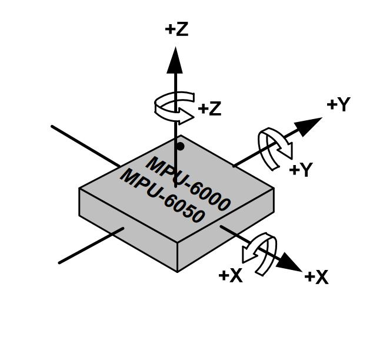

**特点**：

- **组成**：

  - 3轴加速度计：测量XYZ三个方向的加速度；

  - 3轴陀螺仪：测量XYZ三个方向的角速度；
  - DMP：数字运动处理器，可实时融合加速度与角速度数据，直接输出姿态角；
  - 16位ADC：量化范围 -32768 ~ 32767。

- **接口协议**：IIC

  - 从机地址：
    - 1101000（AD0=0）；
    - 1101001（AD0=1）。

- **量程**：多组量程可选择

  - 加速度计：$\pm 2 \text{g}$、$\pm 4 \text{g}$、$\pm 8 \text{g}$、$\pm 16 \text{g}$；
  - 陀螺仪：$\pm 250 ^\circ/\text{s}$、$\pm 500 ^\circ/\text{s}$、$\pm 1000 ^\circ/\text{s}$、$\pm 2000 ^\circ/\text{s}$。

- **可配置**：

  - 数字低通滤波器；
  - 时钟源；
  - 采样分频。

#### 8.6.1.2 MPU6050模块电路


- **左上部分**：电源管理
  - **LDO**：Low DropOut regulator，低压差线性稳压器，将输入的5V电压降压为稳定的3.3V电压；
  - **C3、C10、C12**：猜测均为滤波电容；
  - **D1**：电源指示灯。
- **左下部分**：输出端口
  - **SCL、SDA**：IIC通信端口；
  - **XDA、XCL**：当MPU6050作为IIC主机时的IIC端口；
  - **AD0**：IIC地址可变位（IIC地址最底位）
    - 置为0时，MPU6050地址为1101000；
    - 置为1时，MPU6050地址为1101000。
  - **INT**：中断输出引脚。
- **右边部分**：
  - SDA、SCL总线上**连接上拉电阻**；
  - 其他接线均为MPU6050标准接法。

#### 8.6.1.3 MPU6050内部电路

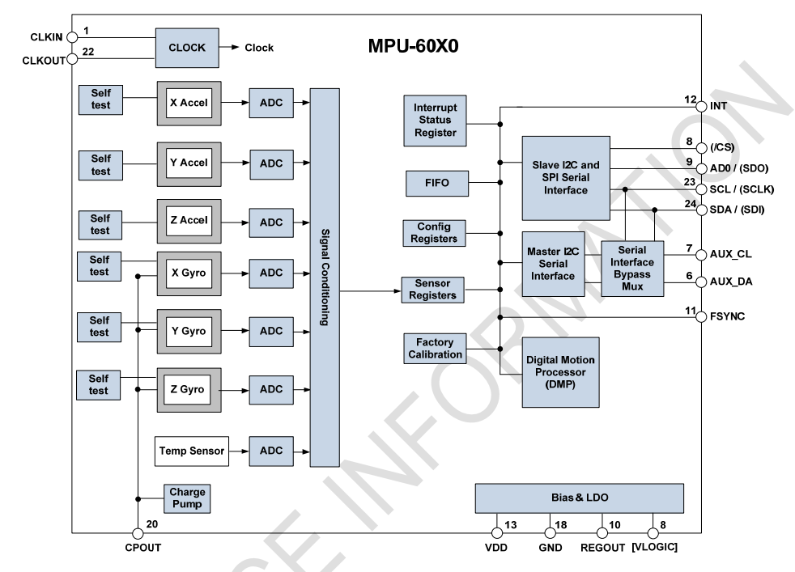

- **左半部分**：
  - **CLOCK**：管理时钟频率（不常用）
    - CLKIN：MPU6050外部时钟接口；
    - CLKOUT：MPU6050内部时钟输出口。
  - **自检模块、传感器与采集模块**：
    - Self test：自检模块，MPU6050上电后对传感器进行检测
      - 大概机制是先施加模拟载荷给传感器，并记下数值，
      - 然后去掉模拟载荷，并记下数据，
      - 然后两次测量作差值，根据差值判断传感器健康状态。
    - X Accel、Y Accel、Y Accel：XYZ三个方向的加速度计；
    - X Gyro、X Gyro、X Gyro：XYZ三个方向的陀螺仪；
    - Temp Sensor：温度传感器；
    - ADC：将传感器模拟量转为数字量。
  - **Charge Pump**：电荷泵，用来升高电压的。
- **右半部分**：
  - 左侧：
    - Interrupt Status Register：中断状态管理器，主要负责输出中断信号；
    - FIFO：传感器数据缓存队列；
    - Config Registers：配置传感器；
    - Sensor Registers：传感器数据寄存器；
    - Factory Calibration：出厂校准；
  - 右侧：
    - Slave IIC and SPI Serial Interface：IIC硬件电路与SPI硬件电路；
    - Master IIC Serial Interace：主机模式下的IIC硬件电路；
    - Serial Interface Bypass Mux：就是一个单刀双掷开关；
    - Digital Motion Processor：数字运动处理器。

#### 8.6.1.4 MPU6050主要寄存器

| 名称         | 地址 | 功能                     |
| ------------ | ---- | ------------------------ |
| SMPLRT_DIV   | 0x19 | 采样率分频               |
| CONFIG       | 0x1A | 配置MPU6050              |
| GYRO_CONFIG  | 0x1B | 配置加速度计             |
| ACCEL_CONFIG | 0x1C | 配置陀螺仪               |
| ACCEL_XOUT_H | 0x3B | X轴加速度高8位           |
| ACCEL_XOUT_L | 0x3C | X轴加速度低8位           |
| ACCEL_YOUT_H | 0x3D | Y轴加速度高8位           |
| ACCEL_YOUT_L | 0x3E | Y轴加速度低8位           |
| ACCEL_ZOUT_H | 0x3F | Z轴加速度高8位           |
| ACCEL_ZOUT_L | 0x40 | Z轴加速度低8位           |
| TEMP_OUT_H   | 0x41 | 温度传感器高8位          |
| TEMP_OUT_L   | 0x42 | 温度传感器低8位          |
| GYRO_XOUT_H  | 0x43 | X轴角速度高8位           |
| GYRO_XOUT_L  | 0x44 | X轴角速度低8位           |
| GYRO_YOUT_H  | 0x45 | Y轴角速度高8位           |
| GYRO_YOUT_L  | 0x46 | Y轴角速度低8位           |
| GYRO_ZOUT_H  | 0x47 | Z轴角速度高8位           |
| GYRO_ZOUT_L  | 0x48 | Z轴角速度低8位           |
| PWR_MGMT_1   | 0x6B | 电源管理模块1            |
| PWR_MGMT_2   | 0x6C | 电源管理模块2            |
| WHO_AM_I     | 0x75 | IIC从机地址（低7位有效） |


## 8.7 案例

# 九、SPI

## 9.1 SPI简介

SPI是"Serial Peripheral Interface"的简称，直译为串行外设接口，是由Motorola公司开发的一种通用数据总线

- **信号线数量**：四根
  - **SS**：Slave Select，有时也称CS（Chip Select），片选信号线；
  - **SCK**：Serial Clock，有时也称CLK（Clock），同步时钟线；
  - **MOSI**：Master Output Slave Input，主机输出从机输入线；
  - **MISO**：Master Input Slave Output，主机输入从机输出线。
- **通信特点**：
  - **同步通信**：
    - 由SCK保持通信同步；
    - 无应答机制；
  - **全双工**：通过两根数据传输线实现（MOSI和MISO）。
  - **高位先行**；
  - **一主多从**：
    - 不能多主多从（不同于IIC）。

## 9.2 物理层

### 9.2.1 硬件接口

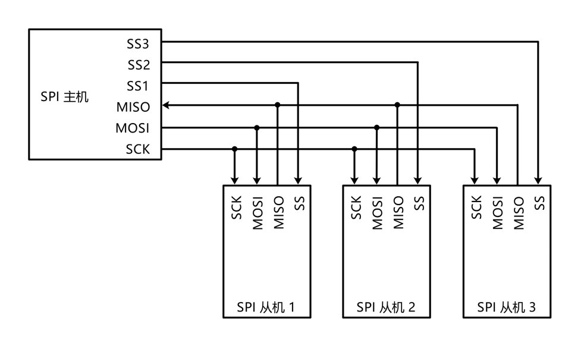

SPI的硬件电路连线如图所示：

- **总线**：所有SPI设备的SCK、MOSI、MISO分别连接在一起；
- **从机控制线**：主机另外引出多条SS控制线，分别接到各从机的SS引脚；
  - 每个从机都有一条**独立的SS**与主机相连；
  - 即：有多少从机，就有多少SS线。
- **IO模式**：
  - 推挽输出：SS、SCK、MOSI；
  - 浮空输入：MISO。
    - 或者配置为上拉输入。

### 9.2.2 数据位的产生方式

# 附录

## RCC

### 外设时钟变量

**APB1外设**：

- **TIM**：
  - `RCC_APB1Periph_TIM2` -- `RCC_APB1Periph_TIM7`；
  - `RCC_APB1Periph_TIM12` -- `RCC_APB1Periph_TIM14`。
- **IIC**：
  - `RCC_APB1Periph_I2C1`；
  - `RCC_APB1Periph_I2C2`。
- **SPI**：
  - `RCC_APB1Periph_SPI2`；
  - ``RCC_APB1Periph_SPI3`。
- **USART**：
  - `RCC_APB1Periph_USART2` -- `RCC_APB1Periph_USART5`
- **USB**：
  - `RCC_APB1Periph_USB`。
- **CAN**：
  - `RCC_APB1Periph_CAN1`。

* **WWDG**：
     * `RCC_APB1Periph_WWDG`
* **BKP**：
     * `RCC_APB1Periph_BKP`。
* **PWR**：
     * `RCC_APB1Periph_PWR`。
* **DAC**：
     *  `RCC_APB1Periph_DAC`。
* **CEC**：
     -  `RCC_APB1Periph_CEC`。

---

**APB2外设**：

- **AFIO**：
  - `RCC_APB2Periph_AFIO`。
- **GPIO**：
  - `RCC_APB2Periph_GPIOA` -- `RCC_APB2Periph_GPIOG`。
- **ADC**：
  - `RCC_APB2Periph_ADC1` -- `RCC_APB2Periph_ADC3`。
- **TIM**：
  - `RCC_APB2Periph_TIM1`；
  - `RCC_APB2Periph_TIM8` -- `RCC_APB2Periph_TIM11`；
  - `RCC_APB2Periph_TIM15` -- `RCC_APB2Periph_TIM17`。
- **SPI**：
  - `RCC_APB2Periph_SPI1`。
- **UART**：
  - `RCC_APB2Periph_USART1`。

### 常用函数

```c
void RCC_AHBPeriphClockCmd(uint32_t RCC_AHBPeriph, FunctionalState NewState);
void RCC_APB2PeriphClockCmd(uint32_t RCC_APB2Periph, FunctionalState NewState);
void RCC_APB1PeriphClockCmd(uint32_t RCC_APB1Periph, FunctionalState NewState);
```

## GPIO

```c
void GPIO_DeInit(GPIO_TypeDef* GPIOx);
void GPIO_AFIODeInit(void);
void GPIO_Init(GPIO_TypeDef* GPIOx, GPIO_InitTypeDef* GPIO_InitStruct);
void GPIO_StructInit(GPIO_InitTypeDef* GPIO_InitStruct);
uint8_t GPIO_ReadInputDataBit(GPIO_TypeDef* GPIOx, uint16_t GPIO_Pin);
uint16_t GPIO_ReadInputData(GPIO_TypeDef* GPIOx);
uint8_t GPIO_ReadOutputDataBit(GPIO_TypeDef* GPIOx, uint16_t GPIO_Pin);
uint16_t GPIO_ReadOutputData(GPIO_TypeDef* GPIOx);
void GPIO_SetBits(GPIO_TypeDef* GPIOx, uint16_t GPIO_Pin);
void GPIO_ResetBits(GPIO_TypeDef* GPIOx, uint16_t GPIO_Pin);
void GPIO_WriteBit(GPIO_TypeDef* GPIOx, uint16_t GPIO_Pin, BitAction BitVal);
void GPIO_Write(GPIO_TypeDef* GPIOx, uint16_t PortVal);
```

## IIC

```c++
// I2C_TypeDef定义
typedef struct
{
  __IO uint16_t CR1;    // 控制寄存器1：CR1
  uint16_t  RESERVED0;  // 保留位
  __IO uint16_t CR2;    // 控制寄存器2：CR2
  uint16_t  RESERVED1;  // 保留位 
  __IO uint16_t OAR1;   // 自身地址寄存器1：OAR1
  uint16_t  RESERVED2;  // 保留位
  __IO uint16_t OAR2;   // 自身地址寄存器2：OAR2
  uint16_t  RESERVED3;  // 保留位
  __IO uint16_t DR;     // 数据寄存器：DR
  uint16_t  RESERVED4;  // 保留位
  __IO uint16_t SR1;    // 状态寄存器1：SR1
  uint16_t  RESERVED5;  // 保留位
  __IO uint16_t SR2;    // 状态寄存器2：SR1
  uint16_t  RESERVED6;  // 保留位
  __IO uint16_t CCR;    // 时钟控制寄存器：CCR
  uint16_t  RESERVED7;  // 保留位
  __IO uint16_t TRISE;  // TRISE寄存器：TRISE
  uint16_t  RESERVED8;  // 保留位
} I2C_TypeDef;


// I2C1定义
#define PERIPH_BASE         ((uint32_t)0x40000000)      
#define APB1PERIPH_BASE     PERIPH_BASE
#define I2C1_BASE           (APB1PERIPH_BASE + 0x5400)   
#define I2C1                ((I2C_TypeDef *) I2C1_BASE)  
```


```c++
#define GPIO_Pin_0                 ((uint16_t)0x0001)  /*!< Pin 0 selected */
#define GPIO_Pin_1                 ((uint16_t)0x0002)  /*!< Pin 1 selected */
#define GPIO_Pin_2                 ((uint16_t)0x0004)  /*!< Pin 2 selected */
#define GPIO_Pin_3                 ((uint16_t)0x0008)  /*!< Pin 3 selected */
#define GPIO_Pin_4                 ((uint16_t)0x0010)  /*!< Pin 4 selected */
#define GPIO_Pin_5                 ((uint16_t)0x0020)  /*!< Pin 5 selected */
#define GPIO_Pin_6                 ((uint16_t)0x0040)  /*!< Pin 6 selected */
#define GPIO_Pin_7                 ((uint16_t)0x0080)  /*!< Pin 7 selected */
#define GPIO_Pin_8                 ((uint16_t)0x0100)  /*!< Pin 8 selected */
#define GPIO_Pin_9                 ((uint16_t)0x0200)  /*!< Pin 9 selected */
#define GPIO_Pin_10                ((uint16_t)0x0400)  /*!< Pin 10 selected */
#define GPIO_Pin_11                ((uint16_t)0x0800)  /*!< Pin 11 selected */
#define GPIO_Pin_12                ((uint16_t)0x1000)  /*!< Pin 12 selected */
#define GPIO_Pin_13                ((uint16_t)0x2000)  /*!< Pin 13 selected */
#define GPIO_Pin_14                ((uint16_t)0x4000)  /*!< Pin 14 selected */
#define GPIO_Pin_15                ((uint16_t)0x8000)  /*!< Pin 15 selected */

#define GPIO_PortSourceGPIOA       ((uint8_t)0x00)
#define GPIO_PortSourceGPIOB       ((uint8_t)0x01)
#define GPIO_PortSourceGPIOC       ((uint8_t)0x02)
#define GPIO_PortSourceGPIOD       ((uint8_t)0x03)
#define GPIO_PortSourceGPIOE       ((uint8_t)0x04)
#define GPIO_PortSourceGPIOF       ((uint8_t)0x05)
#define GPIO_PortSourceGPIOG       ((uint8_t)0x06)

#define GPIO_PinSource0            ((uint8_t)0x00)
#define GPIO_PinSource1            ((uint8_t)0x01)
#define GPIO_PinSource2            ((uint8_t)0x02)
#define GPIO_PinSource3            ((uint8_t)0x03)
#define GPIO_PinSource4            ((uint8_t)0x04)
#define GPIO_PinSource5            ((uint8_t)0x05)
#define GPIO_PinSource6            ((uint8_t)0x06)
#define GPIO_PinSource7            ((uint8_t)0x07)
#define GPIO_PinSource8            ((uint8_t)0x08)
#define GPIO_PinSource9            ((uint8_t)0x09)
#define GPIO_PinSource10           ((uint8_t)0x0A)
#define GPIO_PinSource11           ((uint8_t)0x0B)
#define GPIO_PinSource12           ((uint8_t)0x0C)
#define GPIO_PinSource13           ((uint8_t)0x0D)
#define GPIO_PinSource14           ((uint8_t)0x0E)
#define GPIO_PinSource15           ((uint8_t)0x0F)

#define EXTI_Line0       ((uint32_t)0x00001)  /*!< External interrupt line 0 */
#define EXTI_Line1       ((uint32_t)0x00002)  /*!< External interrupt line 1 */
#define EXTI_Line2       ((uint32_t)0x00004)  /*!< External interrupt line 2 */
#define EXTI_Line3       ((uint32_t)0x00008)  /*!< External interrupt line 3 */
#define EXTI_Line4       ((uint32_t)0x00010)  /*!< External interrupt line 4 */
#define EXTI_Line5       ((uint32_t)0x00020)  /*!< External interrupt line 5 */
#define EXTI_Line6       ((uint32_t)0x00040)  /*!< External interrupt line 6 */
#define EXTI_Line7       ((uint32_t)0x00080)  /*!< External interrupt line 7 */
#define EXTI_Line8       ((uint32_t)0x00100)  /*!< External interrupt line 8 */
#define EXTI_Line9       ((uint32_t)0x00200)  /*!< External interrupt line 9 */
#define EXTI_Line10      ((uint32_t)0x00400)  /*!< External interrupt line 10 */
#define EXTI_Line11      ((uint32_t)0x00800)  /*!< External interrupt line 11 */
#define EXTI_Line12      ((uint32_t)0x01000)  /*!< External interrupt line 12 */
#define EXTI_Line13      ((uint32_t)0x02000)  /*!< External interrupt line 13 */
#define EXTI_Line14      ((uint32_t)0x04000)  /*!< External interrupt line 14 */
#define EXTI_Line15      ((uint32_t)0x08000)  /*!< External interrupt line 15 */
#define EXTI_Line16      ((uint32_t)0x10000)  /*!< External interrupt line 16 Connected to the PVD Output */
#define EXTI_Line17      ((uint32_t)0x20000)  /*!< External interrupt line 17 Connected to the RTC Alarm event */
#define EXTI_Line18      ((uint32_t)0x40000)  /*!< External interrupt line 18 Connected to the USB Device/USB OTG FS
                                                   Wakeup from suspend event */                                    
#define EXTI_Line19      ((uint32_t)0x80000)  /*!< External interrupt line 19 Connected to the Ethernet Wakeup event */
```

