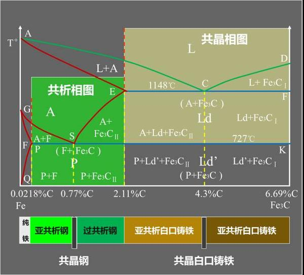

# 一、铁碳相图

如下图所示为铁碳相图

## 1.1 **坐标系**

- **横轴**：铁的含碳量横轴上，或者说碳密度
  - **最左侧**：**0%**，表示纯铁$\text{Fe}$，理论上不含一丝碳杂质的铁。
  - **中间**：**2.11%**，为钢和铸铁的分界线
    - `< 2.11%`：钢；
    - `> 2.11%`：铸铁。
  - **最右侧**：**6.69%**，为渗碳体 $\text{Fe}_3\text{C}$，纯铁掺杂碳（铁碳合金）的最高密度。
- **纵轴**：温度
  - **共析温度**：**727℃**
    - 钢：奥氏体在共析温度时发生共析反应，生成珠光体。
    - 铸铁：高温莱氏体在共析温度时，转为低温莱氏体。
  - **共晶温度**：**1148℃**
    - 铁溶液在共晶温度时发生共晶反应，生成莱氏体，

## 1.2 **钢**

**钢的定义**：含碳量<2.11%的铁（实际工程中钢的含碳量不会接近2.11%，最多也就1.5%，因为含碳量大的钢很脆，已经无法使用）

- **共析钢**：`含碳量 = 0.77% `的钢

  - 0.77%含碳量的钢在共析温度（A1线）时，奥氏体$\text{A}$将全部转为珠光体$\text{P}$。
  - 共析钢的温度处于共析温度以下（如：室温）时，金相组织为珠光体$\text{P}$。

- **亚共析钢**：`0.0218% < 含碳量 < 0.77%` 的钢

  - 亚共析钢降温时，奥氏体$\text{A}$在达到A3线（GS线）时中先析出铁素体$\text{F}$，
  - 然后达到A1线时，剩余的奥氏体全部转为珠光体。
  - 亚共析钢的温度低于共析温度时，金相组织为珠光体+铁素体，$\text{P} + \text{F}$。

- **过共析钢**：

  - 过共析钢降温时，奥氏体$\text{A}$在达到Acm线（ES线）时中先析出渗碳体$\text{Fe}_3\text{C}$，

  - 然后达到A1线时，剩余的奥氏体全部转为珠光体。

  - 过共析钢的温度低于共析温度时，金相组织为珠光体+渗碳体，$\text{P} + \text{Fe}_3\text{C}$。

    

> - A1线对应铁碳相图上727℃的水平线，A3线为点G与点S的连线线，Acm线为点E与点S的连线
>
> - 这种以”A+数字“来命名线的方式看上去非常不直观，这实际上是历史原因造成的：
>   - 早期科学家按实验观察顺序编号（如A₁、A₂、A₃），而非按功能或结构命名，导致数字与功能脱节。
>   - 由法国冶金学家Floris Osmond在19世纪末提出，后经国际学术界完善。
> - A2线是居里点：是铁磁性到顺磁性的温度转变点，大约为768℃

## 1.3 铸铁

**铸铁的定义**：含碳量>2.11%的铁

# 二、黑色金属

# 三、有色金属