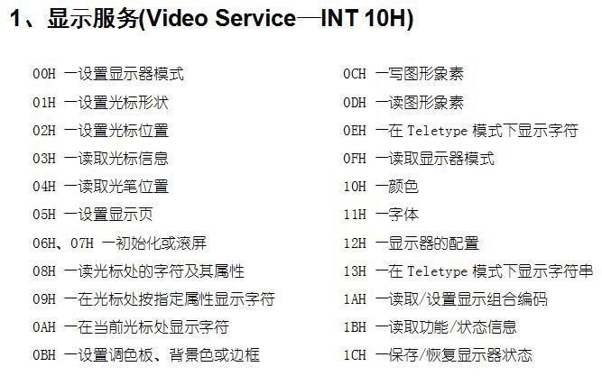

# 寄存器读写

## 计算机

8086CPU內部逻辑结构图：


**CPU**（central process unit）与 **存储器**（内存）通过三类总线连接

存储器由存储单元组成，一个存储单元存储一字节（1B）

### 三类总线

- 地址总线
- 数据总线
- 控制总线

**总线宽度**：就是线的根数
例如：8086CPU的地址总线宽度20，代表有20根地址总线，能代表2^20^个不同的地址（存储单元），即 1MB 寻址能力，或者说 1MB 的寻址空间

### 逻辑存储器

#### 物理上

物理存储器类别：

- **RAM**(random access memory)：随机存取存储器
- **ROM**(read only memory)：只读存储器

#### 逻辑上

对于CPU来说，把所有物理存储器在逻辑上看成**一个整体**，即一个逻辑存储器，然后对这个存储器进行**统一编址**，得到整个地址空间，一个物理存储器在地址空间占据一个地址段，即一段地址空间

例如：8086PC机的地址空间包括：主存储器地址空间（0000 - 9FFFF）、显存地址空间（A000 - BFFFF）和其他各类ROM地址空间（C000 - FFFFF）


## 寄存器

寄存器是**CPU內部**的**信息存储单元**

### 种类

8086CPU有14个寄存器：

- 通用寄存器：AX、BX、CX、DX
- 变址寄存器：SI、DI
- 指针寄存器：SP、BP
- 指令指针寄存器：IP
- 段寄存器：CS、SS、DS、ES
- 标志寄存器：PSW

### 位数

8086CPU的寄存器都是16位的

8086CPU一次最多可以处理16位数据，因此8086也称为16位CPU

通用寄存器AX可以看作由两个8位寄存器AH（8位）、AL（8位）组成。（为了兼容8位CPU）

一个**字**（word）的大小是16位，一个字可以存储在一个16位寄存器中，并且这个字由**高位字节**（8位）和**低位字节**组成（8位）


## ADD和MOVE 指令

mov 是move的缩写，add就是add

```assembly
; ";" 是汇编的注释语法，";"后边的语句会被注释掉
MOV ax, 8 ; 把 8 送入寄存器 ax  相当于给ax赋值8，相当于 ax = 8
MOV ax, bx ; 把 寄存器bx的值赋值给寄存器ax，相当于 ax = bx
ADD aX, 8 ; 相当于 ax += 8
ADD ax, bx ; 相当于 ax += bx
ADD al, bh ; ax可以只运算第八位al
```

**注意：**

1. 寄存器运算也存在溢出 

    		2. 低八位和高八位计算时也会溢出，**低八位溢出的值不会算入到高八位**


## 取址方法

### 物理地址表示方法

物理地址是20位的，但是8086CPU是16位的，一次只能处理16位

采取**段地址**（16位）和**偏移地址**（16位）组合的形式来表示物理地址
$$
物理地址 = 段地址 * 16 + 偏移地址
$$
**注意：**段地址和偏移地址都是人工编程定的，可以灵活选取。物理地址不是编程决定的。

### 分段表示

段地址的不同取法代表了对内存空间的不同分段方式

- 因为段地址由16位表示，所以段地址最多
- 因为偏移地址由16位表示，所以偏移地址最大就是FFFF，意味着一个地址段的最大大小为64K

例如：物理地址21F60，可以表示为段地址2000，偏移地址1F60。记作2000：1F60

段地址有专门的寄存器来保存

- CS（Code Segment）：代码段寄存器
- DS（Data）：数据段寄存器
- SS（Stack）：栈段寄存器
- ES（Extra）：附加段寄存器


## debug命令

[debug命令笔记](./debug命令.md)


## JMP 指令

jump的缩写

**CPU执行一次指令的过程**：

1. 读取寄存器CS、IP的16位数据，通过地址加法器合成位20位寻址数据
2. 20位寻址数据通过地址总线传输给存储器
3. 存储器把相应地址的数据通过数据总线传输给CPU的指令缓冲器，然后CPU开始执行指令

**注意：**CPU执行的代码是由CS、IP的值决定的，无法通过`MOV IP, 0` 等操作改变CS或IP的值，需要使用JMP指令

```assembly
jmp 1000:0  # 使CS:IP = 1000:0
jmp bx  # 使IP = bx的值
```


## 读写内存

- 字节型数据：8位，一个存储单元
- 字型数据：16位，连续两个存储单元（高八位字节存储在高地址位，低八位字节存储在低地址位）

```assembly
mov ax, 1000  # 把1000送入ax
mov ds, ax  # 把ax的值送入ds
mov al, [0]  # 读取 ds:0 的值，并送入al(一个字节型数据)
mov ax, [0]  # 读取 以ds:0为起始地址的字型数据（即ds:0,ds:1的数据），并送入ax
mov bx, [1]  # 起始地址不一定是偶数，可以是任意值
mov [2], bx  # 把bx中的值送入 以ds:2为起始地址的存储空间 中
mov [2], al  # 把al中的值 ds:2 中
```


## 栈

特点：

- 只有一端可以访问数据
- 先进后出：FILO（First In Last Out）

栈空间是人工编程决定的：

- 栈空间由栈段寄存器SS（stack segment）给定

- 栈定由栈顶指针SP（stack pointer）给定

则当前**栈顶地址**为：**SS:SP**

例如：SS 为 1000、SP为11，则栈空间为 1000:0 - 1000:10，栈顶为1000:11

### 指令

- pop：入栈指令
- push：出栈指令

```assembly
mov ax, 1111
mov bx, 2222
push ax  # 把ax的值送入栈
push bx  # 把bx的值送入栈
pop ax  # 读取当前栈顶指针指向的存储单元（字单元）的值，并把这个值送入ax
pop bx  # 再上面这行pop指令执行后，栈顶指针会自动移动
```

### 过程

入栈时：

IP 自减 2，然后找到内存中SS:SP地址，把字型数据（16位、两字节）送入对应的内存空间中

出栈时：

找到内存中SS:SP地址，把地址对应的字型数据送入指定寄存器中，IP 自加 2

### 超界问题

过多的push或pop会导致SP超出了栈空间

CPU无法自主解决超界问题，超界问题需要程序员自己注意


# 汇编程序

## 程序编写和编译

### 编译过程

汇编程序的产生过程：**1. 汇编源码（.asm）**--- 编译器 ---> **2. 目标文件** --- 链接 --- > **3. 可执行文件**

### 汇编源码

包含内容：

- 汇编指令
- 伪指令：并不对应机器码，而是用来跟编译器打交道的

每个汇编源码由多个段组成，这些段可以是栈段，数据段，代码段，但一个汇编源码并且**至少包含一个代码段**

例子：

```assembly
assume cs:codesg  ; 设code段的段寄存器为cs，这行是伪指令

codesg segment  ; 段的开始，codesg是自定义的段名，这行是伪指令
	mov ax, 1000h
	mov bx, 1000h
	add ax, bx
	add bx, ax
	
	; 下面两行固定写法
	mov ax 4c00h
	int 21h  ; 程序终端，把CPU控制权交换给DOS或者debug	
codesg ends  ; 声明codesg段结束，这行是伪指令

end  ; 声明源码结束，这行是伪指令，只是告诉编译器代码结束了，这行是伪指令
```

**注意：**

- 汇编源码表示数字常量的时候**默认是10进制**，要表示16进制的话末尾要加h，例如：1111h

### 编译

**编译：**

编译后生成目标文件（.obj）

```assembly
masm my_code
```

**链接：**

链接将多个目标文件（.obj）及库文件（.lib）链接起来，在开头加上描述信息后生成最终的可执行文件（.exe），可执行文件是机器码

```assembly
link my_obj
```

### 调试

```shell
my_exe.exe  # 可以直接运行可执行程序，但是观察不到结果（因为程序没有输出语句）
debug my_exe.exe  # 把可执行程序导入debug来调试
```

- `t` 命令：可以用来单步执行指令，但是不会自动停止程序

- `p` 命令：跟 t命令 有点像，但是执行到中断时会终止程序
- `g`命令：一次性连续执行指令，直到遇到中断停止


## 一些约定

“`[ ]`” 是汇编语法中规定的物理地址的表示方法，例如：[100]的含义是 DS:100

”`( )` “是人们约定俗称的、表示**物理地址内容**的表示方法，例如：(10000)的含义是物理地址10000h存储的内容。括号内的地址是物理地址，不用`2000:100`这种表达。

因此一些汇编指令可以用”`( )` “更加清晰地表达意思，例如：

```assembly
mov ax, 1000  # 表示是 (ax) = 1000h
add ax, bx  # (ax) = (ax) + (bx)
push ax  # (SP) = (SP) - 2 ; (SS*16+SP) = (ax)
pop ax  # (ax) = (SS*16+SP) ; (SP) = (SP) + 2 
```

"`idata`"表示常量，又称立即数（immediate）


## Loop 指令

loop执行过程：

1. **寄存器cx**自减1
2. CPU判断cx是否为0，不为0则程序指针（IP）跳转到标记处（即将IP的值赋值为标号对应的偏移地址），否则不进行跳转，程序继续执行

要点：

- 从标号开始的指令到loop指令，这一段指令就是循环内容

- loop指令执行过程中默认会使用寄存器cx，cx的值表示了循环了次数，例如：(cx)=10时，循环内容执行10遍

### 示例：

#### 计算幂次

下面这段程序的作用是完成计算2^5^：

```assembly
assume cs:code

code segment
	mov ax, 2
	mov cx, 4
s:	add ax, ax
	loop s
	
	mov ax, 4c00h
	int 21h
code ends

end
```

**注意：**

- 在编译完的可执行文件中 `loop s` 实际上是为翻译为 `loop 006`（假设006 是标记s处对应的偏移地址），就是符号s实际上会被替换为偏移地址

#### 乘法运算

计算123*321：

```assembly
assume cs:code

code segment
	mov ax, 0
	mov cx, 321
s:	add ax, 123  ; 把123累加321次
	loop s
	
	mov ax, 4c00h
	int 21h
code ends

end
```


## 段前缀

### 引入段前缀的原因

问题：编译器在编译 `mov ax, [1]`的时候 会翻译成 `mov, ax, 1`（为什么会这样先不管他，应该不是编译器bug）

解决：编写代码时在偏移地址前显式地加上段地址，例如：`mov ax, ds:[1]`

**注意：**

- 源码`mov ax, ds:[1]`，实际上会翻译成 `mov, ax, [1]`
- 源码`mov ax, [bx]`不会被编译器误解，还会翻译成 源码`mov ax, [bx]`

### 示例

#### 累加运算

从内存中读取**字节型**数据，做累加运算

```assembly
assume cs:code
code segment
	mov ax, 1000h
	mov ds, ax  ; 累加ds段内存的数据
	mov bx, 0  ; 累加指针
	mov cx, 8  ; 控制循环次数
	mov dx, 0  ; 用于保存求和
	
s:	mov al, ds:[bx]
	mov ah, 0
	add dx, ax
	inc bx  ; (bx) 自加1
	loop s
	
	mov ax, 4c00h
	int 21h

code ends
end
```

#### 内存拷贝

从内存的一段中读取字型数据，然后拷贝到另一段内存中（用到es寄存器）

```assembly
assume cs:code
code segment
	mov ax, 1000h
	mov ds, ax  ; 拷贝的源段
	mov ax, 2000h
	mov es, ax  ; 拷贝的目标段
	mov bx, 0  ; 指针
	mov cx, 8  ; 循环8次
	
s:	mov ax, [bx]
	mov es:[bx], ax
	add bx, 2
	loop s
	
	mov ax, 4c00h
	int 21h
code ends
end
```


## 代码段、数据段、栈段

### 同一段

内存拷贝的例子中直接修改了ds的值，非常危险，也许会更改到系统的内存，但是把数据段和栈段放在代码段中就比较安全，因为代码全是程序运行时系统分配给程序的内存，这个内存空间可以随意修改。

### 代码段、数据段、栈段分开

代码段、数据段、栈段同一段容易引起程序混乱，分开后条例比较清晰，下面是改进后的数据倒序

### 示例

#### 数据倒序

```assembly
assume cs:code
code segment
	; dw（define word）定义字，dw是伪指令
	dw 1111h, 2222h, 3333h, 4444h, 5555h, 6666h, 7777h, 0aaaah ; 语法规定常数不能以字母开头，因此前面加个0
	; 下面16个空字预留给栈使用
	dw 0, 0, 0, 0, 0, 0, 0, 0, 0, 0, 0, 0, 0, 0, 0, 0
start:	mov ax, cs  ; 标记程序开始位置（否则程序指针IP会指向开始的数据段）
	mov ss, ax
	mov sp, 30h  ; 初始化栈段及栈顶指针
	
	; 入栈
	mov bx, 0
	mov cx, 8
s:	push cs:[bx]
	add bx, 2
	loop s
	
	; 出栈
	mov bx, 0
	mov cx, 8
s2:	pop cs:[bx]
	add bx, 2
	loop s2
	
	mov ax, 4c00h
	int 21h
code ends
end start  ; “start”标记程序入口是start
```

#### 数据倒序2

```assembly
assume cs:code, ds:data, ss:stack
data segment
	dw 1111h, 2222h, 3333h, 4444h, 5555h, 6666h, 7777h, 0aaaah
data ends

stack segment
	dw 0, 0, 0, 0, 0, 0, 0, 0, 0, 0, 0, 0, 0, 0, 0, 0
stack ends

code segment
start:	
	; 初始化寄存器
	mov ax, stack
	mov ss, ax
	mov sp, 20h  ; 初始化栈段及栈顶指针
	mov ax, data
	mov ds, ax  ; 初始化数据段
	
	; 入栈
	mov bx, 0
	mov cx, 8
s:	push [bx]
	add bx, 2
	loop s
	
	; 出栈
	mov bx, 0
	mov cx, 8
s2:	pop [bx]
	add bx, 2
	loop s2
	
	mov ax, 4c00h
	int 21h
code ends
end start  ; “start”标记程序入口是start
```

**注意：**

- 数据段在开始存放着100h的程序段前缀，例如：当ds为065a时，实际上我们定义的数据放在065a+100=066a

# 内存操作

## 字符串

汇编程序中，定义字符串的格式如下：

```assembly
db 'abcd'  ; db是define byte的缩写，字符串用单引号表示
```

大小写转换：

小写a的ASCII码是，61H（0110 0001B）

大写A的ASCII码是，41H（0100 0001B）

把大写A的第六位 置1，则大写A变为小写a。或者把小写a第六位 置0，则小写a变为大写A。

### 示例

#### 大小写转换

```assembly
assume cs:code, ds:data, ss:stack
data segment
	; 定义字符串
	db 'ascII'
	db 'INforMatION'
data ends

stack segment
stack ends

code segment
start:
	mov ax, data
	mov ds, ax
	
	; 处理第一段字符串，转为大写
	mov bx, 0
	mov cx, 5
s:	mov ax, [bx]
	and al, 11011111b  ; ASCII码大小是一字节，所以用al而不是ax
	mov [bx], al
	inc bx
	loop s
	
	; 处理第一段字符串，转为小写
	mov bx, 5
	mov cx, 11
s2:	mov ax, [bx]
	or al, 00100000b
	mov [bx], al
	inc bx
	loop s2
	
	mov ax, 4c00h
	int 21h
code ends

end start
```


## si 和 di 寄存器

`si`和`di`都是变地址寄存器，和bx差不多，常被用来表示偏移地址，和bx不同的是si和di不能被当作两个8为寄存器来用

- si：source index
- di：destination index

### 示例

#### 同时大小写转换

```assembly
assume cs:code, ds:data, ss:stack
data segment
	db 'aSciI'
	db 'HElLo'
data ends

stack segment
stack ends

code segment
start:
	mov ax, data
	mov ds, ax
	
	mov cx, 5  ; 字符串长度5
	mov si, 0  ; 指向以一个字符串起始位置
	mov di, 5  ; 指向以二个字符串起始位置
	
s:	mov ax, [si]
	and al, 11011111b
	mov [si], ax
	inc si
	
	mov ax, [di]
	or al, 00100000b
	mov [di], al
	inc di
	loop s

	mov ax, 4c00h
	int 21h
code ends
end start

```


## 灵活取址

|       形式        |          名称          |                      含义                      | 实例                                                      |
| :---------------: | :--------------------: | :--------------------------------------------: | --------------------------------------------------------- |
|      [idata]      |        直接寻址        |                  常数直接寻址                  | mov ax, [10]                                              |
|       [bx]        |     寄存器间接寻址     |             通过寄存器变量间接寻址             | mov bx, 0<br />mov ax, [bx]                               |
|   [bx + idata]    |     寄存器相对寻址     | idata作为基本偏移量，bx相对于idata再做偏移寻址 | mov bx, 0<br />mov ax, [bx +10]                           |
|     [bx + si]     |      基址变址寻址      |           bx作为基地址，si作为变地址           | mov bx, 0<br />mov si, 100<br />mov ax, [bx + si]         |
| [bx + si + idata] | 寄存器相对基址变址寻址 |                                                | mov bx, 100<br />mov si, 10<br />mov ax, [bx + si + 1000] |

**不同写法**：

- [bx + si + idata] 
- [bx] [si].idata
- idata[bx] [si]

### 案例

#### 首字母大写

```assembly
assume cs:code, ds:data, ss:stack

data segment
	db '1. file         '  ; 16个字节长
	db '2. open         '
	db '3. save         '
	db '4. exit         '
data ends

stack segment
stack ends

code segment
start:
	; 实现单词首字母大写
	mov ax, data
	mov ds, ax
	
	mov bx, 0
	mov cx, 4  ; 四个字符串
	
s:	mov ax, [bx+3]  ; 取出每个字符串第三个字符
	and al, 11011111b  ; 变为小写，注意ASCII码长度是一个字节，所以用al
	mov [bx+3], al
	add bx, 16  ; 一个字符串16个字节长
	loop s
	
	mov ax, 4c00h
	int 21h
code ends

end start
```

### 二重循环

全部字母小写，由于双重循环需要两个循环计数变量，但是cx只有一个所以写双重循环需要一点技巧

#### 实现一

把外层循环计数变量暂存到**别的寄存器**中

```assembly
assume cs:code, ds:data
data segment
	db 'LIB             '  ; 16个字节长
	db 'DLL             '
	db 'ASM             '
	db 'CPP             '
data ends

code segment
start:
	; 双重循环现方式一
	; 把外部循环计数保存到别的寄存器中
	mov ax, data
	mov ds, ax
	
	mov bx, 0
	mov cx, 4  ; 四个字符串
	
s:	mov dx, cx  ; 把外层循环计数暂存到别的寄存器中

	mov cx, 3  ; 处理当前字符串的前三个字符
	mov si, 0
	s2:	mov ax, [bx+si]
		or al, 00100000b  
		mov [bx+si], al
		inc si 
		loop s2
	
	add bx, 16  ; 一个字符串16个字节长
	mov cx, dx  ; 取出外层循环计数
	loop s
	
	mov ax, 4c00h
	int 21h
code ends
end start
```

**缺点**：寄存器不够用了怎么办，总共就14个寄存器

#### 实现二

把外层循环计数变量暂存到**内存**中

```assembly
code segment
start:
	; 双重循环现方式一
	; 把外部循环计数保存到内存中
	mov ax, data
	mov ds, ax
	
	mov bx, 0
	mov cx, 4  ; 四个字符串
	
s:	mov ds:[40h], cx  ; 把外层循环计数暂存到内存中

	mov cx, 3  ; 处理当前字符串的前三个字符
	mov si, 0
	s2:	mov ax, [bx+si]
		or al, 00100000b  
		mov [bx+si], al
		inc si 
		loop s2
	
	add bx, 16  ; 一个字符串16个字节长
	mov cx, ds:[40h]  ; 取出外层循环计数
	loop s
	
	mov ax, 4c00h
	int 21h
code ends
```

**缺点**：内存的地址需要记，而且改内存可能误把其他有用的内存修改了，上面这个程序就把代码内存改掉了

#### 实现三

把外层循环计数变量暂存到**栈**中

```assembly
stack segment
	dw 0,0,0,0,0,0,0,0  ; 预留16字节的栈空间
stack ends

code segment
start:
	; 双重循环现方式一
	; 把外部循环计数保存到栈中
	mov ax, data
	mov ds, ax
	mov ax, stack
	mov ss, ax
	mov sp, 10h
	
	mov bx, 0
	mov cx, 4  ; 四个字符串
	
s:	push cx  ; 把外层循环计数存到栈中

	mov cx, 3  ; 处理当前字符串的前三个字符
	mov si, 0
	s2:	mov ax, [bx+si]
		or al, 00100000b  
		mov [bx+si], al
		inc si 
		loop s2
	
	add bx, 16  ; 一个字符串16个字节长
	pop cx  ; 取出外层循环计数
	loop s
	
	mov ax, 4c00h
	int 21h
code ends
```

缺点：没有缺点，无懈可击

**优点：**用这个栈的套路，可以实现逻辑清晰的**多层循环**


## 用于内存寻址的寄存器

能表示地址的有**四个**寄存器：

- bx （表示基地址）
- bp （表示基地址）

- si （表示变地址）
- di （表示变地址）

通常是**基地址加变地址**组合使用，例如[bx + si]或[bp + si]

注：只有上面四个寄存器可以用来表示内存上的地址，其他寄存器都不行，例如：[ax + si]或[bx + cx]都是错误的，语法不通过

bp和bx的区别：

- bp不能当作两个独立的8位寄存器使用，而bx可以
- bp默认的段地址是 (ss)，例如：[bp]表示的地址是ss:bp，而bx默认的段地址是ds
- 当显式地指明段地址时，两者用法一样，例如： ds:[bp] 和 ds:[bx] 等效


## 在哪里？有多长？

一个数据的描述包含两个内容：

- 地址（在哪里）
- 长度（有多长）

表示数据的内容（或内容所在地址）：

- 立即数，例如：100
- 寄存器，例如：bx
- 内存数据，例如：[bx]

表述数据的长度：

- 字，例如：mov ax, 2

- 字节，例如：mov al, 2

- 用**`word ptr`**、**`byte ptr`**或**`dword ptr`**指明数据长度，例如：

  ```assembly
  mov word ptr ds:[0] 1
  mov byte ptr ds:[0] 1
  mov dword ptr ds:[0] 1
  ```

**注意：**

- 当使用**立即数**写入**内存**的时候需要指定立即数的长度，而用寄存器和内存交互是就不用，因为寄存器本身就明确了长度


## div指令

### 概述

div是divide的缩写，用作除法

- 除法被除数存在寄存器中
- 除数体也存在寄存器中
- 除法结果的商保存在地位中，余数保存在高位中

### 被除数32位时

**被除数**放在寄存器**ax**、**dx**中，高16位存在dx中，低16位存在ax中

**除数**存在16位寄存器中

**除法结果**商保存在ax（低位）中，余数保存在dx（高位）中

例如：

100001/100  (100001 > 65535 )

```assembly
; 100001的16进制是 186a1
mov ax, 86a1
mov dx, 1
mov bx, 64
div bx  ; 100的16进制是64
```

结果：ax = 03e8	dx = 0001  （03e8h = 1000d）

### 被除数16位时

**被除数**放在寄存器ax中，高8位放在ah中，底8位放在al中

**除数**放在8位寄存器中

**除法结果**商保存在al（低位）中，预报保存在ah（高位）中

例如：

10000/123(10000 < 65535)

```assembly
; 1000的16进制是 186a1
mov ax, 03e8
mov bl, 64
div bl  ; 100的16进制是64
```

结果：ax = 0299 (02h = 2, 99h = 153)

### 在内存中实现除法

```assembly
assume cs:code, ds:data

data segment
	; dd（define doubleword）是定义双字，占4个字节，32位，dd跟dw，db一样也是伪指令
	dd 100001  ; 定义被除数
	dw 100  ; 定义除数
	dw 0;  预留空间保存商
data ends

code segment
start:
	mov ax, data
	mov ds, ax
	mov ax, ds:[0]  ; ax保存低字位
	mov dx, ds:[2]  ; dx保存高字位
	mov bx, ds:[4]  ; bx保存除数（不一定是bx，是寄存器就行）
	div bx  ; 计算除法
	mov ds:[6], ax  ; 将ax中的商保存到预留的内存空间中
	
	mov ax, 4c00h
	int 21h
code ends

end start
```

div 后可以不用寄存器，直接使用内存中的数据，但是要指定数据长度

```assembly
; mov bx, ds:[4]
; div bx

; 下面这行和上面两行等效
div word ptr ds:[4]
```


## mul指令

乘法指令，和除法类似

| 被乘数大小 | 被乘数寄存器 | 乘数来源       | 结果寄存器         |
| ---------- | ------------ | -------------- | ------------------ |
| 8位        | al           | 寄存器或者内存 | 低位：al，高位：ah |
| 16位       | ax           | 寄存器或者内存 | 低位：ax，高位：dx |


## dup指令

dup（duplication）是汇编源程序的**伪指令**

用法示例：

```assembly
data segment
	dw 128 dub(0)  ; 定义128个字，内容为0
data ends
```


# 程序转移

## offset 指令

offset 可以得到标记的偏移地址

### 示例

#### 复制指令

```assembly
assume cs:code

code segment
start:
	mov bx, 0
s:	mov ax, bx
	mov si, offset s
	mov di, offset s2
	
	; 复制s处的指令到s2处
	mov ax, cs:[si]
	mov cs:[di], ax
	
s2:	nop  ; nop是占位指令，占1个字节
	nop
	
	mov ax, 4c00h
	int 21h
code ends
end start
```


## 转移方式

- 段间转移（远转移）：程序跳转到内存中的**任意位置**，程序段寄存器（CS）和指令指针寄存器（IP）都发生改变

- 段内转移：程序只在**当前代码段**内跳转，只有指令指针寄存器发生改变

  - 段内近转移：IP跳转范围 **-32767 - 32766**，16位的位移

  - 段内短转移：IP跳转范围 **-128- 127**，8位的位移

**注意：**

- 段内转移的指令的机器码形式包含的转移信息是**相对位移**
- 相对位移是相对于jmp指令的偏移，可正可负，负数用**补码**表示


## 跳转指令

### jmp 指令

#### jmp 标号

`jmp far ptr s`：段间远转移，翻译后s会被替换为标号所在的**绝对地址**（段地址：偏移地址）

`jmp near ptr s`：段内近转移，翻译后s会被替换为标号所在的**偏移地址**，机器码中包含的是**相对位移**

`jmp short s`：段内段转移，8位的位移

**注意：**

- s 是标号
- 注意s不要超出IP的跳转范围
- 直接写`jmp s`，而不加far、near、short，则默认是最短转移，即如果相对位移是8位以内则为八位转移，超过8位就自动为16为转移，超出当前段范围就自动为段间转移

#### jmp 寄存器

`jmp bx`：段内转移，偏移地址有bx决定

#### jmp 内存单元

`jmp word ptr [0]`：段内近转移，16位内存单元保存着偏移地址

`jmp dword ptr [0]`：段间转移，32位内存单元保存着绝对地址，低位是偏移地址，高位是段地址

### jcxz 指令

jcxz是”Jump if CX is Zero“的缩写，顾名思义，当寄存器cx是0时，才执行跳转，否则不跳转，继续执行。

jcxz只能实现短转移（8位转移）

#### 示例

##### 找到内容为0的地址，并保存在dx中

```assembly
assume cs:code, ds:data
data segment
	dw 8 dup(1234h)
	db 16 dup(55h)
	dw 0  ; 0的数据在 ds:32
data ends

code segment
start:
	mov ax, data
	mov ds, ax
	
	mov bx, 0  ; 扫描指针
s:	mov cx, [bx]
	jcxz ok
	add bx, 2
	jmp s  ; 没找到则继续找
ok:	mov dx, bx  ; 找到后保存在dx中

	mov ax, 4c00h
	int 21h
code ends
end start
```

### loop 指令

先执行(cx) = (cx) - 1，再判断(cx)是否为0，若为0，则跳转，否则继续执行。

loop 只能实现短转移（8位转移）

### 跳转形式

| 有无条件   | 指令       | 转移形式           |
| ---------- | ---------- | ------------------ |
| 无条件转移 | jmp        | 段间转移，段内转移 |
| 有条件转移 | jcxz、loop | 段内段转移         |

**注意：**

- 所有的有条件转移指令都是**短转移**


## 子程序设计

### call 和 ret 指令

call 和 ret 都用到了栈来保存地址

#### call 指令

call指令和jmp指令相似，格式也是`call s`，执行后IP会跳转到标号s处，但是与jmp不同的是，call在执行跳转前，记住了当前的位置（call 的下个指令的偏移地址），方便后面用ret指令使程序回到这里。

相当于：

- push IP
- jmp near prt s

注意：

- `call s`实现的是段间转移，为16位转移
- `call s`对应的机器码中保存的**位移**，而不是目标地址
- `call far ptr s`能实现段间转移，但需要保存段地址和偏移地址，相当于 push cs, push IP, jmp far ptr s

#### 地址保存在内存中

```assembly
call dword ptr [0]
; 相当于:
; push cs
; push IP
; jmp dword ptr [0]  ; 低位保存偏移地址，高位保存段地址
```

#### ret 指令

相当于：

- pop IP

retf 指令相当于：

- pop IP
- pop cs

**注意：**

- ret只会取栈内的值当做返回的地址，因此理论上call和ret不一定是成对出现，即使没有call命令，我们手动push一个地址到栈里，ret也能起作用，但是一般不这么用

#### 示例

##### 计算2的n次方

```assembly
assume cs:code
; 计算2的n次方
code segment
main:
	mov ax, 1  ; 2的0次方
	mov cx, 3  ; cx保存 n 的值
	call s  ; 调用子程序
	mov bx, ax  ; 计算完的结果保存在bx中
	mov ax, 4c00h
	int 21h

s:	add ax, ax
	loop s
	ret
code ends
end main
```

**注意：**

- 这个程序有bug，**非常危险**，使用call和ret时要使用到栈，但是源代码用并没有开辟栈空间，因此程序执行时使用的栈不是我们指定的，有可能会修改掉有用的内存，甚至系统内存

### 给子程序传递参数

#### 寄存器传参

##### 计算数组三次方

通过**寄存器bx**传递参数给cube子程序

```assembly
assume cs:code, ds:data, ss:stack
data segment
	dw 1,2,3,4,5,6,7,8
	dd 0,0,0,0,0,0,0,0
data ends

stack segment
	dd 8 dup(0)  ; 预留32字节栈空间
stack ends

; 计算data段中第一组数据的 3 次方，结果保存在后面一组dword单元中。
code segment
main:
	; 段地址初始化
	mov ax, data
	mov ds, ax
	mov ax, stack
	mov ss, ax
	mov sp, 32
	
	
	mov si, 0  ; 第一组数据
	mov di, 16  ; 后面一组单元
	; 循环处理
	mov cx, 8
s:	mov bx, [si]  ; 通过bx传参
	call cube
	mov [di], ax
	mov [di].2, dx
	add si, 2
	add di, 4
	loop s
	
	mov ax, 4c00h
	int 21h

cube:
; 计算三次方
	mov ax, bx
	mul bx
	mul bx
	ret
code ends
end main
```

#### 内存传参

##### 字符串小写转大写

传递数据在**内存中的首地址**

```assembly
assume cs:code, ds:data, ss:stack
data segment
	dd 4 dup(0)  ; 空的空间
	db 'conversation', 0  ; 0 表示字符串结束
data ends

stack segment
	dd 4 dup(0)  ; 预留16个字节栈空间
stack ends

code segment
main:
	; 初始化寄存器
	mov ax, data
	mov ds, ax
	mov ax, stack
	mov ss, ax
	mov sp, 16
	
	mov si, 16  ; 通过si传递字符串首地址
s:	mov cl, [si]
	mov ch, 0
	jcxz done  ; 如果是'\0'则退出循环
	call capital
	inc si
	jmp short s
done:
	mov ax, 4c00h
	int 21h
	
capital:
	and byte ptr [si], 11011111b
	ret	
code ends
end main
```

#### 栈传参

##### (a - b)的三次方

```assembly
assume cs:code, ss:stack
stack segment
	dd 4 dup(0)  ; 预留16字节的栈空间
stack ends

code segment
; 计算(a - b)^3
main:
	mov ax, stack
	mov ss, ax
	mov sp, 16
	
	mov ax, 1  ; b = 1
	push ax
	mov ax, 3  ; a = 3
	push ax  ; 分别把b、a压栈
	call diffcube
	mov ax, 4c00h
	int 21h

diffcube:
	push bp
	; 此时栈中有四个数据，从栈顶到栈底分别是：(bp), (IP), 3, 1
	mov bp, sp
	mov ax, [bp].4
	sub ax, [bp].6  ; a - b
	mov bp, ax  ; 计算三次方
	mul bp
	mul bp
	pop bp
	ret 4  ; 相当于 pop IP、add sp 4，表示栈里还存着的 3 和 1 都不要了	
code ends
end main
```

### 寄存器冲突

任务：把下列字符串转为大写

```assembly
data segment
	db 'word', 0  ; 0标记字符串结束，类似c中的‘\0’
	db 'unix', 0
	db 'wind', 0
	db 'good', 0
data ends
```

**错误**示范

```assembly
code segment
main:
	mov ax, data
	mov ds, ax
	
	mov cx, 4  ; 表示4个字符串
	mov bx, 0  ; 指向字符串首地址
s:	mov si, bx ; 字符串指针
	call capital
	add bx, 5  ; 指向下一个字符串
	loop 
	mov 4c00h
	int 21h

capital:	
	mov cl, [si]
	mov ch, 0
	jcxz done  ; 判断当前字符是不是'\0'，是的话换成转化，退出函数，否则继续
	and bype ptr [si], 11011111b
	inc si
	jmp short captial
done:
	ret	
code ends
```

问题：子程序 captial的jcxz 和 主程序的loop 都用到了寄存器cx，造成冲突。解决办法在下节。

### 子程序框架

为了解决寄存器冲突，实现子程序的独立运行，在子程序的开始，将子程序要用到的寄存器的值全部入栈，在子程序ret前，从栈内弹回这些寄存器的值。

所以上例中的程序可以这样写

```assembly
assume cs:code, ds:data, ss:stack
data segment
	db 'word', 0  ; 0标记字符串结束，类似c中的‘\0’
	db 'unix', 0
	db 'wind', 0
	db 'good', 0
data ends

stack segment
	dd 8 dup(0)  ; 预留32字节的栈空间
stack ends

; 字符串大写
code segment
main:
	mov ax, data
	mov ds, ax
	mov ax, stack
	mov ss, ax
	mov sp, 32
	
	mov cx, 4  ; 表示4个字符串
	mov bx, 0  ; 指向字符串首地址
s:	mov si, bx ; 字符串指针
	call capital
	add bx, 5  ; 指向下一个字符串
	loop s
	mov ax, 4c00h
	int 21h

capital:	
	push cx
	push si
; 将一个字符串转为大写	
change:
	mov cl, [si]
	mov ch, 0
	jcxz done  ; 判断当前字符是不是'\0'，是的话换成转化，退出函数，否则继续
	and byte ptr [si], 11011111b
	inc si
	jmp short change
done:
	pop si
	pop cx
	ret	
code ends
end main
```

子程序框架：

```assembly
subfunction:
	push 要用到的寄存器
	; 子程序内容
	pop 要用到的寄存器
	ret
```

**注意：**

- 使用子程序时记得开辟栈空间
- 子程序末尾pop时注意顺序，否则程序会崩掉
- 子程序有循环时，不要把开头的push步骤包括在循环内，否则程序会崩掉
- 传参用的寄存器不用push


## psw寄存器

psw是"process status word"的缩写，为16寄存器，每个位都是一个标志位。不是全部16位都用作标志，有些是闲置的。


| 标志               | 值为1         | 值为0             | 意义       |
| ------------------ | ------------- | ----------------- | ---------- |
| OF (Overflow Flag) | OV (OVerflow) | NV (Not oVerflow) | 溢出       |
| DF (Diretion)      | DN (Down)     | UP                | 方向       |
| SF (Sign)          | NG (NeGative) | PL (Positive)     | 符号       |
| ZF (Zero)          | ZR (ZeRo)     | NR (Not zeRo)     | 零值       |
| PF (Parity)        | PE (Even)     | PO (Odd)          | 奇偶       |
| CF (Carry)         | CY (CarrY)    | NC (Not Carry)    | 进位       |
| IF(Interrupt)      |               |                   | 可屏蔽中断 |
| TF(Trap)           |               |                   | 单步中断   |
| AF(Auxiliary)      |               |                   | BCD进位    |

**注意：**

- CF是考虑无符号数的计算，SF是考虑有符号数的计算
- OF是考虑有符号数的计算，例如：8位有符号数的范围是 -128 - 127，如果128就溢出了，但是把他当作无符号数就没有溢出
- PF 奇偶性不是指数值的奇偶性，而是二进制位的奇偶性，例如：1101有3个1，则PF是0，101有两个1，则PF是1
- 有符号数用补码表示

### 补码与反码

有符号数的负数用**补码**表示，用加法表示除法，例如：一个四位二进制数0001，则-1可以表示为 10000-1=1111，那么当0001 + 1111时，就相当于 0001 + 10000 - 0001，第五位的1是溢出位，所以实际上相当于计算了 0001 - 0001 = 0 。所以一个正数x的补码可以表示为 **溢出位 - x**，(10000 - x)。

**反码**就是一个二进制数按位取反的结果，一个二进制数按位取反后和原数相加，所得到的结果一定是1111。那么取反这一操作相当于对原数x进行了如下运算：10000-1-x，因为 (10000-1-x) + x = 1111

补码是 (10000-x)，反码是 (10000-1-x)，那么补码就等于反码+1，所以一个**正数的补码就是取反后加一**，即 `~x + 1`

例如：

|          | 值   | 相当于                                 |
| -------- | ---- | -------------------------------------- |
| **原码** | 0001 | -                                      |
| **反码** | 1110 | 1111 - 0001 = （10000 - 1） - 0001     |
| **补码** | 1111 | 10000 - 0001 = （10000 - 1）- 0001 + 1 |

理论上补码到原码，应该是原码到补码的逆序操作，即 原码x减一后再取反，但是这个操作和原码取反后再加一的操作是等效的，而这个取反加一的操作就是取补码的操作。因此补码的补码就是原码。

实际上从 原码 + 补码 = 进位。从十进制角度上看：1 + 99 = 100、4 + 96 = 100 。**原码和补码是一对的，互为补码**。


## adc和sbb指令

adc (add with carry) 和 sbb (substract with borrow)**考虑进位的加减法**

格式：

```assembly
adc ax, ax  ; 计算 (ax) = (ax) + (ax) + CF
sbb ax, ax  ; 计算 (ax) = (ax) - (ax) - CF
```

用途：大数相加

### 示例

#### 128位数相加

```assembly
assume cs:code, ds:data

data segment
	; 两个128位数（8字*2字节*8位）
	dw 0A452H,0A8F5H,78E6H,0A8EH,8B7AH,54F6H,0F04H,671EH  ; 低地址位保存数据低位
	dw 0E71EH,0EF04H,54F6H,8B7AH,0A8EH,78E6H,58F5H,0452H
data ends

; 128位数相加，结果保存在第一组数据单元上
code segment
main:
	mov ax, data
	mov ds, ax

	mov si, 0  ; 第一个数
	mov di, 16  ; 第二个数
	mov cx, 8	
	call add128
	mov ax, 4c00h
	int 21h
		
add128:
	sub ax, ax  ; 标志寄存器的进位标志清零
s:
	mov ax, [si]
	adc ax, [di]
	mov [si], ax
	inc si
	inc si
	inc di
	inc di
	loop s
	ret
code ends
end main
```

**注意：**

- sub ax, ax 是为了清楚标志寄存器的进位标志，防止之前的标志位干扰计算
- inc si 不能替换成 add si, 1，因为inc不影响标志寄存器，但是add会，可能会干扰计算

## cmp 指令

cmp是compare的缩写，是比较指令，相当于两个数做减法，但是减法结果不保存，主要用来**改变标志寄存器**

通过观察标志寄存器，可以得知两个数的关系

### 无符号数比较

| 比较关系 | (ax) ? (bx)  | 特点                                  | 标志             |
| -------- | ------------ | ------------------------------------- | ---------------- |
| 等于     | (ax) = (bx)  | (ax) - (bx) = 0                       | ZF = 1           |
| 不等于   | (ax) != (bx) | (ax) - (bx) != 0                      | ZF = 0           |
| 小于     | (ax) < (bx)  | (ax) - (bx) 会产生借位                | CF = 1           |
| 小于等于 | (ax) <= (bx) | (ax) - (bx) 或者产生借位，或者结果为0 | CF = 1 或 ZF = 1 |
| 大于     | (ax) > (bx)  | (ax) - (bx) 不产生借位，且结果不为0   | CF = 0 且 ZF = 0 |
| 大于等于 | (ax) >= (bx) | (ax) - (bx) 不产生借位                | CF = 0           |

### 有符号数比较

| 比较关系 | (ax) ? (bx)  | 特点                            | 标志             |
| -------- | ------------ | ------------------------------- | ---------------- |
| 等于     | (ax) = (bx)  | (ax) - (bx) = 0                 | ZF = 1           |
| 不等于   | (ax) != (bx) | (ax) - (bx) != 0                | ZF = 0           |
| 小于     | (ax) < (bx)  | (ax) - (bx) 是负数              | SF = 1           |
| 小于等于 | (ax) <= (bx) | (ax) - (bx) 是负数，或者结果为0 | SF = 1 或 ZF = 1 |
| 大于     | (ax) > (bx)  | (ax) - (bx) 是正数，且结果不为0 | SF = 0 且 ZF = 0 |
| 大于等于 | (ax) >= (bx) | (ax) - (bx) 是正数              | SF = 0           |


## 条件转移指令

jxx指令，满足要求就跳转

| 指令        | 含义                   | 测试条件         |
| ----------- | ---------------------- | ---------------- |
| je/jz       | 等于/结果为0           | ZF = 1           |
| jne/jnz     | 不等于/结果不为0       | ZF = 0           |
| js          | 结果为负               | SF = 1           |
| jns         | 结果不为负             | SF = 0           |
| jo          | 结果溢出               | OF = 1           |
| jno         | 结果不溢出             | OF = 0           |
| jp          | 偶                     | PF = 1           |
| jnp         | 奇                     | PF = 0           |
| jb/jnae/jc  | 小于/不大于等于/借位   | CF = 1 且 ZF = 0 |
| jnb/jae/jnc | 不小于/大于等于/不借位 | CF = 0           |

助记：j - jump, e - equal, n - not, z - zero, s - sign, o - overflow, p - parity, b - below, a - above, c - carry, l - less, g -greater

### cmp与条件转移指令

通常cmp与条件转移指令一起使用，使用cmp比较两个数并改变标志寄存器，然后jxx根据标志寄存器的值来执行跳转，这个一个固定的套路。

### 示例

#### 基本if-else语句

```assembly
assume cs:code
; 如果 (ax) == (bx)，则 ax + bx，否则 ax + ax
code segment
main:
	mov ax, 2
	mov bx, 3
	
	; if-else语句
	cmp ax, bx
	jnz s  ; 不相等就跳转，相等就继续执行
	add ax, bx 
	jmp short ok
s:
	add ax, ax
	
ok:
	mov ax, 4c00h
	int 21h
code ends
end main
```

#### 统计大于8的数据的个数

```assembly
assume cs:code, ds:data, ss:stack
data segment
	db 8,16,32,25,8,9,8,1,0,0,8,6
data ends

stack segment
	dd 4 dup(4)
stack ends

code segment
main:
	mov ax, data
	mov ds, ax
	mov bx, 0  ; 指针
	mov cx, 12  ; 总共12个数字
	mov ax, 0  ; 统计个数
	call find8
	mov ax, 4c00h
	int 21h
	
find8:
	cmp byte ptr [bx], 8
	jna next
	inc ax  ; 如果大于8就加一
next:
	inc bx
	loop find8
	ret	
code ends
end main
```


## 串传送指令

### DF标志

功能：

- DF = 0时，代表UP，执行完串传送指令后 si 和 di 都**自加1**
- DF = 1时，代表DN(down)，执行完串传送指令后 si 和 di 都**自减1**

更改：

- cld (clear direction)，设置DF = 0
- std (setIP direction)，设置DF = 1

### movsb指令

move string byte的缩写，以**字节**为单位传送

执行了下列操作：

1. (**es** * 16 + di) = (ds * 16 + si)
2. 如果DF = 0：(si) = (si) + 1，否则：(si) = (si)  - 1
3. 如果DF = 0：(di) = (di) + 1，否则：(di) = (di)  - 1

### movsw指令

move string byte的缩写，以**字**为单位传送

执行了下列操作：

1. (ds * 16 + di) = (ds * 16 + si)
2. 如果DF = 0：(si) = (si) + **2**，否则：(si) = (si)  - **2**
3. 如果DF = 0：(di) = (di) + **2**，否则：(di) = (di)  - **2**

### rep指令

```assembly
rep movsb ; 等价于下面两行
s:	movsb
	loop s
```

### 示例

#### 复制指定段末尾的数据到数据的开头

把f000h段的末尾数据移动到数据段的开头

```assembly
assume cs:code, ds:data
data segment
	db 16 dup(0)
data ends

code segment
; 把f000h段的末尾数据移动到数据段的开头
main:
	mov ax, 0f000h  ; 数据段寄存器指向f000h段
	mov ds, ax  
	mov si, 0ffffh
	mov ax, data  ; 附加段寄存器指向数据段
	mov es, ax
	mov di, 15
	std  ; 倒序
	rep movsb
	
	mov ax, 4c00h
	int 21h
code ends
end main
```


# 中断及外部设备

## 移位指令

- shl：逻辑左移，头部 被移动到进位标志里，尾部补0
- shr：逻辑右移，尾部  被移动到进位标志里，头部补0
- rol：循环左移，头部 被移动到进位标志里，同时也被移动到尾部
- ror：循环右移，尾部  被移动到进位标志里，同时也被移动到头部
- sal：算数左移，同逻辑左移效果一样
- sar：算数右移，尾部  被移动到进位标志里，头部填补的数依然是头部，而不是0（为了保持符号位）
- rcl：带进位循环左移，进位标志位也参与循环移动，头部移动到进位标志位，进位标志位移动到尾部
- rcr：带进位循环右移，进位标志位也参与循环移动，尾部移动到进位标志位，进位标志位移动到头部

**助记：**s - shift, r - rorate, l - left, r - right,  a - arithmetic, c - carry 


## 操作显存

改变显存数据就意味着改变屏幕显示，显存的地址空间从A0000-BFFFF，其中末尾部分B8000-BFFFF共32K的空间是

80*25彩色字符模式，第0页的显示缓冲区。

一个字符用一个字表示，即两个字节。其中低位字节保存ASCII码，高位字节保存显示属性信息，如下图所示，其中前景指文字，高亮值文字加粗，背景指除文字外的区域，闪烁是文字闪烁。


一行有80个字符，所以一行文字对应160（80*2）个字节单元，所以第一行文字的地址范围是：b8000 - b809f，第二行文字的地址范围是：b80a0 - b813f，以此类推。

### 示例

#### 显示”welcome to masm!“

显示 ”welcome to masm!“ 在屏幕中间

```assembly
assume cs:code, ds:data, ss:stack

data segment
	db 'welcome to MASM!'  ; 需要显示的字符
data ends

stack segment
	dd 4 dup(4)  ; 预留栈空间
stack ends

; 显示字符在屏幕中间
code segment
main:
	mov ax, data
	mov ds, ax
	
	mov si, 0  ; si作为传递字符串首地址的寄存器
	call show
	mov ax, 4c00h
	int 21h
	
show:
; 显示 welcom to MASM
	push di
	push cx

	mov ax, 0b800h
	mov es, ax
	mov di, 12*160 + 2*40 - 2*8  ; 第13行，中间列，的前8个字符
	mov cx, 16  ; 字符串长度16
s:	mov al, [si]  ; 文字ASCII码
	mov ah, 71h  ; 黑色背景
	mov es:[di], ax  ; 写入显存
	inc si  ; 下一个字符
	add di, 2  ; 下个显存单元
	loop s
    
	pop cx
	pop di
	ret
code ends
end main
```

效果：


## 地址标号

### 关于标号

标号一样**标记数据**

### 示例

累加a组数据，把结果存在b中

```assembly
code segment
a:	db 1, 2, 3, 4, 5, 6, 7, 8
b:	dw 0
start:
	mov si, offset a
	mov bx, offset b
	mov cx, 8  ; 把个数字
s:	mov al, cs:[si]
	mov ah, 0  ; 用16位寄存器保存数字，是因为b组数据要求的长度是一个字
	add cs:[bx], ax  ; 累加
	inc si
	loop s
	
	mov ax, 4c00h
	int 21h
code ends
```

上例中 还需要offset得到偏移地址，有些繁琐，可以有更简单的方法

可以直接用地址标号，如下：

```assembly
code segment
	a db 1, 2, 3, 4, 5, 6, 7, 8
	b dw 0
start:
	mov si, 0
	mov cx, 8  ; 把个数字
s:	mov al, a[si]
	mov ah, 0  ; 用16位寄存器保存数字，是因为b组数据要求的长度是一个字
	add b, ax  ; 累加
	inc si
	loop s
	
	mov ax, 4c00h
	int 21h
code ends
```

其中标号`a`、`b`是**数据标号**，而之前的`a:`、`b:`是**地址标号**，地址标号只代表偏移地址，而数据标号代码那一个**内存单元**，包括偏移地址和数据长度。

**注意：**

- 在数据标号后的数据定义伪指令就指定了数据的长度，例如：a db 1, 2, 3，a就代表了数值为1且长度为一字节的内存单元。

在定义数据的时候也定义数据标号

例如：

```assembly
data segment
	a db 1, 2
	b db 3, 4
	c dw a, b  ; 相当于 c dw offset a, offset b
	d dd a, b  ; 相当于 d dw offset a, seg a, offset b, seg b  (seg是求段地址的指令)
data ends
```


## 直接定址表

### 数据的直接定址表

把一组数据（通常是下标）和另一组数据通过表格建立映射关系，这样的表叫做定址表。

#### 示例

##### 显示8位数字字符

在屏幕中间显示出一个字节型数据的16进制数，例如 ：数字7ah，则要显示字符'7a'

```assembly
assume cs:code, ss:stack
stack segment
	dd 4 dup(0)
stack ends
code segment
main:
	mov ax, stack
	mov ss, ax
	mov sp, 16
	
	mov al, 7ah  ; al来传递要显示的数字
	call showbyte
	mov ax, 4c00h
	int 21h

showbyte:
	push cx
	push bx
	push es
	jmp short show
	table db '0123456789abcdef'  ; 一张表，把一个十六进制数映射为字符
show:
	mov ah, al
	mov cl, 4
	shr ah, cl  ; 右移四位，得到高4位数字 
	and al, 00001111b  ; 得到低4位数字
	
	mov bl, ah
	mov bh, 0  ; 此时cx中保存的是al的高4位数字
	mov ah, table[bx]
	mov bx, 0b800h
	mov es, bx
	mov es:[12*160 + 2*40], ah  ; 显示高4位数字
	
	mov bl, al
	mov bh, 0
	mov al, table[bx]
	mov es:[12*160 + 2*40 + 2], al  ; 显示低4位数字
	pop es
	pop bx
	pop cx
	ret
code ends
end main
```

##### 显示sin(x)

x在[0, 30, 60, 90, 120, 150, 180]之间取值，显示sin(x)的值在屏幕中间

```assembly
assume cs:code, ss:stack
stack segment
	dd 4 dup(0)
stack ends

; 显示三角函数值
code segment
main:
	mov ax, stack
	mov ss, ax
	mov sp, 16
	
	mov al, 150  ; al用来传递参数，表示角度值
	call showsin
	mov ax, 4c00h
	int 21h

showsin:
	jmp short body
	table dw ag0, ag30, ag60, ag90, ag120, ag150, ag180  ; agxx是各个字符串的首地址（偏移地址）
	ag0	 db '0', 0  ; 0是停止符
	ag30  db '0.5', 0
	ag60  db '0.866', 0
	ag90  db '1', 0
	ag120 db '0.866', 0
	ag150 db '0.5', 0
	ag180 db '0', 0
body:
	; 预备工作
	push bx
	push di
	push es
	mov bx, 0b800h
	mov es, bx  ; 定义显存段地址
	
	; 得到索引
	mov ah, 0
	mov bl, 30
	div bl  ; 角度除以30得到索引
	
	; 根据索引查表，得到字符串
	mov ah, 0  ; 把除法结果的余数置零，只保留商在al中
	mov bx, ax  ; 把索引值赋值给bx（因为只有bx作为偏移地址）
	add bx, bx  ; (bx)*2，因为偏移地址是一个字，两个字节
	mov bx, table[bx]  ; 得到对应 sin(al) 的字符串（的首地址）
	
	; 显示
	mov di, 12*160 + 2*40  ; 对应显存的地址空间
show:
	mov ah, cs:[bx]  ; 取出字符（的ASCII）
	cmp ah, 0  ; 判断是否是停止符'\0'
	je return
	mov es:[di], ah
	mov byte ptr es:[di+1], 2fh  ; 显示属性，不是核心语句，就是好看
	inc bx
	add di, 2
	jmp short show

return:
	pop es
	pop di
	pop bx
	ret
	
code ends
end main
```

**注意：**

- 这个制表的方法省略了计算sin(x)的步骤，而是人工计算好存在表里，提高了程序运行速度，是一种**空间换时间**的策略


### 代码的直接定制表

把代码的偏移地址制成表格，本质上代码也是数据，所以对代码制表还是对数据制表其实是一样的，都是对一段内存数据的偏移地址制表。

### 示例

#### 屏幕操作

功能：

1. 用**ah**寄存器传递功能号：

   - 0 表示清屏，

   - 1表示设置前景色，

   - 2 表示设置背景色，

   - 3 表示向上滚动一行；

2. 对2、3号功能，用**al**传送颜色值，al的范围是 0 - 7

```assembly
assume cs:code, ss:stack

stack segment
	dd 16 dup(0)  ; 预留32字节栈空间
stack ends

code segment
main:
	mov ax, stack
	mov ss, ax
	mov sp, 64
	mov ah, 3  ; ah传递功能号, 0表示清屏，1表示设置前景色，2表示设置背景色，3表示向上滚动一行；
	mov al, 3  ; al传显示颜色（针对1、2号功能来说）
	call setscreen
	mov ax, 4c00h
	int 21h

setscreen:
	; 主功能函数
	jmp short body
	table dw sub0, sub1, sub2, sub3  ; 函数表
body:
	push bx
	cmp ah, 3
	ja setreturn
	
	mov bx, 0
	mov bl, ah
	add bx, bx  ; 功能号*2，因为函数的偏移地址长度是两个字节，一个字
	call table[bx]
setreturn:
	pop bx
	ret

sub0:
; 主功能子函数0
	; 把内存单元的字符都设置为空格‘ ’就实现了清屏
	push bx
	push cx
	push es
	mov bx, 0b800h  ; 显存段地址
	mov es, bx
	mov bx, 0
	mov cx, 25*80
sub0s:	
	mov byte ptr es:[bx], ' '
	add bx, 2
	loop sub0s
	pop es
	pop cx
	pop bx
	ret  ; sub0 ends

sub1:
; 主功能子函数1
	; 把内存单元的显示属性都设置为指定颜色就实现了改变前景色
	push bx
	push cx
	push es
	mov bx, 0b800h  ; 显存段地址
	mov es, bx
	mov bx, 1
	mov cx, 25*80
sub1s:	
	and byte ptr es:[bx], 11111000b  ; 先将后三位清零
	or es:[bx], al  ; 再写入后三位，即把al写入显存
	add bx, 2
	loop sub1s
	pop es
	pop cx
	pop bx
	ret  ; sub1 ends

sub2:
; 主功能子函数2
	; 把内存单元的显示属性都设置为指定颜色就实现了改变背景色
	push bx
	push cx
	push es
	mov bx, 0b800h  ; 显存段地址
	mov es, bx
	
	mov cl, 4
	shl al, cl  ; 把al的低4位移动到高四位
	mov bx, 1
	mov cx, 25*80
sub2s:	
	and byte ptr es:[bx], 10001111b  ; 先将后三位清零
	or es:[bx], al  ; 再写入后三位，即把al写入显存
	add bx, 2
	loop sub2s
	pop es
	pop cx
	pop bx
	ret  ; sub2 ends

sub3:
; 主功能子函数3
	; 复制前24行，清空最后一样
	push cx
	push es
	push ds
	push si
	push di
	mov di, 0b800h
	mov es, di
	mov ds, di
	mov si, 160  ; 下面一行
	mov di, 0  ; 上面一行
	mov cx, 24*80  ; 把下一行的字符复制到当前行，一共复制24行
	rep movsw
	
	mov cx, 80  ; 最后一行清空
sub3s2:
	mov byte ptr es:[di], ' '
	add di, 2
	loop sub3s2
	
	pop di
	pop si
	pop ds
	pop es
	pop cx
	ret  ; sub3 ends
code ends
end main
```

使用代码直接定制表的优点：

- 可读性高
- **容易扩充功能**，要添加新功能时，只要编写号函数，把他加入表中就可以用了


## 中断

### 简介

分类：

- 內部中断：CPU內部产生的中断
- 外部中断：CPU外部产生的中断，比如键盘、鼠标等外部设备产生的中断

8086CPU內部中断：

1. 除法错误中断，中断号0

2. 单步执行中断，中断号1
3. 执行into指令，中断号4
4. 执行int n指令，中断号n

**注意：**

- 中断号由寄存器ah传参

中断程序常驻在CPU内存中，中断程序的入口地址（即**中断向量**）保存在**中断向量表**中（0000:0000 - 0000:03ff），共占1KB空间，其中一个中断向量由偏移地址（一个字）和段地址（一个字）组成，低位存放偏移地址，高位存放段地址，例如：0号中断程序的偏移地址存在0000:0000中，段地址存在0000:0002中，4个字节一个中断向量，共有256个中断向量，**从0号到255号**。

### 中断过程

1. 从中断信息中取得中断类型码（中断号）
2. 标志寄存器入栈
3. 标志寄存器的第9位TF，第8位IF置为0
4. cs入栈
5. IP入栈
6. 从中断向量表中读取中断程序的入口地址，并设置IP和CS

相当于：

1. 取得中断类型码N
2. pushf
3. TF = 0, IF = 0
4. push cs
5. push IP
6. (IP) = (N*4)，(cs) = (N\*4 + 2)

**注意：**

- 中断过程由**硬件执行**。7
- pushf（push flag）指令是标志寄存器入栈的指令

### 中断处理程序

任务：写一个除法错误中断程序，当执行中断程序时在屏幕中间显示"overflow!"

要求：中断程序应该写在内存中固定的一块位置

事实：在操作系统之上使用计算机，所有的硬件资源都在操作系统的管理之下，应该向操作系统申请获得存放do0的内存。

简便方案：绕过操作系统，直接在找到一块别的程序不会用到的内存区，将do0传送到其中即可。

放哪里好呢：内存0000:0000~0000:03FF，大小为1KB的空间是系统存放中断向量表，DOS 系统和其他应用程序都不会随便使用这段空间。8086 支持 256 个中断，但实际上系统中要处理的中断事件远没有达到256 个 。

就这样好了：**利用中断向量表中的空闲单元来存放我们的程序。**估计出，do0的长度不可能超过256个字节，就选用从0000:0200至0000:02FF的256个字节的空间。

#### 程序框架

- 编写d01中断程序，实现在屏幕中间显示“overflow”
- 安装程序：把d01中断程序拷贝到中断向量表的空闲单元中，0000:0200 - 0000：02ff，共256个字节
- 设置中断向量表，使得0号中断的中断向量指向我们编写的d01程序

#### 实现

```assembly
assume cs:code, ss:stack

stack segment
	dd 16 dup(0)  ; 64字节栈空间
stack ends

code segment
main:
	mov ax, stack
	mov ss, ax
	mov sp, 64
	; 安装中断程序
	call install
	; 设置中断向量表
	call setint 
	; 产生中断
	mov ax, 22
	mov bl, 0
	div bl
	mov ax, 4c00h
	int 21h
	
install:
; 安装程序
	; 用串传送指令拷贝程序
	push ds
	push si
	push di
	push cx
	mov cx, cs
	mov ds, cx
	mov si, offset d01  ; 源地址
	mov cx, 0000h
	mov es, cx
	mov di, 0200h  ; 目标地址
	cld  ; 设置传输方向为正
	mov cx, offset d01end - offset d01  ; 得到自定义中断程序的长度
	rep movsb  ; 执行拷贝
	pop cx
	pop di
	pop si
	pop ds
	ret

setint:
; 设置中断向量表
	push ax
	push es
	mov ax, 0
	mov es, ax
	mov word ptr es:[0], 200h  ; 设置IP
	mov word ptr es:[2], 0  ; 设置CS
	pop es
	pop ax
	ret

d01:
; 自定义中断程序
	jmp short body
	showword db 'overflow!'  ; 将数据写到代码区，保证数据和程序一起加载
body:
	mov ax, 0
	mov ds, ax  ; 指向“overflow”的首地址
	mov si, 202h
	mov ax, 0b800h
	mov es, ax
	mov di, 12*160 + (40-4)*2
	
	; 显示字符
	mov cx, 9
d01s:
	mov al, ds:[si]
	mov es:[di], al
	mov byte ptr es:[di+1], 04
	inc si
	add di, 2
	loop d01s
	; 直接退出程序
	mov ax, 4c00h
	int 21h
d01end:
	nop  ; 占位用
code ends
end main
```

效果：


### 单步中断

引子：debug程序的t命令能够实现单步运行的原因是因为debug把标志寄存器TF的值设置为了1

- TF（Trap Flag）：陷阱标志。当TF = 1时，每次执行完一条指令后产生陷阱，由系统控制计算机。当TF = 0 时，CPU正常工作，不产生陷阱。
- IF （Interupt Flag）：中断标志。当 IF = 1 时，CPU会响应可屏蔽中断请求。当 IF = 0 时，CPU不响应中断请求。

#### 中断过程

CPU在执行完一条指令后，检测到标志寄存器的TF是1，则产生单步中断（中断号是1），引发中断过程，执行中断处理程序。

1. 取得中断类型码1
2. 标志寄存器入栈（pushf），TF、IF置为0
3. CS、IP入栈
4. (IP) = (1 * 4)，(CS) = (1*4 + 2)

**注意：**

- 中断过程中之所以将TF、IF置为0，是因为假如TF、IP还是1时，则当执行单步中断处理程序时，**又产生了单步中断**，又去执行单步中断处理程序，然后又引发单步中断，这个过程就会无穷无尽得进行下去。

#### 应用

有时候系统不会响应单步中断，例如：mov ss, stack  mov sp, 32，这两条始终是一起执行的。因为ss要和sp联合起来表示栈空间，如果只改变其中一个，再改变另一个，那么在中断程序执行时保存寄存器的栈空间就会混乱，**程序就失控**了，所以CPU强制将这两条执行捆绑起来一起执行。

### 由int指令引发的中断

#### int指令

格式：`int n` 。n是终端类型码。

作用：引发中断类型码对应的中段。

执行过程：

1. 取得终端类型码n
2. 标志寄存器入栈（pushf），TF、IP置为0
3. CS、IP入栈
4. (IP) = (n * 4)，(CS) = (n*4 + 2)

示例：

```assembly
int 0  ; 产生除法错误中断
```

注意：

- 没有除法错误也能主动产生除法错误中断
- int指令的最终功能和call指令非常相似，都是调用一段子程序
- 一遍情况下，系统将具有一定功能的子程序，以中断函数的形式提供给应用程序调用

#### 示例

##### 中断7ch程序1-计算平方

- 功能：得到一个word型数据的平方
- 参数：ax 要计算平方的数
- 返回：ax、dx得到计算结果
- 测试：计算 2*3456^2

```assembly
assume cs:code, ss:stack

stack segment
	dd 8 dup(0)
stack ends
	
code segment
main:
	mov ax, stack
	mov ss, ax
	
	; 安装程序
	mov ax, cs
	mov ds, ax
	mov si, offset square
	mov ax, 0
	mov es, ax
	mov di, 200h
	mov cx, offset squareend - offset square
	cld
	rep movsb
	
	; 设置中断向量表
	mov ax, 0
	mov es, ax
	mov word ptr es:[7ch*4], 200h
	mov word ptr es:[7ch*4 + 2], 0
	
	mov ax, 4c00h
	int 21h

square:
; 求平方中断程序
	; 参数：ax，表示乘数
	; 返回：ax、dx，表示乘法结果
	mul ax
	iret  ; 相当于 pop ip、pop cs、pushf
squareend:
	nop	
code ends

end main
```

测试：

```assembly
assume cs:code
code segment
main:
; 计算2*3456^2
	mov ax, 3456
	int 7ch  ; 调用中断程序
	add ax, ax
	adc dx, dx
	
	mov ax, 4c00h
	int 21h
code ends
end main
```


##### 中断7ch程序2-小写转大写

- 功能：把一串以0结尾的字符串转为大写
- 参数：ds:si 指向字符串首地址

```assembly
assume cs:code, ss:stack

stack segment
	dd 8 dup(4)
stack ends

code segment
; 自定义7ch号中断
main:
	mov ax, stack
	mov ss, ax
	mov sp, 32
	
	call install
	call setint
	mov ax, 4c00h
	int 21h

install:
; 中断安装程序
	mov cx, cs
	mov ds, cx
	mov si, offset capital
	mov cx, 0
	mov es, cx
	mov di, 200h
	mov cx, offset capitalend - offset capital
	cld
	rep movsb
	ret

setint:
; 设置中断向量表
	mov cx, 0
	mov es, cx
	mov word ptr es:[7ch*4], 200h  ; 中断程序IP
	mov word ptr es:[7ch*4 + 2], 0  ; 中断程序CS
	ret
	
capital:
; 小写转大写中断程序
	; 传入参数：ds:si，指向字符串的首地址，字符串以0结束
	push cx
	push si
capitals:
	mov cl, [si]
	mov ch, 0
	jcxz capreturn
	and byte ptr [si], 11011111b
	inc si
	jmp short capitals
capreturn:
	pop si 
	pop cx
	iret  ; 注意不是ret
capitalend:
	nop  ; 占位字节
code ends
end main
```

测试程序：

```assembly
assume cs:code, ds:data

data segment
	db 'welcome to masm', 0
data ends

code segment
main:
	mov ax, data
	mov ds, ax
	mov si, 0
	int 7ch  ; 调用中断程序
	
	mov ax, 4c00h
	int 21h
code ends
end main
```


### BIOS中断和DOS中断

#### BIOS

BIOS（basic input/output system），基本输入输出系统，是在系统板的ROM中存放着的一套程序。

- 容量：8KB
- 地址：从FE000H开始

BIOS的主要内容：

- 硬件系统的检测程序和初始化程序
- 外部中断和內部中断的中断例程
- 用于对硬件设备进行I/O操作的中断例程
- 其他和硬件系统相关的中断例程

**注意：**

- BIOS相当于系统提供的内置函数（API），可以直接调用，不过是以中断的形式存在

##### 类别

- 显示服务（Video Service）：INT 10H
- 直接磁盘服务（Direct Disk Service）：INT 13H
- 串行口服务（Serial Port Service）：INT 14H
- 杂项系统服务（Miscellaneous System Service）：INT 15H
- 键盘服务（KeyBoard Service）：INT 16H
- 并行口服务（Parallel Port Service）：INT 17H
- 时钟服务（Clock Service）：INT 1AH
- 直接系统服务（Direct System Service）

##### 显示服务



##### 使用示例

功能号：09H

- 功能：显示字符
- 入口参数：
  - ah = 09h
  - al = 字符
  - bh = 显示页码
  - bl = 显示属性
  - cx = 重复输出字符的次数

- 出口参数：无

##### 示例

###### 在屏幕的5行12列显示3个红底高亮闪烁绿色的'a'

```assembly
assume cs:code
code segment
; 在屏幕第5行第12列显示3三个红底闪烁高亮绿色的字符‘c’
main:
	mov ah, 2  ; 功能号，2表示置光标功能
	mov bh, 0  ; 页号，第0页
	mov dh, 5  ; 行号，第5行
	mov dl, 12  ; 列号，第12列
	int 10h;  ; 调用中断10h，作用：将光标置于第0页、第5行、第12列的位置
	
	mov ah, 9  ; 显示字符功能
	mov al, 'c'  ; 要显示的字符
	mov bh, 0  ; 第0页
	mov bl, 11001010b  ; 显示属性
	mov cx, 3  ; 重复三次
	int 10h  ; 调用中断10h，作用：按要求显示字符
	
	mov ax, 4c00h
	int 21h
code ends
end main
```

#### DOS中断

**DOS中断内容：**

- 终止程序运行：INT 20H
- 功能调用：INT 21H
- 终止处理程序的地址：INT 22H
- Ctrl + c 处理程序：INT 23H
- 致命错误处理程序：INT 24H
- 读磁盘扇区（忽略逻辑结构）：INT 25H
- 写磁盘扇区（忽略逻辑结构）：INT 26H
- 终止，并驻留在内存：INT 27H
- DOS空闲：INT 28H
- 多重中断服务：INT 2FH
- 鼠标功能：INT 33H

**INT 21H 中断功能：**

- 字符功能调用（Character-Oriented Function）
- 目录控制功能（Directory-Control Function）
- 磁盘管理功能（Disk-Management Function）
- 文件操作功能（File Operation Function）
- 文件操作功能（FCB）（File Operation Function）
- 记录操作功能（Record Function）
- 记录操作功能（FCB）（Record Function）
- 内存分配功能（Memroy-Allocation Function）
- 系统功能（System Function）
- 进程控制功能（Process_Control Function）
- 时间和日期功能（Time and Date Function）

##### 示例

###### 取系统日期

中断号：21
功能描述：取系统日期
入口参数：ah = 24H
出口参数：cx = 年（1980-2099），dh = 月（1-12）， dl = 日（1-31），al = 星期几（0=Sun，1 = Mon）

```assembly
assume cs:code
code segment
; 调用DOS中断，取系统日期
main:
	mov ah, 2Ah  ; 功能号
	int 21h  ; 中断号
	
	mov ax, 4c00h
	int 21h
code ends
end main
```

#### BIOS和DOS的联系

和硬件设备相关的DOS中断一般都调用BIOS中断


#### BIOS和DOS中断例程的安装过程

1. CPU一加电后，cs初始化为ffff，ip初始化为0，cpu第一条执行的指令就是`ffff:0`的指令，内存地址`ffff:0`处有一条跳转指令，跳转后去执行BIOS中的硬件系统检测和初始化程序
2. 初始化程序将建立BIOS所支持的中断向量，即将BIOS各中断例程的入口地址登记在中断向量表中
3. 硬件系统检核和初始化程序结束后，调用int 19h，进行操作系统的引导。从此将计算机交由操作系统控制
4. 操作系统启动后，除完成其他工作外，还将它所提供的中断例程装入内存，并建立相应的中断向量


## 端口读写

### 端口简介

CPU的三个邻居：

- 内存
- 寄存器
- 端口：端口对应各种外设
  - 各种接口卡、网卡、显卡等
  - 主板上的接口芯片
  - 其他芯片

各种外设芯片工作时，都有一些寄存器来供CPU读写，从CPU角度讲，将各寄存器当作端口，进行**统一编址**

端口由64k的地址空间

### 读写

**in**：从端口读取数据

**out**：往端口写入数据

CPU读取端口过程（以读取60h端口为例）：

- CPU将地址信息60h通过**地址总线**发出
- CPU将控制信息通过**控制总线**发出，选中端口所在的芯片，并通知要从中读取数据
- 端口所在的芯片将60h端口中数据通过**数据总线**送入CPU


### 操作CMOS RAM芯片

#### CMOS RAM介绍

- CMOS RAM芯片中包含一个实时钟和128个存储单元的RAM
- 128字节的RAM中存放着系统实时钟，系统配置信息和相关程序（用于开机时配置系统信息）
- CMOS RAM由电池供电（纽扣电池），电脑关系后RAM也不会失电而丢掉信息

端口：

- 70h：地址端口，存放要访问CMOS RAM的单元地址
- 71h：数据端口，存放要写入CMOS RAM的数据，或从CMOS RAM中读取的数据

CMOS RAM内存单元：

| 内容 | 秒   | -    | 分   | -    | 时   | -    | -    | 日   | 月   | 年   |
| ---- | ---- | ---- | ---- | ---- | ---- | ---- | ---- | ---- | ---- | ---- |
| 地址 | 0    | 1    | 2    | 3    | 4    | 5    | 6    | 7    | 8    | 9    |

#### 示例

##### 显示当前月份在屏幕中间

```assembly
assume cs:code

code segment
; 显示月份在当前屏幕中间
main:
	mov al, 8  ; 第8个地址单元存放着月信息
	out 70h, al  ; 写入CMOS RAM的地址端口
	in al, 71h  ; 从CMOS RAM中读取月信息
	
	; 分离高四位和第四位，并转为对应数字的ASCII码
	mov ah, al
	mov cl, 4
	shr ah, cl  ; 得到高四位
	and al, 00001111b  ; 得到底四位
	add al, 30h  ; 高四位转为ASCII码
	add ah, 30h  ; 低四位转为ASCII码
	
	; 显示月份在当前屏幕中间
	mov bx, 0b800h
	mov es, bx
	mov byte ptr es:[12*160 + 40*2 - 2], ah
	mov byte ptr es:[12*160 + 40*2], al
	
	mov ax, 4c00h
	int 21h

code ends

end main
```


### 外设连接与中断

#### 外中断

**可屏蔽中断：**

- 可屏蔽中断是CPU可以不响应的外中断
- CPU是否响应可屏蔽中断，要看标志寄存器的IF标志
- 当CPU检测到可屏蔽中断时
  - 若IF = 1，则CPU响应可屏蔽中断
  - 若IF = 0，则CPU不做响应

**不可屏蔽中断：**

- 不可屏蔽中断是CPU必须做出响应的中断
- CPU检测到不可屏蔽中断信息时，执行完当前指令后，立刻响应，引发中断过程
- 8086CPU的不可屏蔽中断只有一个，其中断类型码固定为**2**

**注意：**

- 基本上所有外设引发的外部中断都是可屏蔽中断
- 不可屏蔽中断用来通知系统特别紧急的事情
- 外中断才分为可屏蔽中断和不可屏蔽中断，**内终端一定是不可屏蔽的**，因为他的触发过程是由硬件电路实现的

#### 外中断处理过程

**可屏蔽中断：**

1. 取中断类型码n
2. 标志寄存器入栈
3. IF、TF置为0（IF置为0表示本次中断处理过程中不再接受其他可屏蔽中断，如果要接受其他可屏蔽中断，可以在程序中再开启IF）
4. IP、CS入栈
5. (IP) = (n*4)、(CS) = (n\*4 + 2)

**不可屏蔽中断**：

1. 标志寄存器入栈
2. IF、TF置0
3. IP、CS入栈
4. (IP) = (8)，(CS) = (A H) = (10)

### 键盘

#### 键盘中断过程

1.键盘输入

- 键盘上有一个芯片，对按键进行扫描
- 有键按下时产生一个扫描码，该码被送入主板上相关接口芯片的寄存器上，该寄存器的端口地址为**60h**
- 键盘按下产生扫描码，称为通码，松开键产生扫描码，称为断码
- 通码与断码由一个字节保存，通码最高位是0，断码最高位是1，因此`通码 + 80h = 断码`


2.产生中断

- 键盘的输入到达60H端口时，产生一个**中断号类型码为9**的可屏蔽中断信息
- CPU检测到该中断信息后，如果标志寄存器的IF是1，则转去执行int 9中断程序

3.int 9中断例程（默认由DOS系统提供）

- 读出端口60H的扫描码
- 如果是**字符键**的扫描码，则将该字符键的扫描码和对应的ASCII码写入**内存中的BIOS键盘缓冲区**
- 如果是**控制键**（如Ctrl）**或切换键**（如Shift），则将其转变为状态字节，并写入内存中存储状态字节的单元

#### BIOS键盘缓冲区

- 系统启动后，BIOS用于存放int 9中断例程接受的键盘输入的**内存区**
- 最大可以存放15个键盘输入，每个键盘输入（字符键）用一个字来存储，高位字节放字符键的扫描码，低位字节放字符键的ASCII码

#### 键盘状态字

- 如果键盘输入是控制键或切换键，则以**键盘状态字节**的形式存储在**0040：17**的内存中

| 位   | 7      | 6        | 5       | 4          | 3    | 2    | 1       | 0       |
| ---- | ------ | -------- | ------- | ---------- | ---- | ---- | ------- | ------- |
| 键盘 | Insert | CapsLock | NumLock | ScrollLock | Alt  | Ctrl | 左Shift | 右Shift |

#### 示例

##### 自定义键盘中断（重写的中断程序只在程序运行中有效）

任务：

- 在屏幕中间依次显示 'a'~'z' ，并可以让人看清。

- 在显示的过程中，按下Esc键后，改变显示的颜色

```assembly
assume cs:code, ss:stack, ds:data
data segment
	dd 0  ; 双字，用来保存原int9例程的程序入口
data ends

stack segment
	db 128 dup(0)  ; 预留128字节的栈空间
stack ends

code segment
main:
	mov ax, data
	mov ds, ax
	mov ax, stack
	mov ss, ax
	mov sp, 128
	
	; 改变int9中断程序的入口地址（中断向量）
	mov ax, 0
	mov es, ax
	push es:[9*4]  
	pop ds:[0]  ; 原int9程序的IP存到ds:[0]
	push es:[9*4 + 2]
	pop ds:[2]  ; 原int9程序的cs存到ds:[2]
	
	mov word ptr es:[9*4], offset int9  ; 写入自定义的int9中断程序的入口地址
	mov es:[9*4+2], cs
	
	; 显示字母
	mov ax, 0b800h
	mov es, ax
	mov al, 'a'
	mov cx, 26
s:	mov es:[12*160 + 40*2], al  ; 显示字母
	inc ax
	call delay  ; 延时一段时间
	loop s
	
	; 恢复int9中断程序的入口地址（中断向量）
	mov ax, 0
	mov es, ax
	push ds:[0]
	pop es:[9*4]
	push ds:[2]
	pop es:[9*4 + 2]
	
	; 退出程序
	mov ax, 4c00h
	int 21h
	
delay:
; 延时函数
	push dx
	push ax
	
	mov dx, 10h
	mov ax, 0
delays:
	sub ax, 1
	sbb dx, 0
	cmp ax, 0
	jne delays
	cmp dx, 0
	jne delays
	
	pop ax
	pop dx
	ret
	
int9:
	push ax
	push bx
	push es
	
	in al, 60h  ; 读取键盘扫描码
	; 模拟调用原int9中断例程
	pushf  ; 标志寄存器入栈
	pushf
	pop bx  ; 得到标志寄存器的值
	and bh, 11111100b  ; 将标志寄存器的第8位（TF）、第9位(IF)置0
	push bx
	popf  ; TF、IF置0
	call dword ptr ds:[0]  ; 调用原int9中断例程
	
	; 改变颜色
	cmp al, 01
	jne int9_return
	mov ax, 0b800h
	mov es, ax
	inc byte ptr es:[12*160 + 40*2 + 1]  ; 改变颜色	
int9_return:
	pop es
	pop bx
	pop ax
	iret	
code ends
end main
```

##### 重写键盘中断（永久有效）

任务：

- 按下键盘上的F1键后，屏幕上改变颜色

```assembly
assume cs:code, ss:stack

stack segment
	db 128 dup(0)  ; 预定义128字节的栈空间
stack ends

code segment
main:
; 重写键盘中断例程（int 9）
	; 初始化各段寄存器
	mov ax, stack
	mov ss, ax
	mov sp, 128
	mov ax, 0
	mov es, ax
	push cs
	pop ds  ; 使ds=cs，后面串转移命令要用
	
	; 挪动原中断向量到0:200h处
	push es:[9*4]
	pop es:[200h]
	push es:[9*4 + 2]
	pop es:[202h]
	
	; 安装新中断程序到0:204h处
	mov si, offset int9
	mov di, 204h
	mov cx, offset int9end - offset int9  ; 新中断程序的长度
	cld
	rep movsb
	
	; 改写中断向量表
	cli  ; 屏蔽中断
	mov word ptr es:[9*4], 204h
	mov word ptr es:[9*4 + 2], 0
	sti  ; 取消屏蔽（这样做的目的是为了保证更改中断向量表的过程不被其他中断干扰）
	
	; 退出程序
	mov ax, 4c00h
	int 21h

int9:
; 重写键盘中断例程（int 9）: 按下键盘上的F1键后，屏幕上改变颜色
	push ax
	push bx
	push es
	
	; 读取端口信息
	in al, 60h
	
	; 模拟调用int 9中断例程
	pushf
	pushf
	pop bx
	and bh, 11111100b  ; TF、IF置0
	push bx
	popf
	call dword ptr cs:[200h]  ; 中断例程运行时，cs为0，所以这里写成cs:[200]
	
	; 改变颜色
	cmp al, 3Bh
	jne int9return
	mov bx, 0b800h
	mov es, bx
	mov bx, 1
	mov cx, 2000
int9s:
	inc byte ptr es:[bx]  ; 改变颜色
	add bx, 2
	loop int9s
	
int9return:	
	pop es
	pop bx
	pop ax
	iret
int9end:
	nop
code ends

end main
```


#### BIOS键盘中断：int 9 和 int 16

**int 9**：BIOS中断例程

- 键盘的输入将引发int9中断

- int9中断例程用于将键盘按下的键保存到BIOS**键盘缓冲区**或键盘状态字节中
- 键盘缓冲区由**16个字**组成，可以存放15个键盘输入

**int 16**：BIOS中断例程

- 程序员自己引发int 16中断
- int16用于读取键盘缓冲区中的键盘信息，将其保存在寄存器ax中，高字节存放扫描码，低字节存放ASCII码，读取后将该键盘信息从键盘缓冲区中删除

**int 16执行过程**：

1. 检测键盘缓冲区是否有值
2. 如果没有值，则重复执行第一步，**直到有值为止**
3. 去读键盘缓冲区的第一个字单元
4. 把读取的扫描码送入ah，ASCII码送入al
5. 将读取的键盘信息从键盘缓冲区中删除

**注意：**

- int9和int16是BIOS的两个中断例程，他们配合着使用，一个用于往键盘缓冲区写入数据，一个用于往键盘缓冲区读出数据
- int9和int16中断触发的时机不一样。int9中断是由硬件触发的，一旦键盘有键按下就触发int9中断。int16中断由程序编程触发。

#### 示例

##### 更改屏幕颜色

任务：

- 接受用户输入的值
  - 当输入'r'时，字体颜色变为红色
  - 当输入‘g’时，字体颜色变为绿色
  - 当输入'b'时，字体颜色变为蓝色

```assembly
assume cs:code, ss:stack
stack segment
	db 128 dup(0)
stack ends

code segment
main:
	; 初始化各栈段寄存器
	mov ax ,stack
	mov ss, ax
	mov sp, 128
	mov bx, 0b800h
	mov es, bx
	
	; 调用16h号中断程序（获取键盘输入）
	mov ah, 0  ; 中断功能号为0
	int 16h
	
	; 根据键盘的输入做出反应
	mov ah, 1  ; 用于保存显示信息
	cmp al, 'r'
	je red
	cmp al, 'g'
	je green
	cmp al, 'b'
	je blue
	jmp short return
	
red:
	shl ah, 1
green:
	shl ah, 1
blue:
	mov bx, 1
	mov cx, 2000
s:
	and byte ptr es:[bx], 11111000b
	or es:[bx], ah  ; 写入更改的颜色
	add bx, 2
	loop s
	
	; 退出程序
return:
	mov ax, 4c00h
	int 21h
code ends

end main
```

#### 字符串输入

##### 栈段与数据段定义

在数据段中定义33字节的空间，用于**保存字符串**

```assembly
assume cs:code, ds:data, ss:stack

stack segment
	db 128 dup(0)  ; 预定义128字节的栈空间
stack ends

data segment
	db 33 dup(0)  ; 预定义33字节的字符串的‘栈’空间，32个字符+1个字符串结束标志
data ends
```

##### 主程序

结构：

- 初始化各段寄存器
- 调用getstr子程序（函数）
- 退出程序

```assembly
main:
	; 初始化各段寄存器
	mov ax, data
	mov ds, ax
	mov ax, stack
	mov ss, ax
	mov sp, 128
	
	; 读取字符并显示
	mov dh, 12
	mov dl, 20  ; dh、dl分别表示行号和列号
	mov si, 0  ; ds:si指向字符串存储的首地址
	call getstr

	; 退出程序
	mov ax, 4c00h
	int 21h
```

##### getstr子程序

结构：

- 调用BIOS的16h中断，读取键盘输入
- 判断键盘输入是否为字符
  - 如果是字符，则字符入栈，接着跳转回该子程序开头，继续读取键盘输入
  - 如果不是字符，则判断是退格键，还是回车键
    - 如果是退格键，则字符出栈，接着跳转回该子程序开头，继续读取键盘输入
    - 如果是回车键，则字符0入栈，程序返回

**注意：**

- 字符串保存在数据段中，而不是栈段中，只是用栈的方式来管理字符串
- 用栈的方式管理字符串实际上就是维护着栈顶指针
- charstack子程序就用于以栈的方式管理字符串，其內部维护着一个栈顶指针

```assembly
getstr:
; 获取字符串输入，并实时显示在屏幕上
; 输入：dh = 行号，dl = 列号，
;       ds:[si]指定字符串的首地址
	push ax
getstr_loop:
	; 刷新屏幕并提示输入
	mov ah, 2  ; 显示光标提示符 
	call charstack
	mov ah, 0
	int 16h;  读取键盘
	
	; 判断是否为字符输入
	cmp al, 20h  
	jb nochar  ; 判断输入是否为字符，ASCII小于20h的被认为是非字符
		mov ah, 0  ; 字符入栈 
		call charstack
		mov ah, 2  ; 显示栈中字符 
		call charstack
		jmp short getstr_loop
	nochar:
		cmp ah, 0eh  ; 注意这里是判断ah（扫描码），不是al  
		je backspace  ; 判断是否为退格键
		 
		cmp ah, 1ch  ; 注意这里是判断ah（扫描码），不是al  
		je enter_  ; 判断是否为回车键
		jmp short getstr_loop  ; 既不是回车也不是退格则重新输入
		
		backspace:
		; 对退格键进行处理
			mov ah, 1  ; 字符出栈
			call charstack
			mov ah, 2  ; 显示栈中字符 
			call charstack
			jmp short getstr_loop
		enter_:
		; 对回车键进行处理
			mov ah, 0  ; 字符‘\0’入栈
			mov al, 0
			call charstack
			mov ah, 2  ; 显示栈中字符 
			call charstack
	pop ax
	ret
```

##### charstack子程序

结构：

- 数据区

  - 直接定址表，保存着3个子功能程序的地址

  - 栈顶指针，用来以栈的方式管理字符串

- 代码区

  - 判断传入的功能号（ah）是否超过范围
  - 根据传入的功能号，查直接定址表并调用相应子功能程序

```assembly
charstack:
; 功能号0：字符串入栈
; 功能号1：字符串出栈
; 功能号2：显示栈中字符
; 输入：ah = 功能号，al = 字符，
;       dh = 行号，dl = 列号，
;       ds:[si]指定字符串的首地址
	
	jmp charstack_body
	table dw pushchar, popchar, showchar  ; 直接定址表
	top dw 0  ; 栈顶指针（这个指针的值保存在内存里）
charstack_body:
	push bx
	push cx
	push dx
	push es
	push di
	
	; 调用子功能程序
	cmp ah, 2
	ja charstack_return  ; 如果功能号小于2，继续
	mov bl, ah
	mov bh, 0
	add bx, bx  ; 2 * ah（因为功能号*2才是子功能程序的首地址）
	jmp word ptr table[bx]  ; 调用子功能程序
	
	pushchar:
    ; 字符串入栈：栈顶指针处写入字符后后移
    	jmp charstack_return
    
    popchar:
	; 字符串出栈：栈顶指针处前移后读出字符后
		jmp charstack_return
	
	showchar:
	; 显示字符串
		jmp charstack_return
	
charstack_return:
	pop di
	pop es
	pop dx
	pop cx
	pop bx
	ret
```

##### 字符入栈 子程序

结构：

- 判断是否为字符串结束标志
  - 如果是字符串结束标志，则直接入栈
  - 如果不是，则判断字符数是否超过上限
    - 如果字符数未超过上限，则字符入栈，
    - 如果超过上限，则程序返回

```assembly
pushchar:
; 字符串入栈：栈顶指针处写入字符后后移
    cmp al, 0
    je allow_push  ; 如果是字符串结束标志，就直接入栈
    cmp top, 32
    je charstack_return  ; 上限输入32个字符，超出则直接返回
    allow_push:
        mov bx, top
        mov ds:[bx], al
        inc top
        jmp charstack_return
```

##### 字符出栈 子程序

结构：

- 判断栈是否为空
  - 如果为空则程序返回
  - 如果不为空，则字符出栈到寄存器al上

```assembly
popchar:
; 字符串出栈：栈顶指针处前移后读出字符后
    cmp top, 0
    je charstack_return  ; 判断栈是否为空
    dec top
    mov bx, top
    mov al, ds:[si][bx]
    jmp charstack_return
```

##### 显示字符 子程序

结构：

- 准备显存地址，准备包括：es、di
- 清空要显示字符的显存单元
- 打印字符串到屏幕上

```assembly
showchar:
; 显示字符串
	; 准备显存地址
	mov bx, 0b800h
    mov es, bx
    mov ah, 0
    mov al, 160
    mul dh  ; 行号*160
    add dl, dl  ; 列号*2
    mov dh, 0
    add dx, ax  ; 行号*160 + 列号*2
    mov di, dx  ; di指向屏幕中 (dh)行(dl)列对应的显存单元
		
    ; 清空要显示字符的33个存储单元
    mov cx, 32+1  ; 清空要显示字符的33个存储单元，‘+1’是因为还有32位的字符加一位指示光标
    call clearscreen
		
    ; 打印字符串
    mov cx, top  ; 栈顶指针的大小就是字符串的长度
	call printchar
```

##### 清空屏幕

```assembly
clearscreen:
; 清空要显示字符的32个存储单元
; 输入： es:[di] = 要清空的显存区域的首地址，
;		cx = 要清空的显存单元的数量
	push di
	push cx
	clear_loop:
		mov byte ptr es:[di], ' '  ; 显示空字符
		and byte ptr es:[di + 1], 01111000b  ; 取消闪烁
		or byte ptr es:[di + 1], 00000111b  ; 字符颜色白色
		add di, 2
		loop clear_loop
	pop cx
	pop di
	ret
```

##### 打印字符串

结构：

- 判断字符串长度是否为0
  - 字符串长度为0，则打印光标提示符
  - 如果不为0，则打印字符，并判断字符串是否以0结尾
    - 如果字符串不以0结尾，则打印光标提示符
    - 如果以0结尾，则程序返回

```assembly
printchar:
; 打印内存中的字符串到屏幕上
; 输入： es:[di] = 要打印的显存区域的首地址，
;		ds:[si] = 要打印的字符串在内存中的首地址
;		cx = 字符串长度 + 1
	push bx
	push di
	cmp cx, 0
	je prompt  ; 如果字符长度为0，即还没有字符输入，直接打印光标提示符 
	
	mov bx, 0  ; bx用来遍历字符串	
	printchar_loop:
		mov al, ds:[si][bx]
		mov es:[di], al  ; 向显存写入字符
		and byte ptr es:[di + 1], 01110000b  
		or byte ptr es:[di + 1], 00001011b  ; 文字不闪烁，且为青色
		inc bx
		add di, 2
		loop printchar_loop
		
	cmp byte ptr ds:[bx-1], 0  ; 判断字符串是否以 0 结尾
	je printchar_return  ; 字符串以0结尾则直接返回
	prompt:
	; 字符串不以0结尾则加上闪烁提示光标
		mov byte ptr es:[di], '_'
		or byte ptr es:[di + 1], 10000000b
printchar_return:
	pop di
	pop bx
	ret
```

### 磁盘读写

#### BIOS磁盘服务

BIOS提供的直接磁盘服务（**int 13h**）

| 功能号 | 功能             | 功能号 | 功能           | 功能号 | 功能               |
| ------ | ---------------- | ------ | -------------- | ------ | ------------------ |
| 00H    | 磁盘系统复位     | 09H    | 初始化硬盘参数 | 12H    | 控制器RAM挣断      |
| 01H    | 读取磁盘系统状态 | AH     | 读长扇区       | 13H    | 控制器驱动诊断     |
| 02H    | 读扇区           | BH     | 写长扇区       | 14H    | 控制器內部诊断     |
| 03H    | 写扇区           | CH     | 查询           | 15H    | 读取磁盘类型       |
| 04H    | 检验扇区         | DH     | 硬盘系统复位   | 16H    | 读取磁盘变化状态   |
| 05H    | 格式化磁道       | EH     | 读扇区缓冲区   | 17H    | 设置磁盘类型       |
| 06H    | 格式化坏磁道     | FH     | 写扇区缓冲区   | 18H    | 设置格式化媒体类型 |
| 07H    | 格式化驱动器     | 10H    | 读取驱动器状态 | 19H    | 磁头保护           |
| 08H    | 读取驱动器参数   | 11H    | 校准驱动器     | 1AH    | 格式化ESDI驱动器   |

#### 读磁盘

使用BIOS int 13h中断

入口参数：

- ah = 2，读磁盘功能
- al = 读取的扇区数
- ch = 磁道号，cl = 扇区号
- dh = 磁头号（对于软盘即面号，一个面用一个磁头）
- dl = 驱动器号。软驱从0开始，0代表是软驱A，1表示软驱B。硬盘从80h开始，0表示硬盘C，1表示硬盘D
- es:bx表示接收从扇区读取数据的内存区

返回参数：

- 操作成功：ah = 0，al = 读取成功的扇区数
- 操作失败：ah = 出错代码

#### 写磁盘

**与写磁盘类似**

使用BIOS int 13h中断

入口参数：

- ah = 3，写磁盘功能
- al = 写入的扇区数
- ch = 磁道号，cl = 扇区号
- dh = 磁头号，dl = 驱动器号
- es:bx表示写入扇区数据的内存区

返回参数：

- 操作成功：ah = 0，al = 读取成功的扇区数
- 操作失败：ah = 错误号

#### DOS中断对磁盘文件操作

int 21h中断：

- 目录控制功能
  - 39H：创建目录
  - 3AH：删除目录
  - 3BH：设置当前目录
  - 47H：读取当前目录
- 磁盘管理功能
  - 0DH：磁盘复位
  - 2EH：设置校验标志
  - 0EH：选择磁盘
  - 36H：读取驱动器分配信息
  - 19H：读取当前驱动器
  - 54H：读取校验标志
  - 1BH，1CH：读取驱动器信息
- 文件操作功能
- 文件操作功能（FCB）
- 记录操作功能
- 记录操作功能（FCB）

#### int 39h

功能：用指定的驱动器和路径创建一个新目录

入口参数：

- ah = 39h
- ds:dx，新目录名称的字符串的首地址

返回参数：

- 创建成功：CF = 0
- 创建失败：ax = 错误号

#### 示例

##### 读磁盘与写磁盘

把ds:0的内容写入C盘0面0道1扇区，并读取C盘0面0道1扇区的内容到内存单元0:200

```assembly
assume cs:code, ds:data
data segment
	db 'Hello World!!'
data ends

code segment
main:
	; 初始化个栈段寄存器
	mov ax, data
	mov ds, ax
	
	; 写入C盘0面0道1扇区的内容到内存单元0:200
	mov es, ax
	mov bx, 0  ; 写入ds:0h的内容
	mov al, 1  ; 读取扇区数1
	mov ch, 0  ; 0号磁道
	mov cl, 1  ; 1号扇区
	mov dh, 0  ; 0号驱动
	mov dl, 80h  ; c盘
	mov ah, 3  ; 写扇区
	int 13h

	; 读取C盘0面0道1扇区的内容到内存单元0:200
	mov ax, 0
	mov es, ax
	mov bx, 200h  ; 读到0:200h
	mov al, 1  ; 读取扇区数1
	mov ch, 0  ; 0号磁道
	mov cl, 1  ; 1号扇区
	mov dh, 0  ; 0号驱动
	mov dl, 80h  ; c盘
	mov ah, 2  ; 读扇区
	int 13h
	
	; 退出程序
	mov ax, 4c00h
	int 21h
code ends

end main
```

### 计算机唱歌

#### 扬声器控制


8253芯片（定时/计数芯片）控制

```assembly
mov al, 0b6h  ; 8253芯片初始化
out 43h, al  ; 43h是8253芯片控制口的端口号
mov dx, 12h
mov ax, 34dch
div word ptr [si]  ; 计算分频值，ds:[si]中存放声音的频率
out 42h, al  ; 先送入除法结果的第8位
mov al, ah
out 42h, al  ; 再送入除法结果的高8位（因为42h的端口就是这样规定的，只能8位8位的送数据）
```

8255芯片（并行I/O芯片），控制扬声器的开关

```assembly
in al, 61h  ; 读取8255芯片端口的原值
mov ah, al  ; 把原值暂存到ah里
or al, 3  ; 使低两位值1，打开开关
out 61h, al;
; 延时
mov al, ah
out 61h, al  ; 把原值写回去
```

#### 乐谱

|          | **音符1**          | **音符2** | **音符3** | **音符4** | **音符5** | **音符6** | **音符7** |
| ----- | :----: | :--: | :--: | :--: | :--: | :--: | :--: |
| **低音符频率（HZ）** | 128                 | 147  | 165  | 175  | 196  | 220 | 247 |
| **中音符频率（HZ）** | 262                 | 294  | 330  | 349  | 392  | 440 | 494 |
| **高音符频率（HZ）** | 524                 | 587  | 659  | 698  | 784  | 880 | 988 |

#### 示例

##### 新年好

```assembly
assume cs:code, ds:data, ss:stack

data segment
; 数字乐谱
	mus_freq dw 262,262,262,196,330,330,330,262
			dw 262,330,392,392,349,330,294
			dw 294,330,349,349,330,294,330,262
			dw 262,330,294,196,247,294,262,-1  ; 音调
	mus_time dw 3 dup(12,12,25,25),12,12,50
			dw 3 dup(12,12,25,25),12,12,50  ; 音长
data ends

stack segment
	db 128 dup(0)
stack ends

code segment
main:
	; 初始化各段寄存器
	mov ax, data
	mov ds, ax
	mov ax, stack
	mov ss, ax
	mov sp ,128
	lea si, mus_freq
	lea di, mus_time
	
	; 播放音乐
	play:
		mov ax, ds:[si]
		cmp ax, -1
		je end_play
		call sound
		add si, 2
		add di, 2
		jmp short play
	
	; 退出程序
	end_play:
	mov ax, 4c00h
	int 21h

sound:
; 使扬声器按一定频率发声一段时间
; 参数：ds:[si] = 频率
; 		ds:[di] = 发声时间
	push ax
	push cx
	push dx

	; 控制8253芯片，控制频率
	mov al, 0b6h  ; 8253芯片初始化
	out 43h, al  ; 43h是8253芯片控制口的端口号
	mov dx, 12h
	mov ax, 34dch
	div word ptr [si]  ; 计算分频值，ds:[si]中存放声音的频率
	out 42h, al  ; 先送入除法结果的第8位
	mov al, ah
	out 42h, al  ; 再送入除法结果的高8位（因为42h的端口就是这样规定的，只能8位8位的送数据）
	
	; 控制8255芯片，打开扬声器
	in al, 61h  ; 读取8255芯片端口的原值
	mov ah, al  ; 把原值暂存到ah里
	or al, 3  ; 使低两位值1，打开开关
	out 61h, al;
	
	; 延时（双重循环延时）
	mov dx, [di]
	wait_:
		mov cx, 28000
	delay:
		nop
		loop delay
		dec dx
		jnz wait_
	
	; 关闭扬声器
	mov al, ah
	out 61h, al  ; 把原值写回去
	
	pop dx
	pop cx
	pop ax
	ret
code ends
end main
```


# 高级汇编技术

## 分文件

### 子程序的另一种写法

原来子程序的写法：

```assembly
assume cs:code, ss:stack

stack segment
	db 32 dup(0)
stack ends

code segment
main:
	mov ax, stack
	mov ss, ax
	mov sp, 32
	
	mov ax, 1000
	call double
	
	mov ax, 4c00h
	int 21h

double:
; 计算(ax)*2
	add ax, ax
	ret
code ends
end main
```

子程序的另一种写法：

```assembly
assume cs:code, ss:stack

stack segment
	db 32 dup(0)
stack ends

code segment
; 主程序
main proc
start:
	mov ax, stack
	mov ss, ax
	mov sp, 32
	
	mov ax, 1000
	call double
	
	mov ax, 4c00h
	int 21h
main endp

; 子程序
double proc
; 计算(ax)*2
	add ax, ax
	ret
double endp

code ends
end start
```

格式：

```assembly
子程序名称 proc
	程序体
	ret  ; 或 retf
子程序名称 endp
```

调用：

```assembly
call 子程序名称
; 或者
call far ptr 子程序名称
```

注意：

- 如果调用时`call far ptr`，则对应子程序里返回时也要写**`retf`**，而不是ret

### 分文件编写

一个汇编程序的代码可以由多个文件组成，多个汇编文件汇编后变为多个目标文件（.obj），**多个目标文件**链接（link）成**一个可执行文件**（.exe）

- 主程序文件中，调用外部子程序时，需要添加`extrn xxx:far`的申明
- 子程序文件中，子程序要被外部调用时，需要添加`public xxx`的申明

编译：

- 使用`masm`，分别对主程序文件和子程序文件进行汇编，生成多个目标文件
- 使用`link`，对多个目标文件进行链接，生成一个可执行文件，语法：**`link p1+p2;`**

**注意：**

- **extrn** 不是 extern

#### 示例

##### 主程序和子程序分两个文件写

主程序文件：

```assembly
extrn double:far  ; 申明double函数是外部函数
assume cs:code, ss:stack
stack segment
	db 32 dup(0)
stack ends
code segment
start:
	; 初始化各段寄存器
	; 起始这个程序不用栈段也可以，默认栈段和代码段共享同一段，为了代码有点东西可以写，还是定义了一个栈段
	mov ax, stack
	mov ss, ax
	mov sp, 32
	
	mov ax, 1000
	call double
	
	; 退出程序
	mov ax, 4c00h
	int 21h
code ends
end start
```

子程序文件：

```assembly
public double  ; 申明 double子程序需要被外部调用
assume cs:code
code segment
double proc
	add ax, ax
	retf
double endp
code ends
end
```


## 汇编指令汇总

### 指令类别

8086的指令系统包括以下类：

- 数据传送指令
- 算术指令
- 逻辑指令
- 串处理指令
- 控制转移指令
- 处理机控制与杂项操作指令

具体指令可以查汇编指令大全：[汇编指令大全](汇编语言指令大全.pdf)

### 数据传送指令

#### 汇总

**通用数据传送指令：**

MOV、PUSH、POP、XCHG

**累加器专用传送指令：**

IN、OUT、XLAT

**地址传送指令：**

LEA、LDS、LES

**标志寄存器传送指令：**

LAHF、SAHF、PUSHF、POPF

**类型转换指令：**

CBW、CWD

#### XCHG指令

**交换指令**

格式：XCHG OPR1, OPR2 

作用：交换两个操作数

例如：

- XCHG BX, [BP + SI]
- XCHG AL, BH

**注意：**

- 该指令不影响标志位
- 操作数不允许是段寄存器
- OPR表示operand（操作数）

#### XLAT指令

**换码指令**（查表指令），lat是’‘translate’的缩写（应该）

格式：XLAT 或 XLAT OPR

作用：

- 将寄存器**al**中的数值作为索引（下标），**bx**作为基地址（基本偏移地址或者说一个表格的首地址），将al换做查表得到的数。
- 相当于：
  - mov al, ds:[bx]\[al]
  - (al) = ( (bx) + (al) )


例如：

有数据段

```assembly
data segment
	table db 1,3,5,8,10
	haha db 2, 4, 6, 8
data ends
```

则

```assembly
mov bx, offset table  ; 得到表格首地址
mov al, 3  ; 下标3
xlat  ; 用al作为下标在表格中索引
; 此时al中的值是8，即(al) = 8
```

**注意：**

- 上例中，源程序写`xlat`或`xlat table`都一样，因为这只是汇编源程序的写法，在xlat后加标号会增加程序的可读性，而`xlat table`汇编完对应的机器指令，**实际还是**`xlat`，甚至源程序里可以写`xlat haha`或者`xlat 3`(跟立即数)，汇编完后还是编程机器码的`xlat`，也就说不管xlat 后面加什么操作数，都不会报错，但也没什么用。后面加的东西应当需要增加源程序的可读性。
- 换码指令查的表格只能是**字节型的表格**，即表格中每个单元的长度是一字节。换句话说，xlat只按字节长度查表，如果数据段中用`dw`或`dd`等定义的数据类型是字或者双字，xlat查表时还是把这些数据当作字节型数据处理。
- 字节型表格保存在数据段中，即bx中的偏移地址是数据段的偏移地址
- `xlat`不影响标志位
- 字节表格的长度不能超过256，因为al存的数字最大只能256

#### LEA指令

**有效地址 送 寄存器指令**，lea是“load effective address”的缩写

格式：LEA REG, SRC

作用：取有效地址，把源操作数（SRC）的地址送入目标寄存器（REG）中

例如：

```assembly
data segment
	table db 1, 3, 5, 7
data ends

code segment
	mov ax, data
	mov ds, ax
	
	lea bx, table  ; 取出table变量的地址，相当于 mov bx, offset table
	lea bx, [bx]  ; 相当于 mov bx, bx，原地tp
	lea bx, [si].1[bp]  ; 相当于 mov bx, si、add bx, 1、add bx, bp
	; 所以lea的作用就相当于把方括号[]里的值取出来送入到寄存器中
	
	mov ax, 4c00h
	int 21h
code ends
```

**注意：**

- REG表示寄存器（register）
- SRC表示源操作数（source）

#### LDS指令

**取指针 送 寄存器和ds指令**

格式：LDS REG, SRC

作用：

- 取源操作数指向的偏移地址和段地址
- (REG) = (SRC)
- (DS) = (SRC + 2)

```assembly
data segment
	table dd 1, 2, 3  ; 一个双字数组，低位字保存偏移地址，高位字保存段地址
data ends

code segment
	mov ax, data
	mov ds, ax
	mov bx, table  ; table中保存的值是 01 00（左低右高）， 则结果是(bx) = 1, (ds) = 00
	mov bx, [bx]  ; 结果是 (bx) = ds:[bx], (ds) = ds:[bx+2]
	
	mov ax 4c00h
	int 21h
code ends
```

z**注意：**

- 读取的段地址被送入**ds**中，这是默认的

#### LES指令

**取指针 送 寄存器和es指令**

效果和lds差不多，只不过段地址送入的寄存器是**es**，而不是ds

#### LAHF指令

**标志 送 AH指令**，LAHF是”load ah flags“的缩写

格式：LAHF

作用：

- 把**标志寄存器**的低八位送入到寄存器**ah**中

- (AH) = (FLAGS的低八位)

#### SAHF指令

**AH 送 标志寄存器指令**，SAHF是”save ah flags“的缩写

格式：SAHF

作用：

- 把寄存器**ah**的值送入到**标志寄存器的低八位**中
- (FLAGS的低八位) = (AH) 

#### CBW指令

**字节扩展指令**，CBW是“convert byte to word”的缩写

格式：CBW

作用：

- 把寄存器**al**中存的字节型数字，**扩展为字型数据**并保存在**ax**中
- 当al的**最高位是1**时，扩展后寄存器ah中全为1，即 (ah) = 11111111 = ff
- 当al的**最高位是0**时，扩展后ah中全位0，这样的规则是保证了当把al视为有符号数时，扩展后值不变，即 (ax) = (al)

例如：

```assembly
mov al, 10
cbw  ; 这条语句执行后，ax = 00 10
```

**注意：**

- CBW指令可以用于两个字节型数据相除时，先用CBW把被除数扩展为除数，再作DIV操作
- CBW指令后不需要操作数
- CBW指令隐含着要使用到al和ax
- CBW指令不影响条件标志

#### CWD指令

**字扩展指令**，CWD是“convert word to double word”的缩写

格式：CWD

作用：

- 与CBW类似，把寄存器**ax**中的字型数据，**扩展为双字型**数据，低位保存在**ax**中，高位保存在**dx**中
- 当ax的最高位是1时，扩展后 (dx) = ffff
- 当ax最高位是0时，扩展后 (dx) = 0

**注意：**

- CWD可以用于两个字节数据相除时，先用CWD把被除数扩展为除数，再作DIV操作
- 其他注意和CBW类似

### 算术指令

#### 汇总

加法指令：

ADD、ADC、INC

减法指令：

SUB、SBB、DEC、NEG、CMP

乘法指令：

MUL、IMUL

除法指令：

DIV、IDIV

十进制调整指令：

DAA、DAS、AAA、AAS、AAM、AAD

#### NEG指令

**取补指令**，NEG是“negate”的缩写

格式：NEG OPR

作用：取操作数OPR的补码，即取相反数

例如：

```assembly
assume cs:code, ds:data
data segment
	db 1, 2, 3
data ends

code segment
main:
	mov ax, data
	mov ds, ax
	
    mov ax, 3
    neg ax  ; 执行这条语句后寄存器ax中的值变为 -3
    neg ds:[1]  ; 执行这条语句后 ds:[1]内存的数据变为 -2
    
    mov ax 4c00h
    int 21h
code ends
end main
```

**注意：**

- OPR操作数只能是寄存器或者内存数据，**不能是立即数**
- NEG指令会影响**标志寄存器**

#### IMUL、IDIV指令

**有符号乘法、除法指令**

用法和乘法、除法指令一样，只不过他在计算时把数值看作有符号数

#### BCD码

**压缩的BCD码：**用**4位**二进制位代表一个十进制位，例如：十进制数9用BCD码表示为：1001

**非压缩的BCD码：**用**8位**二进制位（ASCII码的位数）代表一个十进制位，例如：十进制数58用BCD码表示为：0000 1001 0000 1000

**加法问题：**当用**二进制加法运算BCD码**时，会出现问题，例如：如果用二进制加法 计算BCD码表示的 1+9，就会变成 0001 + 1001 = 1010，而实际上1+9的结果10的BCD码是0001 0000，而非1010。1010只是二进制表示的10，而非BCD码表示的10。

**解决：**为了能够使用二进制加法计算BCD码的加法，在二进制加法后，再多加一个6，作为**调整**。例如：1+9 就变为 0001(1) + 1001(9) + 0110(6) = 0001 0000。

**注意：**

- 一个BCD码只能表示一个十进制位，例如：0011 0101 表示的是两个十进制数3、5，其含义是的十进制数35，即0011表示十位，0101表示个位
- 一个十进制位最高的数字只有9，意味着BCD码最多只能到1001，如果有1100，则在BCD码并没有实际含义，它在BCD码的规则中并不表示12，十进制数12的BCD码应当是 0001 0010
- 不是任何BCD的加法都需要调整，例如：1 + 3 = 0001 + 0011 = 0100 = 4，只有当BCD码产生进位时才需要调整，因为按照二进制加法规则本需要进位，而按照十进制加法则需要进位，因此加上6，使得二进制加法同样进位

#### DAA、DAS指令

**针对压缩的BCD，加法、减法的调整指令**，DA是“decimal adjust”的缩写，A代表“addition”，S代表“subtraction”

格式：DAA、DAS

作用：做完加法、减法之后，DAA、DAS用于调整加法、减法结果，使其满足**压缩的BCD**的加减法运算

例如：

```assembly
mov al, 1
add al, 9  ; 这条指令执行完后，(al) = 0000 1010
daa  ; 这条指令执行完后，即调整后，(al) = 0001 0000

mov ax, 2000h
sub ax, 1101h  ; 这条指令执行后，(ax) = 0eff
das  ; 调整后，(ax) = 0e99，即(al) = 99 = -1，因此das、daa只调整寄存器al

mov al, 33h
```

**注意：**

- al是8位寄存器，因此如果采用压缩的BCD码，则al可以表示一个两位十进制数，即最大能表示99
- DAA、DAS指令只对**al**中的数据进行调整

#### AAA、AAS、AAM、AAD指令

**针对非压缩的BCD，加法、减法、乘法、除法的调整指令**，AA是“ASCII adjust”的缩写，A、S、M、D分别表示“addition”、“subtraction”、"multiplication"、"division"

格式：AAA、AAS、AAM、AAD

### 逻辑指令

#### 汇总

**逻辑运算指令：**

AND、OR、NOT、XOR、TEST

**移位指令：**

SHL、SHR、SAL、SAR、ROL、ROR、RCL、RCR

#### NOT指令

**取反指令**

格式：NOT OPR

作用：把操作数OPR取反，操作数可以是寄存器也可以是某一内存单元，不能是立即数

例如：

```assembly
mov ax, 9  ; (ax) = fff9， 9 = 1001
not ax  ; (ax) = 0006， 6 = 0110
```

**注意：**

- NOT指令不影响标志寄存器

#### TEST指令

**测试指令**

格式：TEST OPR1, OPR2

作用：

- 实际上作了两个操作数**相与**的操作，即AND OPR1, OPR2，但是相与结果并不作保存，但是会改变标志寄存器
- 类似于CMP，只是用于改变标志寄存器

例如：

```assembly
mov ax, 9
mov bx, ax
not ax
test ax, bx  ; 测试后标志寄存器的 NZ变为ZR
```

### 串处理指令

#### 汇总

**设置方向标志指令：**

CLD、STD

**串处理指令：**

- MOVSB / MOVSW

- STOSB / STOSW

- LODSB / LODSW
- CMPSB / CMPSW
- SCASB / SCASW

**串重复前缀：**

- REP
- REPZ / REPNZ
- REPE / REPNE

#### STOSB、STOSW指令

**字符串存储指令**，STO是“store”的缩写，SB/SW中的S表示“string”，B表示“byte”，W表示“word”

格式：STOSW、STOSW

作用：

- 把寄存器al或ax中的值送入到**目标地址**`es:di`中去，然后(di) = (di) +/- 1，类似于MOVSB
- 使用时需要**提前配置** al或ax、es、di、DF
- 如果STOSB、STOSW要和REP配合使用，要设置寄存器cx来配置传送次数

例如：

```assembly
assume cs:code, ds:data
data segment
	db 4 dup(0)
data ends
code segment
main:
	mov ax, data
	mov es, ax  ; 设置目标段地址
	mov di, 0  ; 设置目标偏移地址
	mov al, 1001b  ; 设置要传送的值
	cld  ; 设置传送方向
	stosb  ; 这句话的效果相当于：mov es:di, al，inc di
	
	mov di, 0  ; 设置目标偏移地址
	mov cx, 4  ; 设置传送次数为4次
	rep stosb  ; 这条指令执行后，数据区的预留的4个字节的空间会都存储着al中的值，即1001

	mov ax, 4c00h
	int 21h
code ends
end main
```

**注意：**

- 如果单执行STOSB，而不和REP配合使用的话，方向标志DF可以不用设置，但如果之后还要用到DI，还是设置下比较好
- STOSB在执行时要传送**al**中的值，要提前准备好

#### LODSB、LODSW指令

**取字符串元素指令**，LOD是“load”的缩写

格式：LODSB、LODSW

作用：

- 把**源地址**`ds:si`中保存的数据（字符）送入到al、ax中
- 需要提前配置 DS、SI、DF

例如：

```assembly
assume cs:code, ds:data
data segment
	db 1,2,3,4
data ends
code segment
main:
	mov ax, data
	mov ds, ax  ; 配置源段地址
	mov si, 1  ; 配置源偏移地址
	cld  ; 设置串处理方向
	lodsb  ; 加载数据
	
	mov si, 0
	mov cx, 3  ; 设置重复次数
	rep lodsb  ; 这条指令执行完之后 (al) = 3，实际上rep lodsb配合使用没多大意义

	mov ax, 4c00h
	int 21h
code ends
end main
```

**注意：**

- 串处理指令中，**源地址**通常用`ds:si`表示，**目标地址**通常用`es:di`表示
- 实际上 REP 和 LODSB 配合使用没多大意义

#### CMPSB、CMPSW指令

**字符串比较指令**，CMP是“compare”的缩写

格式：CMPSB、CMPSW

作用：

- 比较**源地址**`ds:si`和**目标地址**`es:di`中的数值，然后si和di分别根据DF自加或自减
- 相当于：
  - cmp ds:[si], es:[di]
  - inc/dec si
  - inc/dec di

例如：

```assembly
assume cs:code, ds:data
data segment
	string1 db 'I love Taizhou'
	string2 db 'I love Beijing'
data ends
code segment
main:
	mov ax, data  
	mov ds, ax  ; 配置源段地址
	mov es, ax  ; 配置目标段地址
	lea si, string1  ; 配置源偏移地址
	lea di, string2  ; 配置目标偏移地址
	cld  ; 设置串处理方向
	cmpsb  ; 比较，此时比较的是string1和string3的第一个字符
	jne return  ; 如果不想等就返回
	mov dx, 1  ; 如果相等，dx置1
	
	lea si, string1  ; 配置源偏移地址
	lea di, string2  ; 配置目标偏移地址
	mov cx, 6  ; 配置比较次数
	repe cmpsb
	jcxz equal_short  ; 如果cx等于0，意味着两字符串相等
	jmp short return
	equal_short:
		mov dx, 1  ; 两字符串前6个字符相等，dx置1
	
	lea si, string1  ; 配置源偏移地址
	lea di, string2  ; 配置目标偏移地址
	mov cx, 14  ; 配置比较次数
	repe cmpsb
	jcxz equal_long  ; 如果cx等于0，意味着两字符串相等
	jmp short return
	equal_long:
		mov dx, 1  ; 两字符串前14个字符相等，dx置1
	
return:
	mov ax, 4c00h
	int 21h
code ends
end main
```

#### SCASB 、SCASW指令

**字符串查找指令**，SCA是“scan”的缩写

格式：SCASB、SCASW

作用：

- 将**目标地址**`es:di`中的数据与al、ax中的数据比较，影响标志寄存器，然后di自加或自减
- 相当于:
  - cmp al/ax, es:[di]
  - inc/dec di

例如：

```assembly
assume cs:code, ds:data
data segment
	string db 'I love Taizhou'
data ends
code segment
main:
	mov ax, data  
	mov ds, ax
	
	mov es, ax  ; 配置目标段地址
	lea di, string  ; 配置目标偏移地址
	mov al, 'T'  ; 配置要搜索的字符

	mov cx, 14  ; 搜索的字符串长度为14
	mov dx, cx  ; 保存字符串长度，以后要用到
	cld  ; 配置串处理方向
	repne scasb  ; 开始搜索，如果不相等就继续搜索，直到搜索结束，寄存器cx中的值可以用于得到查找字符的下标
	sub dx, cx  ; 
	dec dx  ; 字符串长度 - (cx) - 1 得到查找字符的真正下标
	
	; 下面是得到字符下标后用法示例，虽然有点蠢
	mov ax, dx  ; 把下标赋值给al
	lea bx, string  ; 得到字符串的偏移地址
	xlat  ; 以al为下标得到字符‘T’

	mov ax, 4c00h
	int 21h
code ends
end main
```

### 控制转移指令

#### 汇总

**无条件转移：**

JMP

**条件转移：**

JZ/JNZ、JE/JNE、JS/JNS、JO/JNO、JP/JNP、JB/JNB、JL/JNL、JBE/JNBE、JLE/JNLE、JCXZ ……

**循环指令：**

LOOP、LOOPZ/LOOPE、LOOPNZ/LOOPZE

**子程序调用和返回指令：**

CALL、RET

**中断调用和返回指令：**

INT、INTO、IRET

#### INTO指令

**溢出中断指令**，INTO是”interrupt if overflow“的缩写

格式：INTO

作用：

- 判断是否溢出（OF = 1）
  - 如果OF = 1，则产生一个溢出中断信息，中断号为4，即引发溢出中断
  - 如果OF = 0，则不引发中断，什么都不做

### 处理机控制与杂项指令

#### 汇总

**标志处理指令：**

- CLD、STD
- CLI、STI
- CLC、STC、CMC

D代表”direction“、DF。I代表”interrupt“、IF。C代表”carry“、CF。

**其他：**

- NOP：空指令，占一个字节
- HLT：暂停机（等待一次外中断，之后继续执行指令）
- WAIT：等待（等待外中断，之后仍继续等待）
- ESC：处理器交权指令
- LOCK：封锁（维持总线的锁存信号，直到其后的指令执行完）

#### CMC指令

**进位标志取反指令**，CMP是”carry-mask complement“的缩写

格式：CMC

作用：把进位标志位CF取反，即 CF = (NOT CF)


## 汇编伪操作汇总

### 汇编操作和汇编伪操作

**汇编操作：**对应机器指令，在程序运行期间由**计算机执行**

**汇编伪操作：**在汇编程序对源程序汇编期间，由**汇编程序处理的操作**，可以完成如数据定义，分配存储区、指示程序结束等功能

### 伪操作类别

- 处理器选择伪操作
- 段定义伪操作
- 程序开始和结束伪操作
- 数据定义及存储器分配伪操作
- 表达式赋值伪操作
- 地址计数器与对准伪操作
- 基数控制伪操作

### 处理器选择伪操作

- .8086：选择8086指令系统
- .286：选择80286指令系统
- .286p：选择保护模式下的80286指令系统
- .386：选择80386指令系统
- .386p：选择保护模式下的80386指令系统
- .486：选择80486指令系统
- .486p：选择保护模式下的80486指令系统
- .586：选择pentium指令系统
- .586p：选择保护模式下的pentium指令系统

### 段定义伪操作

#### 概述

格式：以`段名 + segment`开始，以`段名 + ends`结束，其中`ends`的s是”segment“的缩写

```assembly
assume cs:seg_name
seg_name segment
	; seg_name 是自定义的段名
	; 段内容
seg_name ends
```

例如：

```assembly
assume cs:code, ds:data, es:extra  ; 指定每一段的作用
data segment  ; 定义数据段
	db 'hello world!'  
data ends
;-------------------------
extra segment  ; 定义附加段
	; 附加段内容
extra ends
;-------------------------
code segment  ; 定义代码段
start:
	mov ax, data
	mov ds, ax
	mov ax, 4c00h
	int 21h
code ends
end start
```

**注意：**

- assume是指定每一段的作用，例如：语句`assume ds:data`的作用是告诉编译器这是代码段，但编译器并不帮你把段寄存器ds赋值好，需要在代码段中自己赋值
- 代码段编译器会自动赋值，即cs的初始化是编译器的工作
- 一个汇编程序至少有一个代码段
- 汇编程序如果不是只有代码段，需要在end后指定程序入口

#### 完整的格式

```assembly
assume 段寄存器:段名[, 其他段定义]

段名 segment [定位类型] [组合类型] [使用类型] ['类别']
	; 段内容
段名 ends
```

定位类型（align_type）：

​	para、byte、word、dword、page

组合类型（combine_type）：

​	private、public、common、stack、at、exp

使用类型（use_type）：

​	use16、use32

类别（'class'）

##### 段定位类型

一个段在内存中的首地址是某个数值的整数倍，例如：段定位类型para（”paragraph“的缩写），意味着一个段的首地址是段大小的整数倍（段大小是编译器定的，通常是16字节或32字节）。

合适的段定位类型，或者说段的对齐方式可以提高内存访问的效率

#### 存储模式

指在内存中如何安放各段

格式：.model 存储模式 [, 其他选项]

存储模式：

- tiny
- small
- medium
- compact
- large
- huge
- flat

#### 简化的段定义

- .code [name]：定义一段程序，其名字为“name”
- .data：定义一个数据段
- .data?：定义一个未初始化的数据段，內部的值默认为0
- .fardata [name]
- .fardata? [name]
- const
- .stack [size]：定义一个大小为size的栈段

#### 示例

##### 简化的”hello world“

```assembly
.8086  ; 指定使用8086指令系统
.model small  ; 各段存储模式为small
.data  ; 定义数据段
	string db 'Hello World!$'
.stack 20h  ; 定义大小为20h的栈空间
.code
start:
	; 初始化栈寄存器，因为简化的数据段定义没有给数据段取名字，
	; 所以@data代表匿名的数据段
	mov ax, @data
	mov ds, ax  
	
	; 使用21h中断程序，显示字符
	lea bx, string  ; 字符串首地址
s:	mov dl, [bx]
	cmp dl, '$'  ; 判断字符是否结束：是否是‘$’
	je return
	mov ah, 02h  ; 设置功能号为2
	int 21h  ; 调用21h号中断程序
	inc bx
	jmp s
	
return:
	mov ax, 4c00h
	int 21h
end start
```

### 程序开始和结束伪操作

`title`：定义标题，例如：`title lala`，定义的标题并不会对应机器码，作用相当于注释，只是在源代码中给这个文件取了个标题

`name`：定义模块名字，例如：`name wudi`，作用和title类似，只是给这段程序起了个名字

`.startup`：相当于`mov ax, @data`、`mov ds, ax`的简写

`.exit [返回的值]`：相当于`mov ax, 4c00h`、`int 21h`的简写，例如：.exit 0

**注意：**

- 在MASM5.0/5.1中不支持`.startup` 和 `.exit`

### 数据定义和存储器分配伪操作

#### 数据定义

格式：[变量名] 助记符 操作数 [,操作数 ...]

助记符：

- DB(define byte)：定义一个字节
- DW(define word)：定义一个字，2个字节
- DD(define double word)：定义一个双字，4个字节
- DF(define fword)：定义一个6字节数据
- DQ(define quad word)：定义一个四字，8个字节
- DT(define ten byte)：定义一个10字节数据

例如：

```assembly
two_byte db 2，3  ; two_byte是变量名（数据标号），db是助记符，2、3是操作数
string db 'hello world!'  ; string是变量名（数据标号），db是助记符，‘hello world’是一串操作数
data_word dw 1, 100h, -3, ?  ; 操作数可以是十进制、十六进制、负数，问号代表随机数

part1 db 1, 2
part2 db 100, 200
table dw part1, part2  ; 操作数可以是别的变量（数据标号）,表示该变量的偏移地址

array1 db 100 dup(?)  ; 定义一个长度为100的随机数组
array2 db 2 dup(1, 2 dup(?), 3)  ; dup可以嵌套，这句话的结果是 1,?,?,3, 1,?,?,3
```

#### LABEL伪操作

格式：`变量名 label 数据类型`

作用：同一空间将具有不同的数据类型

例如：

```assembly
byte_array label byte
word_array dw 100 dup(0)  
; 变量byte_array和word_array都指向同一段内存空间
; 但是byte_array把这段内存空间看作字节型数组，而word_array把这段空间看作字型数组
```

### 表达式赋值伪操作

格式：

1. 表达式名 EQU 表达式
2. 表达式名 = 表达式

例如：

```assembly
a equ 2
b equ 3
c equ a+b
d = 4
d = d + 1

mov ax, c + d  ; 这条语句汇编之后就变成了 mov ax, 10 因为 c + d = 5 + 5 = 10
```

**注意：**

- a、b、c、d都相当于源程序中定义的变量，类似于宏，在汇编之后，这些都会被计算和替换为单个立即数
- equ不允许重复定义，而`=`允许，例如：在`c equ a+b`后，如果再跟`c equ c+1`，汇编器就会报错

### 地址计数器与对准伪操作

ORG（origin）伪操作：设置当前地址计数器的值

地址计数器$：保存当前正在汇编的指令的地址

ALIGN伪操作：保证数组边界从2的整数次幂开始

EVEN伪操作：使下一个变量或指令开始于偶数字节地址

例如：

```assembly
data segment
	org 10  ; 设置地址为10
	var1 dw 1234h  ; 变量var1的首地址为11
	org 20  ; 设置地址为20
	var2 dw 5678h
	
	org $+8  ; 设置地址为 (当前地址 + 8) = (20 + 4) + 8 
	var3 dw 1357h
	db 2  ; 此时地址为33
	
	align 4  ; 设置地址为4的整数倍，即36
	array db 100 dup(7)
	
	A db 'morning'
	even  ; 字符串长度为奇数，设置当前地址为偶数
	B dw 2 dup(7)
data ends
```

**注意：**

- `align`和`even`指令 会在空白处 补90h

### 基数控制伪操作

汇编源代码中默认的立即数都是十进制数，例如：mov ax, 81，这里的81默认就是十进制数。除非指定立即数是别的进制，例如：mov ax, 81h，则此时立即数是81h

`.radix`指令可以更改源代码中的默认基数（进制数），例如：.radix 16，则此时语句 mov ax, 81默认就把立即数81看作16进制数，而非十进制数的八十一


## 汇编操作符汇总

### 操作符作用

用于操作数中，通过操作符，将常数、寄存器、标号、变量等，组成表达式，实现**求值**的目的

**注意：**

- 操作符是伪指令，在源程序中的操作符表达式在汇编之后都会变成一个立即数或其他形式

### 操作符类别

- 算术操作符
- 逻辑和移位操作符
- 关系操作符
- 数值回送操作符
- 属性操作符

### 算数操作符

算数操作符：+（加）、-（减）、*（乘）、/（除）、mod（取余）

例如：

```assembly
.code
	block db 25*80*2 dup(?)
	array dw 1,2,3,4,5,6,7
	array_end dw ?
start:
	mov cx, (array_end - array)/2
	add ax, offset block + 2  ; 符号地址 + 常数 意义明确，但是 符号地址 * 常数，不允许
	mov ax, bx+1  ; 错误
	mov ax, [bx+1]  ; 正确，寄存器间接寻址
```

### 逻辑和移位操作符

逻辑和移位操作符：and、or、not、xor、shl、shr

例如：

```assembly
opr1 equ 25
opr2 equ 7
and ax, opr1 and opr2  ; 第一个and是汇编指令and，第二个and是汇编操作符（伪指令）
mov ax, 0ffffh shl 2  ; 这里的shl是汇编操作符，汇编后这条语句为：mov ax, fffc

port_val = 61h
in al, port_val
out port_val and 0feh, al  ; 这里的and是汇编操作符，61h and 0feh = 60h，汇编后这条语句为：out 60h, al
```

### 关系操作符

关系操作符：eq（equal）、ne（not equal）、lt（less than）、le（less equal）、gt（greater than）、ge（greater equal）

比较结果：

- 为真，则 0ffffh（-1）
- 为假，则 0000h（0）

例如：

```assembly
.code
	x:
	mov ax, 1
	y:
	mov bx, 1
	
	mov ax, (offset y - offset x) lt 128  ; 标号y的地址 - 标号x的地址 小于 128，则汇编后这条语句为：mov ax, ffff
```

### 数值回送操作符

数值回送操作符：offset、seg、type、length、size

#### offset、seg操作符

格式：offset/seg 变量/标号

offset：取偏移地址

seg：取偏移地址段地址，seg是”segment“的缩写

#### type操作符

格式：type 变量/ 标号/常数

作用：取得数据类型的字节长度

| db   | dw   | dd   | df   | dq   | dt   | near | far  | 常数 |
| ---- | ---- | ---- | ---- | ---- | ---- | ---- | ---- | ---- |
| 1    | 2    | 4    | 6    | 8    | 10   | -1   | -2   | 0    |

#### length操作符

格式：length 变量

作用：取得由`dup`定义的数组的单元个数

#### size操作符

格式：size 变量

作用：取得由`dup`定义的数组的字节长度，即：设有变量为x，则 size(x) = length(x) * type(x)

#### 示例

```assembly
; 定义数据
array dw 100 dup(?)
string db 'abcd'

; 代码
add si, type array  ; add si, 2
add si, type string  ; add si, 1

mov cx, length array  ; mov cx, 100
mov cx, length string  ; mov cx, 1  ; 因为字符串不是由伪指令dup定义的数组，所以看作一个长度为1

mov cx, size array  ; mov cx, 200
mov cx, size string  ; mov cx, 1  ; 因为字符串不是由伪指令dup定义的数组，所以看作一个大小也为1
```

### 属性操作符

属性操作符：PTR、段操作符、SHORT、THIS、HIGH、LOW

```assembly
mov word ptr [bx], 5  ; word ptr 用于指定操作数的类型为word类型
mov es:[bx], 5  ; es:用于指定 内存的段寄存器
jmp short next  ; short用于指定标号next的转移类型，short为段内近转移
ta equ this byte  ; this返回的当前偏移地址，其后跟的byte指定了该偏移地址的数据类型，将这个地址取名为ta（ta相当于一个宏名）
td dw 1234h

; 语句next的作用是定义了名为next的标号，这个标号代表了this，而this就是当前的偏移地址
; this后跟的far指定了这个标号的转移属性是远转移，因此默认情况下转移到next的方式是远转移，
next equ this far  
mov ax, 2
cons = 1234h
mov ax, low cons  ; low指令取出低位字节，汇编后这条语句为：mov ax 34
mov ax, high cons  ; high指令取出高位字节，汇编后这条语句为：mov ax 12
```


## 汇编过程

可执行文件产生过程：


汇编器汇编源程序后，不仅得到目标文件，还得到另外两个文件：**列表文件**和**交叉引用文件**

### 交叉引用文件

包含标识符（标号、变量名、段名、过程名）在源程序中定义的位置和引用的位置，是一个对源程序所用的**各种符号进行前后对照**的文件。后缀名为“.crf”，”cross reference“的缩写。

### 列表文件

将源程序、目标程序、错误信息等列成表格，以供检查程序使用，相当于一张详细的**编译清单**，其上记录了详细的编译信息。后缀名为”.lst“，”list“的缩写。

列表文件内容如下图：


文件中，右边列是源程序，左边列是对应的汇编后的机器码

**注意：**

- 列表文件可以用文本编辑器打开，例如：记事本、notepad++
- 交叉引用文件是二进制文件，要用其他程序打开，例如：cref.exe

### 两次汇编

第一次汇编：确定地址、翻译成各条机器码、标号原样写出

第二遍汇编：标号代真，用计算出的实际地址值和偏移量替换标号

例如：


**可以看到：**

- 第一次汇编时，各条汇编指令被翻译成机器码，同时获得了各条机器码的地址
- 第一次汇编时，汇编指令中的标号仍保留着，原样写出
- 第二次汇编时，这些标号被替换为实际的值
- 汇编指令与机器码**逐条对应**，而**汇编伪指令则不生成机器码**


## 宏汇编

### 宏

在程序编译（汇编）前，会预先对源文件作**预处理**，预处理其中一项工作就是将调用的**宏展开**为宏程序

宏的含义就是，用一串字符表示另一串字符，其中一串字符是这段宏程序的名字，另一串字符是这段程序的实体

在预处理过程中，源代码中 代表宏程序名字的字符串 会被替换为 宏程序实体的字符串

### 宏使用过程

#### 宏定义

格式：

```assembly
宏名 macro [哑元表]  ; 哑元就是形参，或者叫虚参
	...  ; 宏程序主体
endm  ; 宏定义结束标志
```

#### 宏调用

```assembly
宏名 [实元表]  ; 实元就是实参
```

#### 宏展开

汇编器将宏定义体赋值到宏指令位置，同时实参代替形参

#### 示例

```assembly
assume cs:code, ds:data
data segment
	one_word dw 1
data ends

code segment
; 定义一个宏程序
move macro arg1, arg2, arg3
	mov ax, arg1
	mov cx, arg2
	mov dx, arg3
endm

main:
	mov ax, data
	mov ds, ax
	
	; 宏调用
	lea bx, one_word
	move [bx], bx, 100h
	move 1, one_word, 1

	mov ax, 4c00h
	int 21h
code ends
end main
```

**注意：**

- 宏定义中第一行不能是空行也不能是注释，否则汇编器会报错：“extra character on line”。

### 宏与子程序

子程序的优缺点：

- 模块化，省内存，因为同一功能只有一段代码，而宏每次调用都会被展开，导致代码冗余。
- 但是子程序在调用时代码段寄存器cs的值和代码指针ip都要入栈，开销较大，宏程序则不需要保存现场

宏的优缺点：

- 参数传送简单，执行效率高
- 但是代码占用内存空间大

### 示例

#### 乘法运算

```assembly
assume cs:code, ds:data
data segment
	buffer dw 4 dup(0)  ; 预留空间保存计算结果
data ends

code segment
; 宏定义
save_reg macro
; 将所有通用寄存器入栈
	push ax
	push bx
	push cx
	push dx
endm

load_reg macro
; 将所有通用寄存器出栈，与pop_reg配套使用
	pop dx
	pop cx
	pop bx
	pop ax
endm

multiply macro arg1, arg2, res
; 将arg1与arg2相乘，相乘的结果放到res中
	save_reg
	mov ax, arg1  ; 被乘数
	mul arg2  ; 乘数
	mov res, ax  ; 保存计算结果
	load_reg
endm

; 主程序
main:
	mov ax, data
	mov ds, ax
	
	mov ax, 4  ; 被乘数
	mov dx, 5  ; 乘数
	mov bx, 2  ; 保存结果的偏移地址
	multiply ax, dx, buffer[bx]
	
	mov ax, 4c00h
	int 21h
	
code ends
end main
```

### 局部标号

#### 问题

假设有**宏定义**：

```assembly
abs macro arg
	cmp arg, 0
	jge return
	neg arg
return:
endm
```

如果在程序**多次调用宏**abs，例如：

```assembly
.code
	mov ax, 1
	abs ax
	mov bx, -3
	abs bx
	mov ah, 4ch
	int 21h
```

则**宏展开后**就变成：

```assembly
.code
	mov ax, 1
	cmp ax, 0
	jge return
	neg ax
return:
	mov bx, -3
	cmp bx, 0
	jge return
	neg bx
return:
	mov ah, 4ch
	int 21h
```

就会发现return标号出现多次，即**标号重名**，这不符合语法

#### 解决

为了解决宏展开后标号重名的问题，在宏定义的开头，加上伪指令**`local`**，后面跟上标号的名称，表示这是一个局部标号，例如：local next，表示标号next是一个局部标号

则原来的宏定义可以写为：

```assembly
abs macro arg
	local return  ; 表示标号return是局部标号
	cmp arg, 0
	jge
	neg arg
return:
endm
```

在指明return为局部标号后，源程序宏展开后变为：

```assembly
.code
	mov ax, 1
	cmp ax, 0
	jge ??0001
	neg ax
??0001:
	mov bx, -3
	cmp bx, 0
	jge ??0001
	neg bx
??0002:
	mov ah, 4ch
	int 21h
```

标号被替换为了 ??0001、??0002，汇编器自动把这些标号变为不会重名的标号

### 宏操作符

#### ”<>“宏操作符

在宏调用时，当**实参**字符串包括空格或逗号等间隔符号时，必须使用 ”<“ 和 ”>“ 作为参数的**界定符**

例如：

```assembly
; 宏定义
def_data macro the_data
	db the_data
endm

def_data 3,4,5  ; 宏展开后为：db 3
def_data <3,4,5>  ; 宏展开后为：db 3,4,5
```

#### "&"宏操作符

在宏定义时，当**形参**作为标号或字符串的一部分时，必须使用&作为分隔符

```assembly
; 宏定义
DebugMsg macro point, prompt
	local return
	push ds
	push cs
	
	lea dx, Msg&point
	mov ah, 9
	int 21h
	pop ds
	pop cs
	
	jmp return
	Msg&point& db 'At point &point&: &prompt&', 0dh, 0ah, '$'
	return:
endm

; 宏调用
DebugMsg 2, <invalid operand>  ; 宏展开后：Msg2 db 'At point 2:invalid operand', 0dh, 0ah, '$'
```

**注意：**

- ”&“放在形参前后都可以，”&“类似于”+“，作用是连接两个字符串，因此Msg&point 和 Msg&point&的作用是一样的，第二个"&"用于连接后面的字符，但是后面已经没有字符，或者是间隔符，所以第二个"&"可以略去。
- "&"用于连接”&“符号两边的字符，汇编器会把”&“两边的字符都看作可能的形参，所以 '&prompt' 也可以写成 'prompt&'，前提是含义明确
- 不过为了规范和方便，不如全在形参两边加"&"，就像这样 "&prompt&"，就像“prompt”被“&”夹住一样。这种写法不管什么情况，不管三七二十一，肯定不会出错的

#### “%”宏操作符

在宏调用时，若在**实参**前使用“%”符号，则汇编器会把实参表达式的计算结果作为实参，而非实参表达式本身

例如：

```assembly
string dw 1,2,3,4,5,6,7,8,9,0ah,0bh,0ch,0dh,0eh,0fh

; 宏定义
GetData macro array, index
mov ax, array[index*2]
endm

; 宏调用
GetData string, 2+3  ; 宏展开后：mov ax, string[2+3*2]
GetData String, %2+3  ; 宏展开后：mov ax, string[5*2]
```

#### "!"宏操作符

对于包含在“<”和“>”之间的字符串，汇编器（MASM）将出现在 “ ! ” 之后的**特殊字符作为普通字符**处理，如：“<”、“>”、“%”，","。类似于转移字符

如果要把"!"符号作为普通符号处理，则应写作"!!"

例如：

```assembly
; 宏定义
def_string macro string
	db '&string&$'
endm

; 宏调用
def_string <hello world!!>  ; 宏展开后为：db 'hello world!$'
def_string <input a integer(!< 20!%):>  ; 宏展开后为：db 'input a integer(< 20%):$'
```

#### ";;"宏操作符

在宏定义中，以“;;”开始的**宏注释**，在宏展开后被忽略

例如：

**试不出来**

### 变元

哑元和实元统称为变元，变元可以作为指令的一部分

例如：

```assembly
; 宏定义
leap macro cond, block
	j&cond block
endm

; 宏调用
mov ax, 3
cmp ax, 0
leap e, here  ; 宏展开为：je here
leap ne, there  ; 宏展开为：jne there
here:
	mov dx, 1
there:
	mov dx, 2
```

### 宏库

#### 建立宏库

宏库：将用到的宏定义分类放到不同的宏库文件中

宏库文件：以 ".mac"为后缀的文件，表明这个文件是宏库文件

#### 包含宏库

**"include"**后跟宏库文件名，就可以包含宏库，例如：`include haha.mac`

包含宏库就是把宏库文件的所有内容复制到主程序中调用include的地方，跟c中的include一样

#### 示例

##### 打印字符串宏

宏库文件（asmio.mac）：

```assembly
; 输入字符串
input macro
	mov ah, 1
	int 21h
endm

; 打印字符串
print macro string
	lea dx, string
	mov ah, 9
	int 21h
endm

; 退出程序
exit macro
	mov ah, 4ch
	int 21h
endm
```

主程序：

```assembly
.8086
.model small
include asmio.mac  ; 包含宏库
.data
	string db 'hello world!',13,10,"$"

.code
main:
	; 初始化段寄存器
	mov ax, @data
	mov ds, ax
	
	; 打印字符串
	print string
	
	; 退出程序
	exit
end main
```

## 条件汇编

### 概述

条件汇编：在预编译过程中，根据条件把一段源程序（一串字符串）包括在汇编程序内或排除在外

格式：

```assembly
IFXX 表达式
	...  ; 条件满足则汇编这段程序
[ELSE]
	...  ; 条件不满足则汇编这段程序
ENDIF  ; 指示此段条件汇编结束
```

类别：

```assembly
IF 表达式  ; 表达式 != 0（表达式为真），则汇编
IFE 表达式  ; 表达式 = 0（表达式为假），则汇编

IF1 表达式  ; 在 第一遍 汇编期间表达式为真，则汇编
IF2 表达式  ; 在 第二遍 汇编期间表达式为真，则汇编

IFDEF 表达式  ; 符号定义，则汇编，DEF是“define”的缩写
IFNDEF 表达式  ; 符号不定义，则汇编

IFB <自变量>  ; 自变量为空，则汇编，B是“blank”的缩写
IFNB <自变量>  ; 自变量不为空，则汇编

IFIDN <字符串1>, <字符串2>  ; 串1与串2相同，则汇编，IDN是“identify”的缩写（猜的）
IFDIF <字符串1>, <字符串2>  ; 串1与串2不相同，则汇编，DIF是“difference”的缩写（猜的）
```

### 示例

#### 求最大值

宏定义：

```assembly
; 宏定义
max macro k, arg1, arg2, arg3
	local next, return
	; 比较 k 个参数，得到最大数送入ax中
	mov ax, arg1
	if k-1  ; 如果参数个数 k > 1，即k >= 2，则汇编下面程序
		; arg2和最大数比较，如果不大于最大数就进行下一个比较
		; 否则将arg2的值设为最大值（送入ax）
		cmp ax, arg2  
		ja next
		mov ax, arg2
	next:
		if k-2  ; 如果参数个数 k > 2，即k >= 3，则汇编下面程序
			cmp ax, arg3
			ja return
			mov ax, arg3
		endif
	endif
return:
endm
```

宏调用：

```assembly
; 宏调用
max 1, 2
max 2, 4, 2
max 3, 3, 1, 6
```

展开后为：

```assembly
; max 1, 2:
mov ax, 2
??0001: 

; max 2, 4, 2:
mov ax, 4 
cmp ax, 2
ja ??0002
mov ax, 2
??0002: 
??0003: 

; max 3, 3, 1, 6:
mov ax, 3 
cmp ax, 1 
ja ??0004 
mov ax, 1 
??0004: 
    cmp ax, 6
    ja ??0005
    mov ax, 6
??0005: 
```

#### 确保参数完整

宏定义：

```assembly
; 除法运算
divide macro dividend, divisor, quotient
	local process, return
	; 检测参数是否传入完整
	cnt = 0
	ifndef dividend  ; 如果没有定义表达式dividend，设表达式cnt为1
		cnt = 1
	endif
	ifndef divisor
		cnt = 1
	endif
	ifndef quotient
		cnt = 1
	endif
	if cnt  ; 如果缺少一个参数，则退出宏汇编
		exitm  ; 结束宏汇编
	endif
	; 除法运算
	
	mov ax, dividend
	mov bx, divisor
	mov cx, 0
process:
	cmp ax, bx
	jb return
	sub ax, bx
	inc cx
	jmp short process
return:
	mov quotient, cx
endm
```

宏调用：

```assembly
; 宏调用	
a = 13
b = 2
res equ ds:[0]
divide a, b, res
```

宏展开：

```assembly
; divide a, b, res:
	mov ax, a 
	mov bx, b 
	mov cx, 0 
??0000: 
	cmp ax, bx 
	jb ??0001 
	sub ax, bx 
	inc cx 
	jmp short ??0000
??0001: 
	mov res, cx 
```

**注意：**

- 表达式a、b、c是宏汇编层面的变量，不是汇编程序的变量，该表达式类似于c中定义的宏变量（常量），即`#define`
- 数据前的标号有时也称作变量，其和 “=” 或 “equ” 定义的表达式不是一个概念


## 重复汇编

### 概述

重复汇编：用于连续产生完全相同或基本相同的一组代码

指令（伪指令）：`rept`，"repeat"的缩写

格式：

```assembly
rept 表达式
	...  ; 重复块
endm
```

#### 示例

##### 写入字母表

把字符串‘a’到‘z’写入内存

```assembly
char = 'a'
alphabet label byte
rep 26  ; 重复26次
	db char
	char = char + 1
endm
```

汇编后：

```assembly
db 'a'
db 'b'
...
db 'z'
```

### 不定重复伪操作

#### IRP伪操作

`IRP`是“indefinite”的缩写

格式：

```assembly
irep 哑元 <自变量表>
	...  ; 重复块
endm
```

##### 示例

###### 通用寄存器入栈

```assembly
irp reg, <ax, bx, cx, dx>
	push reg
endm
```

宏展开后后：

```assembly
push ax
push bx
push cx
push dx
```

#### IRPC伪操作

c是“char”的缩写（猜的）

格式：

```assembly
irep 哑元 字符串
	...  ; 重复块
endm
```

##### 示例

###### 写入多串字符串

生成存储字符串的汇编语句

```assembly
irpc k, 12345678
	db 'No.&k'
endm
```

宏展开后：

```assembly
db 'No.1'
db 'No.2'
db 'No.3'
db 'No.4'
db 'No.5'
db 'No.6'
db 'No.7'
db 'No.8'
```


## 80x86汇编

### CPU性能总览

80x86系列CPU性能总览：

| CPU   | 地址总线宽度 | 寻址能力 | 数据总线宽度 | 一次传送的数据 |
| ----- | ------------ | -------- | ------------ | -------------- |
| 8080  | 16           | 64KB     | 8            | 1B             |
| 8088  | 20           | 1MB      | 8            | 1B             |
| 8086  | 20           | 1MB      | 16           | 2B             |
| 80286 | 24           | 16MB     | 16           | 2B             |
| 80386 | 32           | 4GB      | 32           | 4B             |

### 可见寄存器

可见寄存器：指CPU中暴露在外的、供我们使用和操作的寄存器。CPU工作时会使用大量內部的寄存器，这些內部的寄存器不是我们人可以操纵的，是硬件设计时就设计好的

**80x86可见寄存器组：**

- 通用寄存器
- 专用寄存器
- 段寄存器

**80x86通用与专用寄存器结构：**


- AX、BX、CX、DX是16位的通用寄存器，
- SP、BP、SI、DI、IP、FLAGS都是16位的专用寄存器
- 8086/8088/80286 的通用与专用寄存器都是16位的
- 80386 的通用与专用寄存器是32位的，在原16位寄存器的基础上扩展了16位，其寄存器名为：EAX、EBX、……、EFLAGS，在原寄存器名前加E，代表“extra”，为32位寄存器
- 80386除了能使用EAX等32位寄存器，仍然能使用AX、AH、SP等8086中的16位、8位寄存器

**80x86标志寄存器：**

8086、8088的标志寄存器为16位寄存器，有9个可用的标志位


80286的标志寄存器也位16位标志寄存器，有12位可用的标志位，比8086多了NT、IO、PL


80386的标志寄存器为32为寄存器，有14位可用的标志为，比80286多了VM、RF


**80x86段寄存器结构：**


- 粉色的为8086/8088/80286使用的段寄存器，为16位寄存器
- 绿色的为80386**扩展**的段寄存器，分别是：FS、GS

### 寻址方式

**8086寻址方式：**

- 立即寻址：mov ax，2
- 寄存器寻址：mov ax, bx
- 直接寻址：mov ax, ds[2]
- 寄存器间接寻址：mov ax, [bx]
- 寄存器相对寻址：mov ax, 2[bx]
- 基址变址寻址：mov ax, [bx]\[si]
- 相对基址变址寻址：mov ax, 2[bx]\[si]

**80386新增寻址方式：**

- 基质比例变址寻址：mov eax, [bx]\[si*2]
- 相对基质比例变址寻址：mov eax, 2[bx]\[si*2]

其中2，或其他**立即数**为**比例因子**，对于元素大小为2、4、8字节的数组，可以在变址寄存器给出数组元素的下标，依靠比例因子，将下标转换为变址值

**寻址寄存器：**

| 地址成分   | 16位寻址                          | 32位寻址                        |
| ---------- | --------------------------------- | ------------------------------- |
| 基址寄存器 | BX、BP                            | **任何**32位通用寄存器          |
| 变址寄存器 | SI、DI                            | 除ESP外的**任何**32位通用寄存器 |
| 比例因子   | 1（16位寻址都没有比例因子的概念） | 1、2、4、8                      |

### 指令系统

**指令集的32位扩展：**

- 所有的16位指令都可以扩展为32位：mov eax, 21h
- 可使用32位存储器寻址：mov ax, [edx]、mov ecx, [eax]

**使用方式的扩展：**

- IMUL：单操作数 --> 双操作数/三操作数  IMUL REG, SRC
- PUSH：允许入栈立即数
- 移位指令：移位次数允许使用8位立即数（1-31）

### 新增指令

| 指令         | 功能                       | 指令              | 功能         |
| ------------ | -------------------------- | ----------------- | ------------ |
| MOVSX        | 带符号扩展传送             | BT                | 位测试       |
| MOVZX        | 带零扩展传送               | BTS               | 位测试并置1  |
| PUSHA/PUSHAD | 所有寄存器入栈             | BTR               | 位测试并置0  |
| POPA/POPAD   | 所有寄存器出栈             | BTC               | 位测试并变反 |
| LFS/LGS/LSS  | 取地址                     | BSF               | 正向 位扫描  |
| PUSHFD       | 标志进栈                   | BSR               | 反向 位扫描  |
| POPFD        | 标志出栈                   | SHLD              | 双精度左移   |
| BSWAP        | 32位寄存器的字节次数变反   | SHRD              | 双精度右移   |
| CWDE         | 字转换为双字 EAX           | INSB/INSW/INSD    | 串输入       |
| CDQ          | 双字转换为四字 EDX, EAX    | OUTSB/OUTSW/OUTSD | 串输出       |
| CMPXCHG      | 比较并交换（80486）        | XADD              | 交换加       |
| CMPXCHG8B    | 比较并交换8字节（pentium） |                   |              |

### 条件设置指令

根据**单个条件**的置把目标置1：

- SETZ / SETNZ、SETNE / SETNE
- SETS / SETNS、SETO / SETNO
- SETP / SETNP、SETPE / SETPO
- SETC / SETNC 、SETB / SETNB、SETNAE / SETAE

比较两个**无符号数**，根据比较结果把目标字节置1：

- SETB / SETNAE / SETC、SETNB / SETAE / SETNC
- SETA / SETNBE、SETNA / SETBE

比较两个有符号数，根据比较结果把目标字节置1：

- SETL / SETNGE、SETNL / SETGE
- SETG / SETNLE、SETNG / SETLE

### intel系列微处理器工作模式

**实模式**：8086/8088系统支持的单任务工作模式，**程序**可以直接访问**系统**内存和硬件设备，即程序可以获得整个电脑的完全控制权

**保护模式：**程序获得**独立的内存段**，也会组织程序使用自身段范围外的内存。同时提供对**多任务**环境的支持

**虚拟8086模式：**可以从保护模式切换到实模式，提供对原生实模式程序的支持，即**兼容实模式**下的程序

| 工作模式     | 8086 | 80286 | 80386及以上 |
| :---------: | :--: | :---: | :---------: |
| 实模式       | √    |       |             |
| 保护模式     |      | √     |             |
| 虚拟8086模式 |      |       | √           |


## 汇编集成开发环境

### 与汇编有关的软件环境

DOS环境：

- MS-DOS

Windows支持的8086实模式工作环境：

- MS-DOS
- Dosbox
- emu8086

Windows下的汇编环境：

- masm32
- visual studio系列

### emu8086

- 集编辑器、汇编器和调试器于一身，提供了一个8086CPU的模拟器
- 用窗口的形式，提供对8086汇编的支持
- 提供了循序渐进的教程和大量的示例


### masm32

- 一个由个人开发的，包含了不同版本工具组件的**汇编开发工具包**
- 汇编编译器是masm6.0以上版本的 ML.exe
- 资源编译器是Microsoft Visual Studio的 Rc.exe
- 32位链接器是Microsoft Visual Studio 的 Link.exe
- 包含有一些其他工具，如：Lib.exe 和 DumpPe.exe


### Visual Studio

- Microsoft Visual Studio（简称vs）是微软公司的开发工具包系列产品
- vs是一个基本完整的开发工具集，它包含了整个软件生命周期中所需要的大部分工具，如UML工具、代码管控工具和集成开发环境（IDE）等
- vs支持多种程序语言设计


## 反汇编（逆向工程）

### 概述

反汇编是把目标代码转换为汇编代码的过程，即：把机器语言代码转换为汇编语言代码，由低级转高级

常用于软件破解（例如找到软件是如何注册的、从而解出它的注册码或编写注册机）、外挂技术、病毒分析、逆向工程、软件汉化等领域

学习和理解反汇编，对软件调试、漏洞分析、OS的内核原理及理解高级语言代码都有相当大的帮助，在此过程中我们可以理解到软件作者的编程思想

总之一句话：**软件一切神秘的运行机制都在反汇编的代码里面**

### 反汇编工具

#### debug

- debug的u命令可以看到反汇编后的代码，d命令可以查看内存数据，e命令可以更改内存数据

- debug只能用于8086汇编的程序


#### windbg

windbg是“windows debug”的缩写，用于调试（反汇编）32位系统的程序


## 混合编程

```c++
#include <iostream>

int main()
{
	char s[10] = "hello";

    ; 小写转大写
	__asm
	{
		push eax
		push ebx
		push ecx

		lea ebx, s
		mov ecx, 5
		tran:
			mov al, [ebx]
			and al, 11011111b
			mov [ebx], al
			inc ebx
		loop tran

		pop ecx
		pop ebx
		pop eax
	}
	printf("%s\n", s);
	system("pause");
	return 0;
}
```


