# 离散系统概念

## 定义

**离散系统**：系统中有一处或几处信号是脉冲串或数码的系统

> **注意**：
>
> - 系统中有一处信号是脉冲串的系统就称为离散系统，即使系统其他处的信号是连续的

## **离散系统类型**

- **采样系统**：时间离散，数值连续；
- **数字系统**：时间离散，数值量化。
  - **计算机控制系统**：使用计算机什么控制器，构成的控制系统为数字系统

> 说明：
>
> - 采样系统不常用：采样系统的特点是数值连续，然后现在已经很少见到，最常用的还是计算机控制系统。

## 计算机控制系统

### 定义

**计算机控制系统**：使用计算机什么控制器，构成的控制系统为数字系统。

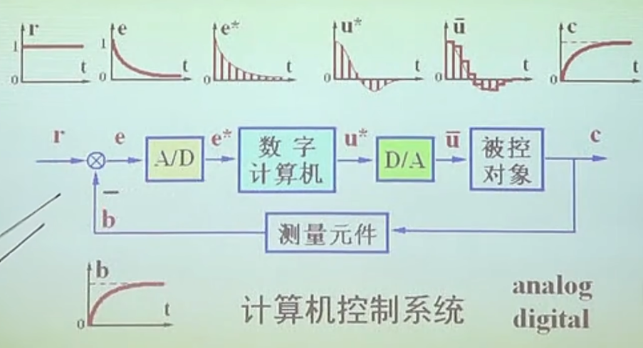

上图为计算机控制系统的结构图，每个信号的类型如下：

- **参考输入**（$r$）：连续形式的参考输入量；
- **反馈信号**（$b$）：连续形式的反馈信号；
- **控制误差**（$e$）：为参考输入与反馈信号的差，仍为连续信号；
- **离散误差**（$e^\star$）：通过A/D离散后获得的**离散信号**；
- **离散控制量**（$u^\star$）：数字计算机根据误差，计算出离散的控制量，仍为**离散信号**；
- **控制量**（$\bar u$）：通过D/A 将离散的控制量转换回**连续信号**，一般是通过零阶保持器（ZOH）实现；
- **输出量**（$c$）：实际被控对象的输出，为一连续的物理量。

### 优缺点

**优点**：

- **使用灵活**：控制计算由程序实现，便于修改，容易实现复杂的控制律。
  - 传统实现控制系统的方式是通过搭建专用的硬件电路，并且一旦电路制作完成，就无法修改。
- **扰干扰性强**：计算机信号为数字信号，不是高电平就是低电平，受噪声干扰小，而模拟信号直接受到噪声影响；
- **一机多用**：一台计算机可同时用于多个控制系统的控制器（通过分时复用的方法同时运行多个不同的控制算法）；
- **便于联网**：计算机可以进行网络通信，实现生产过程的自动化和宏观管理。

**缺点**：

- **精度稍低**：采样点间信号丢失，与相同条件下的连续系统相比，性能有所下降。
  - 补充：不过目前计算机的控制频率与量化精度都有显著提升，他的便利性基本弥补了精度与性能下降的问题。
- **需附加装置**：需要A/D，D/A转换装置。
  - 补充：A/D与D/A目前几乎所有的单片机（MCU）都有，如stm32，80c51等。

### A/D过程

**描述**：将连续的信号转换为离散的脉冲序列。

- **输入**：连续信号；
- **输出**：时间离散、数值离散的脉冲序列。
- **理想模型**：
  - **采样开关**：一个理想采样过程将使用使用一个理想采样开关表示。

  

    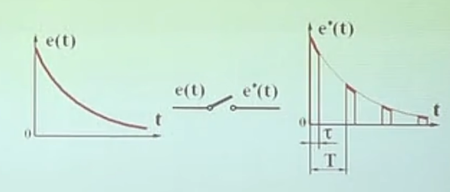
    
采样过程

  

  

    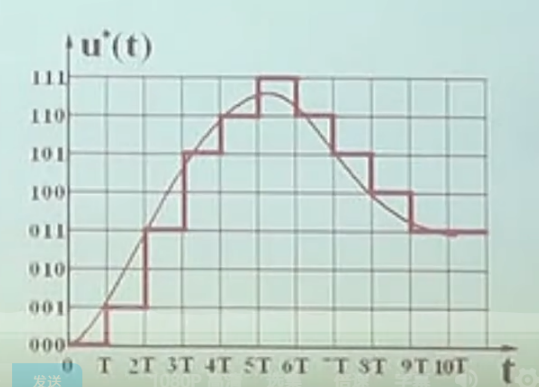
    
量化过程

  

A/D过程分为**三个步骤**（如上图所示）：

- **采样**：将信号某个确定时刻的值取出（保持的意思是大小不变）；
  - **时间上离散**：采样将连续信号在时间上离散；
  - **数值上连续**：采样得到的值仍然是连续的。
  - 补充：
    - 一般采样在物理上是通过电容实现的，把信号的电压存入电容中，并保持一段时间。
    - 一般采样与保持会统称为保持，保持定义如下。
- **保持**：保持采样的值不变，便于量化。
  - 因为量化过程较慢，保持时间不会超过一个A/D周期；
  - 下个A/D周期来临后，重新进行采样并保持。
- **量化**：将连续的采样值用离散的二进制表示。
  - **时间上离散**：采样后的信号时间上离散的，量化不改变这一点；
  - **数值上离散**：量化使得数值也发生离散。

> 采样有狭义与广义之分：
>
> - 狭义：指A/D过程中的采样，指将信号某个确定时间的值取出这个步骤。
> - 广义：提供整个A/D过程。
> - 总结：采样有时就指采样，有时指 采样 + 保持，有时指 采样 + 保持 + 量化。

**理想采样过程**：

- **引入原因**：

  - **实际采样存在误差**：实际A/D过程存在误差：无论是采样保持，还是量化，都会引入**误差**
    - **采样误差**：采样需要时间，而在采样过程，信号已经发生改变；
      - 虽然采样时间很短，但是物理上仍然不是一个时刻，而是一段时间。
    - **量化误差**：量化使得连续的值离散化，会导致信息损失。

  - **误差难以理论分析**：这两类误差难以纳入理论分析，所以选择简化，**直接忽略这两个误差**。

- **简化假设**：

  - 采样瞬间完成：忽略采样时间段内的信号变化，认为 $\tau \ll T$
  - 字长足够：忽略量化误差，认为 $e^\star(kT) = e(kT)$

> 补充：
>
> - 以现在的技术，这两个简化假设基本都满足，采样时间相对于采样周期来说已经非常小，并且，一般的单片机为16位或32位或更高，量化误差也非常小。

### 计算过程

**输入**：控制误差，离散的脉冲序列；

**输出**：控制量，离散的脉冲序列。

**理想模型**：表现为一个s域的传递函数 串联上一个采样开关（采样开关用于表达输出仍为离散信号）。

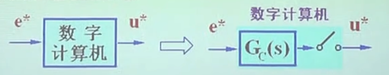

### D/A过程

**描述**：将离散的脉冲序列转换为时间连续的信号。

- **输入**：离散的脉冲序列；
- **输出**：连续的阶梯信号。

**零阶保持器**（ZOH，zero order holder）：为D/A的一种实现方式

- 将一个脉冲的数值保持一拍（一个周期）。
- 波形如下图所示。 

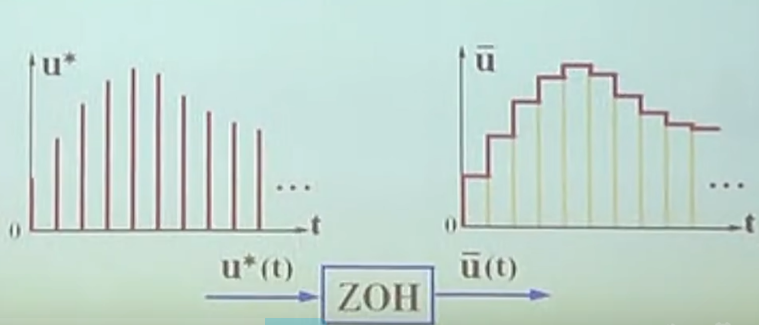

### 总结

计算机控制系统的**理想模型**，如上图所示：

- **A/D 过程**：一个采样开关；
- **计算机**：一个传递函数（s域）加上采样开关；
- **D/A 过程**：零阶保持器。
  - 说明：工程中最常用的为零阶保持器，但是D/A过程不只有零阶保持器一种实现方式。

# 信号的采样与保持

## 理想采样序列

**理想采样序列**$\delta_T(t)$ 定义：
$$
\delta_T(t) = \sum_{k=-\infin}^\infin \delta(t - k T)
$$
**其中**：

- $t$：时间变量；
- $k$：为普通常整数；
- $T$：采样周期。

**含义**：

- $\delta(t-kT)$ ：表示一个脉冲函数延时$k$个周期时间$T$，表示一个在第 $k T$ 时刻的一个脉冲；
- $k$ 从负无穷到正无穷求和：表示这是一个以周期时间 $T$ 为间隔，从远古至未来的一个脉冲序列。

## 理想采样信号

### 时域形式

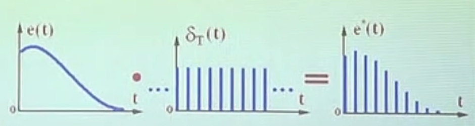

使用理想采样序列可以表达出**连续信号被采样后的时域表达式**（采样过程如上图所示）：
$$
\boxed{
{\large
\begin{align}
e^\star(t) 
&= e(t) \cdot \delta_T(t)  \\[1.3ex]
&= e(t) \cdot \sum_{k=-\infin}^\infin \delta(t - kT)  \\[1.3ex]
&= \sum_{k=-\infin}^\infin e(t) \, \delta(t - kT) 
\quad {\small\left(函数e(t)与求和变量k无关, 因而可以移动到求和号内\right)} \\[1.3ex]
&= \sum_{k=0}^\infin e(kT) \, \delta(t - kT)
\quad {\small\left(根据脉冲函数性质,e(t)可变为常量\right)} \\[1.3ex]
\end{align}
}
}
$$

- **其中**：

  - $e^\star(t)$：采样到的信号；

  - $e(t)$：被采样的原始连续信号。

- **说明**：
  - **左边项**：$e(n T)$ 表示**离散信号的大小**；
  - **右边项**：$\delta(t-kT)$ 表示**离散信号发生的时刻**。

### 拉氏变换

**采样信号的象函数**（作拉氏变换）：
$$
{\large \boxed{
\begin{align}
E^\star(s) 
=&  L\left[ e^\star(t) \right]  \\[1.3ex]
=&  L\left[ \sum_{k=0}^\infin e(kT) \, \delta(t - kT) \right] \\[1.3ex]
=& \sum_{k=0}^\infin e(kT) \, e^{-kTs}
\end{align}
}}
$$

---

**例1**

- **题目**：$e(t) = 1(t)$，求 $E^\star(s)$

- **解**：
  $$
  \begin{align}
  E^\star(s) 
  =& \sum_{k=0}^\infin 1 \cdot e^{-kTs} 
  \quad{\small(直接套用公式：E^\star(s) = \sum_{k=0}^\infin e(kT) \, e^{-kTs})} \\[1.3ex]  
  =& 1 + e^{-Ts} + e^{-2Ts} + \cdots \\[1.3ex]
  =& \frac{1}{1 - e^{-Ts}}  \quad(无穷级级数求和) \\[1.3ex]
  =& \frac{e^{Ts}}{e^{Ts} - 1}
  
  \end{align}
  $$

**例2**

- **题目**：$e(t) = e^{-at}$，求 $E^\star(s)$

- **解**：
  $$
  \begin{align}
  E^\star(s) 
  =& \sum_{k=0}^\infin e^{-akT} e^{-kTs}  \\[1.3ex]
  =& \sum_{k=0}^\infin e^{-k(a+s)T}  \quad(无穷级数求和，和上例一样的解法) \\[1.3ex] 
  =& \frac{1}{1 - e^{-(a+s)T}} \\[1.3ex]
  =& \frac{e^{Ts}}{e^{Ts} - e^{-aT}}
  \end{align}
  $$
  

### 傅氏变换

由于理想采样序列 $\delta_T(t) = \sum_{k=-\infin}^{\infin} \delta(t - kT)$ 是周期函数，可以展开为傅利叶级数：

- 设 理想采样序列用傅利叶级数表达为：
  $$
  \delta_T(t) = \sum_{k=-\infin}^{\infin} c_k \,e^{jk\omega_s t}
  $$

  - 其中：
    - $c_k$：为待定系数；
    - $\omega_s$：为采样角频率，$\omega_s = \frac{2 \pi}{T}$。

- 求解待定系数 $c_k$：
  $$
  \begin{align}
  c_k 
  &= \frac{1}{T} \int_{-\frac{T}{2}}^{\frac{T}{2}} \delta_T(t) 
  \cdot e^{-j \omega_s t} \text{d} t  \\[1.3ex]
  &= \frac{1}{T} \int_{-\frac{T}{2}}^{\frac{T}{2}} \delta(t) 
  \cdot e^{-j \omega_s t} \text{d} t
  \quad {\small (在-T/2到 T/2 之间只有一个脉冲) } \\[1.3ex]
  &= \frac{1}{T}
  \end{align}
  $$

- 因而，理想采样序列为：
  $$
  \delta_T(t) = \frac{1}{T}\sum_{k=-\infin}^{\infin}e^{-j k\omega_s t}
  $$

用理想采样序列采样，得到**理想采样信号**：

- 傅利叶级数形式：
  $$
  \begin{align}
  e^\star(t) 
  &= e(t) \cdot \delta_T(t) \\[1.3ex]
  &= e(t) \cdot \frac{1}{T} \sum_{k=-\infin}^{\infin} e^{-j k \omega_s t} \\[1.3ex]
  &= \frac{1}{T} \sum_{k=-\infin}^{\infin} e(t) \cdot e^{-j k \omega_s t}
  \end{align}
  $$

- 拉氏变换：
  $$
  \begin{align}
  L[e^\star(t)] 
  &= L[\frac{1}{T} \sum_{k=-\infin}^{\infin} e(t) \cdot e^{-j k \omega_s t}] \\[1.3ex]
  &= \frac{1}{T} \sum_{k=-\infin}^{\infin}E(s+k\omega_s j)
  \quad {\small (复位移定理)}
  \end{align}
  $$

- 傅利叶变换：
  $$
  \boxed{
  F[e^\star(t)] = \frac{1}{T} \sum_{k=-\infin}^{\infin} F(\omega +k\omega_s) 
  }\\
  {\small (\; F(\omega) = E(\omega j)\;)}  \\
  \quad {\small （将拉氏变换中的 s 用 \omega j 代替，同时去掉 j 使得虚轴变为实轴频率轴）} \\
  $$

  - 说明：
    - 上式表示**采样后的信号的频谱** 由 **原始信号的频谱** **构成**，
    - 并且 频率轴上每隔 $\omega_s$ ，原始信号的**频谱就会复现一次**（如下图所示）。

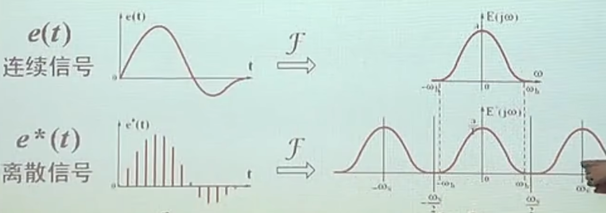

### 总结

- 理想采样信号的**拉氏变换形式**：
  $$
  \boxed{
  \large
  E^\star(s) = \sum_{k=0}^{\infin} e(kT) \cdot e^{-kTs}
  }
  $$

  - 给出了 $E^\star(s)$ 与 $e(t)$ 在采样点取值之间的关系；
  - 一般可写成封闭形式；
  - 用于求 $e^\star(t)$ 的z变换或系统的时间响应。

- 理想采样信号的**傅氏变换形式**：
  $$
  \boxed{
  \large
  E^\star(s) = \frac{1}{T} \sum_{k=-\infin}^{\infin} E(s +k\omega_s j) 
  }
  $$

  - 给出了 $E^\star(s)$ 与 $E(s)$ 之间的联系；
  - 一般不写成封闭形式；
  - 用于 $e^\star(t)$ 的频谱分析。

> **补充**：
>
> - **二者等价**：虽然两种变换方式得到结果表达式看起来很不一样，但是实际上等价，并且可以直接互相转化，不过需要一些复变函数的知识，这里省略，只知道二者可以互相推导即可。

## 香农采样定理

信号完全复现的必要条件：
$$
\boxed{\large
\omega_s \ge 2 \omega_h
}
$$

- 其中：$\omega_s$  为采样角频率，$\omega_s = 2 \pi f_s$，$\omega_h$ 为被采样信号的最大角频率；

- 即：**采样频率为信号最大频率的两倍以上**；

**另一种形式**：

- **奈奎斯特频率（Nyquist Frequency）**：采样角频率的一半$\dfrac{\omega_s}{2}$ 又称为奈奎斯特频率；
- **因而信号完全复现的必要条件为**：$\omega_h \le \omega_N = \dfrac{\omega_s}{2}$，即信号最大频率低于奈奎斯特频率（采样频率的一半）

**混叠（aliasing）**：

- 当信号最大频率超过奈奎斯特频率（采样频率的一半时）时（或者说采样频率小于信号最大频率的两部时），
- 则原始信号的频谱在以 $\omega_s$ 为周期重复时，会发生重叠，这个现象称为混叠，
- 此时再用理想滤波器过滤出 $-\omega_s$到 $\omega_s$ 之间 的信号，则构成的信号与原信号的频谱并不一致，发生失真。

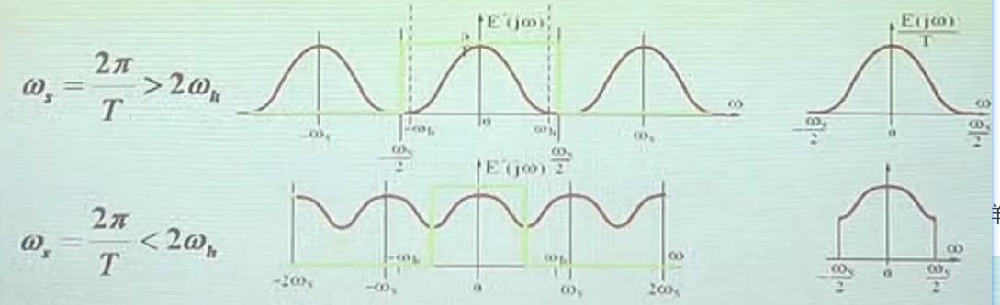

## 零阶保持器

**作用**：将脉冲信号保持一拍（一个采样周期）（如下图所示）

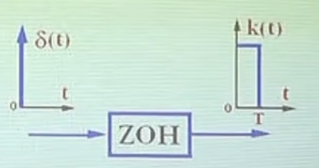

**传递函数**：

- 输入：脉冲信号 $\delta(t)$；

- 输出：$1(t) - 1(t - T)$；

- 求传递函数：
  $$
  \boxed{\large
  \begin{align}
  G_h(s) 
  =& \frac{L[1(t) - 1(t-T)]}{L[\delta(t)]} \\[1.3ex]
  =& \frac{\frac{1}{s} - \frac{1}{s} \cdot e^{-Ts}}{1} \\[1.3ex]
  =& \frac{1 - e^{-Ts}}{s}
  \end{align}
  }
  $$

**频率响应特性**：

- 将传递函数中的 $s$ 用 $j \omega$ 代替，得：
  $$
  G_h(j \omega) = \frac{1 - e^{-T \omega j}}{\omega j}
  $$

- 进一步转换：
  $$
  \begin{align}
  G_h(j \omega) 
  =& \frac{1 - e^{-T \omega j}}{\omega j}  \\[1.3ex]
  =& \frac{e^{\frac{T}{2}\omega j} - e^{-\frac{T}{2}\omega j}}{\omega j}
  \cdot  e^{-\frac{T}{2}\omega j} 
  \quad {\small (分子提取因子e^{-\frac{T}{2} \omega j})}\\[1.3ex]
  =& \frac{2 \sin(\frac{T}{2} \omega) j}{\omega j} \cdot e^{-\frac{T}{2}\omega j}
  \quad {\small (分子使用欧拉公式)}
  \\[1.3ex]
  =& T \cdot \frac{\sin(\frac{T}{2} \omega) j}{\frac{T}{2} \omega j} \cdot e^{-\frac{T}{2}\omega j}
  \quad {\small (分子的系数2移动到分母，同时分母上添加系数 T)} \\[1.3ex]
  =& T \cdot \frac{\sin(\frac{T}{2} \omega)}{\frac{T}{2} \omega} 
  \cdot e^{-\frac{T}{2}\omega j}\\[1.3ex]
  \end{align}
  $$

- 将采样频率 $\omega_s = \frac{2 \pi}{T}$  （$T = \frac{2 \pi}{\omega_s}$）代入上式：
  $$
  \begin{align}
  G_h(j\omega)
  =& T \cdot \frac{\sin(\frac{T}{2} \omega)}{\frac{T}{2} \omega} 
  \cdot e^{-\frac{T}{2}\omega j}\\[1.3ex]
  =& \frac{2 \pi}{\omega_s} \cdot \frac{\sin(\frac{\omega}{\omega_s} \pi)}{\frac{\omega}{\omega_s}\pi} 
  \cdot e^{-\frac{\omega}{\omega_s}\pi j} \\[1.3ex]
  \end{align}
  $$

- 引入sinc函数（辛格函数），$\text{sinc}(x) = \frac{\sin(x)}{x} $：
  $$
  \boxed{\large
  G_h(j\omega) = \frac{2\pi}{\omega_s} \text{sinc}(\frac{\omega}{\omega_s} \pi) \cdot e^{-\frac{\omega}{\omega_s} \pi j}
  }
  $$

  - 左边项为**幅频特性**：$A(\omega) = \frac{2 \pi}{\omega_s} \text{sinc}(\frac{\omega}{\omega_s} \pi)$，为根据采样频率拉伸后的sinc函数；
  - 右边项为**相频特性**：$\ang G(\omega) = -\frac{\omega}{\omega_s} \pi$，为斜率为负的直线，当 $\omega = \omega_s$ 时，相角为 $\pi$。

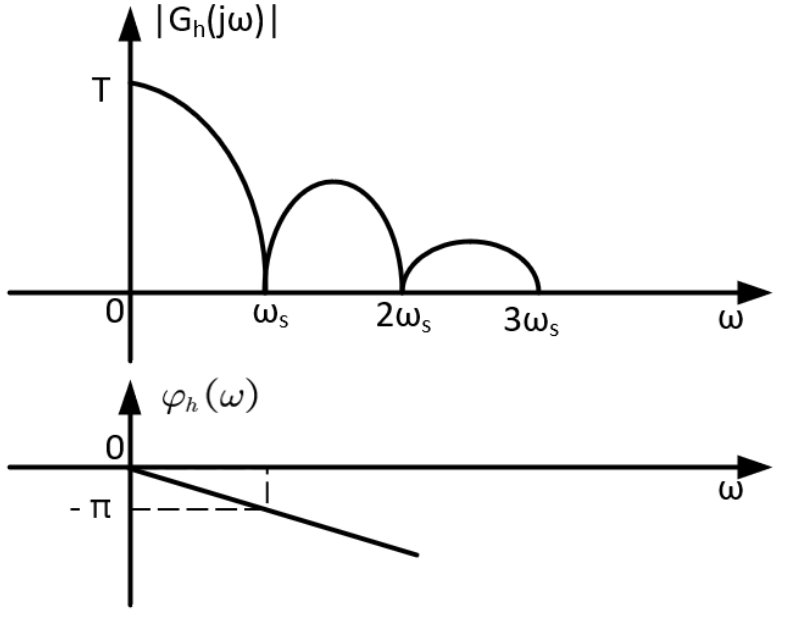

**近似传递函数**：

- **半拍延时**：零阶保持器可以近似简化为半个采样周期的延时
  $$
  \begin{align}
  G_h(s) 
  =& \frac{1 - e^{-Ts}}{s} \\[1.3ex]
  =& e^{\frac{Ts}{2}}
  \end{align}
  $$
  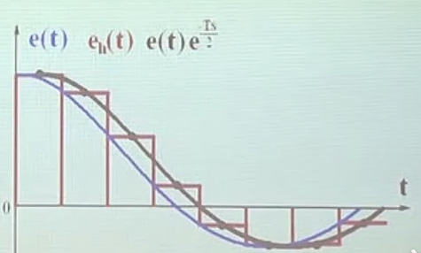

# z变换

## z变换定义

回顾采样信号的拉氏变换：
$$
E^\star(s) = \sum_{k=0}^{\infin} e(kT) \cdot e^{-kTs}
$$
令 $z = e^{-Ts}$，得获得关于变量 $z$ 的传递函数：
$$
E(z) = \sum_{k=0}^{\infin} e(kT) \cdot z^{-k}
$$
因而z变换定义为：
$$
\boxed{\large
\begin{align}
E(z) 
=& Z[e^\star(t)] = E^\star(s)\vert_{z=e^{-Ts}}  \\[1.3ex]
=& \sum_{k=0}^{\infin} e(kT)\cdot  z^{-k}
\end{align}
}
$$
其中：

- $e^\star(s)$：称为原像；
- $E(z)$：称为像函数。

> **说明**：
>
> - **z变换只是变量代换**：z变换**并不是一个新的数学定义**，只是一个变量代换，其本质仍然是传递函数，不会是离散信号的传递函数，普通信号当然也可以z变换，不过没有意义，并且也很麻烦。
>
> **注意**：
>
> - $E(z)$ 对应唯一的 $e^\star(t)$，但是不对应唯一的 $e(t)$，
> - 因为理论上有无数种可能的$e(t)$ 会采样得到相同的 $e^\star(t)$。

**综合比较**采样的各种形式：

- **时域形式**：
  $$
  e^\star(t) = \sum_{k=0}^{\infin} e(kT) \cdot \delta(t - kT)
  $$

- **拉氏变换形式**：
  $$
  E^\star{s} = \sum_{k=0}^{\infin} e(kT)\cdot e^{-kTs}
  $$

- **z变换形式**：
  $$
  E(z) = \sum_{k=0}^{\infin} e(kT) \cdot z^{-k}
  $$
  

## 正向z变换

工程中，一般并不会根据z变换的定义式来计算z变换，而是采用如下三种方法：

- 级数求和法；
- 查表法；
- 留数法。

### 级数求和法

（此方法仍然算使用定义法，这里只是举几个例子加深对z变换的理解）

**例1**：

- 题目：$e(t) = a^{\frac{t}{T}}$，求 $E(z)$

- 解：
  $$
  \begin{align}
  E(z) 
  =& \sum_{k=0}^{\infin}a^k \cdot z^{-k} \\[1.3ex]
  =& \sum_{k=0}^{\infin}(a\cdot z^{-1})^k  \\[1.3ex]
  =& \frac{1}{1 - \frac{a}{z}} \\[1.3ex]
  =& \frac{z}{z - a}
  \end{align}
  $$

**例2**：

- 题目：$e(t) = \sin(\omega t)$，求 $E(z)$

- 解：
  $$
  \begin{align}
  E(z) 
  =& \sum_{k=0}^{\infin} \sin(kT\omega) \cdot z^{-k}  \\[1.3ex]
  =& \sum_{k=0}^{\infin} \frac{1}{2j} \left( e^{j kT\omega} - e^{-j kT\omega}\right)
  \cdot z^{-k}
  \quad {\small (欧拉公式)}\\[1.3ex]
  =& \frac{1}{2j}\left[\sum_{k=0}^{\infin} (e^{j kT\omega}z^{-1} )^k
  - \sum_{k=0}^{\infin} (e^{- jT\omega}z^{-1})^{k}\right] \\[1.3ex]
  =& \frac{1}{2j} \left( \frac{1}{1 - e^{j T\omega}z^{-1}} 
  - \frac{1}{1 - e^{- j T\omega}z^{-1}}\right) 
  \quad {\small(级数求和)} \\[1.3ex]
  =& \frac{1}{2j} \left( \frac{z}{z - e^{j T\omega}} 
  - \frac{z}{z - e^{- j T\omega}}\right) \\[1.3ex]
  =& \frac{1}{2j}
  \frac{z^2 - z e^{-j T\omega} - z^2 + ze^{j T\omega}}{z^2 + 1 - z(e^{j T\omega} + e^{-j T\omega})} 
  \quad {\small(通分)}\\[1.3ex]
  =& \frac{1}{2j}
  \frac{ z (e^{j T\omega}-e^{-j T\omega}) }{z^2 + 1 - z(e^{j T\omega} + e^{-j T\omega})}
  \\[1.3ex]
  =& \frac{1}{2j}
  \frac{ z 2j \sin(\omega T) }{z^2 + 1 - z2\cos(\omega T)}
  \quad {\small (再次使用欧拉公式)}
  \\[1.3ex]
  =& \frac{ \sin(\omega T) z }{z^2 - 2\cos(\omega T)\cdot z + 1 }
  \end{align}
  $$
  

**例3**：

- 题目：$e(t) = t$，求 $E(z)$

- 解：
  $$
  \begin{align}
  E(z) 
  =& \sum_{k=0}^{\infin} k T \cdot z^{-k}\\[1.3ex]
  =& z T \sum_{k=0}^{\infin}k z^{-k-1} 
  \quad {\small(提取公因子 z)} \\[1.3ex]
  =& -z T \frac{\text{d}}{\text{d}t}\sum_{k=0}^{\infin}z^{-k} 
  \quad {\small(这里提出幂次导数时，要加负号)}\\[1.3ex]
  =& -z T \frac{\text{d}}{\text{d}t}\left(\frac{1}{1 - z^{-1}} - 1\right)  
  \quad {\small(这里注意求和首项为z^{-1}而非z^{0}，因而多减去1)}\\[1.3ex]
  =& -z T \frac{\text{d}}{\text{d}t} \frac{1}{z - 1} \\[1.3ex]
  =& -z T \frac{-1}{(z-1)^2} \\[1.3ex]
  =& \frac{Tz}{(z-1)^2}
  \end{align}
  $$

### 查表法

**常用函数的z变换**：

|       e(t)        |                           E(z)                            |              E(s)               |
| :---------------: | :-------------------------------------------------------: | :-----------------------------: |
|    $\delta(t)$    |                            $1$                            |               $1$               |
|      $1(t)$       |                     $\dfrac{z}{z-1}$                      |         $\dfrac{1}{s}$          |
|   $\delta_T(t)$   |                     $\dfrac{z}{z-1}$                      |                -                |
|        $t$        |                   $\dfrac{Tz}{(z-1)^2}$                   |        $\dfrac{1}{s^2}$         |
| $a^{\frac{t}{T}}$ |                     $\dfrac{z}{z-a}$                      | $\dfrac{1}{s-\frac{1}{T}\ln a}$ |
|     $e^{at}$      |                 $\dfrac{z}{z - e^{-aT}}$                  |        $\dfrac{1}{s+a}$         |
|  $\sin \omega t$  |   $\dfrac{z \sin\omega T}{z^2 - 2\cos(\omega T) z +1}$    |   $\dfrac{1}{s^2 + \omega^2}$   |
|  $\cos \omega T$  | $\dfrac{z(z - \cos\omega T)}{z^2 - 2\cos(\omega T) z +1}$ |  $\dfrac{s^2}{s^2 + \omega^2}$  |

**例1**：

- 题目：已知 $E(s) = \frac{1}{(s+a)(s+b)}$，求 $E(z)$
- 解：

  - 首先将 $E(s)$ 分解：
    $$
    \begin{align}
    E(s) 
    =& \frac{1}{(s+a)(s+b)} \\[1.3ex]
    =& \frac{1}{a-b}\left(\frac{1}{s+a} - \frac{1}{s+b}\right)
    \end{align}
    $$
    
  - 进行拉氏反变换，得到原始时域信号：
    $$
    e(t) = \frac{1}{a - b} \left(e^{-at} - e^{-bt} \right)
    $$
  
  - 查表进行z变换：
    $$
    Z[e^{-at}] = \frac{z}{z - e^{-aT}} \\[1.3ex]
    Z[e^{-bt}] = \frac{z}{z - e^{-bt}}
    $$
  
  - 因而：
    $$
    E(z) = \frac{1}{a - b}\left(\frac{z}{z - e^{-at}} - \frac{z}{z - e^{-bt}}\right)
    $$

### 留数法

留数法（反演积分法）：
$$
\boxed{\large
E(z) = \sum_{i=1}^l\text{Res}\left[E(s) \frac{z}{z - e^{Ts}}\right]_{s=s_i}
}
$$
其中：

- $l$：为 $E(s)$ 极点个数。

**例1**：

- 题目：$E(s) = \dfrac{s(2s+3)}{(s+1)^2(s+2)}$，求 $E(z)$

- 解：

  - $E(s)$ 共有两个留数，因而：
    $$
    E(z) =
    \underset{s=-1}{\text{Res}}\left[E(s)\frac{z}{z-e^{Ts}}\right] 
    +\underset{s=-2}{\text{Res}}\left[E(s)\frac{z}{z-e^{Ts}}\right]
    $$

  - 计算第一个留数：
    $$
    \begin{align}
     & \underset{s=-1}{\text{Res}}\left[E(s)\frac{z}{z-e^{Ts}}\right]  \\[1.3ex]
    =& \frac{1}{}
    \end{align}
    $$
    

## z变换定理

### 线性性质

**线性性质**：
$$
\boxed{\large
\begin{align}
 & Z[a \cdot e_1^\star(t) \pm b \cdot e_2^\star(t)] \\[1.3ex]
=& a \cdot Z[e^\star(t)] \pm b \cdot Z[e_2^\star(t)]  \\[1.3ex]
=& a \cdot E_1(z) \pm b \cdot E_2(z)]
\end{align}
}
$$

### 实位移定理

#### 延时定理

**定理**：
$$
\boxed{\large
Z[e(t - nT)] = z^{-n} E(z)
}
$$
**证明**：
$$
\begin{align}
Z[e(t-nT)] 
=& \sum_{k=0}^{\infin} e(kT-nT) z^{-k} \\[1.3ex]
=& \sum_{i=-n}^{\infin} e(iT) z^{-i-n}  
\quad {\small(变换代换，令 i = k - n)} \\[1.3ex]
=& \sum_{i=0}^{\infin} e(iT) z^{-i} \cdot z^{-n}
\quad {\small(i<0时，e(i) = 0，因而求和下限为i=0)} \\[1.3ex]
=& z^{-n} \sum_{i=0}^{\infin} e(iT) z^{-i}
\quad {\small(n与求和变量i无关，提出到求和号外)} \\[1.3ex]
=& z^{-n} E(z)

\end{align}
$$

#### 超前定理

**定理**：
$$
\boxed{\large
Z[e(t+nT)] = z^n \left[ E(z) - \sum_{k=0}^{n-1} e(kT)z^{-k} \right]
}
$$
**证明**：
$$
\begin{align}
Z[e(t+nT)]
=& \sum_{k=0}^{\infin} e(kT + nT) z^{-k}  \\[1.3ex]
=& \sum_{i=n}^{\infin} e(i T) z^{-i+n} 
\quad {\small(进行变换代换，令 i = k+n)} \\[1.3ex]
=& z^n \left [\sum_{i=0}^{\infin} e(iT) z^{-i} - \sum_{i=0}^{n-1}e(iT)z^{-i}\right]
\quad {\small(提出z^n，并将求和项补至i=0)} \\[1.3ex]
=& z^n \left[E(z) - \sum_{k=0}^{n-1}e(kT)z^{-k}\right]
\end{align}
$$

#### 示例

**例1**：

- 题目：$e(t) = t -T$ ，求 $E(z)$

- 解：
  $$
  \begin{align}
  E(z) 
  =& z^{-1} Z[t] \\[1.3ex]
  =& z^{-1} \frac{Tz}{(z-1)^2}  \\[1.3ex]
  =& \frac{T}{(z-1)^2}
  \end{align}
  $$

**例2**：

- 题目：$e(t) = t +2T$，求 $E(z)$

- 解：
  $$
  \begin{align}
  E(z) 
  =& z^2 \left\{Z[t] - e(0)\cdot z^0 - e(T)\cdot z^{-1} \right\} \\[1.3ex]
  =& z^2 \left[ \frac{Tz}{(z-1)^2} - 0 - \frac{T}{z} \right] \\[1.3ex]
  =& z^2 \left\{ \frac{T\left[z^2 - (z-1)^2\right]}{(z-1)^2 z}\right\} \\[1.3ex]
  =& z^2 \left[ \frac{T(2z-1)}{(z-1)^2 z}\right] \\[1.3ex]
  =&  \frac{Tz(2z-1)}{(z-1)^2} \\[1.3ex]
  \end{align}
  $$

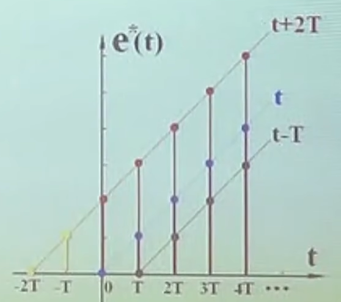

### 复位移定理

**定理**：
$$
\boxed{\large
Z[e(t)\cdot e^{\mp at}]
= E[z \cdot e^{\pm aT}]
}
$$
**证明**：
$$
\begin{align}
Z[e(t)\cdot e^{\mp at}] 
=& \sum_{k=0}^{\infin} e(kT) e^{\mp akT} z^{-k} \\[1.3ex]
=& \sum_{k=0}^{\infin} e(KT) (e^{\pm aT}z)^{-k}  \\[1.3ex]
=& E(z \cdot e^{\pm aT})
\end{align}
$$
**例1**：

- 题目：$e(t) = t \cdot e^{-at}$，求 $E(z)$

- 解：
  $$
  \begin{align}
  E(z) = \frac{Tz\cdot e^{aT}}{(z\cdot e^{aT} -1 )^2}
  \end{align}
  $$

### 初值定理

**定理**：
$$
\boxed{\large
\lim_{k\to 0} e(kT) = \lim_{z\to\infin}E(z)
}
$$
**证明**：
$$
\begin{align}
\lim_{z\to\infin} E(z) 
=& \lim_{z\to\infin}\left[ \sum_{k=0}^{\infin} e(kT) z^{-k} \right] \\[1.3ex]
=& \lim_{z\to\infin}\left[e(0T) + e(T)\cdot z^{-1} + e(2T) \cdot z^{-2} + \cdots\right]\\[1.3ex]
=& e(0) 
\quad {\small(\lim_{z\to\infin} z^{-1} = 0, \lim_{z\to\infin} z^{-2} = 0, \cdots)}
\end{align}
$$
**例1**：

- **题目**：

  - **已知**：

  $$
  E(z) = \frac{0.792 \cdot z^2}{(z-1)[z^2]- 0.461 z + 0.208}
  $$

  - **求**：$e(0)$

- **解**：
  $$
  e(0) = \lim_{z\to\infin} E(z) = 0
  $$
  

### 终值定理

**定理**：
$$
\boxed{\large
\lim_{n\to\infin} e(kT) = \lim_{z\to1}(z-1)E(z)
}
$$
**证明**（暂时没弄明白，没证明好）：
$$
\begin{align}
\lim_{z\to1} (z-1)E(z)
=& \lim_{z\to1} \left[ z \sum_{k=0}^{\infin}e(kT)z^{-k} - \sum_{k=0}^{\infin}e(kT)z^{-k} \right] \\[1.3ex]	 
=& \lim_{z\to1} \left[\sum_{k=0}^{\infin}e(kT)z^{-k+1} - \sum_{k=0}^{\infin}e(kT)z^{-k} \right]  \\[1.3ex]
=& \lim_{z\to1} \left[( e(0)z^1 + e(T)z^0+ e(2T)z^{-1}\cdots) 
- ( e(0)z^0 + e(T)z^{-1} + e(2T)z^{-2} +\cdots ) \right]\\[1.3ex]
=& \lim_{z\to1} \left[ e(0)z^1 + [e(T)-e(0)]z^0 + [e(2T) - e(T)]z^{-1} + \cdots \right] \\[1.3ex]
=& e(0)z + \sum_{k=0}^{\infin}[e(kT+T)-e(kT)] z^{-k}  \\[1.3ex]
=& e(0)z + Z[e(t+T)-e(t)]

\end{align}
$$

### 卷积定理(未完成)

定理（未完成）：

- 设：
  $$
  c^\star(t) = e^\star(t)*g^\star(t) = \sum_{n=0}^{\infin} e(nT)\cdot g[(k-n)t]
  $$
  
- 则：

证明：

## 反向z变换

反向z变换有三种方法：

-  长除法；

- 查表法；

- 留数法：
  $$
  \boxed{\large
  e(kT) = \sum \text{Res}\left[E(z)\cdot z^{k-1}\right]
  }
  $$

### 长除法

**例1**：

- **题目**：$E(z) = \dfrac{10z}{(z-1)(z-2)}$，求 $e^\star(t)$

- **解**：

  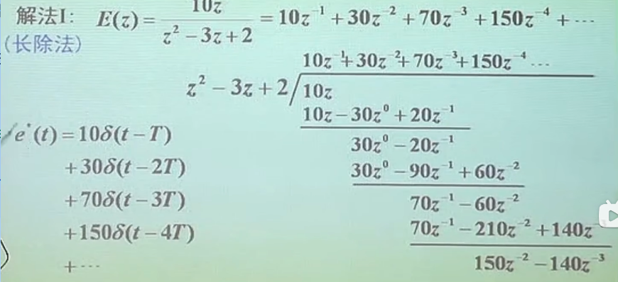

  

### 查表法

**例1**：

- **题目**：$E(z) = \dfrac{10z}{(z-1)(z-2)}$，求 $e^\star(t)$

- **解**：
  $$
  \begin{gather}
  \begin{aligned}
  \frac{E(z)}{z} 
  =& \frac{10}{(z-1)(z-2)} \\[1.3ex]
  =& 10\left(\frac{1}{z-2} - \frac{1}{z-1}\right)
  \end{aligned}
  
  \\[1.5ex]{\large\Downarrow}\\[1.5ex]
  
  E(z) 
  = 10 \left(\frac{z}{z-2} - \frac{z}{z-1}\right)
  
  \\[1.5ex]{\large\Downarrow}\\[1.5ex]
  
  \begin{aligned}
  e(t) 
  =& 10 \left(2^{\frac{t}{T}} - 1^{\frac{t}{T}} \right) \\[1.3ex]
  =& 10 (2^{\frac{t}{T}} - 1)
  \end{aligned}
  
  \\[1.5ex]{\large\Downarrow}\\[1.5ex]
  
  e^\star(t) = \sum_{k=0}^{\infin} 10 (2^{k}-1) \cdot \delta(t- kT)
  \end{gather}
  $$

**例2**：

- **题目**：$E(z) = \dfrac{z^2}{(z-0.8)(z-0.1)}$，求 $e^\star(t)$

- **解**：

  - 求 $\dfrac{E(z)}{z}$：
    $$
    \begin{align}
    \frac{E(z)}{z} 
    =& \frac{z}{(z-0.8)(z-0.1)} \\[1.3ex]
    =& \frac{8}{7}\frac{1}{z-0.8} - \frac{1}{7}\frac{1}{z-0.1}
    
    \end{align}
    $$

  - 得到 $E(z)$：
    $$
    \begin{align}
    \frac{E(z)}
    =& \frac{8}{7}\frac{z}{z-0.8} - \frac{z}{7}\frac{1}{z-0.1}
    
    \end{align}
    $$

  - 查表，进行反变换：
    $$
    e(t) = \frac{8}{7} 0.8^{\frac{t}{T}} - \frac{1}{7} 0.1^{\frac{t}{T}}
    $$

  - 因而采样信号 $e^\star(t)$ 为：
    $$
    e^\star(t) = \sum_{k=0}^{\infin} \frac{1}{7}(8 \cdot 0.8^k - 0.1^k)\delta(t- kT)
    $$
    

### 留数法

**例1**：

- **题目**：$E(z) = \dfrac{10z}{(z-1)(z-2)}$，求 $e^\star(t)$

- **解**：

  - 根据留数法，原连续信号为：
    $$
    e(kT) = \sum \text{Res}\left[E(z)\cdot z^{k-1}\right]
    $$

  - 第一个留数：
    $$
    \begin{align}
      \lim_{z\to1} \left[(z-1)\frac{10z}{(z-1)(z-2)}z^{k-1}\right] 
    = -10
    \end{align}
    $$

  - 第二个留数：
    $$
    \lim_{z\to2} \left[(z-2)\frac{10z}{(z-1)(z-2)}z^{k-1}\right] = 10 \cdot 2^n
    $$

  - 因而连续信号为：
    $$
    \begin{align}
    e(nT) 
    =& -10 + 10 \cdot 2^k \\[1.3ex]
    =& 10(2^{k} - 1)
     \end{align}
    $$

  - 采样信号为：
    $$
    e^\star(t) = \sum_{k=0}^{\infin}10(2^k-1)\cdot \delta(t-kT)
    $$

**例2**：

- **题目**：$E(z) = \dfrac{z^2}{(z-0.8)(z-0.1)}$，求 $e^\star(t)$

- **解**：

  - 第一个留数：
    $$
    \lim_{z=0.8} \left[(z-0.8)\frac{z^2}{(z-0.8)(z-0.1)}z^{k-1} \right] 
    = \frac{0.8^{k+1}}{0.7}
    = \frac{8}{7} 0.8^k
    $$

  - 第二个留数：
    $$
    \lim_{z=0.1} \left[(z-0.1)\frac{z^2}{(z-0.8)(z-0.1)}z^{k-1} \right] 
    = \frac{0.1^{k+1}}{-0.7}
    = -\frac{1}{7} 0.1^k
    $$

  - 因而连续信号 $e(kT)$ 为：
    $$
    e(kt) = \frac{8}{7} 0.8^k - -\frac{1}{7} 0.1^k
    $$

  - 采样信号 $e^\star(t)$ 为：
    $$
    e^\star(t) = \sum_{k=0}^{\infin}\frac{1}{7}(8\cdot 0.8^k - 0.1^k)\delta(t- kT)
    $$

**例3**：

- **题目**：$E(z) = \dfrac{5}{(z-a)^2}$，求 $e^\star(t)$

- **解**：

  - 连续信号：
    $$
    \begin{align}
    e(nT) 
    =& \frac{1}{(2-1)!} \lim_{z-\to a} \frac{\text{d}}{\text{d}z}
    \left[(z-a)^2 \frac{5}{(z-a)^2} z^{k-1}\right] \\[1.3ex]
    =& \lim_{z\to a}5 (k-1)z^{k-2} \\[1.3ex]
    =& 5(k-1)a^{k-2}
    \end{align}
    $$

  - 采样信号：
    $$
    e^\star(t) = \sum_{k=0}^{\infin} 5(k-1)a^{k-2}\delta(t-  kT)
    $$

# 离散系统的数学模型

## 差分方程

### 差分定义

**前向差分**：

- **1阶前向差分**：$\Delta e(k) = e(k+1) - e(k)$；

- **2阶前向差分**：$\Delta^2 e(k) = \Delta e(k+1) - \Delta e(k) = e(k+2) - 2e(k+1) +　e(k)$；

- **ｎ阶前向差分**：
  $$
  \begin{align}
  \Delta^n e(k) 
  =& \Delta^{n-1}e(k+1)-\Delta^{n-1}e(k) \\[1.3ex]
  =& e(k+n) - a_1 e(k+n-1) + \cdots + a_{n-1} e(k+1) + a_n e(k)
  \end{align}
  $$

**后向差分**：

- **1阶后向差分**：$\nabla e(k) = e(k) - e(k-1)$；

- **2阶后向差分**：$\nabla^2 e(k) = \nabla e(k) - \nabla e(k-1) = e(k) - 2e(k-1) + e(k)$；

- **n阶后向差分**：
  $$
  \begin{align}
  \nabla^n e(k) 
  =& \nabla^{n-1} e(k) - \nabla^{n-1} e(k-1) \\[1.3ex]
  =& e(k) + a_1 e(k-1) + \cdots + a_{n-1} e(k-n+1) + a_{n} e(k-n)
  \end{align}
  $$

> 补充：
>
> - 微分与差分的关系：$\lim_{T\to0}\frac{\Delta e(k)}{T} = \frac{\text{d}e(t)}{\text{d}t}$

### 差分方程

n阶线性定常离散系统**前向差分方程**：
$$
\begin{align}
 & c(k+n)+a_1(k+n-1)+a_2(k+n-2) + \cdots + a_{n-1}c(k+1) + a_n c(k)  \\[1.3ex]
=& b_0 r(k+m) + b_1 r(k+m-1) + \cdots + b_{m-1} c(k+1) + b_m c(k)
\end{align}
$$
其中：

- $c(k)$：输出脉冲；
- $r(k)$：输入脉冲；

- $a_n$：输出脉冲的系数，为常数；
- $b_n$：输入脉冲的系数，为常数。

n阶线性定常离散系统**后向差分方程**：
$$
\begin{align}
 & c(k) + a_1 c(k-1) + a_2 c(k-2) + \cdots + a_{n-1} c(k-n+1) + a_n c(k) \\[1.3ex]
=& b_0 r(k-n+m) + b_1 r(k-n+m-1) + \cdots + b_{m-1}e(k-n+1) + b_m e(k-n)
\end{align}
$$

### 差分方程解法

（这里以一个例子演示差分方程的两种解法：**迭代法** 与 **z变换法**）

**题目**：

- 已知连续系统的微分方程：
  $$
  \begin{cases}
  \ddot e(t) - 4 \dot e(t) + 3 e(t) = r(t) \\[1.3ex]
  e(t) = 0 \qquad ( t\le 0)
  \end{cases}
  $$

- 求：

  - 将系统离散化（采样周期 $T=1$），求系统相应的前向差分方程；
  - 当输入为阶跃输入时（$r(t) = 1(t)$），求输出的脉冲序列。

**解**：

- **系统离散化**：

  - 离散一阶微分：

  $$
  \dot e(t) = \frac{\Delta e(k)}{T} = \frac{e(k+1) - e(k)}{T} = e(k+1) - e(k)
  $$

  - 离散二阶微分：

  $$
  \ddot e(t) = \frac{\Delta^2 e(k)}{T} = \frac{\frac{\Delta e(k+1)}{T} - \frac{\Delta e(k)}{T}}{T} = e(k+2) - 2 e(k+1) + e(k)
  $$

  - 将上两式代入系统微分方程：
    $$
    \begin{gather}
    \ddot e(t) - 4\dot e(t) + e 3(t) = r(t) \\[1.3ex]
    {\large \Downarrow}\\[1.3ex]
    \begin{aligned}
    e(k+2) - 2e(k+1) + e(k) - 4[e(k+1) - e(k)] + 3e(k) &= r(k)  \\[1.3ex]
    e(k+2) - 6 e(k+1) + 8e(k) &= r(k)
    \end{aligned}
    
    \end{gather}
    $$

  - 获得离散后和系统差分方程（前向差分）：
    $$
    \begin{cases}
    e(k+2) - 6 e(k+1) + 8e(k) = r(k)  \\[1.3ex]
    r(k) = 0 \qquad(k\le 0)
    \end{cases}
    $$

- **求解系统输出**：

  - **迭代法**：

    - 将系统差分方程称项：将最后项（时间上）移到等号一侧，其他项移动到等号另一侧，得
      $$
      e(k+2) = 6 e(k+1) - 8 e(k) + r(k)
      $$

    - 求解 $e(1)$： 令 $k=-1$，$r(k) = 1(k)$，可解得 $e(1)$
      $$
      \begin{align}
      e(1) 
      =& 6 e(0) - 8e(-1) + 1(-1)  \\[1.3ex]
      =& 6 \cdot 0 - 8 \cdot 0 + 0  
      \quad {\small\left(\;e(0) = 0, e(-1) = 0, 1(-1)=0\;\right)} \\[1.3ex]
      =& 0
      \end{align}
      $$

    - 求解 $e(2)$：令 $k=0$，可得
      $$
      \begin{align}
      e(2) 
      =& 6 e(1) - 8e(0) + 1(0) \\[1.3ex]
      =& 6 \cdot 0 - 8 \cdot 0 + 1 \\[1.3ex]
      =& 1
      \end{align}
      $$

    - 求解 $e(3)$，令 $k=1$，可得：
      $$
      \begin{align}
      e(3) 
      =& 6e(2) - 8e(1) + 1(1) \\[1.3ex]
      =& 6 - 0 + 1  \\[1.3ex]
      =& 7
      \end{align}
      $$

    - 求解 $e(4)$，令 $k=2$，可得：
      $$
      \begin{align}
      e(4) 
      =& 6 e(3) - 8e(2) + 1(2)  \\[1.3ex]
      =& 6 \cdot 7 - 8 \cdot 1 + 1  \\[1.3ex]
      =& 35
      \end{align}
      $$

    - 递增 $k$ 的值，一值迭代下去，可得系统输出信号为：
      $$
      e^\star(t) = \delta(t-2) + 6\,\delta(t-3) + 35\,\delta(t-4) \cdots1
      $$

  - **z 变换法**：

    - 对系统差分方程两侧作 z变换：
      $$
      \begin{gather}
      e(k+2) - 6 e(k+1) + 8e(k) = 1(t)
      
      \\[1.3ex]{\large \Downarrow}\\[1.3ex]
      
      \begin{aligned}
      z^2 \left[  E(z) - e(1)z^{-1} - e(0)\right] - 6z[E(z) - e(0)] + 8 E(z) 
      &= \frac{z}{z - 1}  \\[1.3ex]
      
      z^2 E(z) - 6 z E(z) + 8 E(z) 
      &= \frac{z}{z - 1}  \\[1.3ex]
      
      (z^2 - 6z + 8) E(z)
      &= \frac{z}{z - 1}  \\[1.3ex]
      
      E(z)
      =& \frac{z}{(z-2)(z-4)(z-1)}
      
      \end{aligned}
      
      \end{gather}
      $$
  
    - 使用查表法对 $E(z)$ 作反变换：
      $$
      \begin{gather}
      E(z) 
      = \frac{1}{3}\frac{z}{z-1} - \frac{1}{2} \frac{z}{z-2} + \frac{1}{6}\frac{z}{z-4}
      
      \\[1.3ex]{\large \Downarrow}\\[1.3ex]
      
      e(t) = \frac{1(t)}{3} - \frac{2^\frac{t}{T}}{2} + \frac{4^\frac{t}{T}}{6}
      
      \end{gather}
      $$
      

> 说明：
>
> - 这里离散化的系统与原连续系统**并不等价**：即离散化的系统与原连续系统的频率响应并不相同，因此引入误差；
> - 有更好的方法：实际上将连续系统离散化（一般是将连续传递函数转化为离散传递函数）有更多的方法，工程上常用的是双线性变换，又称**tustin变换**。

## 脉冲传递函数

### 定义

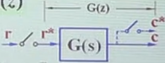

- **定义**：零初始条件下，离散系统**输出信号的z变换** 与 **输入信号的z变换** 之比

- **输出信号的z变换**：

  - 脉冲响应函数 $g(t)$：连续系统受到单位脉冲后（一个脉冲）的响应为 $g(t)$

  - 当受到脉冲序列（多个脉冲，固定周期）时，系统响应为：
    $$
    \begin{gather}
    c(t) = \sum_{k=0}^{\infin}g(t - kT)r(kT)  \\[1.3ex]
    {\large \Downarrow}  \\[1.3ex]
    \quad {\small(对输出c(t)以周期T进行采样)}\\[1.3ex]
    {\large \Downarrow}  \\[1.3ex]
    c(nT) = \sum_{k=0}^{\infin}g[(n - k)T]r(kT)
    \end{gather}
    $$

  - 现在对输出信号 $c(t)$ 求 z变换：
    $$
    \begin{align}
    C(z) 
    =& \sum_{n=0}^{\infin} c(nT) z^{-n}  \\[1.3ex]
    =& \sum_{n=0}^{\infin} \sum_{k=0}^{\infin}g[(n - k)T]r(kT)z^{-n}  \\[1.3ex]
    =& \sum_{k=0}^{\infin} \sum_{n=0}^{\infin}g[(n - k)T]r(kT)z^{-n}
    \quad {\small(交换求和号顺序，不影响什么)}  \\[1.3ex]
    =& \sum_{k=0}^{\infin} \sum_{i=-k}^{\infin} g(iT)r(kT) z^{-i-k}
    \quad {\small(令 i = n-k)}  \\[1.3ex]
    =& \sum_{k=0}^{\infin} \sum_{i=0}^{\infin} g(iT)r(kT) z^{-i-k}
    \quad {\small(由于i<0时，g(iT)=0，因而改变求和下限，此时求和变量i与k互相独立)}  \\[1.3ex]
    =& \sum_{k=0}^{\infin} \sum_{i=0}^{\infin} [\,g(iT)z^{-i}\,][\,r(kT) z^{-k}\,]
    \\[1.3ex]
    =& \sum_{k=0}^{\infin}g(iT)z^{-i}\cdot \sum_{i=0}^{\infin}r(kT) z^{-k}
    \quad {\small(由于求和变量i与k无关，因而可以两个求和拆开)}  \\[1.3ex]
    =& G(z) \cdot R(z)
    \end{align}
    $$

    - 其中：$G(z)$ 为脉冲响应函数的 z变换，$G(z) = \sum_{k=0}^{\infin} G(kT)z^{-k}$。

  - 因此，输出的z变换为：
    $$
    \boxed{\large
    C(z) = G(z)\cdot R(z)
    }
    $$

- **脉冲传递函数**：$G(z)$ 同时为脉冲传递函数
  $$
  \boxed{\large
  G(z) = \frac{C(z)}{R(z)} = \sum_{k=0}^{\infin} g(kT)z^{-k}
  }
  $$

### 性质

脉冲传递函数的**性质**：

- **复函数**：$G(z)$ 为 $z$ 复函数；

- **系统结构参数**：$G(z)$ 只与系统结构有关，与输入信号无关（类似于连续系统传递函数）；

- **系统差分方程**：$G(z)$ 反变换后表示系统的差分方程；

- **脉冲响应z变换**：脉冲传递函数为脉冲响应函数的z变换，$G(z) = Z[g^\star(t)]$。

脉冲传递函数的**局限性**：

- **零初始条件**：原则上不反映非零初条件下系统响应的全部信息；
- **单输入单输出**：一般只适合描述单输入单输出离散系统；
- **线性定常**：只适用于描述线性定常离散系统。

### 示例

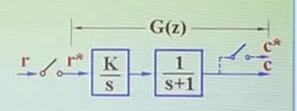

**题目**：

- **已知**：系统结构如上图所示，采样周期 $T = 1$
- **求**：
  - 系统的脉冲传递函数 $G(z) = \frac{C(z)}{R(z)}$；
  - 系统在 z 平面的零极点分布图；
  - 系统的差分方程。

**解**：

- 求解**脉冲传递函数**（**查表法**）：

  - 系统的传递函数为：
    $$
    G(s) = \frac{K}{s} \frac{1}{s+1}
    $$

  - 则系统的脉冲响应为：
    $$
    \begin{align}
    g(t) 
    =& L^{-1}[\frac{K}{s} - \frac{K}{s+1}]  \\[1.3ex]
    =& K [\,1(t) -  e^{-t} ]
    \end{align}
    $$

  - 对脉冲响应响应作 z变换：
    $$
    \begin{align}
    G(z) 
    =& Z[g(t)] \\[1.3ex]
    =& K \left( \frac{z}{z-1} - \frac{z}{z - e^{-T}}\right)  \\[1.3ex]
    =& K \frac{z(z-e^{-T}) - z(z-1)}{(z-1)(z-e^{-T})}
    \quad {\small(通分)} \\[1.3ex]
    =& \frac{(1-e^{-T})Kz}{(z-1)(z-e^{-T})}
    \end{align}
    $$

- 求解**脉冲传递函数**（**留数法**）：

  - 根据留数法：
    $$
    G(z) = \sum \text{Res}\left[G(s)\frac{z}{z - e^{Ts}} \right]
    $$
    
  - 第一个留数：
    $$
    \lim_{s\to 0} \left[s \frac{K}{s}\frac{1}{s+1} \frac{z}{z - e^{Ts}} \right]
    = \frac{kz}{z - 1}
    $$
  
  - 第二个留数：
    $$
    \lim_{s\to -1} \left[(s+1) \frac{K}{s}\frac{1}{s+1} \frac{z}{z - e^{Ts}} \right]
    = -\frac{kz}{z - e^{-T}}
    $$
  
  - 因而脉冲传递函数为：
    $$
    \begin{align}
    G(z) 
    =& \left (\frac{z}{z-1} - \frac{z}{z - e^{-T}} \right)  \\[1.3ex]
    =& \frac{(1-e^{-T})Kz}{(z-1)(z-e^{-T})}
    \end{align}
    $$
  
- 系统的**零极点图**：

  - 系统有两个极点 和 一个零点：
    $$
    \begin{align}
    p_{1} =& 1\\[1.3ex]
    p_2 =& e^{-T}= 0.368 \\[1.3ex]
    z_1 =& 0
    \end{align}
    $$
    
  - 零极点图：
  - 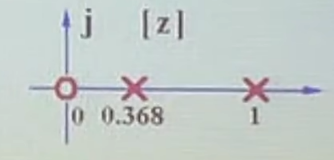
  
- 系统的**差分方程**：

  - 回顾**脉冲传递函数**：
    $$
    G(z) = \frac{C(z)}{R(z)} = \frac{(1 - e^{-T})Kz}{(z-1)(z - e^{-T})}
    $$

  - 可得**输入与输出的关系**：
    $$
    \begin{align}
    C(z)(z-1)(z - e^{-T}) =& (1-e^{-T})KzR(z) \\[1.3ex]
    C(z)[z^2 - (e^{-T}+1)z + e^{-T}] =& (1 - e^{-T})Kz R(z)  \\[1.3ex]
    C(z)[z^2 - 1.368 z + 0.368] =& 0.632 Kz R(z)
    \end{align}
    $$

  - 对上式作**z反变换**：
    $$
    c(k+2) - 1.368\cdot  c(k+1) + 0.368\cdot  c(k) = 0.632 K\cdot  r(k+1)
    $$

    - 其中：
      - $c(k+2) = \sum_{k=0}^{\infin}c(kT + 2T)\cdot \delta(kT + 2T)$；
      - $r(r+1) = \sum_{k=0}^{\infin}r(kT + T)\cdot \delta(kT + T)$

  - **后向差分形式**：
    $$
    c(k) - 1.368\cdot c(k-1) + 0.368\cdot c(k-2) = 0.632 k\cdot r(k-1)
    $$

## 开环脉冲传递函数

当环节之间存在开关或者ZOH时，系统的脉冲传递会发生变化（极点不变，但是分子变化）

### 环节之间有开关时

**此时脉冲传递函数**为：
$$
\begin{align}
G(z) 
=& G_1(z)\cdot G_2(z) \\[1.3ex]
=& Z[\frac{K}{s}] \cdot Z[\frac{1}{s+1}]  \\[1.3ex]
=& \frac{Kz}{z - 1} \frac{z}{z - e^{-T}}  \\[1.3ex]
=& \frac{K z^2}{(z-1)(z - e^{-T})}
\end{align}
$$

### 环节之间无开关时

**此时脉冲传递函数**为（上文已经推导过）：
$$
G(z) = \frac{(1-e^{-T})Kz}{(z-1)(z-e^{-T})}
$$

### 环节之间有ZOH时

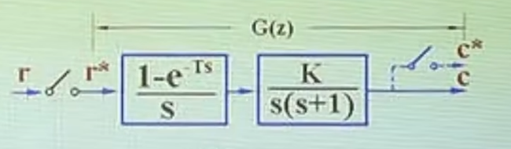

- **处理ZOH**：

  - ZOH的连续传递函数为：

  $$
  G_h(s) = \frac{1 - e^{-Ts}}{s}
  $$

  - 拆分ZOH：可将 ZOH拆分成两个环节（直通环节 并联 延时环节 后 再串联 积分环节）：
    $$
    G(s) = (1 - e^{-Ts}) \frac{1}{s}
    $$

  - 进行等效：离散信号经过 直通与延时环节后，信号仍为离散形式，因而此处可以假想有开关

  - 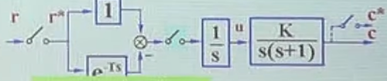

- 等效后，系统**脉冲传递函数**为：
  $$
  \begin{align}
  G(z) 
  =& Z\left[1 - e^{-Ts}\right] \cdot Z\left[\frac{1}{s}G(s)\right]  \\[1.3ex]
  =& (1 - z^{-1}) Z\left[\frac{K}{s^2(s+1)}\right]  \\[1.3ex]
  =& K \frac{z-1}{z} Z\left[\frac{1}{s^2} - \frac{1}{s} + \frac{1}{s+1}\right]  \\[1.3ex]
  =& K \frac{z-1}{z} \left[ \frac{Tz}{(z - 1)^2} - \frac{z}{z-1} 
  + \frac{z}{z-e^{-T}}\right]  \\[1.3ex]
  =& K \frac{z-1}{z} \frac{Tz(z- e^{-T}) - z(z-1)(z- e^{-T}) + z(z-1)^2}{(z-1)^2(z - e^{-T})}  \\[1.3ex]
  =& K \frac{z-1}{z} \frac{Tz^2 - Tz e^{-T} - z^3 - e^{-T}z + (1 + e^{-T})z^2 + z^3 - 2 z^2 + z}{(z-1)^2(z-e^{-T})}  \\[1.3ex]
  =& K \frac{z-1}{z} \frac{(T-1 + e^{-T})z^2 + (-Te^{-T} - e^{-T} + 1)z}{(z-1)^2(z - e^{-T})}  \\[1.3ex]
  =& K \frac{(T-1 + e^{-T})z + (1 -Te^{-T} - e^{-T}) }{(z-1)(z-e^{-T})}
  \end{align}
  $$

### 综合比较

- **有开关时**：
  $$
  G(z) 
  = \frac{K z^2}{(z-1)(z - e^{-T})}
  $$

- **无开关时**：
  $$
  G(z) = \frac{(1-e^{-T})Kz}{(z-1)(z-e^{-T})}
  $$

- **有ZOH时**：
  $$
  G(z) =  K \frac{(T-1 + e^{-T})z + (1 -Te^{-T} - e^{-T}) }{(z-1)(z-e^{-T})}
  $$
  

## 闭环脉冲传递函数

### 例1

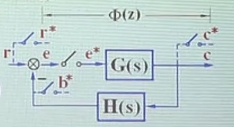

**题目**：

- **已知**：系统结构如下图所示；
- **求**：系统闭环传递函数 $\frac{C(z)}{R(z)}$（$C(z) = Z[c(t)]$，$R(z) = Z[r(t)]$）

**解**：

- **系统输出** $C(z)$ 为：
  $$
  C(z) = E(z) \cdot G(z)
  $$

- **误差项** $E(z)$ 为：
  $$
  \begin{align}
  E(z) =& R(z) - E(z)\cdot GH(z)  \\[1.3ex]
  [1 + GH(z)]E(z) =& R(z)
  \end{align}
  $$

  - **注意**（**最容易错的**）：$GH(z)  = Z[G(s)H(s)] \ne G(z)\cdot H(z)$（因为在G与H之间**没有采样开关**）

- **联立**上两式：
  $$
  \begin{gather}
  \begin{cases}
  C(z) = E(z)\cdot G(z) \\[1.3ex]
  R(z) = [1 + GH(z)]E(z)  \\[1.3ex]
  \end{cases}
  \\[1.3ex]{\Large \Downarrow}\\[1.3ex]
  \begin{aligned}
  C(z) 
  =& \frac{R(z)}{1 + GH(z)} \cdot G(z)  \\[1.3ex]
  =& \frac{R(z)G(z)}{1 + GH(z)}
  \end{aligned}
  \end{gather}
  $$
  
- **可得脉冲传递函数**为：
  $$
  \frac{C(z)}{R(z)} = \frac{G(z)}{1 + GH(z)}
  $$

  - **注意**：在离散系统中，**无法保证梅逊增益公式有效**（有适用条件，下面会讲）

### 例2

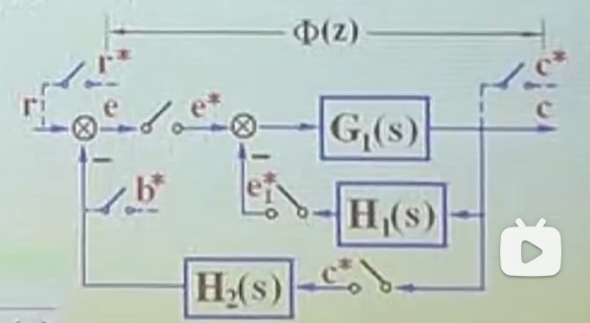

**题目**：

- **已知**：系统结构如上图所示
- **求**：系统的传递函数

**解**：

- **系统输出**为：
  $$
  C(z) = [E(z) - E_1(z)]G_1(z)
  $$

- $E_1(z)$ 为：
  $$
  \begin{align}
  E_1(z) =& [E(z) - E_1(z)]G_1H_1(z)    \\[1.3ex]
  [1 + G_1H_1(z)]E_1(z) =& G_1H_1(z) E(z)  \\[1.3ex]
  E_1(z) =& E(z)\frac{G_1H_1(z)}{1 + G_1(z)H_1(z)}
  \end{align}
  $$

- $E(z)$ 为：
  $$
  \begin{align}
  E(z) 
  =& R(z) - B(z)    \\[1.3ex]
  =& R(z) - C(z)H_2(z)
  \end{align}
  $$
  
- **联立**上三式：
  $$
  \begin{gather}
  \left\{
  \begin{aligned}
  C(z) =& [E(z) - E_1(z)]G_1(z)  \\[1.3ex]
  E_1(z) =& E(z) \frac{G_1H_1(z)}{1 + G_1H_1(z)}  \\[1.3ex]
  E(z) =& R(z) - C(z)H_2(z)  \\[1.3ex]
  \end{aligned}
  \right.
  
  \\[1.3ex]{\Large \Downarrow}\\[1.3ex]
  
  \begin{aligned}
  C(z) 
  =& E(z) \left( 1  - \frac{G_1H_1(z)}{1 + G_1H_1(z)}\right) G_1(z)  \\[1.3ex]
  =& \left[R(z) - C(z)H_2(z) \right]G_1(z) \frac{1}{1 + G_1(z)H_1(z)} \\[1.3ex]
  =& \frac{R(z)G_1(z) - C(z)H_2(z)G_1(z)}{1 + G_1H_1(z)} \\[1.3ex]
  \end{aligned}
  
  \\[1.3ex]{\Large \Downarrow}\\[1.3ex]
  
  \begin{aligned}
  C(z)\left[1 + G_1H_1(z)\right] =& R(z)G_1(z) - C(z)H_2(z)G_1(z)  \\[1.3ex]
  C(z)\left[1 + G_1H_1(z) + H_2(z)G_1(z)\right] =& R(z) G_1(z)  \\[1.3ex]
  
  \end{aligned}
  
  \end{gather}
  $$

- 可得**脉冲传递函数**为：
  $$
  \frac{C(z)}{R(z)} = \frac{G_1(z)}{1 + G_1H_1(z) + H_2(z)G_1(z)}
  $$

### 例3

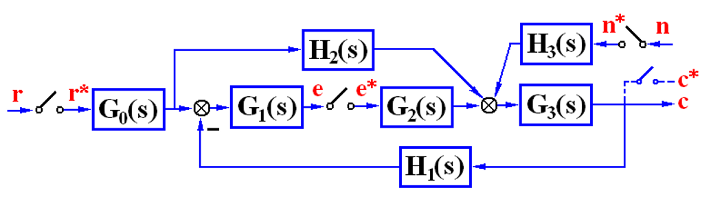

**题目**：

- **已知**：系统结构如上图所示；
- **求**：$\dfrac{C(z)}{R(z)}$ 与 $\dfrac{C(z)}{N(z)}$。

**解**：

- 求 $\dfrac{C(z)}{R(z)}$：

  - **系统输出** $C(z)$：
    $$
    C(z) = R(z) G_0H_2G_3(z) + E(z)G_2G_3(z)
    $$

  - $E(z)$ 为：
    $$
    \begin{align}
    E(z) 
    =& -E(z)G_2G_3H_1G_1(z) + R(z)G_0G_1(z) - R(z)G_0H_2G_3H_1G_1(z)  \\[1.3ex]
    
    E(z)\left[1 +G_2G_3H_1G_1(z)\right] 
    =& R(z)\left[G_0G_1(z) - G_0H_2G_3H_1G_1(z)\right]\\[1.3ex]
    
    E(z) 
    =& R(z) \frac{G_0G_1(z) - G_0G_1G_3H_1H_2(z)}{1 + G_1G_2G_3H_1(z)}
    \end{align}
    $$

  - 联立上两式：
    $$
    \begin{gather}
    \begin{cases}
    C(z) = R(z) G_0H_2G_3(z) + E(z)G_2G_3(z)  \\[1.3ex]
    E(z) = R(z) \dfrac{G_0G_1(z) - G_0G_1G_3H_1H_2(z)}{1 + G_1G_2G_3H_1(z)}
    \end{cases}
    
    \\[1.3ex]{\Large \Downarrow}\\[1.3ex]
    
    \begin{aligned}
    C(z) 
    =& R(z)G_0H_2G_3(z) +
       R(z)\dfrac{G_0G_1(z) - G_0G_1G_3H_1H_2(z)}{1+G_1G_2G_3H_1(z)}G_2G_3(z)  \\[1.3ex]
    =& R(z)\left[ G_0H_2G_3(z) + 
       \dfrac{G_0G_1(z) - G_0G_1G_3H_1H_2(z)}{1+G_1G_2G_3H_1(z)}G_2G_3(z)\right]\\[1.3ex]
    =& R(z)
       \dfrac{
       \begin{aligned}
         G_0H_2G_3(z) + G_0H_2G_3(z)G_1G_2G_3H_1(z) \\
       + G_0G_1(z)G_2G_3(z) - G_0G_1G_3H_1H_2(z)G_2G_3(z)
       \end{aligned}}{1+G_1G_2G_3H_1(z)}
    
    \end{aligned}
    
    \end{gather}
    $$

  - 因而**脉冲传递函数** $\frac{C(z)}{R(z)}$ 为：
    $$
    \frac{C(z)}{R(z)}
    =
    \frac{
    \begin{aligned}
    G_0H_2G_3(z) + G_0H_2G_3(z)G_1G_2G_3H_1(z) \\
    + G_0G_1(z)G_2G_3(z) - G_0G_1G_3H_1H_2(z)G_2G_3(z)
    \end{aligned}
    }
    {1+G_1G_2G_3H_1(z)}
    $$
    

- 求 $\dfrac{C(z)}{N(z)}$（此时忽略 $R(Z)$ 的输入）：

  - **系统输出** $C(z)$：
    $$
    C(z) = H_3G_3(z) N(z) + E(z)G_2G_3(z)
    $$

  - $E(z)$ 为：
    $$
    \begin{align}
    E(z) 
    =& E(z) \cdot -G_2G_3H_1G_1(z) - N(z) H_3G_3H_1G_1(z)  \\[1.3ex]
    
    E(z)\left[ 1 + G_1G_2G_3H_1(z)\right]
    =& - N(z) G_1G_3H_1H_3(z)  \\[1.3ex]
    
    E(z) =& N(z) \dfrac{-G_1G_3H_1H_3(z)}{1 + G_1G_2G_3H_1(z)}  \\[1.3ex]
    \end{align}
    $$

  - **联立**上两式：
    $$
    \begin{gather}
    \begin{cases}
    C(z) = H_3G_3(z) N(z) + E(z)G_2G_3(z)  \\[1.3ex]
    E(z) = N(z) \dfrac{-G_1G_3H_1H_3(z)}{1 + G_1G_2G_3H_1(z)}  \\[1.3ex]
    \end{cases}
    
    \\[1.3ex]{\Large \Downarrow}\\[1.3ex]
    
    \begin{aligned}
    C(z) 
    =& N(z) G_3H_3(z) + N(z)\dfrac{-G_1G_3H_1H_3(z)}{1 + G_1G_2G_3H_1(z)}G_2G_3(z)
    \\[1.3ex]
    =& N(z) 
    \left[
    G_3H_3(z) - \dfrac{G_1G_3H_1H_3(z)G_2G_3(z)}{1 + G_1G_2G_3H_1(z)}
    \right]  \\[1.3ex]
    =& N(z) \dfrac{G_3H_3(z) + G_3H_3(z)G_1G_2G_3H_1(z) - G_1G_3H_1H_3(z)G_2G_3(z)}{1 + G_1G_2G_3H_1(z)}
    
    \end{aligned}
    \end{gather}
    $$

  - 因而**传递函数**为：
    $$
    \dfrac{C(z)}{N(z)} 
    = 
    \dfrac{G_3H_3(z) + G_3H_3(z)G_1G_2G_3H_1(z) - G_1G_3H_1H_3(z)G_2G_3(z)}{1 + G_1G_2G_3H_1(z)}
    $$
    

### 梅逊增益公式的适用情况

在以下两种情况下，可以使用梅逊增益公式求闭环脉冲传递函数：

- **情况1**：

  - **条件**：单回路（无前馈通道）的离散系统，在前向通信存在至少一个实际的采样开关
  - **例如**：
  - 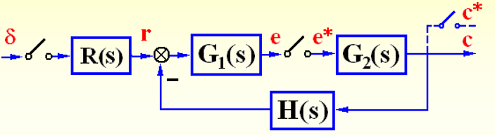

  - 此时闭环脉冲传递函数为：
    $$
    \frac{C(z)}{1} = \frac{RG_1(z)G_2(z)}{1 + G_1G_2H(z)}
    $$

- **情况2**：

  - **条件**：离散系统结构图中，各环节之间均有或等效有采样开关时
  - **例如**：
  - 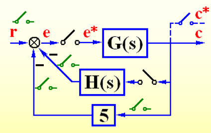

  - 此时闭环脉冲传递函数为：
    $$
    \frac{C(z)}{R(z)} = \frac{G(z)}{1 + G(z)H(z) + 5G(z)}
    $$
    
